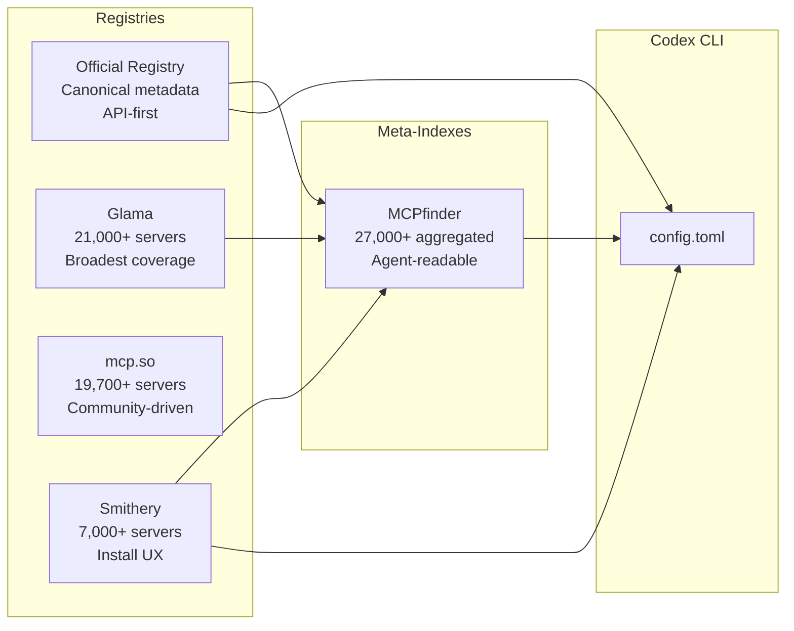
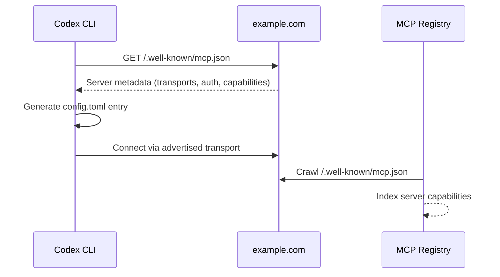

# Codex CLI and MCP Server Discovery: Navigating Registries, Smithery, Glama, and the Official MCP Registry


---

The MCP ecosystem has exploded. As of late May 2026, over 27,000 MCP servers are indexed across public registries [^1], spanning databases, cloud providers, SaaS integrations, developer tools, and bespoke domain-specific services. For Codex CLI users, the challenge is no longer *whether* a tool exists — it is finding the right one, verifying its trustworthiness, and wiring it into `config.toml` without friction.

This article maps the MCP server discovery landscape, compares the major registries, and provides concrete workflows for integrating discovered servers into Codex CLI projects.

## The Discovery Problem

Codex CLI's MCP integration is straightforward once you know what to install. You add a `[mcp_servers.<name>]` table to `~/.codex/config.toml` (or a project-scoped `.codex/config.toml` for trusted projects) [^2], and the CLI handles the rest. The bottleneck is upstream: *which* server, *which* version, and *is it maintained?*

With four major registries, several meta-indexes, and an emerging protocol-level discovery standard, the ecosystem resembles early npm — fast-growing, duplicative, and lacking a single canonical source.

## The Major Registries

### The Official MCP Registry

The official registry at `registry.modelcontextprotocol.io` is maintained by Anthropic with community contributions [^3]. It serves as the canonical, protocol-level source and exposes a REST API at `/v0/servers`:

```bash
# Fetch ten servers from the official registry
curl "https://registry.modelcontextprotocol.io/v0/servers?limit=10"
```

Each entry uses a standardised `server.json` format containing the server's unique name (e.g. `io.github.user/server-name`), location metadata (npm package, remote URL), execution instructions (command-line args, env vars), and capability declarations [^4]. The registry also supports an `updated_since` parameter for incremental synchronisation — useful for tooling that needs to track new additions.

**Best for:** Programmatic access, client implementations, canonical metadata.

### Glama

Glama (`glama.ai/mcp`) is the largest directory by volume, indexing over 21,000 servers with visual previews, daily updates, and broad coverage of niche and newly published servers [^1]. Its interface is closer to a search engine than a curated marketplace — you get everything, including experimental and low-quality entries.

**Best for:** Maximum coverage when exploring what exists.

### mcp.so

The mcp.so community directory lists approximately 19,700 servers, with strong coverage of third-party and unofficial tools [^1]. It leans towards community-submitted entries and newer or experimental servers.

**Best for:** Finding community-built servers, especially newer or experimental ones.

### Smithery

Smithery (`smithery.ai`) positions itself as the Docker Hub of MCP — a curated registry with approximately 7,000 listings, clean search, one-click install commands, and both local and hosted deployment options [^5]. It offers a CLI (`smithery`) and an MCP server of its own (`smithery-cli-mcp`) that lets AI agents browse and install servers programmatically [^6].

**Best for:** Developer experience, install convenience, hosted remote servers.

## Comparing the Registries



| Registry | Servers | API | CLI tool | Hosted servers | Trust signals |
|---|---|---|---|---|---|
| Official Registry | Growing | REST `/v0` | No | No | Canonical |
| Glama | 21,000+ | Yes | No | No | Community ratings |
| mcp.so | 19,700+ | Limited | No | No | Stars, recency |
| Smithery | 7,000+ | Yes | `smithery` CLI | Yes | Verified badge |

## MCPfinder: Agent-Native Discovery

MCPfinder (`mcpfinder.dev`) is not another directory site — it is an MCP server that sits on top of every public registry, providing agent-readable search with trust scoring and install-ready configuration [^7]. Install it as an MCP server, and Codex CLI gains the ability to discover tools programmatically during a session:

```toml
[mcp_servers.mcpfinder]
command = "npx"
args = ["-y", "@anthropic/mcpfinder"]
```

With MCPfinder configured, you can ask Codex to find and install servers conversationally:

> "Find an MCP server for Elasticsearch that supports index management and query debugging."

MCPfinder searches across the Official Registry, Glama, and Smithery, inspects environment variables and trust signals, and returns install-ready JSON — which the agent can then translate into `config.toml` entries.

## Wiring Discovered Servers into Codex CLI

### STDIO Servers (Local Processes)

Most discovered servers run as local processes started by `npx`, `uvx`, or a binary. The standard `config.toml` pattern:

```toml
[mcp_servers.context7]
command = "npx"
args = ["-y", "@upstash/context7-mcp"]

[mcp_servers.context7.env]
LOCAL_TOKEN = "your-token-here"
```

Key configuration options [^2]:

- **`startup_timeout_sec`** — Server initialisation deadline (default: 10 seconds)
- **`tool_timeout_sec`** — Per-tool execution deadline (default: 60 seconds)
- **`enabled`** — Toggle without removing the config block
- **`enabled_tools` / `disabled_tools`** — Allowlist or blocklist specific tools
- **`default_tools_approval_mode`** — `auto`, `prompt`, or `approve`

### Streamable HTTP Servers (Remote)

Remote servers — including Smithery-hosted instances — use the `url` parameter:

```toml
[mcp_servers.figma]
url = "https://mcp.figma.com/mcp"
bearer_token_env_var = "FIGMA_OAUTH_TOKEN"
```

For OAuth-enabled servers, run `codex mcp login <server-name>` to complete the flow. Codex stores tokens securely and refreshes them automatically [^2].

### Using Smithery CLI for Installation

Smithery's CLI can install servers to supported clients directly [^6]:

```bash
# Install globally
npm install -g smithery@latest

# Add an MCP server
smithery mcp add @anthropic/brave-search --client codex \
  --config '{"apiKey": "your-key"}'

# List installed servers
smithery mcp list --client codex
```

⚠️ As of May 2026, Smithery CLI has native support for Claude Desktop and Cursor clients, but Codex CLI support requires manual `config.toml` editing after discovery. The `--client codex` flag is community-contributed and may not cover all configuration options.

### Using `codex mcp` Commands

Codex CLI provides its own MCP management subcommand [^8]:

```bash
# Add an STDIO server interactively
codex mcp add github-mcp \
  --env GITHUB_TOKEN=ghp_xxx \
  -- npx -y @github/mcp-server

# List configured servers
codex mcp list

# Remove a server
codex mcp remove github-mcp
```

## The .well-known/mcp.json Discovery Standard

The MCP v2.1 specification introduces Server Cards via `/.well-known/mcp.json` — a standardised endpoint that exposes server metadata without requiring a full connection [^9]. This enables:

- **IDE extensions** auto-configuring when pointed at a domain
- **Registries** crawling domains to discover servers automatically
- **Clients** displaying capabilities before initialisation



An IETF draft (`draft-serra-mcp-discovery-uri`) also defines DNS TXT record discovery for environments where HTTP well-known URIs are impractical [^10]. This is still early-stage but signals the ecosystem's trajectory towards zero-configuration discovery.

## A Practical Discovery Workflow

For senior developers evaluating MCP servers for a Codex CLI project, here is a pragmatic workflow:

### 1. Start with the Official Registry

Query the API for servers matching your domain:

```bash
curl -s "https://registry.modelcontextprotocol.io/v0/servers?q=elasticsearch" \
  | jq '.servers[] | {name, description, updated_at}'
```

### 2. Cross-Reference on Smithery

Check Smithery for install convenience, hosted options, and verified badges:

```bash
smithery mcp search elasticsearch
```

### 3. Verify Trust Signals

Before adding any server to `config.toml`, check:

- **GitHub stars and recent commits** — Is it maintained?
- **Environment variables required** — What credentials does it need?
- **Tool count and scope** — Does it expose more tools than you need? (MCP schema bloat is real [^11])
- **Licence** — Is it compatible with your project?

### 4. Scope to Project

For team projects, use project-scoped configuration in `.codex/config.toml` rather than the global file. This keeps MCP dependencies explicit and version-controlled:

```toml
# .codex/config.toml (project-scoped, trusted projects only)
[mcp_servers.project-db]
command = "npx"
args = ["-y", "@askdba/mysql-mcp-server"]

[mcp_servers.project-db.env]
DSN = "${MYSQL_DSN}"
```

### 5. Lock Tool Exposure

Use `enabled_tools` to restrict the agent to only the tools it needs, reducing context window consumption and attack surface:

```toml
[mcp_servers.github]
command = "npx"
args = ["-y", "@github/mcp-server"]
enabled_tools = ["get_issue", "list_pull_requests", "create_comment"]
default_tools_approval_mode = "prompt"
```

## What is Coming Next

The discovery landscape is consolidating rapidly. Three trends to watch:

1. **Protocol-level discovery** — `.well-known/mcp.json` and DNS-based discovery will reduce reliance on centralised registries for well-known services [^9].

2. **Agent-driven installation** — Tools like MCPfinder and Smithery's CLI MCP server are making it possible for agents to discover and install their own tools mid-session, closing the loop between "I need a capability" and "I have a capability" [^7].

3. **Enterprise governance** — As organisations adopt MCP at scale, expect private registries with approval workflows, SBOM-style manifests for MCP dependencies, and policy enforcement for which servers can be configured in project-scoped configs.

For Codex CLI users, the practical advice is straightforward: use the official registry as your canonical source, Smithery for install convenience, MCPfinder for agent-native discovery, and always scope and restrict tools to what your project actually needs.

## Citations

[^1]: [MCP Registries in 2026: Where to List Your Server for AI Tool Discovery — RoxyAPI](https://roxyapi.com/blogs/mcp-registries-where-to-list-your-server-2026)
[^2]: [Model Context Protocol — Codex CLI Official Documentation](https://developers.openai.com/codex/mcp)
[^3]: [Official MCP Registry](https://registry.modelcontextprotocol.io/)
[^4]: [Official MCP Registry API Reference](https://github.com/modelcontextprotocol/registry/blob/main/docs/reference/api/official-registry-api.md)
[^5]: [Smithery AI: A Central Hub for MCP Servers — WorkOS](https://workos.com/blog/smithery-ai)
[^6]: [Smithery CLI Documentation](https://smithery.ai/docs/concepts/cli)
[^7]: [MCPfinder — MCP Server Discovery for AI Agents](https://mcpfinder.dev/)
[^8]: [Codex CLI Command Line Reference](https://developers.openai.com/codex/cli/reference)
[^9]: [SEP-1649: MCP Server Cards — HTTP Server Discovery via .well-known](https://github.com/modelcontextprotocol/modelcontextprotocol/issues/1649)
[^10]: [IETF Draft: The "mcp" URI Scheme and MCP Server Discovery Mechanism](https://datatracker.ietf.org/doc/draft-serra-mcp-discovery-uri/)
[^11]: [MCP Schema Bloat: System Prompt Tax and Tool Definition Performance — Codex Resources](https://codex.danielvaughan.com/2026/04/23/mcp-schema-bloat-system-prompt-tax-tool-definition-performance/)
