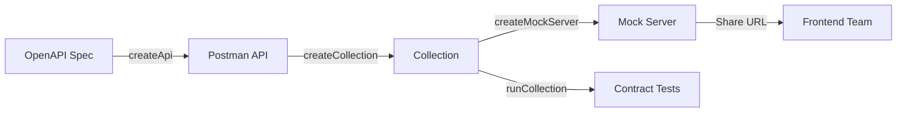
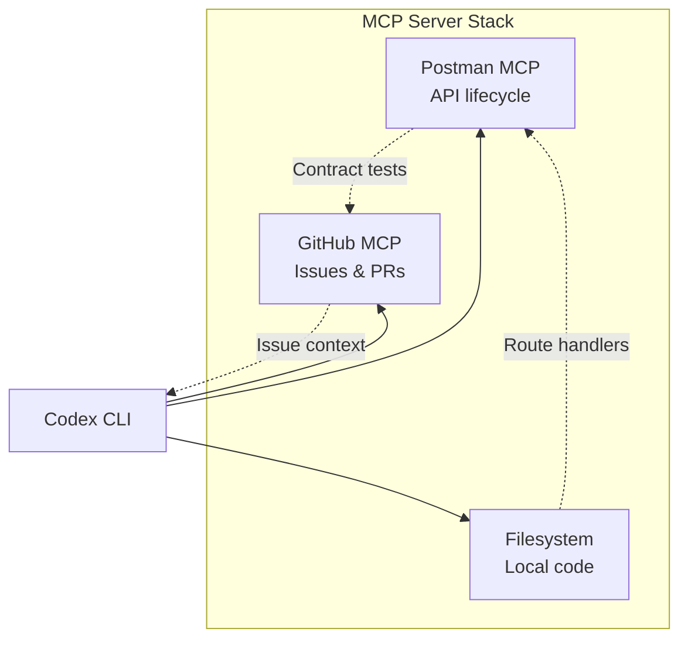

# Codex CLI with the Postman MCP Server: API Lifecycle Automation, Collection Management, and Test Workflows


---

## Introduction

Postman remains the dominant API development platform, with over 35 million registered developers and API collections numbering in the hundreds of millions [^1]. The official Postman MCP server (`@postman/postman-mcp-server`, currently at v2.8.9) exposes 100+ tools across the full Postman API surface — workspaces, collections, environments, mock servers, monitors, and specifications — to any MCP-compatible agent [^2]. Wiring it into Codex CLI transforms the terminal agent from a code-only tool into one that can orchestrate the entire API lifecycle without switching context to the Postman GUI.

This article covers configuration, workflow patterns, and practical considerations for integrating the Postman MCP server with Codex CLI v0.134.0.

---

## The Postman MCP Server Landscape

The official server from `postmanlabs/postman-mcp-server` ships three tool configuration profiles [^2]:

| Profile | Endpoint (Remote) | Tool Count | Use Case |
|---------|-------------------|------------|----------|
| **Minimal** | `mcp.postman.com/minimal` | ~37 | Core CRUD on collections, environments, workspaces |
| **Code** | `mcp.postman.com/code` | Subset | API search and idiomatic client code generation |
| **Full** | `mcp.postman.com/mcp` | 100+ | Complete Postman API surface including enterprise features |

All three profiles are available as both remote Streamable HTTP servers and local STDIO servers via the npm package [^2]. An EU-region variant is hosted at `mcp.eu.postman.com` for data residency requirements [^3].

Tool names follow camelCase convention in v2 (e.g. `createCollection`, `runCollection`, `getWorkspace`) — a breaking change from the kebab-case used in v1 [^4].

### Tool Categories

The full profile organises tools across these domains [^2] [^5]:

- **Workspaces** — create, list, retrieve, update, delete
- **Collections** — CRUD, fork, merge, run with test results
- **Requests and Responses** — add, update, delete, manage examples
- **Environments** — CRUD, variable management
- **Mock Servers** — create, configure, retrieve
- **Monitors** — create, run, retrieve results
- **API Specifications** — OpenAPI/Swagger spec management
- **Comments and Documentation** — annotate collections and requests
- **Analytics** — query usage data (added in v2.8.2) [^4]
- **Private API Network** — enterprise API catalogue management

---

## Configuration

### Remote Server with OAuth (Recommended)

Codex CLI v0.134.0 added OAuth support for Streamable HTTP MCP servers [^6]. For the Postman remote server, this is the cleanest path:

```bash
codex mcp add postman --remote-url https://mcp.postman.com/minimal
```

This triggers an OAuth flow against Postman's identity provider. No API key management required. For the full tool surface:

```bash
codex mcp add postman-full --remote-url https://mcp.postman.com/mcp
```

### Remote Server with API Key

For CI pipelines or environments where OAuth is impractical (including the EU server), use a Postman API key [^3]:

```toml
[mcp_servers.postman]
type = "remote"
url = "https://mcp.postman.com/mcp"

[mcp_servers.postman.headers]
Authorization = "Bearer ${POSTMAN_API_KEY}"
```

### Local STDIO Server

For air-gapped environments or reduced latency, run the npm package locally [^2]:

```toml
[mcp_servers.postman]
command = "npx"
args = ["-y", "@postman/postman-mcp-server", "--full"]

[mcp_servers.postman.env]
POSTMAN_API_KEY = "${POSTMAN_API_KEY}"
```

The `--full`, `--minimal`, and `--code` flags select the tool profile. Omitting the flag defaults to minimal [^2].

### Docker

For reproducible environments, the official Docker image is available [^7]:

```bash
docker run -e POSTMAN_API_KEY="$POSTMAN_API_KEY" mcp/postman --full
```

### Choosing a Profile

Start with **minimal** unless you need enterprise features. The 37-tool minimal profile keeps context window consumption manageable — critical when composing with other MCP servers. Codex CLI v0.134.0's tool schema compaction helps [^6], but 100+ tools from the full profile still consume significant tokens.

---

## AGENTS.md for API Projects

An `AGENTS.md` file at the repository root gives Codex CLI project-specific conventions. For API-first projects using Postman:

```markdown
# AGENTS.md — API Project Conventions

## Postman Integration
- All API collections live in the "Backend Services" workspace
- Environment naming: `{service}-{stage}` (e.g. `payments-staging`)
- Collection structure: one folder per resource, one request per operation
- Every request must have at least one example response saved
- Use Postman collection variables for base URLs, not hardcoded paths

## API Standards
- OpenAPI 3.1 specifications are the source of truth
- All endpoints must have contract tests in their Postman collection
- Mock servers must be created for any new API before implementation begins
- Monitor frequency: 5-minute intervals for production, 15-minute for staging

## Anti-Hallucination Rules
- Postman MCP v2 uses camelCase tool names, NOT kebab-case
- Collection schema version is v2.1.0
- Do NOT invent Postman tool names — list available tools first
- API key auth uses Bearer token format, not X-Api-Key header
```

---

## Workflow Patterns

### 1. API-First Development: Spec to Collection to Mock

The most powerful pattern chains specification, collection, and mock server creation in a single conversational flow:



Prompt Codex CLI:

> "Read the OpenAPI spec at `api/openapi.yaml`, create a Postman collection in the Backend Services workspace with one request per endpoint, add example responses from the spec's response schemas, then create a mock server and return its URL."

The agent reads the local spec file, calls `createCollection` with the structured request body, iterates through endpoints to add requests via `createRequest`, attaches example responses, and finally calls `createMockServer`. The mock URL is immediately usable by frontend developers.

### 2. Environment Synchronisation Across Stages

Environment drift between development, staging, and production is a persistent pain point. With the Postman MCP server, Codex CLI can audit and synchronise environments:

> "List all environments in the payments-api workspace. Compare the variable keys across payments-dev, payments-staging, and payments-prod. Report any variables present in dev but missing from staging or prod."

This uses `getWorkspace`, `listEnvironments`, and `getEnvironment` to build a diff. For remediation:

> "Add the missing variables to payments-staging with empty values and a description noting they need configuration."

### 3. Collection-Driven Test Generation

Postman's Agent Mode generates tests internally [^8], but Codex CLI can generate tests from the code side and push them into collections:

> "Read the Express route handlers in `src/routes/payments.ts`. For each endpoint, create a Postman request in the payments collection with appropriate headers, body examples from the TypeScript types, and a test script that validates the response status code and schema."

The agent analyses the route handlers, extracts endpoint signatures and request/response types, then calls `createRequest` and `createResponse` for each. Test scripts are added as Postman test snippets in the request's test tab.

### 4. Batch Collection Audit with `codex exec`

For large API platforms with dozens of collections, use `codex exec` for non-interactive auditing:

```bash
codex exec "List all collections in the Production APIs workspace. \
For each collection, check: (1) every request has at least one saved example, \
(2) every request has a test script, (3) collection description is not empty. \
Output a JSON array with collection name, request count, \
coverage percentage, and issues found." \
--output-schema '{"type":"array","items":{"type":"object","properties":{"name":{"type":"string"},"requests":{"type":"integer"},"coveragePct":{"type":"number"},"issues":{"type":"array","items":{"type":"string"}}}}}'
```

The `--output-schema` flag ensures structured, parseable output suitable for CI dashboards [^6].

### 5. Monitor Health Checks in CI

Wire Postman monitors into your deployment pipeline:

```bash
#!/bin/bash
RESULT=$(codex exec "Run the monitor 'payments-api-smoke' and return \
the pass/fail status and any failing test names as JSON" \
--output-schema '{"type":"object","properties":{"status":{"type":"string"},"failures":{"type":"array","items":{"type":"string"}}}}')

STATUS=$(echo "$RESULT" | jq -r '.status')
if [ "$STATUS" != "pass" ]; then
  echo "Smoke tests failed after deployment"
  echo "$RESULT" | jq '.failures'
  exit 1
fi
```

---

## Composing with Other MCP Servers

The Postman MCP server is most effective when composed with complementary servers:



```toml
[mcp_servers.postman]
command = "npx"
args = ["-y", "@postman/postman-mcp-server", "--minimal"]
[mcp_servers.postman.env]
POSTMAN_API_KEY = "${POSTMAN_API_KEY}"

[mcp_servers.github]
command = "npx"
args = ["-y", "@github/github-mcp-server"]
[mcp_servers.github.env]
GITHUB_TOKEN = "${GITHUB_TOKEN}"
```

A typical composite workflow: "Read the GitHub issue #142, examine the API spec changes in the linked PR, update the Postman collection to match, and run the collection tests to verify nothing breaks."

### Read-Only Concurrency

Codex CLI v0.134.0 runs read-only MCP tools concurrently when they advertise `readOnlyHint` [^6]. Postman's read operations (list, get, search) benefit from this — a workspace audit that previously called tools sequentially now parallelises reads across collections, environments, and monitors.

---

## Model Selection

| Task | Recommended Model | Rationale |
|------|-------------------|-----------|
| Collection design from OpenAPI specs | o3 | Complex schema mapping, structural decisions |
| Environment variable auditing | o4-mini | Straightforward comparison, lower cost |
| Test script generation | o3 | Requires understanding of API contracts and edge cases |
| Batch collection auditing | o4-mini | Repetitive pattern, high volume |

---

## Security Considerations

**API Key Scope.** Postman API keys grant access to all workspaces the account can reach. For CI pipelines, create a dedicated service account with access limited to the relevant workspace [^3].

**Approval Gating.** Run Codex CLI in `suggest` or `auto-edit` mode when the Postman MCP server is configured. Tools like `deleteCollection` or `updateEnvironment` can cause data loss. Use approval mode to gate write operations:

```toml
[mcp_servers.postman]
command = "npx"
args = ["-y", "@postman/postman-mcp-server", "--minimal"]
[mcp_servers.postman.env]
POSTMAN_API_KEY = "${POSTMAN_API_KEY}"
```

In `suggest` mode, Codex CLI will present each MCP tool call for approval before execution.

**Rate Limits.** Postman API usage counts against your plan's rate limits [^1]. The full profile's 100+ tools encourage chatty interactions — monitor API call volume, especially in batch workflows.

**Credential Hygiene.** Never commit `POSTMAN_API_KEY` to source control. Use environment variables or a secrets manager. Codex CLI's `${VAR}` syntax in `config.toml` resolves from the shell environment at runtime.

---

## Limitations

- **Token Budget.** The full profile (100+ tools) consumes substantial context. Prefer minimal or code profiles and compose with other servers selectively.
- **No Real-Time Collection Execution.** The MCP server triggers collection runs but does not stream test results in real time — you get the final summary.
- **Training Data Lag.** Models may not know about v2 camelCase tool naming or recent tool additions (e.g. analytics tools added in v2.8.2). The `AGENTS.md` anti-hallucination rules mitigate this.
- **OAuth US-Only.** OAuth authentication for the remote server is currently limited to the US region. EU and other regions require API key authentication [^3].
- **Mock Server Limitations.** Mock servers created via MCP inherit Postman's mock constraints — response matching is based on saved examples, not dynamic logic.
- **No Newman Integration.** The official MCP server uses the Postman API, not Newman. For local collection execution without Postman cloud, consider the community `mcp-postman` server by shannonlal [^9], which wraps Newman.

---

## Conclusion

The Postman MCP server bridges the gap between code-level agent workflows and API platform operations. By wiring it into Codex CLI, senior developers can automate the tedious parts of API lifecycle management — collection creation, environment synchronisation, test scaffolding, and monitoring — without leaving the terminal. Start with the minimal profile, add an `AGENTS.md` to encode your team's API conventions, and expand to the full profile only when enterprise features are needed.

---

## Citations

[^1]: [Postman MCP Server Product Page](https://www.postman.com/product/mcp-server/) — Official product page with platform statistics and tool configurations.

[^2]: [postmanlabs/postman-mcp-server GitHub Repository](https://github.com/postmanlabs/postman-mcp-server) — Source code, README with installation instructions, tool profiles, and v1-to-v2 migration guide.

[^3]: [Set Up a Remote Postman MCP Server — Postman Docs](https://learning.postman.com/docs/reference/postman-api/postman-mcp-server/postman-mcp-remote-server) — Official documentation for remote server setup, OAuth, API key auth, and EU endpoints.

[^4]: [postmanlabs/postman-mcp-server Releases](https://github.com/postmanlabs/postman-mcp-server/releases) — Release notes for v2.8.9 (latest), v2.8.4 (Instructions resource), v2.8.2 (analytics tools), v2.7.0 (Markdown tables).

[^5]: [Headless Postman: Automating the API Lifecycle with the MCP Server — Postman Blog](https://blog.postman.com/headless-postman-automating-the-api-lifecycle-with-the-mcp-server/) — Blog post covering API lifecycle automation patterns with the MCP server.

[^6]: [Codex CLI Changelog — OpenAI Developers](https://developers.openai.com/codex/changelog) — v0.134.0 changelog: MCP OAuth, tool schema compaction, readOnlyHint concurrency, per-server environment targeting.

[^7]: [Postman MCP Server Docker Image — Docker Hub](https://hub.docker.com/r/mcp/postman) — Official Docker image for containerised deployment.

[^8]: [Testing APIs with Postman Agent Mode — Postman Blog](https://blog.postman.com/testing-apis-with-postman-agent-mode-a-practical-guide/) — Postman's built-in AI agent for test generation.

[^9]: [shannonlal/mcp-postman GitHub Repository](https://github.com/shannonlal/mcp-postman) — Community MCP server wrapping Newman for local collection execution.
