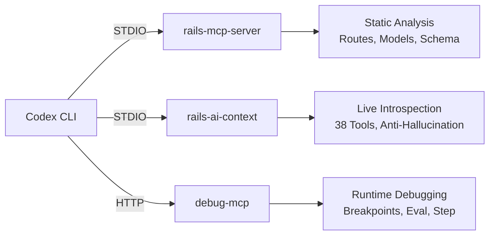

# Codex CLI for Ruby on Rails: Agent-Assisted Development, MCP Servers, and Rails 8 Workflows


---

Rails 8 shipped with a philosophy that a single developer can build a world-class application without a sprawling infrastructure stack. Solid Queue replaces Sidekiq, Solid Cache replaces Redis, and Kamal 2 replaces Capistrano[^1]. That same spirit of consolidation makes Rails 8 projects an excellent fit for agent-assisted development with Codex CLI — the codebase is convention-heavy, the file layout is predictable, and the framework's "omakase" approach gives an LLM agent strong priors about where things live and how they connect.

This article maps the Rails MCP server ecosystem, walks through practical `config.toml` configurations, and demonstrates workflows for the tasks Rails developers actually spend their time on.

## The Rails MCP Server Landscape

Three MCP servers stand out for Rails development in mid-2026, each addressing a different layer of the stack.

### rails-mcp-server (Maquina)

The most mature option. The `rails-mcp-server` gem exposes four registered tools — `switch_project`, `search_tools`, `execute_tool`, and `execute_ruby` — plus a catalogue of internal analysers covering models, routes, controllers, views, database schema, and environment configuration[^2]. It uses Prism for static analysis of model relationships, supports both STDIO and HTTP (SSE) transports on port 6029, and can manage multiple Rails projects simultaneously[^3].

### rails-ai-context

A zero-configuration gem providing 38 MCP tools that give agents live access to schema, models, routes, and conventions[^4]. It works with Codex CLI, Claude Code, Cursor, and Copilot. The distinguishing feature is its anti-hallucination rules: six constraints force the agent to verify every column, association, route, and method via a tool call before referencing it in generated code[^4]. The gem evolved into `rails-ai-bridge` for ongoing maintenance.

### debug-mcp

Runtime debugging via MCP. Connects LLM agents to live Ruby/Rails processes through the `debug` gem, exposing breakpoints, variable inspection, code evaluation, and execution control as MCP tool calls[^5]. Requires Ruby >= 3.2.0 and runs on HTTP at `127.0.0.1:8080/mcp`[^5]. Rails-specific tools are auto-registered when a Rails process is detected.



## Configuring Codex CLI for Rails

A production-ready `config.toml` for a Rails 8 project typically wires up `rails-mcp-server` for code intelligence and optionally `debug-mcp` for runtime work. Place this in your project root at `.codex/config.toml`:

```toml
# .codex/config.toml — Rails 8 project

model = "o4-mini"

[mcp_servers.rails]
command = "rails-mcp-server"
args = ["--stdio"]
env = { "RAILS_MCP_PROJECT_PATH" = "." }
startup_timeout_sec = 15.0
tool_timeout_sec = 30.0

[mcp_servers.rails-debug]
command = "debug-mcp"
enabled = false          # enable when actively debugging
startup_timeout_sec = 10.0
tool_timeout_sec = 60.0
```

For teams running multiple Rails services, `rails-mcp-server` supports project switching via its `switch_project` tool, or you can configure per-service entries:

```toml
[mcp_servers.api]
command = "rails-mcp-server"
args = ["--stdio"]
env = { "RAILS_MCP_PROJECT_PATH" = "./services/api" }

[mcp_servers.admin]
command = "rails-mcp-server"
args = ["--stdio"]
env = { "RAILS_MCP_PROJECT_PATH" = "./services/admin" }
```

Install the servers before first use:

```bash
gem install rails-mcp-server
gem install debug-mcp          # optional, for runtime debugging
gem install rails-ai-context   # optional, for zero-config introspection
```

## AGENTS.md for Rails Projects

An `AGENTS.md` file anchored to Rails conventions dramatically improves agent output quality. A minimal example:

```markdown
# AGENTS.md

## Stack
- Rails 8.0, Ruby 3.3, PostgreSQL 16
- Solid Queue for background jobs (no Redis)
- Solid Cache for caching (no Redis)
- Kamal 2 for deployment
- Stimulus + Turbo for frontend

## Conventions
- Models in app/models/, controllers in app/controllers/
- Service objects in app/services/ — one public method: `call`
- Form objects in app/forms/ using ActiveModel
- RSpec for tests, FactoryBot for fixtures
- British English in user-facing strings

## MCP Tools Available
- rails-mcp-server: use `execute_tool` with `get_routes` before generating controllers
- rails-mcp-server: use `execute_tool` with `project_info` before major refactors
- Verify model associations via MCP before writing joins or includes

## Do NOT
- Add Redis — use Solid Queue / Solid Cache
- Use Sidekiq — use Solid Queue
- Generate Capistrano configs — use Kamal 2
```

## Workflow: Scaffolding a Feature with Solid Queue

Rails 8's Solid Queue runs in-process with Puma via `config.solid_queue.connects_to`, eliminating the separate worker container[^6]. Here is how an agent-assisted workflow handles a new background job feature:

**Step 1 — Verify the current schema and routes:**

```bash
codex "Use the rails MCP server to show me the current database schema \
and routes related to orders"
```

The agent calls `execute_tool` with `get_routes` filtered to `orders` and the schema analyser, grounding its understanding in the actual codebase rather than guessing.

**Step 2 — Generate the job and integration:**

```bash
codex "Create a Solid Queue job called OrderConfirmationJob that sends \
a confirmation email after an order is placed. Use ActiveJob with \
Solid Queue as the backend. Add the job to the Order model's \
after_create callback. Write an RSpec test."
```

Because the `AGENTS.md` specifies Solid Queue and RSpec, the agent avoids Sidekiq patterns and generates the correct queue adapter configuration.

**Step 3 — Verify:**

```bash
codex "Run the order confirmation job specs and fix any failures"
```

## Workflow: Kamal 2 Deployment Debugging

Kamal 2 replaced Traefik with Kamal Proxy and introduced a declarative `deploy.yml`[^7]. When deployments fail, agents can diagnose issues if they have access to the deployment configuration:

```bash
codex "Read my deploy.yml and the Kamal 2 documentation. The health check \
is failing on the staging server. Diagnose likely causes and suggest fixes."
```

For deeper integration, add your deploy configuration to the MCP server's project scope so the agent can cross-reference it with routes and environment configuration:

```bash
codex "Use the rails MCP execute_tool with analyze_environment to check \
if RAILS_ENV and SECRET_KEY_BASE are correctly set for production, \
then compare with deploy.yml"
```

## Workflow: Runtime Debugging with debug-mcp

When a bug only reproduces in a running process, `debug-mcp` bridges the gap between static analysis and live state[^5]:

```bash
# Start your Rails server with the debug gem attached
RUBY_DEBUG_OPEN=true bin/rails server

# In another terminal, enable the debug MCP server
# then ask Codex to investigate
codex "Connect to the running Rails process via debug-mcp. Set a breakpoint \
at OrdersController#create. When it triggers, inspect the params and \
@order object to find why the discount calculation is wrong."
```

The agent uses `run_script` and `evaluate` tool calls to inspect variables, step through code, and propose fixes — all without you manually attaching a debugger.

## Model Selection for Rails Work

Rails projects benefit from different model tiers depending on the task[^8]:

| Task | Recommended Model | Reasoning |
|------|------------------|-----------|
| Schema migrations, model generation | `o4-mini` | Convention-heavy, fast turnaround |
| Complex refactoring across services | `o3` | Needs deep reasoning about dependencies |
| Routine test writing | `o4-mini` | Pattern-matching on existing specs |
| Kamal deployment debugging | `o3` | Multi-file reasoning across config and logs |
| Subagent for linting/formatting | `gpt-5.4-mini` | Cheap, fast, sufficient |

Override per-task in your config with profiles:

```toml
[profiles.refactor]
model = "o3"

[profiles.default]
model = "o4-mini"
```

## RubyMine MCP Integration

JetBrains RubyMine 2025.3+ ships with a built-in MCP server that exposes IDE-level tools — code navigation, refactoring, test running, and Rails-aware inspections — to external agents including Codex CLI[^9]. This means Codex can trigger RubyMine's "Find Usages", "Safe Delete", or "Extract Method" refactorings through MCP tool calls, combining the IDE's deep Ruby understanding with the LLM's reasoning.

## The MCP-on-Rails Prompt Library

For teams not yet ready to wire up full MCP servers, the `mcp-on-rails` project provides pre-configured prompts and templates for Rails development with AI assistants[^10]. It creates a `.mcp-on-rails/` directory with specialised prompts for architecture, models, controllers, views, Stimulus, jobs, tests, and DevOps — essentially an `AGENTS.md` on steroids, structured by Rails concern. Inspired by Obie Fernandez's `claude-on-rails`[^10].

## Anti-Hallucination Strategies

Rails' naming conventions are a double-edged sword for LLMs — the agent can confidently generate a `has_many :comments` association that does not exist in your schema. Three mitigations:

1. **MCP-first verification**: The `rails-ai-context` gem's six anti-hallucination rules force tool-call verification before every reference to a column, association, or route[^4].
2. **Schema grounding in AGENTS.md**: Include a `db/schema.rb` reference or instruct the agent to always read it before generating migrations.
3. **PreToolUse hooks**: Codex CLI's hook system can gate destructive operations. A `PreToolUse` hook that requires MCP schema verification before `rails generate migration` prevents phantom-column migrations.

## Summary

Rails 8's consolidated stack — Solid Queue, Solid Cache, Kamal 2 — pairs naturally with Codex CLI's agent model. The MCP server ecosystem for Rails has matured rapidly: `rails-mcp-server` for static analysis, `rails-ai-context` for live introspection with anti-hallucination guards, and `debug-mcp` for runtime debugging. Combined with a well-structured `AGENTS.md` and appropriate model selection, agent-assisted Rails development moves from novelty to a genuine productivity multiplier.

---

## Citations

[^1]: Ruby on Rails 8.0 Release Notes, [https://guides.rubyonrails.org/8_0_release_notes.html](https://guides.rubyonrails.org/8_0_release_notes.html)

[^2]: Maquina rails-mcp-server GitHub repository, [https://github.com/maquina-app/rails-mcp-server](https://github.com/maquina-app/rails-mcp-server)

[^3]: Mario Alberto Chávez, "Rails MCP Server with HTTP Server-Sent Events support", April 2025, [https://mariochavez.io/desarrollo/2025/04/20/rails-mcp-server-with-sse/](https://mariochavez.io/desarrollo/2025/04/20/rails-mcp-server-with-sse/)

[^4]: rails-ai-context GitHub repository — 38 MCP tools for Rails, [https://github.com/crisnahine/rails-ai-context](https://github.com/crisnahine/rails-ai-context)

[^5]: debug-mcp GitHub repository — Ruby runtime debugging MCP server, [https://github.com/rira100000000/debug-mcp](https://github.com/rira100000000/debug-mcp)

[^6]: Devōt, "Rails 8 Solid Trifecta: Solid Queue, Solid Cache, and Solid Cable", [https://devot.team/blog/rails-solid-trifecta](https://devot.team/blog/rails-solid-trifecta)

[^7]: TTB Software, "Deploy Rails 8 with Kamal 2: A Production-Ready Setup From Scratch", February 2026, [https://ttb.software/2026/02/22/deploy-rails-8-kamal-2-production-guide/](https://ttb.software/2026/02/22/deploy-rails-8-kamal-2-production-guide/)

[^8]: OpenAI Codex CLI Models documentation, [https://developers.openai.com/codex/models](https://developers.openai.com/codex/models)

[^9]: JetBrains, "RubyMine 2025.3: Multi-Agent AI Chat, Rails-Aware MCP Server", December 2025, [https://blog.jetbrains.com/ruby/2025/12/rubymine-2025-3-multi-agent-ai-chat-rails-aware-mcp-server-faster-multi-module-projects-startup-and-more/](https://blog.jetbrains.com/ruby/2025/12/rubymine-2025-3-multi-agent-ai-chat-rails-aware-mcp-server-faster-multi-module-projects-startup-and-more/)

[^10]: GoCoder7, MCP on Rails GitHub repository, [https://github.com/GoCoder7/mcp-on-rails](https://github.com/GoCoder7/mcp-on-rails)
