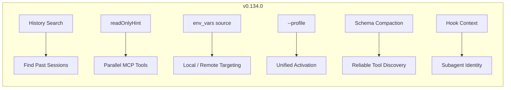
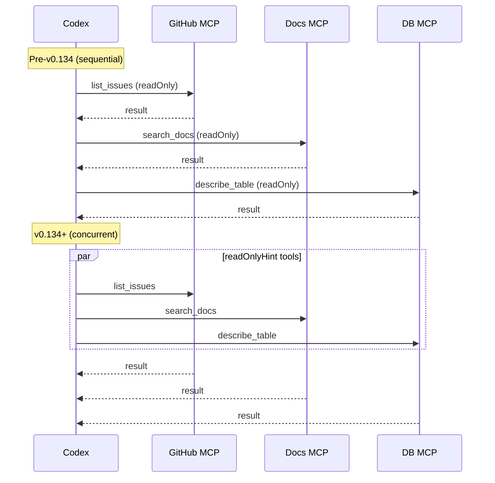

# Codex CLI v0.134.0 Release Guide: Conversation History Search, MCP Concurrency, and Profile Migration


---

Codex CLI v0.134.0 shipped on 26 May 2026 [^1], one of the quieter point releases of the month but one that meaningfully changes three everyday workflows: finding past sessions, running read-only MCP tools in parallel, and managing named configuration profiles. This article unpacks every change, shows updated configuration, and flags what you need to migrate.

## What Shipped

The release groups into six areas:

1. **Conversation history search** — case-insensitive, full-content search across local session transcripts.
2. **Concurrent read-only MCP tool execution** — tools advertising `readOnlyHint` now run in parallel.
3. **Per-server MCP environment targeting** — `env_vars` gains explicit `source` control for local vs remote executors.
4. **Profile selector unification** — `--profile` becomes the single activation path; legacy `[profiles.*]` tables are rejected.
5. **Tool schema reliability** — connector tools preserve `$ref`/`$defs` structures and compact oversized schemas.
6. **Richer extension and hook context** — extensions receive conversation history; hooks receive subagent identity.



## Conversation History Search

Every interactive Codex session is persisted as a JSONL rollout under `~/.codex/sessions/YYYY/MM/DD/` [^2]. Until v0.134.0, finding a previous session meant either using the resume picker (`/resume` or `codex resume`) or manually grepping the JSONL files. The new search feature adds case-insensitive content matching with result previews directly from the TUI [^1].

### How It Works

From an active session, type `/search` followed by your query. Results display matched session excerpts with timestamps, and selecting a result opens that session via the existing resume flow.

From the command line:

```bash
# Search all local sessions for a term
codex resume --search "database migration"

# Combine with directory scoping
codex resume --search "failing test" --all
```

The `--all` flag extends search beyond the current working directory, matching sessions from any project [^2].

### Practical Patterns

For teams that use Codex CLI heavily, conversation history search turns past sessions into a knowledge base. Common uses:

- **Audit trail** — find the session where a specific file was modified or a deployment command was executed.
- **Pattern reuse** — locate a previous prompt that solved a similar problem and fork from it.
- **Incident review** — search for error messages to find how a colleague resolved them.

## Concurrent Read-Only MCP Tool Execution

This is the headline performance improvement. When an MCP server declares a tool with `readOnlyHint: true` in its tool annotations, Codex CLI now executes those tools concurrently rather than sequentially [^1]. The default concurrency limit is governed by `agents.max_threads`, which defaults to `6` [^3].

### Why This Matters

Consider a typical workflow composing multiple MCP servers — a documentation server, a GitHub server in read-only mode, and a database schema explorer. Previously, each tool call waited for the preceding one to finish. With `readOnlyHint`, a prompt like "summarise the open issues, check the API docs for rate limits, and show me the users table schema" can fan out all three queries simultaneously.



### MCP Server Requirements

The concurrency optimisation is opt-in on the server side. An MCP server must declare `readOnlyHint` in its tool annotations [^4]:

```json
{
  "name": "list_issues",
  "description": "List open issues",
  "annotations": {
    "readOnlyHint": true
  }
}
```

If your MCP server does not advertise this hint, tools continue to execute sequentially. Mutating tools (creating issues, writing files, running commands) should never set this flag.

### Tuning Concurrency

Adjust the thread ceiling in `~/.codex/config.toml`:

```toml
[agents]
max_threads = 8  # default is 6
```

Higher values benefit setups with many read-only MCP servers but increase memory pressure. Monitor with `codex doctor` [^5] if sessions become sluggish.

## Per-Server MCP Environment Targeting

MCP server configuration in `config.toml` now supports explicit `source` declarations on `env_vars`, distinguishing between variables read from the local shell environment and those resolved on a remote executor [^1] [^3].

### Configuration Syntax

```toml
[mcp_servers.prod-db]
command = "db-mcp-server"
args = ["--read-only"]

# Simple form: reads from local environment (default)
env_vars = ["DATABASE_URL", "DB_READ_REPLICA"]

# Object form: explicit source targeting
[[mcp_servers.prod-db.env_vars]]
name = "DATABASE_URL"
source = "local"

[[mcp_servers.prod-db.env_vars]]
name = "REMOTE_DB_TOKEN"
source = "remote"
```

The `source = "local"` setting reads from Codex's parent process environment. The `source = "remote"` setting resolves the variable on the remote executor, which is relevant only when using `codex remote-control` or executor-backed workflows [^3].

### When to Use Remote Targeting

Remote environment targeting matters in two scenarios:

1. **Remote executors** — when running `codex remote-control` against a cloud VM, the executor environment may contain credentials (e.g., instance-profile tokens, Kubernetes service account tokens) that do not exist locally.
2. **Hybrid setups** — a local MCP server for documentation alongside a remote MCP server for production database access, each needing different credential sources.

⚠️ Streamable HTTP servers do not support remote environment placement as of v0.134.0. This applies only to STDIO-transport servers [^3].

## Profile Selector Unification

v0.134.0 makes `--profile` the canonical way to activate a named profile, unifying behaviour across the CLI, TUI permissions, and sandbox flows [^1]. The legacy `[profiles.profile-name]` table syntax inside `config.toml` is now rejected with a migration warning [^6].

### Migration Path

**Before (deprecated):**

```toml
# ~/.codex/config.toml — OLD STYLE, rejected in v0.134.0
[profiles.deep-review]
model = "gpt-5.5"
model_reasoning_effort = "xhigh"
approval_mode = "unless-allow-listed"
```

**After (v0.134.0+):**

```toml
# ~/.codex/deep-review.config.toml — NEW STYLE
model = "gpt-5.5"
model_reasoning_effort = "xhigh"
approval_mode = "unless-allow-listed"
```

Each profile lives in its own file at `$CODEX_HOME/profile-name.config.toml`. The file uses top-level keys — no wrapping table [^6].

### Activation

```bash
# CLI flag
codex --profile deep-review

# Environment variable
export CODEX_PROFILE=deep-review
codex

# Default profile in config.toml
# ~/.codex/config.toml
profile = "deep-review"
```

### Recommended Profile Names

Name profiles after environments rather than individuals or projects [^6]:

| Profile | Purpose |
|---------|---------|
| `dev` | Fast iteration, `suggest` approval, Spark model |
| `ci` | Non-interactive, `auto-edit` approval, `--ephemeral` |
| `review` | High reasoning effort, `unless-allow-listed` |
| `prod` | Locked sandbox, restricted MCP servers, audit hooks |

## Tool Schema Reliability

Connector tools (MCP tools exposed through the tool protocol) now preserve local `$ref` and `$defs` JSON Schema structures rather than inlining them [^1]. For schemas exceeding the token budget, Codex compacts them before exposure to the model, reducing hallucinated parameter names.

This is a behind-the-scenes improvement, but if you maintain an MCP server with complex nested schemas, you should see fewer cases of the model inventing parameters that do not exist.

## Richer Extension and Hook Context

Extensions now receive conversation history in their tool context, enabling tools that reason across the full session [^1]. Hooks gain subagent identity in their input payload, allowing hook logic to differentiate between the primary agent and its subagents.

For hooks, the input JSON now includes:

```json
{
  "event": "on_agent_tool_call",
  "agent_id": "main",
  "subagent_id": "subagent-3a9f",
  "tool_name": "write_file",
  "tool_input": { "path": "src/index.ts", "content": "..." }
}
```

This enables patterns like:
- **Subagent-specific policies** — block file writes from subagents while allowing them from the primary agent.
- **Audit differentiation** — log which agent in a multi-agent session performed each action.

## Bug Fixes

The release also addresses several reliability issues [^1]:

- **Remote WebSocket reconnection** — the remote client now reconnects more reliably after network interruptions.
- **Windows TUI rendering** — fixes for visual artefacts in Windows Terminal and ConPTY environments.
- **Workspace-specific usage limits** — usage-limit messages now correctly reference the active workspace rather than the global quota.
- **Node-based tool proxy** — environment variables are now forwarded correctly to Node.js-based MCP tool proxies.

## Upgrade Path

```bash
# Self-update (if installed via npm)
npm update -g @openai/codex

# Or via the built-in updater
codex self-update

# Verify
codex --version
# 0.134.0
```

After updating:

1. **Migrate profiles** — move any `[profiles.*]` tables from `config.toml` into separate `*.config.toml` files.
2. **Audit MCP servers** — mark genuinely read-only tools with `readOnlyHint` on the server side to benefit from concurrent execution.
3. **Test env_vars** — if using remote executors, verify that `source` declarations resolve correctly.

## Citations

[^1]: OpenAI, "Codex CLI v0.134.0 Release Notes," GitHub Releases, 26 May 2026. [https://github.com/openai/codex/releases](https://github.com/openai/codex/releases)

[^2]: OpenAI, "Features — Codex CLI," OpenAI Developers, 2026. [https://developers.openai.com/codex/cli/features](https://developers.openai.com/codex/cli/features)

[^3]: OpenAI, "Configuration Reference — Codex," OpenAI Developers, 2026. [https://developers.openai.com/codex/config-reference](https://developers.openai.com/codex/config-reference)

[^4]: Model Context Protocol, "Tool Annotations," MCP Specification, 2026. [https://modelcontextprotocol.io/specification/2025-03-26/server/tools#annotations](https://modelcontextprotocol.io/specification/2025-03-26/server/tools#annotations)

[^5]: OpenAI, "Codex CLI v0.131.0 Release Notes — codex doctor," GitHub Releases, 18 May 2026. [https://github.com/openai/codex/releases](https://github.com/openai/codex/releases)

[^6]: OpenAI, "Advanced Configuration — Codex," OpenAI Developers, 2026. [https://developers.openai.com/codex/config-advanced](https://developers.openai.com/codex/config-advanced)
