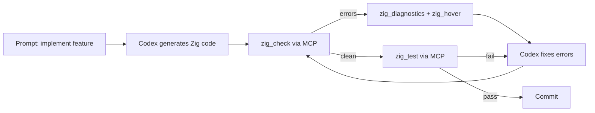
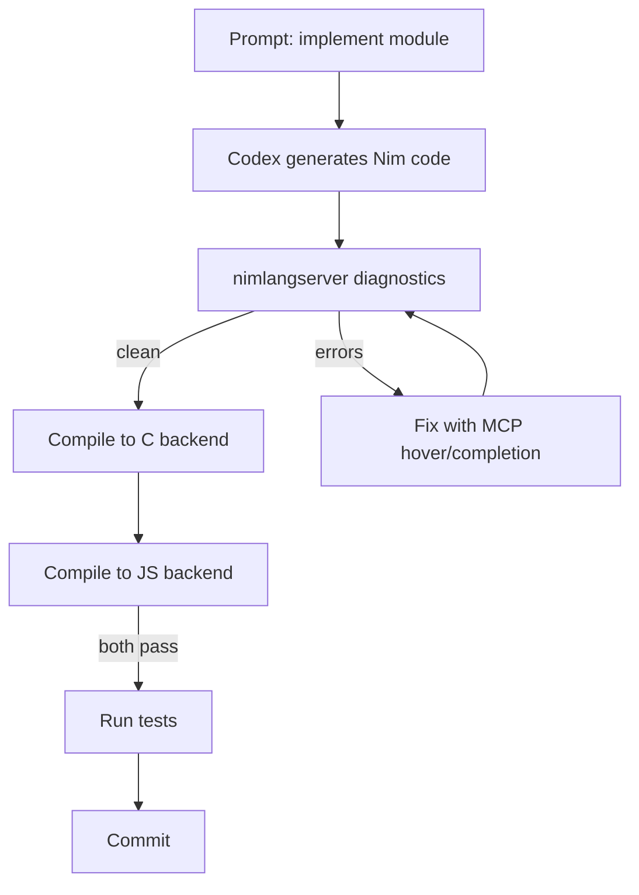

# Codex CLI for Zig and Nim: MCP Servers, Agent Skills, and Emerging Systems Language Workflows


---

Codex CLI's existing systems-language coverage spans Go, Rust, and C/C++ — the incumbents. But two emerging languages are quietly accumulating the MCP infrastructure and agent tooling needed to make AI-assisted development practical: **Zig 0.16.0** (released April 2026)[^1] and **Nim 2.2.10** (released April 2026)[^2]. Both now have dedicated MCP servers, language-server-backed code intelligence, and agent skill packages that slot directly into a Codex CLI `config.toml`. This article maps the tooling landscape and shows how to wire it together.

## Why Zig and Nim Present Unique Agent Challenges

Neither language is a straightforward code-generation target. Zig's comptime system replaces templates and generics with ordinary Zig code that executes at compile time — there is no separate syntax[^3]. Most LLM training data contains patterns from Zig 0.11–0.13 that produce compilation errors on 0.16[^4]. Nim's macro-driven metaprogramming and multi-backend compilation (C, C++, JavaScript) create a similar gap between what models have seen and what current toolchains expect.

Agent-assisted workflows for these languages therefore depend on two things: **up-to-date documentation served via MCP**, and **agent skills that encode version-specific rules** to override stale training data.

## The Zig MCP Ecosystem

Three MCP servers cover complementary surfaces for Zig development.

### zig-mcp (nzrsky) — ZLS Bridge

The most capable option bridges Codex CLI to the Zig Language Server (ZLS) via the Language Server Protocol[^5]. It spawns ZLS as a child process, communicates via LSP's Content-Length framing, and exposes the results as MCP tools:

**Code intelligence tools:** `zig_hover`, `zig_definition`, `zig_references`, `zig_completion`, `zig_diagnostics`, `zig_format`, `zig_rename`, `zig_document_symbols`, `zig_workspace_symbols`, `zig_code_action`, `zig_signature_help`

**Build tools:** `zig_build`, `zig_test`, `zig_check`, `zig_version`, `zig_manage`

The server automatically restarts ZLS on crash and reopens tracked documents — essential for long-running agent sessions[^5].

### zig-mcp (zig-wasm) — Documentation Server

A lighter server focused on standard library and builtin documentation[^6]. Four tools — `list_builtin_functions`, `get_builtin_function`, `search_std_lib`, `get_std_lib_item` — read directly from local Zig installations via `zig std`, significantly reducing token usage compared to embedding full docs in the system prompt. Current release is v1.4.0[^6].

### mcp.zig — Native Zig MCP Framework

For teams building custom tooling, mcp.zig provides a native Zig implementation of the MCP protocol itself[^7]. Written entirely in Zig, it supports STDIO and HTTP transports, JSON-RPC 2.0, and the full tool/resource/prompt surface. Version 0.0.5 implements MCP protocol version 2025-11-25[^7].

## The Nim MCP Ecosystem

### NimCP — MCP Server Library

NimCP leverages Nim's macro system to provide a declarative API for building MCP servers[^8]. Tools are registered via the `mcpTool` macro, which extracts tool name, description, and JSON schema directly from procedure signatures and doc comments:

```nim
let server = mcpServer("nim-project-tools", "1.0.0"):
  mcpTool:
    proc analyse_imports(file_path: string): string =
      ## Analyse Nim import graph for a given file
      return analyseImports(file_path)
```

NimCP supports four transports — STDIO, SSE, HTTP (via the Mummy web framework), and WebSocket — and installs via `nimble install nimcp`[^8]. ⚠️ NimCP implements MCP 2024-11-05; compatibility with the forthcoming 2026-07-28 specification[^9] is unconfirmed.

### nimlangserver — Language Server with MCP Mode

The official Nim language server (v1.14.0, May 2026) can run as an MCP server for AI coding agents including Codex CLI, Claude Code, and Gemini[^10]. Built on nimsuggest, it provides semantic code intelligence — completions, go-to-definition, hover, diagnostics — exposed through MCP rather than requiring a separate LSP client[^10].

## Codex CLI Configuration

### Zig: Three-Server Composition

Wire all three Zig MCP servers into `~/.codex/config.toml` (or project-scoped `.codex/config.toml`)[^11]:

```toml
[mcp_servers.zig-zls]
command = "/path/to/zig-mcp"
args = ["--zls-path", "/path/to/zls"]

[mcp_servers.zig-docs]
command = "npx"
args = ["-y", "zig-mcp@latest"]

[mcp_servers.zig-build-tools]
command = "npx"
args = ["-y", "@smithery/cli", "install", "zig-mcp-server", "--client", "codex"]
env = { GITHUB_TOKEN = "$GITHUB_TOKEN" }
```

The ZLS bridge handles code intelligence and builds. The docs server handles API lookups without burning context on full documentation. The build tools server adds code generation and optimisation analysis[^12].

### Nim: Dual-Server Setup

```toml
[mcp_servers.nim-langserver]
command = "nimlangserver"
args = ["--mcp"]

[mcp_servers.nim-custom]
command = "nim-mcp-server"
args = ["--transport", "stdio"]
```

The language server provides semantic intelligence. A project-specific NimCP server (built with the library above) can expose domain-specific tools — database schema validators, configuration linters, deployment checks[^8].

## Agent Skills: Overriding Stale Training Data

### Zig Skills Package

The zig-skills package provides 57 reference files targeting Zig 0.16.0, covering standard library APIs, language basics, production patterns, and migration guides for breaking changes across 0.14–0.16[^4]. Install globally:

```bash
npx -y skills add https://github.com/nzrsky/zig-skills
```

Or scope to a project by copying the `.codex/` directory from the repository into your project root. This gives Codex CLI verified, version-specific guidance that prevents generation of deprecated patterns like `@cImport` (deprecated in 0.16 in favour of the build system's translate-c package, with full removal planned for a future release)[^1][^4].

### AGENTS.md for Zig Projects

Create an `AGENTS.md` in the project root encoding Zig-specific rules:

```markdown
# Zig 0.16 Project Rules

## Language Version
- Target: Zig 0.16.0. Do NOT use APIs from 0.14 or earlier.
- `@cImport` is DEPRECATED (removal planned for 0.17). Use build system translate-c package.
- Use `std.Io` for async I/O (new in 0.16), not legacy patterns.
- Package dependencies live in `zig-pkg/` directory.

## Build System
- Always use `build.zig` with `b.path()` and `root_module` patterns.
- Cross-compilation targets must use the Zig build system, not Makefiles.

## Testing
- Run `zig build test` before committing. All tests must pass.
- Use `std.testing` assertions, not manual error checks.

## Anti-Hallucination
- If uncertain about an API, use the zig-docs MCP server to verify.
- Never guess function signatures — call `zig_hover` or `search_std_lib`.
```

### AGENTS.md for Nim Projects

```markdown
# Nim 2.2 Project Rules

## Language Version
- Target: Nim 2.2.10 with ORC memory management.
- Use `--mm:orc` (default since 2.0). Do NOT reference `--gc:refc`.
- Backend: C unless JavaScript target is explicit.

## Style
- Use Nim's style insensitivity but prefer camelCase for procs.
- Prefer `result` variable over explicit return where idiomatic.

## Package Management
- Use nimble for dependencies. Lock file: nimble.lock.
- Run `nimble check` before committing.

## Anti-Hallucination
- Use nimlangserver MCP for completion and hover verification.
- Do NOT assume module paths — verify with nimlangserver MCP hover or completion.
```

## Workflow Patterns

### Pattern 1: Zig Build-Test-Fix Loop



The ZLS bridge provides real compiler diagnostics rather than relying on the model's internal Zig knowledge, which is typically 2–3 versions behind[^4].

### Pattern 2: Nim Cross-Backend Verification



Nim's multi-backend compilation means code that compiles for C may fail for JavaScript. Agent workflows should verify both targets when the project requires them[^2].

### Pattern 3: Batch Audit with codex exec

For large Zig codebases, use `codex exec` to audit files in parallel:

```bash
codex exec \
  "Review this Zig file for deprecated 0.14/0.15 patterns. \
   Flag any use of @cImport, old allocator patterns, or \
   removed std APIs. Output JSON." \
  --files "src/**/*.zig" \
  --output-schema '{"deprecated_patterns": ["string"], "severity": "string"}'
```

## Model Selection

For Zig and Nim work, model choice matters more than for mainstream languages:

| Task | Recommended Model | Rationale |
|------|-------------------|-----------|
| Code generation | `o3` | Strongest reasoning for unfamiliar syntax |
| Refactoring | `o4-mini` | Fast iteration, adequate for pattern transforms |
| Documentation | `gpt-5.5` | Best prose quality for doc comments[^13] |
| Build system | `o3` | Build.zig complexity requires deep reasoning |

⚠️ Even with `o3`, expect higher error rates than for Go or Rust. The MCP feedback loop (generate → check → fix) compensates by catching errors the model cannot self-detect.

## Sandbox and Security Considerations

Both Zig and Nim compile to native binaries. Codex CLI's sandbox must allow:

- **Network access**: Zig's package manager fetches from `zig-pkg/` (local) but may need network for initial `zig fetch`. Nim's nimble requires network for package resolution.
- **Build tool execution**: `zig build`, `nim c`, `nimble` must be permitted. Use approval mode for production-adjacent builds.
- **ZLS process**: The zig-mcp bridge spawns ZLS as a child process. Ensure the sandbox permits subprocess creation.

Configure sandbox permissions in `config.toml`:

```toml
[sandbox]
allow_network = true
allow_subprocess = true
```

## Known Limitations

- **Training data lag**: Both languages iterate faster than LLM training cycles. Zig 0.16's `std.Io` rewrite and Nim 2.2's ORC refinements may not be in model weights. MCP servers and agent skills partially compensate but cannot fully replace up-to-date training[^4].
- **Smaller community corpus**: Fewer Stack Overflow answers and blog posts mean models have less to learn from. Expect more hallucinated APIs than for Go or Rust.
- **MCP server maturity**: The zig-mcp ZLS bridge requires Zig 0.15.2+ and ZLS installed separately. The openSVM zig-mcp-server targets 0.15.2 and may lag behind 0.16 features[^12]. NimCP implements an older MCP specification[^8].
- **Token budget**: Zig's comptime and Nim's macros produce verbose intermediate representations that can exhaust context windows on complex codebases.
- **No REPL integration**: Neither language has a standard REPL, limiting the interactive exploration patterns available with Python or JavaScript agent workflows.

## Citations

[^1]: [Zig 0.16.0 Release Notes](https://ziglang.org/download/0.16.0/release-notes.html) — Zig Programming Language, April 2026
[^2]: [Nim version 2.2.10 released](https://nim-lang.org/blog/2026/04/24/nim-2210.html) — Nim Blog, April 2026
[^3]: [Zig Language Reference — Comptime](https://ziglang.org/) — Zig Programming Language
[^4]: [Zig Skills for AI Agents](https://github.com/nzrsky/zig-skills) — nzrsky, GitHub
[^5]: [zig-mcp: ZLS Bridge MCP Server](https://github.com/nzrsky/zig-mcp) — nzrsky, GitHub
[^6]: [zig-mcp: Zig Documentation MCP Server](https://github.com/zig-wasm/zig-mcp) — zig-wasm, GitHub
[^7]: [mcp.zig: Native MCP Implementation for Zig](https://github.com/muhammad-fiaz/mcp.zig) — muhammad-fiaz, GitHub
[^8]: [NimCP: MCP Server Library for Nim](https://github.com/gokr/nimcp) — gokr, GitHub
[^9]: [2026-07-28 MCP Specification Release Candidate](https://blog.modelcontextprotocol.io/posts/2026-07-28-release-candidate/) — Model Context Protocol Blog
[^10]: [Nim Language Server](https://github.com/nim-lang/langserver) — nim-lang, GitHub, v1.14.0, May 2026
[^11]: [Codex CLI Configuration Reference](https://developers.openai.com/codex/config-reference) — OpenAI Developers
[^12]: [zig-mcp-server](https://github.com/openSVM/zig-mcp-server) — openSVM, GitHub
[^13]: [Codex CLI Changelog — GPT-5.5 availability](https://developers.openai.com/codex/changelog) — OpenAI Developers, May 2026
