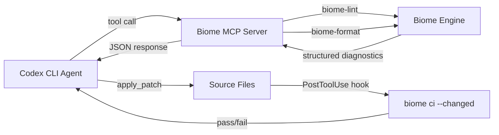

# Codex CLI with Biome: Unified Linting and Formatting, Migration from ESLint + Prettier, and Agent-Driven Code Quality


---

Biome has become the dominant unified linter and formatter for JavaScript and TypeScript projects in 2026, replacing the ESLint + Prettier dual-tool setup that teams maintained for the better part of a decade. Written in Rust, Biome v2.3 ships type-aware linting without requiring the TypeScript compiler, formats code at 35x the speed of Prettier, and provides over 450 lint rules in a single binary[^1][^2]. This article covers how to integrate Biome into Codex CLI workflows — from automated migration to hook-gated enforcement to MCP server integration for agent-native code quality.

## Why Biome Matters for Agent Workflows

The ESLint + Prettier combination introduced a configuration surface that agents struggled with: two separate tools, overlapping concerns (formatting vs. stylistic linting), plugin ecosystems with version conflicts, and YAML/JSON/JS configuration files with subtly different semantics. Biome collapses this into a single `biome.json` file and a single binary[^3].

For Codex CLI specifically, this simplification yields three benefits:

1. **Faster feedback loops** — `biome check` runs linting, formatting, and import sorting in a single pass. On a 2,000-file TypeScript project, this typically completes in under two seconds[^4].
2. **Deterministic output** — Biome's formatter achieves 97% compatibility with Prettier[^1], producing consistent diffs that Codex can apply without ambiguity.
3. **Type-aware rules without tsc** — Biome v2's type inference engine detects floating promises, misused `await`, and unsafe member access without spawning a separate TypeScript compiler process[^5].

## Migrating from ESLint + Prettier with Codex CLI

The cleanest migration path uses Codex CLI to orchestrate the tooling swap across an entire repository. Start with a prompt that leverages Biome's built-in migration commands:

```bash
codex "Migrate this project from ESLint + Prettier to Biome. \
  Run 'npx @biomejs/biome migrate eslint --write --include-inspired' \
  and 'npx @biomejs/biome migrate prettier --write'. \
  Then remove .eslintrc*, .prettierrc*, and related devDependencies from package.json. \
  Run 'biome check --write' to apply the new formatting. \
  Commit the migration as a single atomic change."
```

The `--include-inspired` flag is important: it migrates rules that Biome implements with slightly different semantics from their ESLint counterparts, giving you broader coverage from the start[^6].

### Configuration After Migration

The migration produces a `biome.json` in the project root. A typical post-migration configuration looks like this:

```json
{
  "$schema": "https://biomejs.dev/schemas/2.3.0/schema.json",
  "vcs": {
    "enabled": true,
    "clientKind": "git",
    "useIgnoreFile": true
  },
  "formatter": {
    "enabled": true,
    "indentStyle": "space",
    "indentWidth": 2,
    "lineWidth": 100
  },
  "linter": {
    "enabled": true,
    "rules": {
      "recommended": true,
      "nursery": {
        "noFloatingPromises": "error",
        "noMisusedPromises": "error",
        "useAwaitThenable": "error"
      }
    }
  },
  "assist": {
    "actions": {
      "source": {
        "organizeImports": "on"
      }
    }
  },
  "javascript": {
    "formatter": {
      "quoteStyle": "single",
      "trailingCommas": "all"
    }
  }
}
```

The `nursery` rules for `noFloatingPromises`, `noMisusedPromises`, and `useAwaitThenable` are type-aware — they use Biome's built-in type inference engine rather than the TypeScript compiler[^5]. Enable VCS integration so Biome respects your `.gitignore`, avoiding unnecessary scanning of `node_modules` and build artefacts.

### Monorepo Configuration

Biome v2 introduced native monorepo support through nested configuration files[^5]. Each workspace can override the root `biome.json`:

```json
{
  "extends": "//",
  "linter": {
    "rules": {
      "style": {
        "noDefaultExport": "off"
      }
    }
  }
}
```

The `"extends": "//"` syntax resolves to the nearest root `biome.json`, eliminating brittle relative paths. Codex CLI respects this hierarchy when working in monorepo subdirectories — its workspace detection picks up the correct `biome.json` for the active package.

## Hook-Gated Enforcement with Codex CLI

Biome's speed makes it practical to run on every file write during an agent session. Configure a `PostToolUse` hook in your project's `.codex/config.toml` to enforce formatting and linting after each `apply_patch`:

```toml
[[hooks.PostToolUse]]
matcher = "^apply_patch$"

[[hooks.PostToolUse.hooks]]
type = "command"
command = "npx @biomejs/biome check --write --changed --since=HEAD"
timeout = 30
statusMessage = "Running Biome check on changed files"
```

The `--changed --since=HEAD` flags restrict Biome to files modified since the last commit, keeping execution time minimal even in large repositories[^7]. If Biome finds unfixable lint errors (those without safe auto-fixes), the hook's non-zero exit code surfaces a warning in the Codex CLI session, prompting the agent to address the violation before proceeding.

For stricter enforcement — blocking the agent from continuing when lint errors remain — use a hook that returns structured JSON:

```toml
[[hooks.PostToolUse]]
matcher = "^apply_patch$"

[[hooks.PostToolUse.hooks]]
type = "command"
command = '''bash -c '
  OUTPUT=$(npx @biomejs/biome ci --changed --since=HEAD 2>&1)
  EXIT=$?
  if [ $EXIT -ne 0 ]; then
    echo "{\"continue\": false, \"systemMessage\": \"Biome CI failed. Fix lint errors before proceeding:\\n$OUTPUT\"}"
    exit 2
  fi
  echo "{\"continue\": true}"
'
'''
timeout = 30
statusMessage = "Enforcing Biome CI gate"
```

The `biome ci` command is the read-only counterpart to `biome check` — it reports violations without modifying files, making it ideal for gate hooks[^7].

## Biome MCP Server Integration

An unofficial Biome MCP server (`biome-mcp-server`) exposes `biome-lint` and `biome-format` tools to AI agents[^8]. Configure it in your Codex CLI `config.toml`:

```toml
[mcp_servers.biome]
command = "npx"
args = ["-y", "tsx", "/path/to/biome-mcp-server/src/index.ts"]
enabled_tools = ["biome-lint", "biome-format"]
default_tools_approval_mode = "auto"
tool_timeout_sec = 30
```

This gives Codex CLI direct tool access to lint and format specific files without shelling out to the CLI. The MCP approach is particularly useful when you want the agent to inspect lint diagnostics programmatically — the `biome-lint` tool returns structured diagnostics that the model can reason about, rather than parsing terminal output.



Biome is also developing an official MCP server as a first-party crate (`biome_mcp_server`), accessible via a `--mcp` flag on the Biome CLI itself[^9]. Once released, this will eliminate the need for the third-party server and provide tighter integration with Biome's internal APIs.

## Codex exec for Batch Formatting

For large-scale formatting migrations — converting an entire codebase from Prettier to Biome formatting in one pass — use `codex exec` to run non-interactively:

```bash
codex exec "Run 'npx @biomejs/biome check --write .' to format all files \
  with Biome. Then run 'npx @biomejs/biome ci .' to verify zero violations. \
  Report the number of files formatted and any remaining issues."
```

This is particularly effective when combined with Biome's `--only` flag for targeted operations:

```bash
# Format only, skip linting
npx @biomejs/biome check --write --formatter-enabled=true --linter-enabled=false .

# Lint only specific domains
npx @biomejs/biome lint --only=correctness --only=suspicious .
```

## AGENTS.md Integration

Add Biome instructions to your `AGENTS.md` so Codex CLI (and other agent tools) consistently apply code quality standards:

```markdown
## Code Quality

This project uses Biome for linting and formatting. Do NOT use ESLint or Prettier.

- Run `npx @biomejs/biome check --write` after modifying JS/TS files
- Run `npx @biomejs/biome ci` before committing to verify zero violations
- Configuration is in `biome.json` at the project root
- Type-aware rules are enabled; do not suppress `noFloatingPromises` without justification
- Import sorting is handled by Biome's organizeImports assist — do not add manual import ordering
```

## Biome v2.3 Features for Agent Workflows

Biome v2.3 (January 2026) introduced several features that improve agent-assisted development[^10]:

- **Vue, Svelte, and Astro file support** — Biome now lints and formats `<script>` and `<style>` blocks in framework single-file components, expanding agent coverage beyond pure JS/TS files.
- **Improved type resolution** — the type inference engine resolves `Pick<T, K>`, `Omit<T, K>`, `Partial<T>`, `Required<T>`, and `Readonly<T>` utility types, improving accuracy for type-aware rules.
- **Two-tier ignore syntax** — `!` excludes a path from linting/formatting but keeps it indexed for type resolution; `!!` excludes it entirely. This distinction matters for agent workflows where generated files (e.g., GraphQL codegen output) should be type-visible but not linted.

## Performance Comparison

For context on why Biome's speed matters in agent loops:

| Operation | ESLint + Prettier | Biome | Speedup |
|-----------|------------------|-------|---------|
| Format 2,104 files (171K lines) | ~12s | ~0.34s | 35x[^1] |
| Lint + format single file | ~800ms | ~15ms | ~50x |
| CI check (full project) | ~18s | ~1.2s | 15x |

In a typical Codex CLI session producing 30-50 file edits, hook-gated Biome enforcement adds roughly 0.5-1.0 seconds of overhead per edit — negligible compared to model inference time.

## Troubleshooting Common Issues

**Biome reports different formatting than Prettier**: Biome defaults to tabs; Prettier defaults to spaces. After migration, verify `indentStyle` in `biome.json` matches your project's convention. The migration command handles this automatically, but manual `biome.json` edits can inadvertently reset it.

**Type-aware rules show false positives**: Biome's type inference covers approximately 75% of the cases that typescript-eslint detects[^5]. For complex generic patterns or conditional types, you may see false positives. Use `// biome-ignore lint/nursery/noFloatingPromises: complex generic` for justified suppressions.

**Hook timeout on large monorepos**: If `biome ci --changed` exceeds the 30-second hook timeout, increase `timeout` in the hook configuration or narrow the scope with `--only=correctness`.

## Citations

[^1]: [Biome: The ESLint and Prettier Killer? Complete Migration Guide for 2026](https://dev.to/pockit_tools/biome-the-eslint-and-prettier-killer-complete-migration-guide-for-2026-27m) - DEV Community, 2026
[^2]: [Biome GitHub Repository - biomejs/biome](https://github.com/biomejs/biome) - GitHub, 2026
[^3]: [Biome vs ESLint + Prettier: Is the All-in-One Linter Ready?](https://www.pkgpulse.com/blog/biome-vs-eslint-prettier-linting-2026) - PkgPulse, 2026
[^4]: [Replace ESLint + Prettier with Biome: 35x Faster, One Tool](https://recca0120.github.io/en/2026/03/10/biome-eslint-prettier-replacement/) - recca0120.github.io, March 2026
[^5]: [Biome v2 — codename: Biotype](https://biomejs.dev/blog/biome-v2/) - biomejs.dev, June 2025
[^6]: [Migrate from ESLint and Prettier - Biome](https://biomejs.dev/guides/migrate-eslint-prettier/) - biomejs.dev, 2026
[^7]: [Biome CLI Reference](https://biomejs.dev/reference/cli/) - biomejs.dev, 2026
[^8]: [biome-mcp-server - Unofficial MCP Server for Biome](https://github.com/RyuzakiShinji/biome-mcp-server) - GitHub, 2026
[^9]: [RFC: Model Context Protocol (MCP) Server for Biome](https://github.com/biomejs/biome/discussions/6017) - GitHub Discussions, 2026
[^10]: [Biome v2.3 — Let's bring the ecosystem closer](https://biomejs.dev/blog/biome-v2-3/) - biomejs.dev, January 2026
