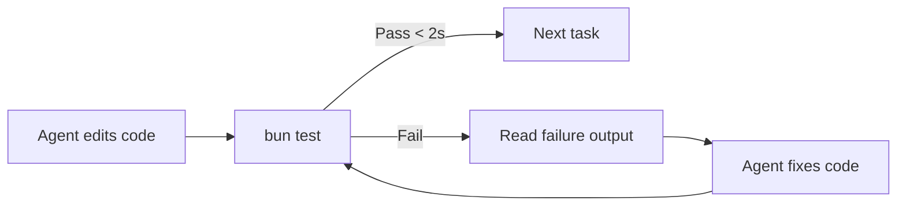
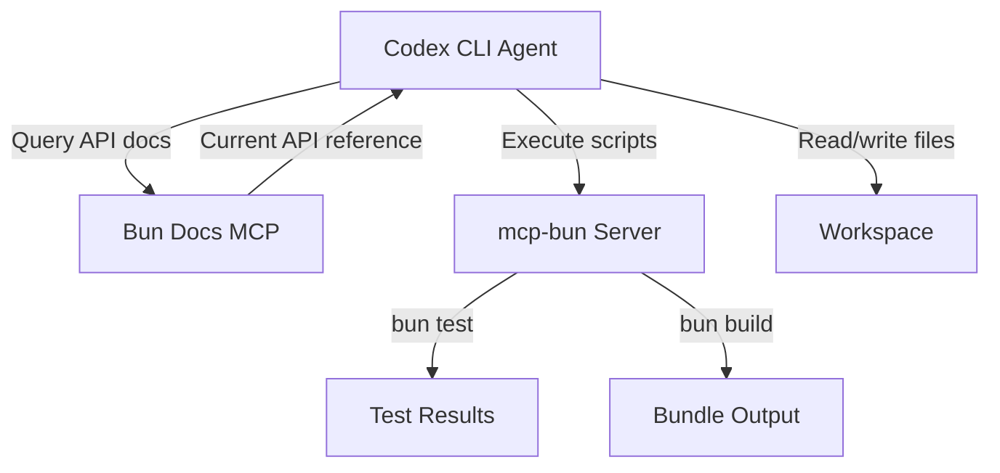

# Codex CLI for Bun Development: Runtime, Test Runner, Database Clients, and MCP-Driven Agent Workflows


---

Bun has matured from a promising upstart into a batteries-included JavaScript runtime shipping built-in database clients, a Jest-compatible test runner, a bundler, and a package manager — all in a single binary written in Zig[^1]. With v1.3.14 (May 2026) adding `Bun.Image`, HTTP/3 in `Bun.serve()`, and a rewritten `fs.watch()`[^2], the runtime now covers enough surface area that many projects can drop Node.js, Jest, Webpack, and half a dozen npm dependencies in a single migration.

This article covers how to configure Codex CLI for Bun-native development: AGENTS.md conventions, sandbox configuration for Bun's built-in database clients, the `bun test` feedback loop, MCP server integration, and `codex exec` pipelines that exploit Bun's 14× faster startup[^3].

## Why Bun Projects Need Bun-Specific Agent Configuration

Codex CLI infers project tooling from lockfiles, configuration files, and AGENTS.md directives. A Bun project diverges from a Node.js project in several ways that affect agent behaviour:

- **`bun.lock`** replaces `package-lock.json` — Codex must run `bun install` not `npm install`
- **`bun test`** replaces Jest or Vitest — the agent must recognise Bun's test runner flags
- **`Bun.SQL`** provides built-in Postgres, MySQL, and SQLite clients[^4] — sandbox network policies must allow database connections
- **`Bun.serve()`** replaces Express/Fastify for HTTP servers — different startup patterns
- **TypeScript runs natively** without a compile step — no `tsc` or `ts-node` needed

Without explicit AGENTS.md guidance, Codex defaults to Node.js assumptions and generates `npm run test`, `npx`, or unnecessary TypeScript compilation steps.

## AGENTS.md Configuration for Bun Projects

A root-level AGENTS.md should establish Bun as the primary runtime and constrain agent behaviour accordingly:

```markdown
# AGENTS.md

## Runtime
This project uses Bun v1.3.x. Do NOT use node, npm, npx, or yarn.
Use `bun` for all script execution, `bun install` for dependencies,
`bun test` for testing, and `bunx` for one-off package execution.

## Package Management
- Lockfile: bun.lock (text-based, git-diffable)
- Do NOT generate package-lock.json or yarn.lock
- Use `bun add` / `bun remove` for dependency changes

## Testing
- Test runner: `bun test` (Jest-compatible API)
- Coverage: `bun test --coverage`
- Snapshots: `bun test --update-snapshots` to refresh
- Test files: `**/*.test.ts` or `**/__tests__/**`

## Database
- This project uses Bun.SQL for Postgres (built-in, no npm package)
- Connection string from DATABASE_URL environment variable
- Use `--sql-preconnect` flag for server startup

## Build
- Bundler: `bun build` (no Webpack/Vite/esbuild needed)
- Entry point: src/index.ts
- Output: dist/
```

## Sandbox and Permission Profile Configuration

Bun's built-in database clients and HTTP server require network access that Codex's default sandbox restricts. A dedicated permission profile in `config.toml` addresses this:

```toml
[profiles.bun-dev]
sandbox_mode = "workspace-write"
approval_policy = "auto-edit"

[profiles.bun-dev.sandbox]
# Allow Bun's built-in database clients
allow_network = [
  "localhost:5432",   # Postgres
  "localhost:3306",   # MySQL
  "localhost:6379",   # Redis
  "localhost:3000",   # Dev server
]

# Bun writes to these paths
allow_write = [
  "./dist",
  "./node_modules",
  "./.bun",
]
```

Launch sessions with:

```bash
codex --profile bun-dev
```

For CI pipelines using `codex exec`, the `--full-auto` flag combined with `--sandbox workspace-write` provides the necessary permissions:

```bash
codex exec --full-auto --sandbox workspace-write \
  "Run bun test --coverage and report any failures"
```

## The Bun Test Feedback Loop

Bun's test runner executes a 500-test suite in roughly 1.2 seconds — 20× faster than Jest[^5]. This speed transforms the agent feedback loop. Where Jest-based workflows might discourage running the full suite on every edit, Bun makes whole-suite execution practical after every change.



A Bun-specific test skill in `.codex/skills/bun-test.md` encodes this:

```markdown
# Bun Test Skill

After EVERY code change, run `bun test` on the affected test files.
If all tests pass, run `bun test` on the full suite to catch regressions.

Use `bun test --bail` to stop at the first failure during iterative fixes.
Use `bun test --timeout 5000` for integration tests with database access.
Use `bun test --coverage` before committing to verify coverage thresholds.

Bun test is Jest-compatible. Use:
- `describe` / `it` / `expect` for assertions
- `beforeAll` / `afterAll` for lifecycle hooks
- `mock()` for mocking (Bun-native, not jest.mock)
- `spyOn()` for spying on methods
```

### Snapshot Testing with Codex

Bun's snapshot testing integrates cleanly with Codex workflows. When the agent generates new UI components or API responses, it can create baseline snapshots:

```typescript
import { expect, test } from "bun:test";

test("API response shape", () => {
  const response = buildUserResponse({ id: 1, name: "Test" });
  expect(response).toMatchSnapshot();
});
```

When the agent intentionally changes output shapes, it runs `bun test --update-snapshots` and includes the updated snapshot files in the commit.

## MCP Server Integration

The **mcp-bun** server by Carlos Eduardo provides Codex CLI with direct access to Bun runtime operations: script execution, dependency management, project building, and performance analysis[^6]. Configure it in `config.toml`:

```toml
[mcp_servers.bun]
command = "npx"
args = ["-y", "@anthropic/mcp-bun"]
env = { BUN_PATH = "/usr/local/bin/bun" }
```

The **Bun Docs MCP** server provides the agent with up-to-date Bun API documentation[^7], which is particularly valuable given how rapidly Bun's API surface has expanded through the 1.3.x series:

```toml
[mcp_servers.bun-docs]
command = "npx"
args = ["-y", "bun-docs-mcp"]
```

With both servers connected, the agent can query current Bun APIs before generating code, avoiding hallucinated or deprecated patterns.



## Exploiting Bun's Built-in Database Clients

Bun 1.2 introduced `Bun.SQL` for Postgres[^4], and Bun 1.3 extended this to MySQL and Redis with native clients that outperform their npm equivalents — the built-in Redis client delivers 7.9× the throughput of ioredis[^8].

For Codex workflows, this means the agent can scaffold database-backed features without adding dependencies:

```typescript
import { sql } from "bun";

const users = await sql`
  SELECT id, name, email
  FROM users
  WHERE created_at > ${cutoffDate}
`;
```

An AGENTS.md directive should make this preference explicit:

```markdown
## Database Access
- Use `import { sql } from "bun"` for all database queries
- Do NOT install pg, mysql2, or ioredis packages
- Built-in Redis: `import { RedisClient } from "bun"`
- Use parameterised queries (template literals) — never string concatenation
```

### Sandbox Considerations for Database Tests

When Codex runs integration tests that connect to a local Postgres instance, the sandbox must permit network access to the database port. The `--sql-preconnect` flag, added in Bun 1.3, establishes the database connection at process startup rather than on first query[^4], which reduces test latency:

```bash
bun --sql-preconnect test --timeout 10000 tests/integration/
```

## Non-Interactive Pipelines with codex exec

Bun's fast startup makes it ideal for `codex exec` pipelines where the agent runs a single task and exits. A typical CI integration:

```bash
# Generate API client from OpenAPI spec
codex exec --full-auto --model gpt-5.4 \
  "Read openapi.yaml and generate a type-safe Bun client in src/api/client.ts. \
   Use Bun.SQL for database queries. Run bun test to verify."

# Dependency audit
codex exec --full-auto --model o4-mini \
  --output-schema '{"type":"object","properties":{"vulnerabilities":{"type":"array"},"outdated":{"type":"array"}}}' \
  "Run bun audit and bun outdated. Return structured findings."
```

The `--output-schema` flag produces machine-parseable JSON that downstream CI steps can consume[^9].

## Migration from Node.js Projects

When migrating an existing Node.js project to Bun, Codex can automate the bulk of the work with a structured prompt:

```bash
codex exec --full-auto \
  "Migrate this project from Node.js to Bun:
   1. Replace package-lock.json with bun.lock (run bun install)
   2. Replace jest.config.ts with bun test conventions
   3. Replace pg/mysql2 imports with Bun.SQL
   4. Replace express with Bun.serve()
   5. Update scripts in package.json to use bun
   6. Run bun test and fix any failures
   7. Update AGENTS.md to reflect Bun conventions"
```

The key migration points:

| Node.js | Bun Equivalent |
|---------|----------------|
| `npm install` | `bun install` |
| `npx` | `bunx` |
| `jest` / `vitest` | `bun test` |
| `pg` / `mysql2` | `Bun.SQL` |
| `ioredis` | Built-in Redis client |
| `express` / `fastify` | `Bun.serve()` |
| `webpack` / `esbuild` | `bun build` |
| `ts-node` / `tsx` | Native TypeScript execution |

## Performance Considerations for Agent Workflows

Bun's performance characteristics directly benefit agent feedback loops:

- **Startup:** 14× faster than Node.js[^3] — each `codex exec` invocation completes faster
- **Install:** 7× faster warm installs with v1.3.14's isolated linker[^2] — dependency changes resolve quickly
- **Testing:** 20× faster than Jest for equivalent suites[^5] — the agent can run tests more frequently
- **Bundling:** Built-in bundler avoids Webpack/Vite configuration complexity

These compound across a typical agent session. A Codex session that runs 30 test cycles saves roughly 10 minutes compared to an equivalent Jest-based workflow — time the agent spends on actual code changes rather than waiting for tooling. ⚠️ (Exact savings depend on suite size and hardware.)

## PreToolUse Hook for Bun Enforcement

To prevent the agent from falling back to Node.js commands, a PreToolUse hook in `.codex/hooks/enforce-bun.sh` can reject non-Bun invocations:

```bash
#!/bin/bash
# .codex/hooks/enforce-bun.sh
# Reject npm/node/npx/yarn commands in Bun projects

COMMAND="$CODEX_TOOL_INPUT"

if echo "$COMMAND" | grep -qE '^\s*(npm|npx|node|yarn)\s'; then
  echo "REJECT: Use bun/bunx instead of npm/npx/node/yarn in this project"
  exit 1
fi
```

Register it in `config.toml`:

```toml
[[hooks.pre_tool_use]]
command = ".codex/hooks/enforce-bun.sh"
on_tools = ["shell"]
```

## Conclusion

Bun's all-in-one design — runtime, package manager, test runner, bundler, and database clients in a single binary — reduces the configuration surface that Codex CLI must navigate. Fewer tools means fewer agent mistakes, faster feedback loops, and simpler AGENTS.md files. The emerging MCP server ecosystem for Bun provides the final piece: real-time API documentation and runtime execution capabilities that keep the agent grounded in current Bun APIs rather than hallucinating Node.js patterns.

For teams already on Bun or considering migration, investing in Bun-specific AGENTS.md conventions, sandbox profiles, and PreToolUse enforcement pays immediate dividends in agent accuracy and session throughput.

## Citations

[^1]: [Bun — A fast all-in-one JavaScript runtime](https://bun.com/) — Official Bun homepage describing the runtime as written in Zig with built-in bundler, test runner, and package manager.

[^2]: [Bun v1.3.14 Release Blog](https://bun.com/blog/bun-v1.3.14) — Release notes for v1.3.14 (May 2026) covering Bun.Image, 7× faster warm installs, HTTP/3, and rewritten fs.watch().

[^3]: [MCP Bun Server — AI-Powered JS/TS Development](https://mcpmarket.com/es/server/bun) — Documents Bun's 14× faster startup compared to Node.js in the context of MCP server performance.

[^4]: [Bun 1.3 Release Blog](https://bun.com/blog/bun-v1.3) — Bun 1.3 release announcing built-in MySQL client, Redis client, and zero-config frontend dev server, building on Bun 1.2's Bun.SQL for Postgres.

[^5]: [Bun Test vs Vitest vs Jest Benchmarks 2026 — PkgPulse](https://www.pkgpulse.com/guides/bun-test-vs-vitest-vs-jest-test-runner-benchmark-2026) — Benchmark comparison showing Bun test completing a 500-test suite in 1.2 seconds versus Jest's 24 seconds.

[^6]: [carlosedp/mcp-bun — GitHub](https://github.com/carlosedp/mcp-bun) — Bun JavaScript Runtime MCP Server providing script execution, dependency management, and performance analysis tools for AI agents.

[^7]: [Bun Docs MCP — Zed Extension](https://zed.dev/extensions/bun-docs-mcp) — MCP server providing up-to-date Bun documentation to AI assistants.

[^8]: [Bun Introduces Built-in Database Clients — InfoQ](https://www.infoq.com/news/2026/01/bun-v3-1-release/) — Coverage of Bun's built-in Redis client delivering 7.9× the performance of ioredis.

[^9]: [Codex CLI Features — OpenAI Developers](https://developers.openai.com/codex/cli/features) — Official documentation for `codex exec` non-interactive mode and `--output-schema` structured output.
