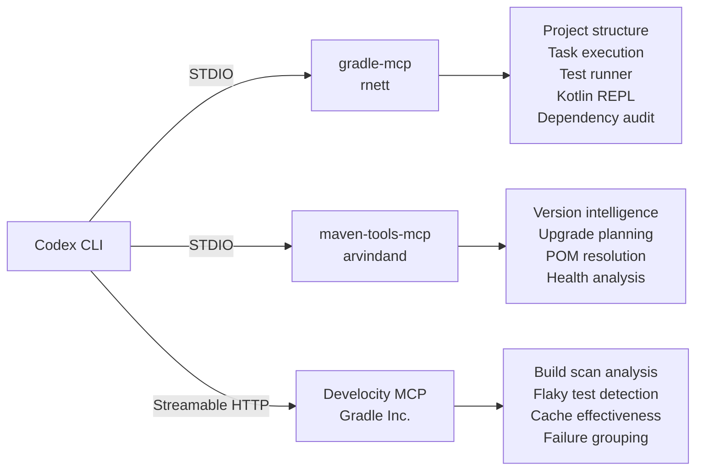
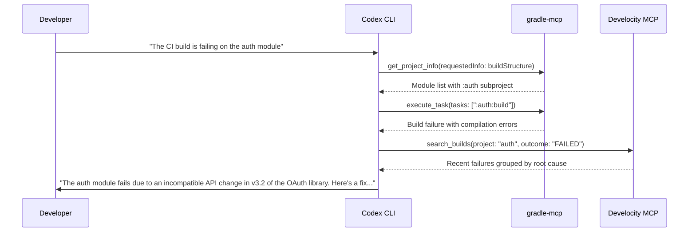

# Codex CLI for Gradle Builds: MCP Servers, Develocity Integration, and Agent-Driven Dependency Management


---

Gradle remains the dominant build tool for JVM projects — powering Android, Spring Boot, Kotlin Multiplatform, and a growing share of enterprise Java estates [^1]. With Gradle 9.5.1 shipping in May 2026 [^2] and Codex CLI at v0.134.0 [^3], there is now a mature MCP server ecosystem bridging agent-assisted development with Gradle's Tooling API, Develocity build scans, and Maven Central dependency intelligence. This article maps the integration landscape and provides concrete configuration for production use.

## The Gradle MCP Ecosystem

Three categories of MCP server cover different slices of the Gradle workflow:



### gradle-mcp (rnett) — The Primary Build Server

The `gradle-mcp` server by Ryan Nett is the most comprehensive option, superseding the now-deprecated `IlyaGulya/gradle-mcp-server` [^4]. It exposes the full Gradle Tooling API to agents and ships with built-in agent skills for common workflows [^5].

**Key capabilities:**

- **Project exploration** — multi-project structure discovery, module listing, task enumeration, and property inspection
- **Task execution** — background builds with output capture, environment control, and progress monitoring
- **Test execution** — filtered test suites with full stack traces and per-case log access
- **Dependency management** — auditing, updating, and adding dependencies with source browsing
- **Kotlin REPL** — interactive environment with access to all project classes for API exploration
- **Compose UI verification** — render Compose components to images for visual checking
- **Gradle documentation** — searchable indexed user guides and DSL references

**Requirements:** JDK 25 or higher [^5].

### maven-tools-mcp — Dependency Intelligence

The `arvindand/maven-tools-mcp` server provides Maven Central dependency intelligence for all JVM build tools, including Gradle [^6]. It exposes 11 tools covering version lookups, bulk dependency checks, upgrade planning with major/minor/patch classification, POM resolution with BOM support, and dependency health analysis.

A notable design choice: deterministic safe actions (minor/patch bumps) are separated from judgment calls (major upgrades, conflict resolution), letting agents apply safe changes directly whilst surfacing risky ones for human review [^6].

### Develocity MCP Servers — Build Intelligence at Scale

Gradle Inc. ships two official MCP servers as part of Develocity 2026.1 [^7]:

1. **Develocity MCP Server** — browse build scans, investigate failures with stack traces, analyse test patterns, compare builds, and assess cache effectiveness. Requires Develocity 2025.3+ [^7].
2. **Develocity Analytics MCP Server** — query aggregate build data for vulnerability detection, performance trends, and CI stability assessment. Requires Develocity 2025.4+ with Athena Data Export or the Reporting Kit 2.1+ [^7].

Both servers use redesigned tools optimised for agent context windows — retrieving only the data needed at each step rather than dumping entire build scans [^7].

## Configuring Codex CLI

### gradle-mcp via STDIO

Add to `~/.codex/config.toml` (or `.codex/config.toml` in a trusted project):

```toml
[mcp_servers.gradle]
command = "jbang"
args = ["run", "--quiet", "--fresh", "gradle-mcp@rnett"]
env = { GRADLE_MCP_PROJECT_ROOT = "/path/to/project" }
startup_timeout_sec = 30.0
tool_timeout_sec = 120.0
```

The `GRADLE_MCP_PROJECT_ROOT` environment variable sets the default project root when the agent does not specify one explicitly [^5]. Increase `tool_timeout_sec` beyond the default 60 seconds — Gradle builds routinely take longer than a minute.

### maven-tools-mcp via Docker

```toml
[mcp_servers.maven-tools]
command = "docker"
args = ["run", "-i", "--rm", "arvindand/maven-tools-mcp:latest"]
startup_timeout_sec = 15.0
```

Three image variants are available: `:latest` (STDIO with Context7 docs), `:latest-noc7` (without Context7), and `:latest-http` (HTTP transport for sidecar workflows) [^6].

### Develocity MCP Server via Streamable HTTP

```toml
[mcp_servers.develocity]
type = "url"
url = "https://develocity.example.com/mcp"
env = { DEVELOCITY_ACCESS_KEY = "your-access-key" }
```

The access key requires the *Access build data via the API* permission [^7].

## Sandbox Configuration for Gradle

Gradle's daemon architecture and dependency caching write outside the project workspace, which conflicts with Codex CLI's default sandbox. The sandbox issue was resolved in April 2026 [^8] with the following configuration:

```toml
sandbox_mode = "workspace-write"

[sandbox_workspace_write]
network_access = true
writable_roots = [
  "~/.gradle",
  "/tmp/gradle-user-home"
]
```

For sdkman-managed Gradle installations on Linux, add the sdkman candidates directory to `writable_roots` as well [^8].

An alternative approach avoids widening the sandbox by redirecting the Gradle user home into the workspace:

```toml
[mcp_servers.gradle]
command = "jbang"
args = ["run", "--quiet", "--fresh", "gradle-mcp@rnett"]
env = { GRADLE_USER_HOME = "./.gradle-home" }
```

## Agent Workflow Patterns

### Build Failure Diagnosis



### Dependency Upgrade Workflow

Combining `gradle-mcp` with `maven-tools-mcp` creates a powerful upgrade pipeline:

1. **Audit** — agent uses `gradle-mcp` to list all declared dependencies with their resolved versions
2. **Plan** — agent queries `maven-tools-mcp` for available upgrades, classified by semver level
3. **Apply** — minor and patch bumps are applied directly to `build.gradle.kts`; major bumps are flagged for review
4. **Verify** — agent runs the full test suite via `gradle-mcp` to confirm compatibility
5. **Report** — agent produces a dependency update summary with risk assessments

### Declarative Gradle and Agent Authoring

Gradle 9.x introduces Declarative Gradle — an extensible declarative build language designed for clarity [^9]. The `build init` plugin can now generate Declarative Gradle builds, and the project has its own standalone site [^9]. The declarative syntax is particularly well-suited to agent authoring because its restricted, schema-driven structure reduces the chance of the agent generating invalid build logic compared to imperative Groovy or Kotlin DSL scripts.

## Gradle 9.5 Features Relevant to Agent Workflows

Gradle 9.5 (May 2026) ships several features that improve agent-assisted development [^2]:

- **Task provenance in errors** — error messages now include the source location of the failing task, helping agents pinpoint issues without searching the entire build script
- **Type-safe Kotlin accessors for Settings plugins** — IDE autocompletion and compile-time checking for convention plugins, reducing agent errors when generating plugin code
- **Domain Object Collection locking** — plugins can protect configured elements from modification, preventing agents from accidentally breaking framework configurations
- **Client-daemon communication configuration** — a new environment variable for specifying the network address used for daemon communication, useful in containerised agent environments

## AGENTS.md Configuration for JVM Projects

Add Gradle-specific instructions to your project's `AGENTS.md`:

```markdown
## Build System

This project uses Gradle 9.5 with Kotlin DSL.

### Commands
- Build: `./gradlew build`
- Test: `./gradlew test`
- Specific module: `./gradlew :module-name:test`

### Conventions
- Dependencies are declared in `gradle/libs.versions.toml` (version catalogue)
- Convention plugins live in `build-logic/`
- Do NOT modify `settings.gradle.kts` without explicit approval
- Run `./gradlew dependencies` before adding new dependencies to check for conflicts

### MCP Servers Available
- `gradle` — project introspection, task execution, testing
- `maven-tools` — dependency version lookups and upgrade planning
```

## Performance Considerations

| Concern | Mitigation |
|---|---|
| Gradle daemon cold start | Set `startup_timeout_sec = 30` or higher; the daemon persists across invocations |
| Large multi-project builds | Use `requestedInfo` to fetch only needed categories rather than full project info |
| Test suite duration | Use test filtering (`testPatterns`) to run only relevant tests during iteration |
| Dependency resolution | Enable Gradle's configuration cache to avoid repeated resolution |
| Context window usage | Develocity MCP's redesigned tools fetch data incrementally, staying within limits [^7] |

## What Is Not Yet Covered

- **Gradle Build Cache** MCP integration — whilst Develocity analyses cache effectiveness, there is no MCP server for directly managing the local or remote build cache
- **Gradle Plugin Portal** — no MCP server exposes plugin discovery or compatibility checking
- **Version catalogue management** — `maven-tools-mcp` works with Maven coordinates but does not natively read or write `libs.versions.toml`

---

## Citations

[^1]: [Gradle User Manual — Introduction](https://docs.gradle.org/current/userguide/userguide.html)
[^2]: [Gradle 9.5.1 Release Notes](https://docs.gradle.org/current/release-notes.html) — Released 2026-05-14
[^3]: [Codex CLI Changelog](https://developers.openai.com/codex/changelog) — v0.134.0, 26 May 2026
[^4]: [IlyaGulya/gradle-mcp-server — GitHub](https://github.com/IlyaGulya/gradle-mcp-server) — Deprecated; recommends rnett/gradle-mcp
[^5]: [rnett/gradle-mcp — GitHub](https://github.com/rnett/gradle-mcp) — v0.0.11, 28 Mar 2026
[^6]: [arvindand/maven-tools-mcp — GitHub](https://github.com/arvindand/maven-tools-mcp)
[^7]: [Develocity MCP Servers Documentation — Gradle Inc.](https://docs.gradle.com/develocity/2026.1/integrations/mcp-servers/)
[^8]: [Allow Gradle to run in sandbox — GitHub Issue #5228](https://github.com/openai/codex/issues/5228) — Closed April 2026
[^9]: [What's New in Gradle 9.0.0 — Declarative Gradle](https://gradle.org/whats-new/gradle-9/)
