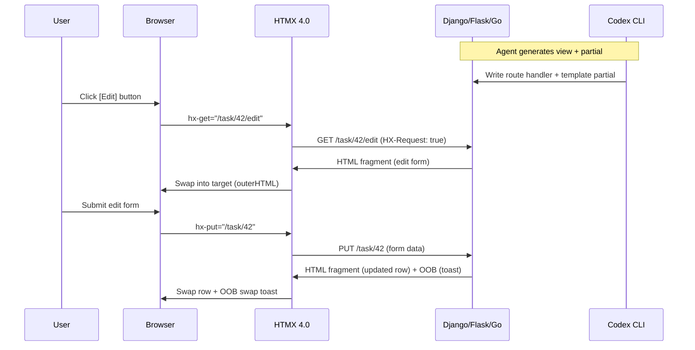

# Codex CLI for HTMX and Hypermedia-Driven Development: Server-Rendered Fragments, MCP Tooling, and Agent Workflows


---

HTMX has crossed 47,000 GitHub stars and won the "most admired" spot in the 2025 State of JS survey [^1][^2]. With version 4.0 now in beta — replacing XMLHttpRequest with the Fetch API, adding native morphing, and introducing streaming HTML fragment delivery [^3] — the library represents a genuine architectural counter-movement to the SPA orthodoxy. Teams adopting HTMX report 40–60% reductions in frontend code and a 60x decrease in shipped JavaScript compared to React-based equivalents [^4].

This article explores how Codex CLI accelerates HTMX development: generating server-rendered partials, wiring hypermedia attributes, integrating the emerging HTMX MCP tooling ecosystem, and applying agent-driven workflows to the patterns that make hypermedia applications distinct.

## Why HTMX Is a Natural Fit for Agent-Assisted Development

The hypermedia approach inverts the typical frontend/backend split. Instead of a JSON API consumed by a JavaScript client, the server returns HTML fragments that HTMX swaps into the DOM [^5]. This means:

- **Most logic lives server-side** — exactly where Codex CLI operates best.
- **No build step** — no Webpack, no Vite, no bundler configuration for the agent to manage.
- **Small, self-contained units** — each endpoint returns a partial template, making tasks naturally decomposable for subagents.
- **Declarative wiring** — `hx-get`, `hx-post`, `hx-swap`, and `hx-target` attributes replace imperative JavaScript, giving the agent a predictable surface to work with.

Where a React application might require the agent to reason across component state, hooks, context providers, and API client layers simultaneously, an HTMX application keeps the complexity in server-side route handlers and template partials — a pattern Codex's code-generation loop handles well.

## Setting Up the Stack

HTMX pairs with any server-side framework. The most common stacks in 2026 are Django + HTMX, Flask + HTMX, Go (templ or html/template) + HTMX, and Spring Boot + Thymeleaf + HTMX [^6][^7]. A representative `AGENTS.md` for a Django + HTMX project:

```markdown
# AGENTS.md

## Stack
- Python 3.13, Django 6.0, HTMX 4.0-beta3, Alpine.js 3.x (islands only)
- Tailwind CSS 4.x via standalone CLI (no Node)
- pytest + django-test-plus for testing

## Conventions
- Return HTML fragments from views, not JSON
- Use django-template-partials for partial rendering
- Every hx-* interaction must have a corresponding test using django-htmx's HtmxMiddleware
- Use hx-swap-oob for out-of-band updates (toasts, counters, nav badges)
- Prefer hx-boost on navigation links over SPA routing
```

This gives Codex CLI the constraints it needs to generate idiomatic hypermedia code rather than falling back to JSON API patterns.

## Agent-Driven Fragment Generation

The core HTMX development loop — write a route, return a partial, wire the attribute — maps cleanly to a Codex prompt:

```bash
codex "Add an inline edit workflow for the task title in tasks/templates/tasks/task_row.html.
       Clicking the title should swap in an edit form (hx-get to an edit endpoint).
       Submitting should PUT the update and swap back the display partial.
       Use hx-swap='outerHTML' and include CSRF token handling."
```

Codex generates:

1. A Django view returning the edit form partial.
2. A Django view handling the PUT and returning the updated display partial.
3. The `hx-get` and `hx-put` attributes wired to the correct endpoints.
4. URL route registrations.

Because each piece is a small server-side function returning HTML, the agent can verify correctness by running the Django test client against each endpoint — no browser required for the initial pass.

### Batch Fragment Generation with `codex exec`

For larger applications, `codex exec` can generate fragment endpoints in bulk:

```bash
codex exec "For each model in tasks/models.py, generate:
  1. A list partial template with hx-get pagination
  2. A detail partial with hx-swap-oob sidebar update
  3. An inline create form partial with hx-post
  4. Django views and URL patterns for all three
  Write tests that assert each view returns HTML (not JSON) and contains the expected hx-* attributes."
```

## Subagent Patterns for Hypermedia Applications

HTMX applications decompose naturally into parallel workstreams because each endpoint is independent. A subagent configuration in `config.toml`:


```toml
[agents.htmx-views]
model = "gpt-5.4-mini"
instructions = """
Generate Django views that return HTML partials.
Never return JsonResponse. Always use render() or render_to_string().
Include django-htmx request detection: if not request.htmx, return full page.
"""

[agents.htmx-templates]
model = "gpt-5.4-mini"
instructions = """
Generate Django template partials using django-template-partials syntax.
Use  blocks. Wire hx-* attributes per AGENTS.md conventions.
"""

[agents.htmx-tests]
model = "gpt-5.4-mini"
instructions = """
Generate pytest tests for HTMX endpoints.
Assert response Content-Type is text/html.
Assert hx-* attributes are present in response content.
Use request.META['HTTP_HX_REQUEST'] = 'true' for HTMX-specific paths.
"""
```


Delegate with:

```bash
codex "Implement the contact management CRUD using three subagents:
       one for views, one for templates, one for tests.
       All three share the Contact model defined in contacts/models.py."
```

The `gpt-5.4-mini` model is well-suited for these subagent tasks — each produces small, focused code with clear constraints [^8].

## The HTMX MCP Ecosystem

### HTMX Debugger MCP Server

The `htmx-mcp` server by madeonawave provides debugging tools for HTMX interactions — inspecting swap operations, tracing request chains, and validating attribute configurations [^9]. Configure it in `config.toml`:

```toml
[mcp_servers.htmx-debug]
command = "npx"
args = ["-y", "htmx-mcp"]
```

### HTMX Documentation via llms.txt

The HTMX project has an active discussion on providing `llms.txt` support — a machine-readable documentation format that AI agents can consume within their token budgets [^10]. Community-generated `llms.txt` files for HTMX 2.x already exist [^11], and the pattern extends to HTMX 4.0. Point Codex at the documentation:

```bash
codex --instructions "Reference https://htmx.org/llms.txt for HTMX API details" \
  "Refactor the search form to use hx-trigger='input changed delay:300ms' with hx-indicator"
```

### Browser Testing with Rod MCP

For end-to-end verification of HTMX interactions, the Rod MCP server provides browser automation tools — clicking elements, capturing screenshots, and extracting DOM state [^12]. This closes the verification loop:

```toml
[mcp_servers.rod-browser]
command = "npx"
args = ["-y", "@nicepkg/rod-mcp"]
```

```bash
codex "Test the infinite scroll on /tasks/:
       1. Load the page
       2. Scroll to the bottom
       3. Verify hx-get triggered and new task rows appeared
       4. Take a screenshot for visual confirmation"
```

## HTMX 4.0 Migration Patterns

HTMX 4.0 introduces breaking changes that Codex CLI can automate [^3]:

| Change | HTMX 2.x | HTMX 4.0 |
|---|---|---|
| Transport | XMLHttpRequest | Fetch API |
| Attribute inheritance | Implicit | Explicit (`hx-inherit`) |
| Event names | `htmx:beforeRequest` | `htmx:before:request` |
| History | DOM snapshot | Network re-request |
| Morphing | Extension (`idiomorph`) | Built-in (`morph`, `morphInner`) |

Automate the migration:

```bash
codex exec "Migrate all HTMX 2.x patterns to 4.0:
  1. Add explicit hx-inherit where attribute inheritance was relied upon
  2. Rename event listeners from htmx:beforeRequest to htmx:before:request format
  3. Replace idiomorph extension usage with native hx-swap='morph'
  4. Replace hx-history-elt with the new history configuration
  Run the test suite after each change category."
```

## Mermaid: HTMX Request-Response Flow with Codex CLI



## The Alpine.js Island Pattern

Pure HTMX handles server-driven interactions, but some UI elements — dropdown menus, toggle states, client-side validation — benefit from lightweight JavaScript. The standard 2026 pattern pairs HTMX with Alpine.js for "islands of interactivity" [^13]:

```bash
codex "Add a tag selector to the task form using Alpine.js for the dropdown
       state management and HTMX for server-side search.
       - Alpine manages the open/close state and selected tags array
       - hx-get='/api/tags/search' with hx-trigger='input changed delay:200ms'
         fetches matching tag partials from the server
       - Clicking a tag partial adds it to Alpine's selected array
       Keep the Alpine scope minimal — no x-data larger than 5 properties."
```

This prompt encodes the architectural boundary: Alpine handles ephemeral UI state; HTMX handles server communication. Codex respects this when given clear `AGENTS.md` constraints.

## Testing Hypermedia Endpoints

HTMX applications are unusually testable because every interaction is a standard HTTP request returning HTML:


```python
# tests/test_task_views.py
import pytest
from django.test import Client

@pytest.mark.django_db
class TestTaskInlineEdit:
    def test_edit_form_returns_partial(self, client: Client, task):
        resp = client.get(
            f"/tasks/{task.pk}/edit/",
            HTTP_HX_REQUEST="true",
        )
        assert resp.status_code == 200
        assert "text/html" in resp["Content-Type"]
        assert 'hx-put=' in resp.content.decode()
        assert "{% partialdef" not in resp.content.decode()  # rendered, not raw

    def test_non_htmx_request_returns_full_page(self, client: Client, task):
        resp = client.get(f"/tasks/{task.pk}/edit/")
        assert resp.status_code == 200
        assert "<html" in resp.content.decode()
```


Generate a full test suite with:

```bash
codex "Write pytest tests for every HTMX endpoint in tasks/urls.py.
       Each test should verify:
       1. HTMX requests return a fragment (no <html> tag)
       2. Non-HTMX requests return a full page
       3. The response contains expected hx-* attributes
       4. OOB swaps include the correct hx-swap-oob targets"
```

## Production Considerations

### Streaming Fragments with HTMX 4.0

HTMX 4.0's Fetch API migration enables streaming responses — the browser can process and render HTML fragments as they arrive [^3]. For long-running agent operations, this pairs well with server-sent events:

```bash
codex "Implement a streaming search results page using HTMX 4.0's
       fetch-based streaming. The server should yield result partials
       as they're found, and HTMX should append each one to the results
       container as it arrives. Use Django's StreamingHttpResponse."
```

### Cache-Friendly Partials

Hypermedia partials can be cached aggressively at the CDN layer because each URL returns a self-contained HTML fragment. Codex can generate cache headers:

```bash
codex "Add Cache-Control headers to all read-only HTMX partials in tasks/views.py.
       Use max-age=60 for list partials and max-age=300 for detail partials.
       Ensure write operations (POST/PUT/DELETE) include no-cache headers."
```

## Citations

[^1]: [HTMX in 2026: When You Don't Need React (And When You Absolutely Do)](https://dev.to/pockit_tools/htmx-in-2026-when-you-dont-need-react-and-when-you-absolutely-do-2mf4) — DEV Community, 2026. HTMX has crossed 47,000 GitHub stars and the 2025 State of JS survey shows HTMX maintaining "most admired" status.

[^2]: [The HTMX Renaissance — Rethinking Web Architecture for 2026](https://www.softwareseni.com/the-htmx-renaissance-rethinking-web-architecture-for-2026/) — SoftwareSeni, 2026. HTMX adoption trends, growth statistics, and enterprise adoption patterns.

[^3]: [HTMX 4.0: The Fetchening](https://htmx.org/essays/the-fetchening/) — htmx.org. Official essay on the HTMX 4.0 migration from XHR to Fetch API, including streaming, native morphing, explicit attribute inheritance, and event name changes. HTMX 4.0.0-beta3 released 8 May 2026.

[^4]: [HTMX in 2026: Why Hypermedia is Beating React for Faster Django Apps](https://medium.com/@yogeshkrishnanseeniraj/htmx-in-2026-why-hypermedia-is-beating-react-for-faster-django-apps-48fd4adb43b2) — Medium, 2026. Reports 40–60% frontend code reduction and 60x decrease in shipped JavaScript versus React.

[^5]: [htmx.org — High Power Tools for HTML](https://htmx.org/) — Official HTMX documentation. Core library reference for hx-get, hx-post, hx-swap, hx-target, and related attributes.

[^6]: [HTMX in a Java World: Building Hypermedia APIs with Spring Boot and Thymeleaf](https://www.javacodegeeks.com/2026/05/htmx-in-a-java-world-building-hypermedia-apiswith-spring-boot-and-thymeleaf.html) — Java Code Geeks, May 2026. HTMX + Spring Boot + Thymeleaf stack patterns.

[^7]: [Htmx + Go: The Anti-SPA Movement of 2026](https://sachinsharma.dev/blogs/htmx-go-anti-spa-2026) — Sachin Sharma, 2026. Go + HTMX stack patterns and production deployment.

[^8]: [Codex CLI Models](https://developers.openai.com/codex/models) — OpenAI Developers. GPT-5.4-mini documented as "fast, efficient mini model for responsive coding tasks and subagents."

[^9]: [HTMX Debugger MCP Server](https://www.pulsemcp.com/servers/htmx-mcp) — PulseMCP. MCP server by madeonawave for debugging HTMX interactions. ⚠️ Tool maturity and feature set unverified at time of writing.

[^10]: [Add llms.txt support to HTMX — Discussion #3568](https://github.com/bigskysoftware/htmx/discussions/3568) — GitHub. Community discussion on providing machine-readable HTMX documentation for AI agents.

[^11]: [llms.txt file for HTMX 2](https://snippets.khromov.se/llms-txt-file-for-htmx-2/) — Useful Snippets. Community-generated llms.txt for HTMX 2.x documentation.

[^12]: [Rod MCP Server](https://lobehub.com/mcp/birddigital-rod-mcp-server) — LobeHub. Browser automation MCP server using Rod, suitable for testing HTMX interactions.

[^13]: [Hybrid HTMX + Minimal JS in Django 2026: When to Add Alpine.js or Keep Pure Hypermedia](https://medium.com/@yogeshkrishnanseeniraj/hybrid-htmx-minimal-js-in-django-2026-when-to-add-alpine-js-3b62210b5321) — Medium, 2026. Decision framework for combining HTMX with Alpine.js islands of interactivity.
