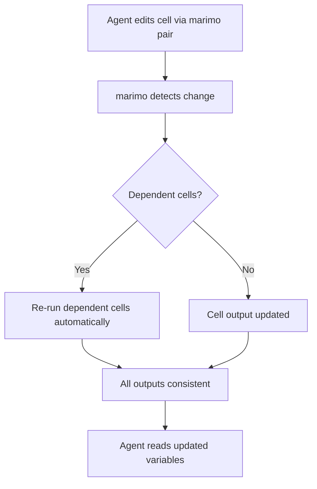
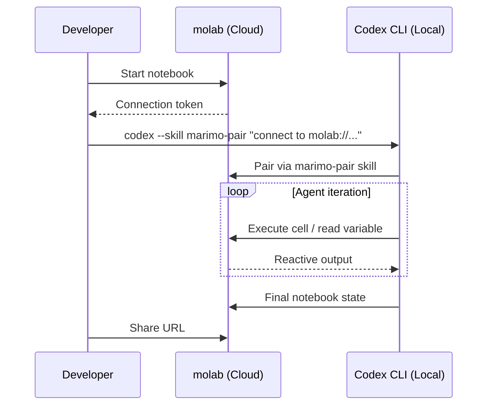

# Codex CLI for Marimo Reactive Notebooks: Agent Pair Programming, marimo pair, and Data Science Workflows


---

Jupyter notebooks have a well-known problem: hidden state. Run cells out of order, delete a definition, and downstream cells still hold stale values until the kernel restarts. For solo exploration that is an annoyance; for agent-assisted development it is a landmine. An AI agent modifying a cell cannot know whether the notebook's in-memory state matches what the code on disc says it should be.

Marimo[^1] solves this with reactive execution. Every cell sits in a directed acyclic graph of dependencies. Change one cell and marimo automatically re-runs — or marks as stale — every cell that depends on it. Notebooks are stored as plain `.py` files, making them diffable, lintable, and agent-friendly from the start. With version 0.23.8 shipping in May 2026[^2], marimo has matured into a production-grade platform with built-in SQL cells, interactive UI widgets, WASM deployment, and — crucially — first-class agent integration via the `marimo pair` skill and the Agent Client Protocol (ACP)[^3].

This article covers how to connect Codex CLI to running marimo notebooks, what the agent can actually do once connected, and the workflows that make the combination compelling for data science, experimentation, and reproducible research.

## Why Marimo Suits Agents Better Than Jupyter

Three architectural choices make marimo a natural fit for agentic workflows:

1. **Reactive DAG execution.** When Codex CLI edits a cell, marimo automatically propagates the change. The agent does not need to guess which cells to re-run — the runtime handles it[^1].

2. **Pure Python storage.** Notebooks are `.py` files with `@app.cell` decorators. Codex CLI's standard file-editing tools (`Read`, `Write`, `Edit`) work without specialised notebook parsers[^1].

3. **Deterministic cell ordering.** Because marimo enforces a DAG, there is no hidden execution order. An agent reading the file sees exactly the state the runtime will produce[^4].



## Connecting Codex CLI to Marimo

There are two integration paths: the `marimo pair` agent skill (recommended) and direct ACP connection through the `codex-acp` adapter.

### Option 1: marimo pair

`marimo pair` is an agent skill maintained by the marimo team that gives Codex CLI full access to a running notebook session — reading live variables, executing cells, installing packages, and manipulating UI elements[^5].

**Install the skill:**

```bash
# Via npm (Node.js required)
npx skills add marimo-team/marimo-pair

# Via uv + Deno
uvx deno -A npm:skills add marimo-team/marimo-pair
```

**Start a marimo server and pair:**

```bash
# Terminal 1: start the notebook
marimo edit my_analysis.py --no-token

# Terminal 2: invoke Codex CLI with the skill
codex --skill marimo-pair "pair with me on my_analysis.py"
```

The `--no-token` flag enables auto-discovery. For authenticated servers, set the `MARIMO_TOKEN` environment variable instead[^5].

### Option 2: ACP via codex-acp

Marimo supports external agents through Zed's Agent Client Protocol[^3]. The `codex-acp` adapter, open-sourced by Zed Industries, bridges Codex CLI's runtime with any ACP-compatible client over stdio using JSON-RPC 2.0[^6].

```bash
# Install the adapter
npm install -g @zed-industries/codex-acp
```

The ACP route is useful when working inside Zed or another ACP-compatible editor, but for pure terminal workflows `marimo pair` is simpler and better documented.

## What the Agent Can Do

Once paired, Codex CLI gains capabilities beyond simple file editing:

| Capability | Description |
|---|---|
| **Read variables** | Inspect any Python object in the notebook's live namespace |
| **Execute cells** | Run individual cells or trigger the reactive DAG |
| **Add/remove cells** | Programmatically restructure the notebook |
| **Install packages** | Call `pip install` or `uv add` within the session |
| **Manipulate UI elements** | Interact with sliders, dropdowns, and data transformers |
| **Test in scratchpad** | Run experimental code without modifying the main notebook |

This means an agent can, for instance, load a dataset, inspect its shape, build a visualisation, and iterate on the analysis — all within a single paired session, with the reactive engine keeping everything consistent[^5].

## Workflow 1: Exploratory Data Analysis

A common pattern is to hand Codex CLI a dataset and let it build an initial exploration notebook:

```bash
codex --skill marimo-pair "Load sales_2026.parquet into a marimo notebook. \
  Show summary statistics, null counts, and a time-series plot of revenue by month. \
  Use Polars for the dataframe and Altair for charts."
```

Because marimo supports built-in SQL cells backed by DuckDB, Polars, Pandas, and other engines[^7], the agent can mix Python and SQL freely:

```python
@app.cell
def load_data():
    import polars as pl
    df = pl.read_parquet("sales_2026.parquet")
    return df,
```

```sql
-- marimo SQL cell, automatically returns a dataframe
SELECT
    DATE_TRUNC('month', order_date) AS month,
    SUM(revenue) AS total_revenue
FROM df
GROUP BY 1
ORDER BY 1
```

The reactive DAG ensures that if the agent modifies the Polars import cell, the SQL cell downstream re-runs automatically.

## Workflow 2: Hypothesis-Driven Experimentation

Marimo's reactivity shines when an agent iterates on a statistical model:

```bash
codex --skill marimo-pair "In experiment.py, the current model is a linear regression. \
  Try a gradient-boosted tree with LightGBM. Compare RMSE on the validation set. \
  If the new model wins, replace the old cell; if not, leave a comment explaining why."
```

The agent can use the scratchpad to test the LightGBM model without touching the main cells, inspect the RMSE, and only commit the change if it improves the metric — all within the reactive environment.

## Workflow 3: Notebook Quality Enforcement

Marimo ships a linter (`marimo check`) that validates notebook structure[^8]. You can enforce this automatically with a Codex CLI hook:

```toml
# codex.toml
[[hooks.post_edit]]
match = "*.py"
run = """
if grep -q 'import marimo' "$FILE" && grep -q '@app.cell' "$FILE"; then
  uvx marimo check "$FILE"
fi
"""
```

This hook runs after every file edit, but only triggers on marimo notebooks. A non-zero exit blocks the agent from proceeding with invalid notebook structure.

## Configuring Automatic Execution

By default, when an agent modifies a cell via ACP, marimo marks dependent cells as stale rather than auto-running them[^3]. To enable automatic re-execution — essential for agentic workflows — add this to your `pyproject.toml`:

```toml
[tool.marimo.server]
watcher_on_save = "autorun"
```

With `autorun` enabled, every edit the agent makes triggers immediate reactive propagation, giving the agent a tight feedback loop.

## Sandbox Considerations

Codex CLI's sandbox restricts filesystem access by default. Marimo notebooks often need to read data files and write outputs. Configure your `AGENTS.md` or `codex.toml` to allow the relevant paths:

```toml
# codex.toml
[sandbox]
allow_read = ["./data", "./notebooks", "~/.local/lib/python*"]
allow_write = ["./notebooks", "./outputs"]
allow_net = ["localhost:*"]
```

The `allow_net` entry for `localhost` is required because `marimo pair` communicates with the running marimo server over a local HTTP connection[^5].

## molab: Cloud-Based Agent Pairing

For teams that want to avoid local setup, marimo provides molab (molab.marimo.io), a free cloud sandbox for agent collaboration[^5]. Start a notebook on molab, open the actions panel, select "Pair with an agent", and receive connection instructions for your local Codex CLI session. All Python code executes within the molab sandbox, and completed work can be shared via URL.



## Limitations and Rough Edges

Marimo's agent support is experimental. A few constraints to be aware of:

- **One session per agent.** You cannot connect multiple Codex CLI instances to the same notebook simultaneously[^3].
- **No Windows native support.** The `marimo pair` shell scripts (`discover-servers.sh`, `execute-code.sh`) require bash, curl, and jq. On Windows, run from Git Bash or WSL[^5].
- **Token authentication.** The `--with-token` auth flow keeps credentials out of shell history, but requires the `MARIMO_TOKEN` environment variable to be set correctly[^5].
- **Custom agents.** Support for custom agent types beyond the built-in providers is listed as "coming soon"[^3].

## When to Use Marimo vs Jupyter with Codex CLI

| Factor | Marimo | Jupyter |
|---|---|---|
| Agent safety | Reactive DAG prevents stale state | Hidden state risks |
| Version control | Plain `.py` files | JSON `.ipynb` files require nbstripout |
| SQL integration | Built-in SQL cells with DuckDB | Requires ipython-sql extension |
| Agent integration | Native via marimo pair + ACP | Via nbformat API or kernel gateway |
| Ecosystem maturity | Growing (v0.23.8) | Established (decades of extensions) |
| Deployment | Script, app, or WASM | Voilà, Panel, or manual export |

For new data science projects where agent collaboration is a priority, marimo is the stronger choice. For existing Jupyter-heavy workflows, the migration path (`marimo convert notebook.ipynb`) provides a gradual transition[^1].

## Conclusion

Marimo's reactive execution model eliminates the class of bugs that make Jupyter notebooks dangerous for agents — stale state, non-deterministic execution order, and opaque binary file formats. Combined with `marimo pair`, Codex CLI gains the ability to operate inside a live computational environment rather than simply editing files and hoping the results are correct.

The integration is still experimental, but the architectural foundations — plain Python storage, reactive DAGs, ACP compatibility — are sound. For teams doing data science, ML experimentation, or reproducible research with Codex CLI, marimo is worth evaluating now.

---

## Citations

[^1]: [marimo — A reactive notebook for Python](https://github.com/marimo-team/marimo) — GitHub repository and documentation, accessed May 2026.

[^2]: [marimo v0.23.8 on PyPI](https://pypi.org/project/marimo/) — Latest release, May 22, 2026.

[^3]: [Agents — marimo documentation](https://docs.marimo.io/guides/editor_features/agents/) — Agent Client Protocol integration guide.

[^4]: [Marimo Notebooks: Reactive Python for the AI Builder](https://medium.com/data-science-collective/marimo-notebooks-reactive-python-for-the-ai-builder-fbbd76d499fa) — Edgar Bermudez, Data Science Collective, March 2026.

[^5]: [marimo-pair — GitHub](https://github.com/marimo-team/marimo-pair) — Agent skill for dropping agents inside running marimo notebook sessions.

[^6]: [codex-acp — Zed Industries](https://github.com/zed-industries/codex-acp) — ACP-compatible adapter bridging Codex CLI with ACP clients over stdio.

[^7]: [marimo SQL cells documentation](https://docs.marimo.io/) — Built-in SQL engine supporting Polars, Pandas, DuckDB, and other backends.

[^8]: [Other tips for agent CLIs — marimo documentation](https://docs.marimo.io/guides/generate_with_ai/using_claude_code/) — Hook configuration for marimo check validation.
