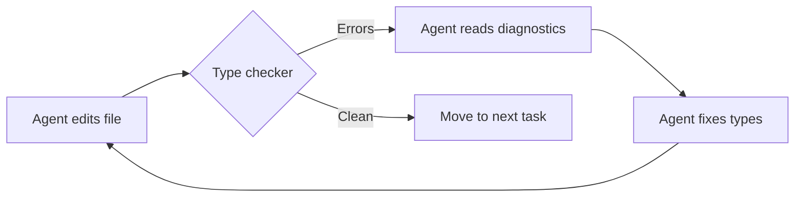
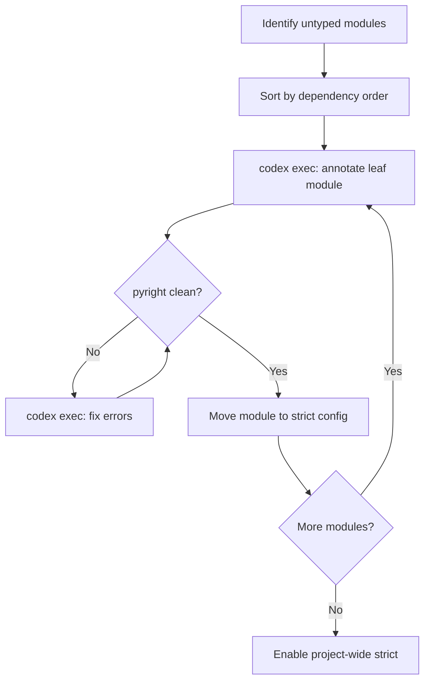

# Codex CLI for Python Type Safety: Agent-Driven Type Checking with Mypy, Pyright, ty, and Pyrefly


---

## The 2026 Type Checking Landscape

Python type checking entered 2026 with two established tools and emerged mid-year with four serious contenders. The landscape shifted materially when Astral joined OpenAI in March 2026 [^1], bringing ty — an extremely fast Rust-based type checker — under the same roof as Codex CLI. Meta followed in May with Pyrefly 1.0, battle-tested on Instagram's 20-million-line codebase [^2]. Meanwhile, mypy shipped its 2.0 release with parallel checking [^3], and Pyright continued its steady cadence at v1.1.409 [^4].

| Tool | Version (May 2026) | Language | Speed vs mypy | Spec Conformance | Plugin System |
|------|-------------------|----------|---------------|-----------------|---------------|
| **mypy** | 2.1.0 | Python (mypyc) | 1x (baseline) | ~85% | Yes (mature) |
| **Pyright** | 1.1.409 | TypeScript | 2–5x faster | ~98% | No |
| **ty** | 0.0.39 (beta) | Rust | 10–60x faster | ~15% | No (by design) |
| **Pyrefly** | 1.0.0 | Rust | 10–50x faster | ~90% | No |

The choice matters for agent workflows because **speed determines how tightly you can integrate type checking into the edit-check-fix loop**. A checker that completes in milliseconds can run after every file write; one that takes 30 seconds forces batch validation at turn boundaries.



## Encoding Type Rules in AGENTS.md

The single highest-leverage action for type-safe agent output is encoding your type checking standards in `AGENTS.md`. Without explicit instructions, Codex CLI will generate code that runs but may omit annotations, use `Any` liberally, or ignore your project's strictness level [^5].

```markdown
# Python Type Checking Standards

## Type Checker
- Primary: `pyright` in strict mode (`typeCheckingMode = "strict"` in pyproject.toml)
- Secondary: `mypy --strict` for plugin-dependent modules (Django ORM, SQLAlchemy)

## Rules
- Every function MUST have full parameter and return type annotations
- Never use `Any` without a `# type: ignore[<code>]` comment explaining why
- Use `typing.Protocol` for structural subtyping, not ABCs
- Use `TypedDict` for dictionary shapes, not `dict[str, Any]`
- Use `collections.abc` imports (Sequence, Mapping), not `typing` equivalents
- Run `pyright .` after every file modification — fix all errors before proceeding
- If pyright reports zero errors, also run `ruff check .` before considering the task done

## Anti-Patterns
- Do NOT add `# type: ignore` to silence errors without understanding them
- Do NOT use `cast()` as a shortcut for proper narrowing
- Do NOT leave function signatures untyped "for now"
```

This encodes both the tool choice and the behavioural constraints. The critical line is **"Run pyright . after every file modification"** — this turns the type checker into a verification gate within the agent loop rather than a post-hoc linting step.

## Wiring Type Checkers into the Agent Loop

### Sandbox Configuration

Type checkers need read access to your source tree and potentially to stub packages. If you are running Codex CLI in `workspace-write` mode (the default for interactive sessions), no additional sandbox configuration is needed. For stricter profiles, ensure the type checker binary and its dependencies are accessible:

```toml
# ~/.codex/config.toml
[profile.python-typed]
extends = ":workspace"
allow_read = [
  "/usr/local/lib/python3.12",
  "~/.local/share/uv",
  "~/.cache/pyright",
]
```

### Per-Edit Verification

The tightest integration pattern runs the type checker after every file write. In your `AGENTS.md`, instruct the agent explicitly:

```markdown
## Verification Loop
After modifying any `.py` file:
1. Run `pyright <modified_file>` (single-file check, fast)
2. If errors, fix them immediately before touching other files
3. After all files are modified, run `pyright .` (full project check)
4. Run `python -m pytest tests/ -x --tb=short` to confirm runtime behaviour
```

This creates a feedback loop where the agent catches type errors within the same turn, rather than accumulating them across a multi-file change. With Pyright's incremental analysis, single-file checks typically complete in under 200ms [^4], well within the agent's tool-call budget.

### Using ty for Ultra-Fast Feedback

If your project has adopted the Astral toolchain, ty provides even tighter feedback. After editing a load-bearing file in a large project, ty recomputes diagnostics in approximately 4.7ms — 80× faster than Pyright's 386ms [^6]:

```bash
# In AGENTS.md or as a post-edit hook
ty check src/modified_module.py
```

The trade-off is conformance: ty currently passes fewer typing specification tests than Pyright [^6]. For projects that use advanced generics, overloaded decorators, or `ParamSpec` heavily, Pyright remains the safer choice. For typical web application code with standard annotations, ty is more than adequate and dramatically faster.

## Gradual Typing Migration with Codex CLI

The most impactful use of Codex CLI for type safety is not enforcing annotations on new code — that is table stakes — but **migrating existing untyped codebases to full type coverage**. The proven strategy follows Eightfold's three-tier model: Untracked, Lenient, and Strict [^7].

### Step 1: Baseline Assessment

Use `codex exec` to generate a structured report of your current type coverage:

```bash
codex exec "Analyse the Python project in the current directory. \
  Run 'pyright . --outputjson' and summarise: \
  (1) total files, (2) files with errors, (3) error categories, \
  (4) most-errored modules. Output as JSON." \
  --output-schema '{"type":"object","properties":{
    "total_files":{"type":"integer"},
    "files_with_errors":{"type":"integer"},
    "error_categories":{"type":"object"},
    "worst_modules":{"type":"array","items":{"type":"string"}}
  }}'
```

### Step 2: Module-by-Module Migration

Configure mypy (or Pyright) with per-module overrides that create a ratchet — modules start lenient and graduate to strict:

```toml
# pyproject.toml
[tool.pyright]
typeCheckingMode = "standard"

[tool.mypy]
python_version = "3.12"
warn_return_any = true
check_untyped_defs = true

[[tool.mypy.overrides]]
module = "app.core.*"
disallow_untyped_defs = true
strict = true

[[tool.mypy.overrides]]
module = "app.legacy.*"
ignore_errors = true
```

Then use Codex CLI to annotate one module at a time:

```bash
codex "Add complete type annotations to every function and method \
  in src/app/services/user_service.py. Use typing.Protocol where \
  you need structural subtyping. Run pyright on the file after \
  each change. Do not modify runtime behaviour."
```

### Step 3: Batch Annotation with codex exec

For large migrations, script the process across your worst-offending modules:

```bash
#!/bin/bash
MODULES=$(cat type-migration-queue.txt)
for mod in $MODULES; do
  codex exec "Add full type annotations to $mod. \
    Run 'pyright $mod' and fix all errors. \
    Do not change runtime behaviour. \
    Confirm zero pyright errors before finishing." \
    --approval-mode full-auto \
    -m o4-mini
  echo "Completed: $mod"
done
```

Using `o4-mini` for batch annotation keeps costs manageable while maintaining sufficient reasoning capability for type inference [^8].



## Choosing a Type Checker for Agent Workflows

The decision matrix differs from human workflows because agents care about **parse speed** (how fast the checker returns), **error message clarity** (how actionable the diagnostics are for an LLM), and **correctness** (whether false positives send the agent in circles).

### Mypy: Best for Plugin-Heavy Projects

Choose mypy 2.x when your project depends on mypy plugins — Django (django-stubs), SQLAlchemy (sqlalchemy-stubs), Pydantic v1, or Attrs [^3]. No other checker supports plugins. The new `--num-workers` parallel mode in mypy 2.0 delivers up to 5x speedup on multi-core machines, partially closing the performance gap [^3].

**AGENTS.md snippet for mypy:**
```markdown
Type check with: `mypy --strict --num-workers 4 .`
Follow mypy error codes exactly — do not add blanket `# type: ignore`.
```

### Pyright: Best Default for Most Teams

Pyright's 98% spec conformance makes it the safest choice when you need correctness without plugins [^4]. Its error messages include detailed explanations that LLMs parse reliably. Use `typeCheckingMode = "strict"` in `pyproject.toml` for maximum coverage.

### ty: Best for Astral-Native Projects

If your project already uses uv and Ruff, adding ty completes the single-binary toolchain [^6]. The speed advantage is transformative for agent workflows — sub-5ms feedback means the type checker becomes essentially free within the agent loop. Accept the beta-era conformance gaps if your code uses standard typing patterns.

### Pyrefly: Best for Very Large Codebases

Pyrefly 1.0 checks over 1.85 million lines per second and has been validated on Instagram's codebase [^2]. If your monorepo exceeds 500,000 lines, Pyrefly's throughput matters more than the marginal conformance difference.

## CI Enforcement

Type safety is only durable if CI rejects regressions. Add a pre-merge gate:

```yaml
# .github/workflows/type-check.yml
name: Type Safety
on: [pull_request]
jobs:
  typecheck:
    runs-on: ubuntu-latest
    steps:
      - uses: actions/checkout@v4
      - uses: astral-sh/setup-uv@v6
      - run: uv sync --frozen
      - run: uv run pyright .
      - run: uv run mypy --strict src/
```

For teams using the Codex GitHub Action, add type checking as a post-generation validation step:

```yaml
      - uses: openai/codex-action@v1
        with:
          prompt: "Fix the failing tests in this PR"
          post-validation: "uv run pyright . && uv run pytest"
```

This ensures that any code Codex generates in CI passes type checking before the PR is updated [^9].

## Model Selection for Type Annotation Tasks

Type annotation is a reasoning-heavy task that benefits from models with strong code understanding:

| Task | Recommended Model | Rationale |
|------|------------------|-----------|
| Complex generic annotations | gpt-5.5 | Needs deep inference for `ParamSpec`, `TypeVarTuple` |
| Standard function annotations | o4-mini | Cost-effective, handles common patterns well |
| Batch module annotation | o4-mini | Volume work, standard patterns |
| Type error diagnosis | gpt-5.5 or o3 | Complex errors need reasoning chains |
| Plugin-specific types (Django) | gpt-5.5 | Framework-specific knowledge |

## Known Limitations

- **Training data lag:** Codex models may not know the latest ty diagnostic codes or Pyrefly-specific configurations. Encode current syntax in your AGENTS.md.
- **ty beta gaps:** ty currently lacks support for some PEP 695 type parameter syntax and advanced `ParamSpec` patterns [^6]. If the agent encounters ty errors it cannot resolve, fall back to Pyright for that module.
- **mypy plugin conflicts:** Running both mypy (with plugins) and Pyright on the same codebase can produce contradictory diagnostics. Designate one as primary in AGENTS.md and use the other only for plugin-dependent modules.
- **`# type: ignore` drift:** Without explicit AGENTS.md rules, agents will add `# type: ignore` comments to silence errors rather than fixing them. The anti-pattern rule in your AGENTS.md is essential.
- **Sandbox network access:** Installing type stubs (`types-requests`, `django-stubs`) requires network access. Ensure stubs are pre-installed or your sandbox profile permits `pypi.org` access.

## Citations

[^1]: Astral, "Astral is joining OpenAI," astral.sh, 19 March 2026. [https://astral.sh/blog/astral-is-joining-openai](https://astral.sh/blog/astral-is-joining-openai)

[^2]: Meta Engineering, "Introducing Pyrefly: A new type checker and IDE experience for Python," engineering.fb.com, 2025; Pyrefly v1.0.0 released 12 May 2026. [https://engineering.fb.com/2025/05/15/developer-tools/introducing-pyrefly-a-new-type-checker-and-ide-experience-for-python/](https://engineering.fb.com/2025/05/15/developer-tools/introducing-pyrefly-a-new-type-checker-and-ide-experience-for-python/)

[^3]: mypy Contributors, "mypy 2.0 Release Notes — parallel type checking," mypy.readthedocs.io, May 2026. [https://mypy.readthedocs.io/en/stable/changelog.html](https://mypy.readthedocs.io/en/stable/changelog.html)

[^4]: Microsoft, "Pyright — Static Type Checker for Python," github.com/microsoft/pyright. [https://github.com/microsoft/pyright](https://github.com/microsoft/pyright)

[^5]: OpenAI, "Custom instructions with AGENTS.md — Codex," developers.openai.com. [https://developers.openai.com/codex/guides/agents-md](https://developers.openai.com/codex/guides/agents-md)

[^6]: Astral, "ty: An extremely fast Python type checker and language server," astral.sh/blog/ty. [https://astral.sh/blog/ty](https://astral.sh/blog/ty)

[^7]: Eightfold Engineering, "From zero to type-safe: How we brought static type checking to large-scale Python codebase," eightfold.ai. [https://eightfold.ai/engineering-blog/static-type-checking-large-scale-python-codebase/](https://eightfold.ai/engineering-blog/static-type-checking-large-scale-python-codebase/)

[^8]: OpenAI, "Codex CLI — Models," developers.openai.com. [https://developers.openai.com/codex/cli](https://developers.openai.com/codex/cli)

[^9]: OpenAI, "GitHub Action — Codex," developers.openai.com. [https://developers.openai.com/codex/github-action](https://developers.openai.com/codex/github-action)
