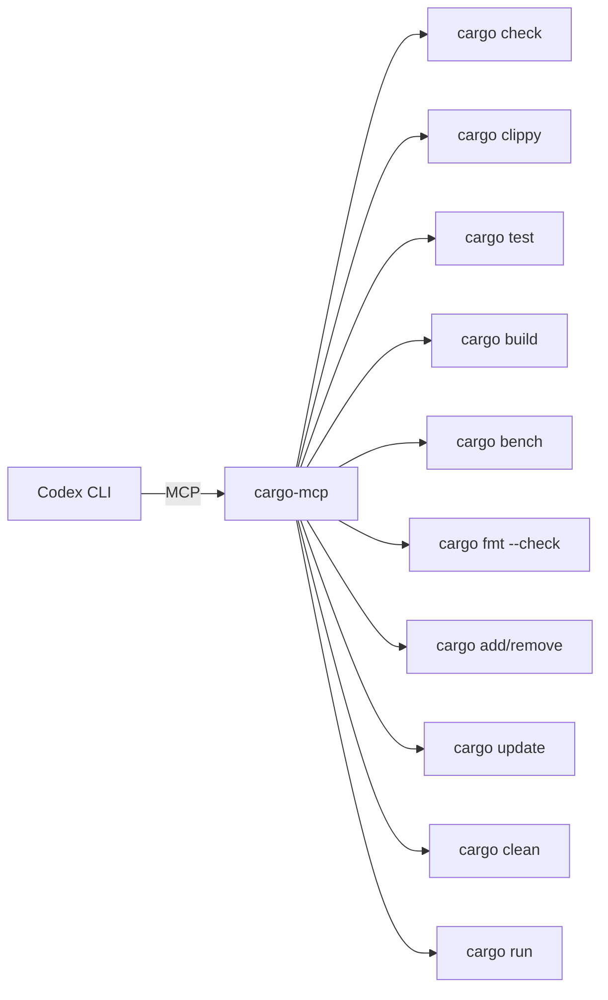
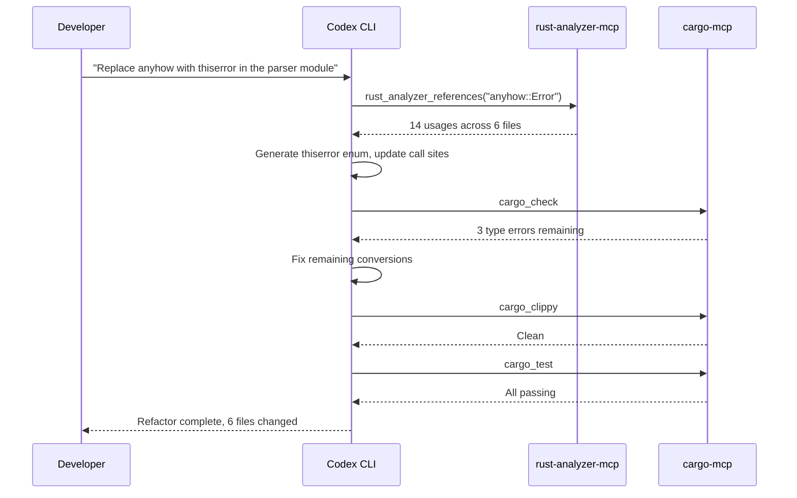

# Codex CLI for Rust Development: codex-rs, cargo MCP, and Systems Programming Agent Workflows


---

There is a certain irony in using Codex CLI to write Rust: the tool itself is written in Rust. The `codex-rs` rewrite — which now accounts for roughly 95% of the codebase[^1] — means that every time you run `codex` in your terminal, you are executing a Cargo workspace of approximately 65 member crates[^2]. That shared lineage makes Codex CLI a surprisingly effective companion for Rust development, particularly when paired with Rust-specific MCP servers that expose `cargo`, `clippy`, and `rust-analyzer` capabilities directly to the agent.

This article covers three areas: the architecture of `codex-rs` itself (useful context when the tool is both your IDE agent and a Rust project you might contribute to), the MCP servers that bring Rust toolchain awareness into the agent loop, and practical workflow patterns for systems programming with Codex CLI.

## The codex-rs Architecture

When OpenAI open-sourced Codex CLI in April 2025, the codebase was TypeScript on Node.js[^1]. By early 2026, the project had been rewritten in Rust and restructured as a layered Cargo workspace following a principle of separation: user-facing entry points sit atop a shared core engine, which talks down to platform and protocol layers[^2].

### Key Crates

| Crate | Purpose |
|-------|---------|
| `codex-core` | Reusable library: `ThreadManager`, `CodexThread`, `Session` for turn-by-turn model interactions, context compaction, and tool dispatch[^2] |
| `codex-tui` | Interactive fullscreen terminal UI built on Ratatui[^2] |
| `codex-exec` | Headless non-interactive runner for automation and CI pipelines[^2] |
| `codex-cli` | Multitool CLI that consolidates the above through subcommands[^2] |
| `codex-utils-*` | 20+ utility crates under `utils/`[^2] |

The workspace manages 142 dependencies via centralised `workspace.dependencies` in the root `Cargo.toml`, ensuring consistent versions across all crates[^2].

### Sandbox Modes

Codex CLI's `--sandbox` (`-s`) flag controls the execution environment[^3]:

```bash
# Read-only: inspect code, no writes (default)
codex -s read-only "explain the borrow checker issue in src/lib.rs"

# Workspace-write: modify files in project dir, no network
codex -s workspace-write "refactor this module to use thiserror"

# Full access: no restrictions (use in containers only)
codex -s danger-full-access "run the full integration test suite"
```

The `workspace-write` mode automatically includes `~/.codex/memories` in the writable roots, so the agent can persist learnings across sessions without requiring elevated permissions[^3].

## MCP Servers for Rust Development

Codex CLI acts as an MCP client, connecting to configured servers on startup[^4]. For Rust development, two MCP servers stand out: `cargo-mcp` for build toolchain operations and `rust-analyzer-mcp` for semantic code intelligence.

### cargo-mcp

The `cargo-mcp` server by Jacob Rothstein wraps Cargo commands behind an MCP interface, exposing 11 tools[^5]:



Install via Cargo:

```bash
cargo install cargo-mcp
```

Configure in `~/.codex/config.toml`:

```toml
[mcp_servers.cargo]
command = "cargo-mcp"
args = ["serve"]
env = { "CARGO_MCP_DEFAULT_TOOLCHAIN" = "stable" }
```

Every tool accepts a `toolchain` parameter (overriding the default) and a `cargo_env` map for environment variables, which is useful for cross-compilation or feature flag permutations[^5]:

```bash
# The agent can run clippy on nightly with specific features
codex "run clippy on nightly with the async-std feature enabled"
```

Safety is enforced through whitelisted commands only — no arbitrary shell execution — and path validation that requires a `Cargo.toml` to be present[^5].

### rust-analyzer-mcp

The `rust-analyzer-mcp` server by Zeeshan Ali provides 10 tools that bridge rust-analyzer's Language Server Protocol capabilities into MCP[^6]:

| Tool | Capability |
|------|------------|
| `rust_analyzer_symbols` | List all symbols in a file |
| `rust_analyzer_definition` | Jump to definition |
| `rust_analyzer_references` | Find all usages |
| `rust_analyzer_hover` | Type info and documentation |
| `rust_analyzer_completion` | Code completions |
| `rust_analyzer_format` | Format via rustfmt |
| `rust_analyzer_code_actions` | Refactoring suggestions |
| `rust_analyzer_diagnostics` | File-level errors and warnings |
| `rust_analyzer_workspace_diagnostics` | Workspace-wide issue detection |
| `rust_analyzer_set_workspace` | Switch workspace directory |

Install and configure:

```bash
cargo install rust-analyzer-mcp
```

```toml
[mcp_servers.rust-analyzer]
command = "rust-analyzer-mcp"
```

With both servers configured, Codex CLI gains a tight feedback loop: it can query type information via `rust_analyzer_hover`, attempt a refactor, run `cargo_check` to verify compilation, then run `cargo_clippy` for lint compliance — all within a single agent turn[^6][^5].

### Combining Both Servers

```toml
# ~/.codex/config.toml — Rust development profile
[profiles.rust-dev]
model = "o4-mini"
sandbox_mode = "workspace-write"
approval_policy = "unless-allow-listed"

[mcp_servers.cargo]
command = "cargo-mcp"
args = ["serve"]
env = { "CARGO_MCP_DEFAULT_TOOLCHAIN" = "stable" }

[mcp_servers.rust-analyzer]
command = "rust-analyzer-mcp"
```

Activate the profile:

```bash
codex --profile rust-dev "add serde with derive feature and update all structs to derive Serialize"
```

## Agent Workflow Patterns

### Pattern 1: Type-Driven Refactoring

Rust's type system provides unusually rich signals for an agent. A typical refactor workflow:



The agent uses `rust_analyzer_references` to find every usage before making changes, rather than relying on text search. This catches re-exports and trait implementations that grep would miss.

### Pattern 2: Unsafe Code Auditing

```bash
codex --profile rust-dev "audit all unsafe blocks in src/. \
  For each one, explain why it's needed, whether it can be replaced \
  with a safe alternative, and whether the safety invariants are documented"
```

The agent uses `rust_analyzer_hover` to inspect the types involved in each `unsafe` block and `rust_analyzer_diagnostics` to check whether `#[deny(unsafe_op_in_unsafe_fn)]` is enabled. Combined with `cargo_clippy` (which includes `clippy::undocumented_unsafe_blocks`), this produces a structured audit report.

### Pattern 3: Dependency Management

```bash
codex "check for outdated dependencies, update serde and tokio to latest, \
  run tests, and revert if anything breaks"
```

With `cargo_add`, `cargo_update`, and `cargo_test` exposed as MCP tools, the agent can perform speculative upgrades within the sandbox. The `workspace-write` sandbox mode allows `Cargo.toml` and `Cargo.lock` modifications but blocks network access after initial resolution, preventing supply chain attacks during automated updates[^3].

### Pattern 4: Cross-Compilation Verification

```bash
codex "check that the crate compiles for wasm32-unknown-unknown \
  and aarch64-unknown-linux-gnu targets"
```

The `cargo_check` tool accepts environment variables including `CARGO_BUILD_TARGET`, letting the agent verify cross-compilation without a full build.

## AGENTS.md for Rust Projects

The Codex CLI repository's own `AGENTS.md` provides a template for Rust-specific agent instructions[^7]:

```markdown
# AGENTS.md

## Build and Test
- Use `just test` (not `cargo test` directly) to follow project defaults
- Run `just fmt` after code changes — do not ask for approval
- Before finalising, run `just fix -p <crate>` for scoped Clippy checks
- Only run workspace-wide `just fix` when modifying shared crates

## Rust Conventions
- After modifying Cargo.toml or Cargo.lock, run lockfile sync
- When using include_str! or include_bytes!, update build configuration
- After modifying config types, regenerate the schema

## Snapshot Testing
- Generate: `just test -p <crate>`
- Review: `cargo insta pending-snapshots -p <crate>`
- Accept: `cargo insta accept -p <crate>`
```

Key lessons from OpenAI's own Rust AGENTS.md: be explicit about which commands to use (many Rust projects wrap `cargo` with `just`, `make`, or `xtask`), specify when workspace-wide operations are acceptable versus scoped `-p` flags, and document snapshot testing workflows since agents frequently need to accept updated snapshots after intentional changes[^7].

## Performance Considerations

Rust compilation times are the primary bottleneck in agent workflows. A few mitigations:

- **Scoped checks**: Direct the agent to run `cargo check -p <crate>` rather than workspace-wide checks. On the `codex-rs` workspace itself, a scoped check takes roughly 8 seconds versus 45+ seconds for the full workspace[^7].
- **Incremental compilation**: The `workspace-write` sandbox preserves the `target/` directory between turns, so incremental compilation works as expected.
- **`readOnlyHint` concurrency**: As of v0.134.0, MCP tools annotated with `readOnlyHint: true` execute concurrently[^8]. Both `rust_analyzer_hover` and `rust_analyzer_references` are read-only, meaning the agent can gather type information in parallel before beginning mutations.

## The codex-mcp-rs Bridge

For teams that use other AI coding assistants alongside Codex, the `codex-mcp-rs` project provides the inverse integration: a Rust-based MCP server that wraps Codex CLI, allowing Claude Code, Roo Code, and others to dispatch tasks to Codex as a tool[^9]. It supports multi-turn conversations via session IDs, configurable sandbox policies, and runs on Tokio for async I/O. This is useful for hybrid workflows where Codex handles Rust-specific tasks within a broader multi-agent pipeline.

## Conclusion

Codex CLI's Rust lineage gives it a natural advantage for Rust development. The combination of `cargo-mcp` and `rust-analyzer-mcp` transforms the agent from a text-completion engine into a type-aware development partner that can query the compiler, run lints, execute tests, and manage dependencies — all within the guardrails of Codex's sandboxed execution model.

The key insight for Rust workflows is to lean into the type system: use `rust-analyzer` tools to gather semantic context before making changes, and use `cargo check` and `cargo clippy` as verification gates after each mutation. The compiler becomes the agent's test oracle, catching errors that would slip past pattern matching in dynamically typed languages.

---

## Citations

[^1]: [OpenAI Codex CLI: The Rust-Powered Terminal Agent Taking on Claude Code](https://botmonster.com/posts/openai-codex-cli-rust-powered-ai-agent/) — Botmonster, 2026. Reports 95% Rust codebase, 75.6K GitHub stars, 709 releases.
[^2]: [codex-rs Architecture: How OpenAI Rewrote Codex CLI in Rust](https://codex.danielvaughan.com/2026/03/28/codex-rs-rust-rewrite-architecture/) — Codex Blog (Daniel Vaughan), March 2026. Architecture deep-dive covering crate structure, 65 member crates, 142 centralised dependencies.
[^3]: [codex-rs/README.md](https://github.com/openai/codex/blob/main/codex-rs/README.md) — OpenAI, GitHub. Sandbox modes documentation including workspace-write memory persistence.
[^4]: [Model Context Protocol — Codex CLI](https://developers.openai.com/codex/mcp) — OpenAI Developer Documentation. MCP client configuration reference.
[^5]: [cargo-mcp: An MCP Server for Cargo Commands](https://github.com/jbr/cargo-mcp) — Jacob Rothstein, GitHub. v0.2.0, 11 tools, safety features, MIT/Apache-2.0.
[^6]: [rust-analyzer-mcp: MCP Server for rust-analyzer](https://github.com/zeenix/rust-analyzer-mcp) — Zeeshan Ali, GitHub. 10 tools, Tokio async runtime, 70 stars.
[^7]: [AGENTS.md — openai/codex](https://github.com/openai/codex/blob/main/AGENTS.md) — OpenAI, GitHub. Rust-specific development instructions: `just test`, `just fmt`, snapshot testing, scoped Clippy, lockfile sync.
[^8]: [Codex CLI v0.134.0 Changelog](https://developers.openai.com/codex/changelog) — OpenAI, May 2026. readOnlyHint concurrent MCP tool execution.
[^9]: [codex-mcp-rs: Rust MCP Server Bridge for Codex CLI](https://github.com/missdeer/codex-mcp-rs) — GitHub. Multi-turn sessions, configurable sandbox, Tokio async I/O.
