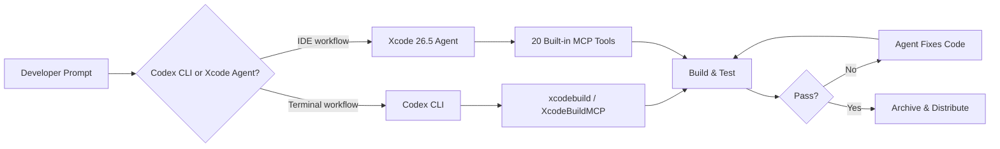
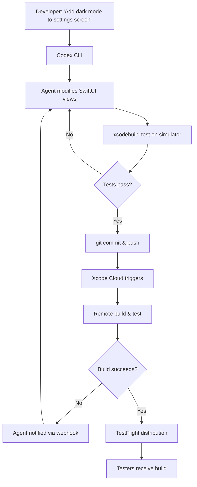

# Codex CLI for Swift/Xcode Cloud Builds: Remote Build Agents, TestFlight Automation, and iOS CI/CD Workflows


---

iOS development has historically been the most GUI-bound major platform. Xcode's build system, provisioning profiles, simulator management, and App Store Connect workflows all conspire to keep you clicking rather than typing. Codex CLI changes that equation. Combined with Xcode 26.3's native agentic coding support[^1], XcodeBuildMCP's 79-tool MCP server[^2], and Xcode Cloud's CI/CD pipeline[^3], you can now run an entire iOS development and release cycle from the terminal — with an AI agent driving the loop.

This article covers the practical integration points: configuring Codex CLI for `xcodebuild`, wiring up XcodeBuildMCP for deep Xcode automation, automating TestFlight distribution, and orchestrating the lot through Xcode Cloud.

## The CLI-First iOS Development Loop

OpenAI's official guidance is clear: keep builds in the terminal[^4]. Apple's `xcodebuild` handles build, test, archive, `build-for-testing`, and `test-without-building` actions from the command line, which lets Codex stay in an agentic loop rather than bouncing into the Xcode GUI.

For a typical SwiftUI project, the core commands are:

```bash
# List available schemes
xcodebuild -list -project MyApp.xcodeproj

# Build for simulator
xcodebuild -scheme MyApp -sdk iphonesimulator -destination 'platform=iOS Simulator,name=iPhone 16 Pro' build

# Run tests
xcodebuild -scheme MyApp -sdk iphonesimulator -destination 'platform=iOS Simulator,name=iPhone 16 Pro' test

# Archive for distribution
xcodebuild -scheme MyApp -sdk iphoneos -archivePath build/MyApp.xcarchive archive
```

Codex CLI can invoke these directly. The key insight from OpenAI's iOS use-case documentation is to use "the narrowest command that actually proves the contract you touched" after each change, expanding to broader builds only when needed[^4]. A single-file SwiftUI change doesn't need a full archive — a simulator build suffices.

### Tuist as an Alternative

For projects that want to avoid `.xcodeproj` and `.xcworkspace` files entirely, Tuist generates and builds Xcode projects without the GUI[^4]. This is particularly agent-friendly because the project configuration lives in Swift files that Codex can read and modify directly.

## XcodeBuildMCP: 79 Tools for Deep Xcode Automation

XcodeBuildMCP, now maintained by Sentry[^2], ships as a dual-mode package: a CLI for direct terminal use and an MCP server for AI coding agents. Version 2.0 introduced command-line accessibility alongside the MCP server functionality[^2].

### Installation

Add XcodeBuildMCP to your Codex CLI configuration:

```bash
codex mcp add XcodeBuildMCP -- npx -y xcodebuildmcp@latest mcp
```

Or configure it in your MCP settings JSON:

```json
{
  "mcpServers": {
    "XcodeBuildMCP": {
      "command": "npx",
      "args": ["-y", "xcodebuildmcp@latest", "mcp"]
    }
  }
}
```

### Project Configuration

XcodeBuildMCP uses a per-project configuration file at `.xcodebuildmcp/config.yaml`:

```yaml
scheme: MyApp
project: MyApp.xcodeproj
simulator: "iPhone 16 Pro"
```

This allows AI agents to run independent build, test, and deploy cycles without needing to discover project structure each time[^2].

### Key Tool Categories

The 79 tools span the full development lifecycle[^2]:

| Category | Example Tools | Purpose |
|---|---|---|
| **Build** | `simulator/build`, `simulator/build-and-run` | Compile and launch |
| **Testing** | `simulator/test` | Run XCTest suites |
| **Screenshots** | `simulator/screenshot` | Visual verification |
| **Debugging** | `debugging/attach`, `debugging/breakpoint` | LLDB integration |
| **UI Automation** | `ui-automation/tap`, `ui-automation/swipe` | Interact with running app |
| **Device** | Real device testing via USB or Wi-Fi | Physical device validation |

### Token Efficiency: MCP vs CLI

A practical consideration: each CLI command costs roughly 200 tokens versus 550–1,400 per MCP tool definition[^5]. For simple build-and-test loops, direct `xcodebuild` invocations through Codex CLI are more token-efficient. Reserve XcodeBuildMCP's richer tools for operations that genuinely need them — simulator screenshots, LLDB debugging sessions, and UI automation.

## Xcode 26.3+ Agentic Coding Integration

Xcode 26.3, released February 2026, introduced native support for agentic coding through Claude Agent and OpenAI Codex[^1]. The integration exposes 20 built-in tools via MCP, including:

- **File operations**: Create, read, and modify project files
- **Build system**: Build projects and run tests directly
- **Visual verification**: Capture Xcode Previews for iterative design
- **Documentation**: Access Apple's full developer documentation[^1]

Xcode 26.5 (May 2026) extended this with message queuing in the coding assistant[^6], allowing you to stack multiple agent instructions without waiting for each to complete.



**Important**: Xcode's agentic coding requires macOS 26 Tahoe on Apple Silicon exclusively[^7]. Intel Macs are not supported.

## Xcode Cloud: Remote Build Agents

Xcode Cloud is Apple's first-party CI/CD service, built into Xcode and App Store Connect[^3]. It provides ephemeral macOS build environments — effectively remote build agents — that run your workflows without tying up local hardware.

### Workflow Configuration

Xcode Cloud workflows support multiple start conditions[^3]:

- **Branch changes**: Trigger on push to `main`, `release/*`, or any pattern
- **Pull request**: Build and test on PR creation or update
- **Tag**: Archive and distribute when a version tag is pushed
- **Manual**: On-demand builds from Xcode or App Store Connect

### Integrating Codex CLI with Xcode Cloud

Xcode Cloud executes custom scripts at three points in the build lifecycle via the `ci_scripts/` directory[^3]:

```bash
# ci_scripts/ci_post_clone.sh — runs after repo clone
#!/bin/bash
set -e

# Install dependencies
brew install swiftlint tuist

# Run Codex CLI for pre-build validation
# (requires OPENAI_API_KEY in Xcode Cloud environment secrets)
npx codex exec "Review the last 5 commits for breaking API changes and report any issues" \
  --model o4-mini \
  --output ci_scripts/codex-review.md
```

```bash
# ci_scripts/ci_pre_xcodebuild.sh — runs before xcodebuild
#!/bin/bash
set -e

# Generate project files if using Tuist
if [ -f "Project.swift" ]; then
  tuist generate --no-open
fi
```

### Xcode Cloud API

The App Store Connect API provides programmatic access to Xcode Cloud data[^3], enabling you to:

- Trigger builds from Codex CLI or any automation script
- Query build status and test results
- Create dashboards aggregating build health across projects

## TestFlight Automation

TestFlight distribution is where Codex CLI's agent loop meets Apple's release pipeline. The workflow splits into two paths: Xcode Cloud–managed distribution and direct CLI upload.

### Path 1: Xcode Cloud to TestFlight

The simplest approach uses Xcode Cloud's built-in TestFlight integration. When a workflow's post-action is configured for TestFlight distribution, successful builds are automatically uploaded[^3].

For automated test notes, Xcode Cloud looks for files named `WhatToTest.<LOCALE>.txt` inside a `TestFlight/` directory at the project root[^8]:

```
MyApp/
├── TestFlight/
│   ├── WhatToTest.en-US.txt
│   └── WhatToTest.ja.txt
├── MyApp.xcodeproj
└── ...
```

You can ask Codex CLI to generate these notes from recent commits:

```bash
codex exec "Read the git log since the last tag and write concise TestFlight test notes \
  summarising what testers should focus on. Write to TestFlight/WhatToTest.en-GB.txt"
```

### Path 2: Direct Upload via xcrun altool

For projects not using Xcode Cloud, or when you need finer control, upload directly from the terminal:

```bash
# Export IPA from archive
xcodebuild -exportArchive \
  -archivePath build/MyApp.xcarchive \
  -exportPath build/export \
  -exportOptionsPlist ExportOptions.plist

# Validate before upload
xcrun altool --validate-app \
  -f build/export/MyApp.ipa \
  -t ios \
  --apiKey "$APP_STORE_CONNECT_KEY_ID" \
  --apiIssuer "$APP_STORE_CONNECT_ISSUER_ID"

# Upload to App Store Connect / TestFlight
xcrun altool --upload-app \
  -f build/export/MyApp.ipa \
  -t ios \
  --apiKey "$APP_STORE_CONNECT_KEY_ID" \
  --apiIssuer "$APP_STORE_CONNECT_ISSUER_ID"
```

**Note**: Apple requires the `-assetFile` flag instead of `-f` for uploads starting in 2026[^9]. Check your Xcode version's `altool` man page for the current syntax.

### End-to-End Agent Workflow



## Codex CLI Skills for iOS Development

OpenAI provides installable skills that bake iOS-specific best practices into the agent's behaviour[^4]:

- **SwiftUI expert patterns**: Idiomatic view composition and state management
- **Liquid Glass adoption**: iOS 26's new design language
- **Performance auditing**: Instruments-driven profiling workflows
- **Swift concurrency**: Structured concurrency, actors, and sendability
- **View refactoring**: Breaking down monolithic views

Install a skill and it persists across sessions, giving Codex CLI deeper context for iOS-specific decisions without burning tokens on repeated system prompts.

## Practical Configuration

A production-ready setup combining all the pieces:

```toml
# codex.toml — project-level Codex CLI configuration
[model]
default = "o4-mini"        # Fast iteration for build loops
review = "gpt-5.5"         # Thorough review before release

[mcp.servers.XcodeBuildMCP]
command = "npx"
args = ["-y", "xcodebuildmcp@latest", "mcp"]

[sandbox]
allow_commands = [
  "xcodebuild",
  "xcrun",
  "simctl",
  "tuist"
]
```

```markdown
<!-- AGENTS.md — agent instruction file -->
## iOS Build Rules
- Always build for simulator first; only archive when explicitly asked
- Run `xcodebuild test` after every SwiftUI view change
- Use XcodeBuildMCP screenshot tool to verify visual changes
- Never modify signing or provisioning settings without confirmation
- Generate TestFlight notes from git log when archiving
```

## What This Unlocks

The combination of Codex CLI, XcodeBuildMCP, Xcode 26.5's agentic coding, and Xcode Cloud means an iOS developer can:

1. **Describe a feature** in natural language
2. **Have the agent implement it**, building and testing in a loop
3. **Push to trigger Xcode Cloud**, which builds on Apple's remote agents
4. **Distribute to TestFlight automatically**, with agent-generated test notes
5. **Iterate on tester feedback** by describing the fix and repeating

The entire cycle stays CLI-first and agent-driven. The Xcode GUI becomes optional — a visual verification step rather than the primary development environment.

---

## Citations

[^1]: Apple Newsroom, "Xcode 26.3 unlocks the power of agentic coding", February 2026. [https://www.apple.com/newsroom/2026/02/xcode-26-point-3-unlocks-the-power-of-agentic-coding/](https://www.apple.com/newsroom/2026/02/xcode-26-point-3-unlocks-the-power-of-agentic-coding/)

[^2]: Sentry/XcodeBuildMCP, "A Model Context Protocol (MCP) server and CLI that provides tools for agent use when working on iOS and macOS projects", GitHub. [https://github.com/getsentry/XcodeBuildMCP](https://github.com/getsentry/XcodeBuildMCP)

[^3]: Apple Developer, "Xcode Cloud Overview", 2026. [https://developer.apple.com/xcode-cloud/](https://developer.apple.com/xcode-cloud/)

[^4]: OpenAI Developers, "Build for iOS — Codex use cases", 2026. [https://developers.openai.com/codex/use-cases/native-ios-apps](https://developers.openai.com/codex/use-cases/native-ios-apps)

[^5]: FlowDeck, "MCP vs CLI for AI-powered iOS development", April 2026. [https://flowdeck.studio/blog/2026/04/22/mcp-vs-cli-for-ai-powered-ios-development/](https://flowdeck.studio/blog/2026/04/22/mcp-vs-cli-for-ai-powered-ios-development/)

[^6]: 9to5Mac, "Xcode 26.5 adds two features that make agentic coding more useful", May 2026. [https://9to5mac.com/2026/05/12/xcode-26-5-adds-two-features-that-make-agentic-coding-more-useful/](https://9to5mac.com/2026/05/12/xcode-26-5-adds-two-features-that-make-agentic-coding-more-useful/)

[^7]: MacRumors, "Apple Releases Xcode 26.3 With Support for AI Agents From Anthropic and OpenAI", February 2026. [https://www.macrumors.com/2026/02/26/apple-releases-xcode-26-3/](https://www.macrumors.com/2026/02/26/apple-releases-xcode-26-3/)

[^8]: Pol Piella, "Xcode Cloud: Generating and translating TestFlight test notes automatically". [https://www.polpiella.dev/setting-testflight-test-notes-for-xcode-cloud-builds](https://www.polpiella.dev/setting-testflight-test-notes-for-xcode-cloud-builds)

[^9]: Apple Developer, "Upload builds — App Store Connect Help", 2026. [https://developer.apple.com/help/app-store-connect/manage-builds/upload-builds/](https://developer.apple.com/help/app-store-connect/manage-builds/upload-builds/)
