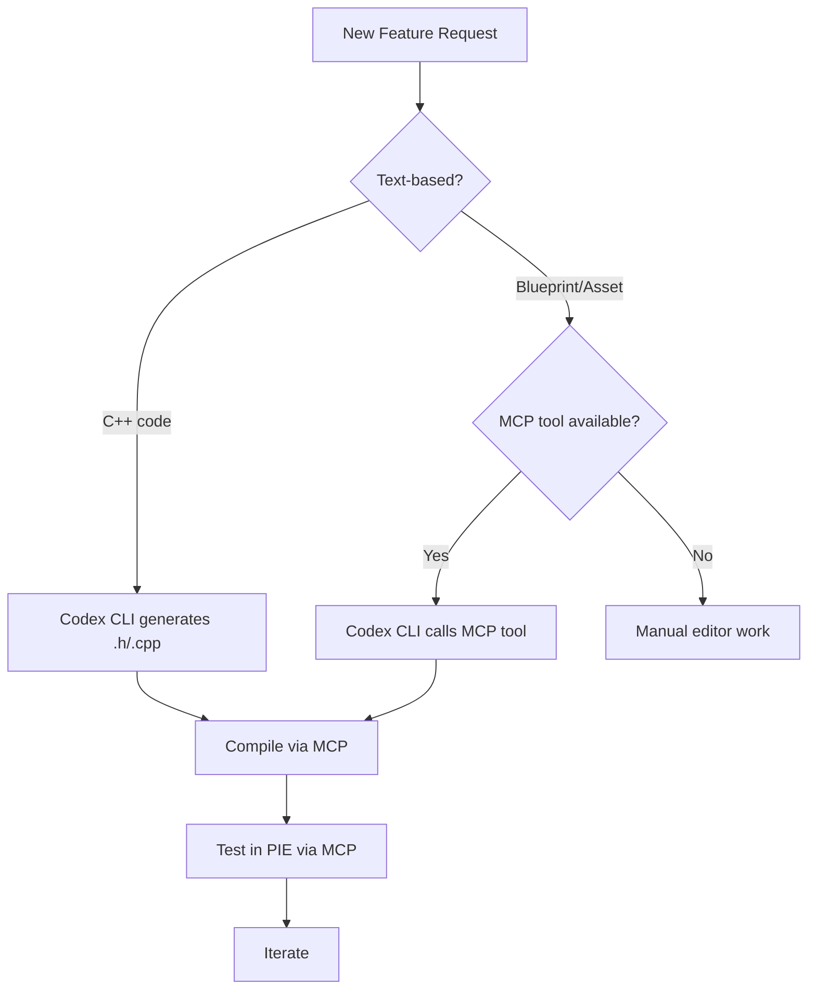

# Codex CLI for Unreal Engine 5.7: MCP Servers, Blueprint Workflows, and Agent-Driven Game Development


---

Unreal Engine 5.7 shipped with production-ready Nanite Foliage, Substrate materials, a revamped PCG framework, and Epic's own experimental AI Assistant built into the editor[^1]. Simultaneously, the community has built a rich MCP server ecosystem that connects Codex CLI — and other MCP-compatible agents — directly to a live Unreal Editor session. The result: senior game developers can drive actor placement, Blueprint scaffolding, material authoring, and level iteration from a terminal prompt without leaving their compile-test loop.

This article maps the current Unreal Engine MCP landscape, shows how to wire Codex CLI into UE5.7 projects, and documents the practical patterns that actually ship game features.

## The Unreal MCP Ecosystem in 2026

Three mature MCP integrations dominate the space, each targeting a different workflow:

| Server | Tools | Transport | Focus |
|--------|-------|-----------|-------|
| **StraySpark Unreal MCP Server** | 207+ across 34 categories | JSON-RPC 2.0 over HTTP | Full editor automation: actors, materials, Sequencer, Blueprints, PCG, landscape[^2] |
| **UnrealCodex** | 20+ tools | HTTP (port 3000) | Codex CLI native integration with in-editor chat panel and UE5.7 API context[^3] |
| **unreal-mcp (chongdashu)** | ~30 tools | FastMCP over TCP (port 55557) | Lightweight actor/Blueprint/editor control via Python MCP server[^4] |

All three share a common architecture: a C++ plugin running inside the Unreal Editor exposes engine APIs over a local socket, and an MCP-compliant bridge translates tool calls into editor commands.


### StraySpark: The Industrial-Strength Option

StraySpark's server exposes 12 context resources alongside its 207 tools, giving the agent awareness of scene hierarchy, active assets, viewport state, and project configuration without requiring manual explanation[^2]. Categories span actor management, Blueprint node graph editing, material authoring, Sequencer timeline control, landscape sculpting and foliage painting, Niagara VFX, animation state machines, Control Rig, PCG graph authoring, and cinematics.

For teams needing granular control, StraySpark provides **tool presets** — curated subsets that restrict the agent to specific domains (e.g., "level-design-only" or "materials-only"), reducing token consumption and preventing unintended editor mutations[^2].

### UnrealCodex: Codex CLI Native

UnrealCodex is purpose-built for Codex CLI. The plugin embeds a chat panel directly in the editor with live streaming responses, tool call grouping, and code block rendering[^3]. Its distinguishing feature is a **dynamic UE5.7 context system** that provides on-demand API documentation, meaning the agent receives accurate class references, function signatures, and property metadata for the current engine version rather than relying on stale training data.

Installation requires building the plugin from source and installing the MCP bridge dependencies:

```bash
# Clone with submodules (MCP bridge is a submodule)
git clone --recurse-submodules https://github.com/online5880/UnrealCodex.git

# Build for your platform (example: macOS Apple Silicon)
RunUAT BuildPlugin -Plugin="UnrealCodex/UnrealCodex.uplugin" \
  -Package="./Packaged" -TargetPlatforms=Mac -Rocket

# Install MCP bridge dependencies
cd UnrealCodex/Resources/mcp-bridge && npm install
```

The MCP server starts automatically when the editor loads and listens on port 3000 by default[^3].

## Configuring Codex CLI for Unreal Projects

### MCP Server Registration

Add the Unreal MCP server to your Codex CLI configuration. For StraySpark's HTTP-based server:

```toml
# ~/.codex/config.toml or .codex/config.toml in project root
[mcp-servers.unreal]
type = "http"
url = "http://localhost:8080"
```

For UnrealCodex:

```toml
[mcp-servers.unreal-codex]
type = "http"
url = "http://localhost:3000"
```

### AGENTS.md for Game Projects

Unreal Engine's C++ codebase has specific conventions that agents must respect. A well-structured `AGENTS.md` at the project root prevents common mistakes:

```markdown
# AGENTS.md

## Engine
Unreal Engine 5.7. Target platforms: Win64, Linux.

## Code Conventions
- All gameplay classes inherit from UObject/AActor hierarchy
- Use UFUNCTION(BlueprintCallable) for functions exposed to Blueprints
- Use UPROPERTY(EditAnywhere, BlueprintReadWrite) for editable properties
- Header files use #pragma once, not include guards
- Follow Epic's naming: F for structs, U for UObject, A for AActor, E for enums

## Build System
- Build with UnrealBuildTool. Do NOT use raw CMake.
- Module definitions in .Build.cs files
- Test with Unreal Automation Framework, not GoogleTest

## Critical Constraints
- Never modify .uasset files directly — they are binary
- Blueprint logic changes must go through MCP tools or editor UI
- Live Coding (Ctrl+Alt+F11) for C++ hot reload during PIE
- Always compile before testing: `UnrealBuildTool -build`

## MCP Tools Available
UnrealCodex MCP on port 3000 with actor, Blueprint, material,
animation, and asset tools. Use these for scene manipulation.
```

### Sandbox Considerations

Codex CLI's default sandbox restricts filesystem writes to the workspace directory. Unreal Engine projects generate significant build artefacts outside the workspace (Intermediate, Saved, Binaries directories). Configure your permission profile to allow writes to the project tree:

```toml
# .codex/config.toml
[permissions]
profile = "auto-edit"

# Allow Unreal build artefacts
[[permissions.allow]]
path = "/path/to/MyProject/**"
```

## Practical Workflow Patterns

### Pattern 1: C++ Gameplay Class Generation

The recommended workflow for new gameplay features is to have Codex generate C++ classes with Blueprint-callable functions, then use MCP tools to wire them into the scene:

```
> Create a new AProjectile actor class with:
  - UProjectileMovementComponent for physics
  - USphereComponent for collision
  - UFUNCTION(BlueprintCallable) Launch(FVector Direction, float Speed)
  - On hit, apply 50 damage via UGameplayStatics::ApplyDamage
  - Register in MyProject.Build.cs module dependencies
```

Codex generates the `.h` and `.cpp` files following Unreal conventions, then uses the MCP `compile_project` tool to trigger a build and the `spawn_actor` tool to place a test instance in the current level.

### Pattern 2: Material Authoring via MCP

Material editing in Unreal is notoriously visual. MCP tools bridge this gap by exposing material graph operations programmatically:

```
> Create a new material M_Ice with:
  - Base colour from a Fresnel node blended with light blue
  - Roughness 0.1, Metallic 0.0
  - Subsurface scattering enabled
  - Apply to all StaticMeshActors tagged "frozen" in the current level
```

The agent uses MCP tools to create the material asset, add expression nodes, connect pins, set parameter values, compile the material, and apply it to tagged actors — all without touching the material editor GUI.

### Pattern 3: Level Iteration with PCG

Unreal 5.7's production-ready Procedural Content Generation framework[^1] pairs naturally with agent-driven workflows. The agent can create PCG graphs, add nodes, configure rules, and execute generation:

```
> Create a PCG graph that scatters pine trees across the landscape:
  - Sample points on landscape with density 0.3/m²
  - Filter by slope (max 30°) and altitude (above 200m)
  - Randomise scale 0.8-1.2 and yaw rotation
  - Use SM_PineTree_01 static mesh
  - Execute and preview in the viewport
```

### Pattern 4: Animation Blueprint Scaffolding

UnrealCodex provides dedicated animation Blueprint tools for state machine editing[^3]. A typical workflow:

```
> Create an Animation Blueprint for ABP_Character:
  - Locomotion state machine with Idle, Walk, Run, Sprint states
  - Blend by speed variable (0-600 range)
  - Add a JumpStart → JumpLoop → JumpEnd overlay
  - Wire up to the SK_Mannequin skeleton
```

## The Binary Asset Problem

A critical limitation: Unreal stores Blueprints, materials, levels, and most assets in binary `.uasset` format. No text-based agent — including Codex CLI — can directly edit these files[^5]. The two viable strategies are:

1. **MCP-mediated editing**: Use MCP tools that call Unreal Editor APIs to modify assets at runtime. This works for any operation the editor exposes programmatically.

2. **C++ with BlueprintCallable**: Write core logic in C++ (which agents handle well), expose it via `UFUNCTION(BlueprintCallable)`, and manually wire the Blueprint graph for visual scripting elements that resist programmatic authoring.



## Epic's Built-In AI Assistant vs. MCP Agents

Unreal 5.7 ships with an experimental AI Assistant accessible via F1 on any editor element[^1]. How does it compare to Codex CLI with MCP?

| Capability | Epic AI Assistant | Codex CLI + MCP |
|-----------|-------------------|-----------------|
| C++ code generation | Yes | Yes |
| Blueprint node editing | No | Yes (via MCP tools) |
| Scene manipulation | No | Yes (actor spawn, transform, materials) |
| Multi-file refactoring | No | Yes |
| Custom model selection | No (Epic subscription tiers) | Yes (GPT-5.5, o3, o4-mini, third-party) |
| Sandbox isolation | N/A (runs inside editor) | Yes (bubblewrap/Seatbelt) |
| CI/CD integration | No | Yes (`codex exec`) |
| Context from AGENTS.md | No | Yes |

Epic's assistant excels at contextual help — hover over a property, press F1, get an explanation. But for automated multi-step workflows, Codex CLI with MCP tools provides the programmable loop that ships features[^6].

## Sandbox and Security Considerations

Game projects present unique security surface area. Large binary assets, proprietary art pipelines, and platform SDK credentials all sit in or near the project directory. Key precautions:

- **Restrict MCP tool sets**: Use StraySpark's tool presets or UnrealCodex's `allowedTools` configuration to limit which editor operations the agent can invoke. A "code-only" preset prevents accidental scene modifications during refactoring sessions.
- **Deny-read sensitive paths**: Exclude platform SDK directories, signing certificates, and proprietary middleware from the agent's readable filesystem.
- **Hook-gate destructive operations**: Use Codex CLI hooks to require human approval before operations like `delete_all_actors` or `execute_console_command`.

```toml
# .codex/config.toml — hook gating for destructive UE operations
[[hooks.on-tool-call]]
match = "delete_all_actors|execute_console_command|save_all"
action = "require-approval"
```

## Testing with the Unreal Automation Framework

Codex CLI can run Unreal's built-in automation tests via `codex exec`, enabling agent-generated test validation in CI:

```bash
# Run all project automation tests headlessly
codex exec "Run the Unreal Automation Framework tests for the Projectile module.
Use: UnrealEditor-Cmd MyProject.uproject -ExecCmds='Automation RunTests Projectile' -NullRHI -NoSound -Unattended"
```

The agent generates the test class (`FProjectileTest`), registers it with `IMPLEMENT_SIMPLE_AUTOMATION_TEST`, writes assertions using `TestEqual` and `TestTrue`, and executes the suite — all within a single prompt-compile-test loop.

## Getting Started Checklist

1. Install Codex CLI: `npm i -g @openai/codex` (or use the standalone Rust binary)[^7]
2. Choose your MCP server: StraySpark for comprehensive editor control, UnrealCodex for Codex-native integration, or unreal-mcp for lightweight experimentation
3. Configure the MCP server in `.codex/config.toml`
4. Write an `AGENTS.md` with Unreal conventions, module structure, and build instructions
5. Set permission profiles to allow project directory writes
6. Start with C++ generation workflows before attempting MCP-mediated Blueprint editing
7. Add hook gates for destructive editor operations

## Citations

[^1]: Epic Games, "Unreal Engine 5.7 is here! Find out what's new and download today," *Unreal Engine News*, 2025-2026. [https://www.unrealengine.com/news/unreal-engine-5-7-is-now-available](https://www.unrealengine.com/news/unreal-engine-5-7-is-now-available)

[^2]: StraySpark, "Unreal MCP Server — 200+ AI Tools for UE5 Editor Automation via MCP," *Epic Developer Community Forums*, 2026. [https://forums.unrealengine.com/t/strayspark-unreal-mcp-server-200-ai-tools-for-ue5-editor-automation-via-mcp/2707474](https://forums.unrealengine.com/t/strayspark-unreal-mcp-server-200-ai-tools-for-ue5-editor-automation-via-mcp/2707474)

[^3]: online5880, "UnrealCodex: Codex CLI integration for Unreal Engine 5.7," *GitHub*, 2026. [https://github.com/online5880/UnrealCodex](https://github.com/online5880/UnrealCodex)

[^4]: chongdashu, "unreal-mcp: Enable AI assistant clients to control Unreal Engine through natural language using MCP," *GitHub*, 2026. [https://github.com/chongdashu/unreal-mcp](https://github.com/chongdashu/unreal-mcp)

[^5]: StraySpark, "UE 5.7's Built-In AI Assistant vs. MCP: Which AI Workflow Actually Ships Games?", *StraySpark Blog*, 2026. [https://www.strayspark.studio/blog/ue57-ai-assistant-vs-mcp-comparison](https://www.strayspark.studio/blog/ue57-ai-assistant-vs-mcp-comparison)

[^6]: Antigravity Lab, "Antigravity × Unreal Engine Game Development — Accelerate C++ and Blueprint Workflows with AI," 2026. [https://antigravitylab.net/en/articles/app-dev/antigravity-unreal-engine-game-development](https://antigravitylab.net/en/articles/app-dev/antigravity-unreal-engine-game-development)

[^7]: OpenAI, "Codex CLI," *OpenAI Developers*, 2026. [https://developers.openai.com/codex/cli](https://developers.openai.com/codex/cli)
