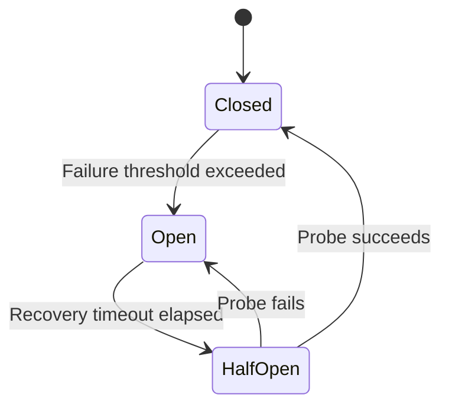
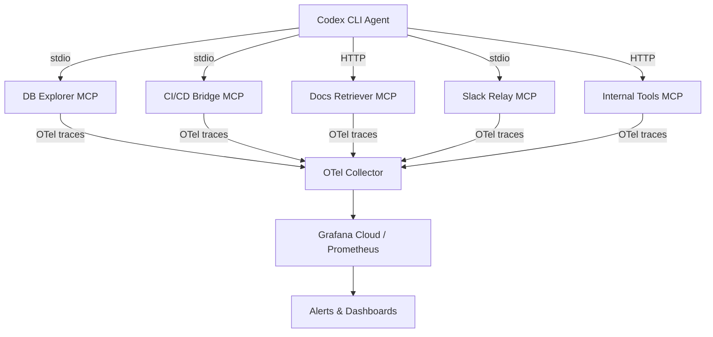

# MCP Server Health Monitoring at Scale: Heartbeats, Circuit Breakers, and Observability for Multi-Server Configurations


---

Running a single MCP server alongside Codex CLI is straightforward. Running five or more — a database explorer, a CI/CD bridge, a documentation retriever, a Slack relay, and a custom internal tool — is where things quietly fall apart. A server that silently hangs on startup, a flaky HTTP connection that returns errors intermittently, or a single slow tool that blocks the entire agent loop: these are the failure modes that turn a productive agentic workflow into a frustrating debugging session.

This article covers the operational patterns needed to keep multi-server MCP configurations healthy at scale: Codex CLI's built-in health controls, circuit breaker strategies, OpenTelemetry-based observability, and practical monitoring architectures.

## The Failure Modes You Actually Hit

Before diving into solutions, it helps to catalogue what goes wrong when you scale beyond two or three MCP servers.

**Startup failures** are the most common. The MCP server binary isn't on `PATH`, an environment variable is missing, or the server takes longer than the default 10-second timeout to initialise [^1]. Codex CLI will silently degrade — the server's tools simply won't appear — unless you've configured it otherwise.

**Silent hangs** occur when a server's process is alive but unresponsive. The JSON-RPC connection over stdio or HTTP stays open, but tool calls never return. The default 60-second tool timeout eventually fires, but by then the agent has wasted a full minute of context window [^2].

**Cascading slowdowns** happen when one slow server blocks readOnlyHint-ineligible tool calls. Since Codex CLI v0.134.0 only parallelises tools that advertise `readOnlyHint` [^3], a single slow write-capable tool serialises everything behind it.

**Configuration corruption** affects all servers simultaneously. A malformed TOML entry in `~/.codex/config.toml` breaks every MCP server, not just the misconfigured one, because Codex CLI and the VS Code extension share the same configuration file [^4].

## Codex CLI's Built-in Health Controls

Codex CLI provides several configuration levers for managing MCP server health. These aren't a full monitoring stack, but they're the foundation.

### Timeouts

```toml
[mcp_servers.slow-db]
command = "/usr/local/bin/db-mcp-server"
startup_timeout_sec = 30
tool_timeout_sec = 120
```

The `startup_timeout_sec` parameter (default: 10s) controls how long Codex waits for the server to complete the MCP `initialize` handshake [^1]. For servers that need to establish database connections or download schemas at startup, increasing this is essential. The `tool_timeout_sec` parameter (default: 60s) caps individual tool execution time [^2].

### The `required` Flag

```toml
[mcp_servers.critical-api]
command = "critical-api-mcp"
required = true
```

When `required = true`, Codex CLI will fail startup entirely if the server cannot initialise [^1]. This is a blunt but effective circuit breaker for mission-critical servers — it prevents you from starting an agent session that appears functional but is missing essential tools.

### The `enabled` Flag

```toml
[mcp_servers.experimental]
command = "experimental-mcp"
enabled = false
```

The `enabled` flag lets you disable a flaky server without deleting its configuration [^1]. This is operationally valuable: you preserve the full configuration for when the server is fixed, and you avoid the risk of TOML syntax errors from hasty edits.

### Diagnostic Commands

Two diagnostic tools help assess MCP health:

- **`/mcp` within a session** shows connection state for each configured server, including which tools were successfully registered [^5].
- **`codex doctor`** runs support-ready diagnostics across runtime, authentication, terminal, network, configuration, and local state [^6]. It now correctly detects npm-managed installations and provides actionable output for debugging MCP startup failures.

## Circuit Breaker Patterns for MCP

Codex CLI doesn't implement circuit breakers natively. If you're running MCP servers that proxy to external APIs — and most production configurations do — you need to build this resilience into your server implementations or your infrastructure layer.

### The Three-State Model



The circuit breaker pattern tracks consecutive failures against a configurable threshold [^7]. Once the threshold is exceeded, the circuit opens and immediately rejects requests without attempting the downstream call. After a recovery timeout, a single probe request is allowed through. If it succeeds, the circuit closes; if it fails, it reopens.

### Implementation in MCP Server Code

For a Python-based MCP server proxying an external API:

```python
import time
from dataclasses import dataclass, field
from enum import Enum

class CircuitState(Enum):
    CLOSED = "closed"
    OPEN = "open"
    HALF_OPEN = "half_open"

@dataclass
class CircuitBreaker:
    failure_threshold: int = 5
    recovery_timeout: float = 30.0
    state: CircuitState = CircuitState.CLOSED
    failure_count: int = 0
    last_failure_time: float = 0.0

    def call(self, operation):
        if self.state == CircuitState.OPEN:
            if time.time() - self.last_failure_time > self.recovery_timeout:
                self.state = CircuitState.HALF_OPEN
            else:
                raise CircuitOpenError("Circuit breaker is open")

        try:
            result = operation()
            self._on_success()
            return result
        except Exception as e:
            self._on_failure()
            raise

    def _on_success(self):
        self.failure_count = 0
        self.state = CircuitState.CLOSED

    def _on_failure(self):
        self.failure_count += 1
        self.last_failure_time = time.time()
        if self.failure_count >= self.failure_threshold:
            self.state = CircuitState.OPEN
```

The critical detail: when the circuit is open, the MCP server should return an `isError: true` response with a descriptive message rather than crashing [^8]. This lets the agent understand the failure and potentially route to an alternative tool.

```python
from mcp.types import CallToolResult, TextContent

async def handle_tool_call(self, name, arguments):
    try:
        return self.circuit_breaker.call(
            lambda: self._execute_tool(name, arguments)
        )
    except CircuitOpenError:
        return CallToolResult(
            isError=True,
            content=[TextContent(
                text=f"Service temporarily unavailable (circuit open). "
                     f"Retry in {self.circuit_breaker.recovery_timeout}s."
            )]
        )
```

### Retry with Exponential Backoff

Circuit breakers pair naturally with retry logic. The retry handles transient blips; the circuit breaker handles sustained outages [^7]. Add jitter to prevent synchronised retry storms across multiple agent sessions:

```python
import random
import asyncio

async def retry_with_backoff(operation, max_attempts=3):
    for attempt in range(max_attempts):
        try:
            return await operation()
        except TransientError:
            if attempt == max_attempts - 1:
                raise
            delay = (2 ** attempt) + random.uniform(0, 1)
            await asyncio.sleep(delay)
```

Only retry idempotent operations. For MCP tools that modify state, a failed call should surface the error to the agent rather than risk duplicate mutations [^8].

## OpenTelemetry Observability

The OpenTelemetry project published formal semantic conventions for MCP in 2026, providing a standardised vocabulary for instrumenting MCP clients and servers [^9].

### Key Attributes

| Attribute | Description | Required |
|-----------|-------------|----------|
| `mcp.method.name` | Request or notification method | Yes |
| `mcp.session.id` | MCP session identifier | Recommended |
| `mcp.protocol.version` | MCP spec version | Recommended |
| `gen_ai.tool.name` | Tool being invoked | Conditional |
| `error.type` | Error classification | On failure |
| `network.transport` | `pipe`, `tcp`, `websocket` | Recommended |

### Span Structure

MCP spans follow the naming convention `{mcp.method.name} {target}` — for example, `tools/call database_query` [^9]. Client spans (kind: `CLIENT`) measure from request initiation to response receipt. Server spans (kind: `SERVER`) measure processing time from request reception to result transmission.

Context propagation uses W3C Trace Context headers injected into the `params._meta` property of MCP messages [^9], enabling end-to-end traces across agent → MCP client → MCP server → downstream API.

### Standard Metrics

The conventions define four histogram metrics with recommended bucket boundaries of `[0.01, 0.02, 0.05, 0.1, 0.2, 0.5, 1, 2, 5, 10, 30, 60, 120, 300]` seconds [^9]:

- `mcp.client.operation.duration` — client-side operation latency
- `mcp.server.operation.duration` — server-side processing latency
- `mcp.client.session.duration` — total client session lifetime
- `mcp.server.session.duration` — total server session lifetime

### Practical Instrumentation

Using OpenLIT with Grafana Cloud provides a low-friction path to MCP observability [^10]:

```bash
pip install openlit mcp
```

```python
import openlit

openlit.init(
    otlp_endpoint="https://otlp-gateway-prod-gb-south-0.grafana.net/otlp",
    application_name="codex-mcp-servers",
    environment="production"
)
```

This auto-instruments MCP operations and exports traces and metrics to Grafana Cloud's pre-built MCP Observability dashboard, which surfaces tool performance, protocol health, resource usage, and error tracking [^10].

## Multi-Server Monitoring Architecture

For production configurations running five or more MCP servers, a structured monitoring approach prevents the "which server broke?" guessing game.



### Health Check Tools

Register a `health_check` tool in each MCP server that exposes internal status [^8]:

```python
@server.tool()
async def health_check() -> dict:
    return {
        "status": "healthy",
        "uptime_seconds": time.time() - start_time,
        "requests_served": request_counter,
        "circuit_breaker_state": circuit.state.value,
        "memory_mb": process.memory_info().rss / 1_048_576
    }
```

### Logging Discipline

MCP servers using stdio transport must log exclusively to stderr — stdout is reserved for JSON-RPC messages [^8]. Use structured logging with correlation IDs that match the `mcp.session.id` attribute:

```python
import logging
import sys

handler = logging.StreamHandler(sys.stderr)
handler.setFormatter(logging.Formatter(
    '%(asctime)s [%(levelname)s] session=%(session_id)s %(message)s'
))
```

### Alert Thresholds

Based on the OTel histogram metrics, set alerts for:

- **Tool latency P95 > 10s** — indicates downstream degradation
- **Error rate > 5% over 5 minutes** — triggers investigation
- **Startup failure on `required` server** — immediate page
- **Circuit breaker open > 2 minutes** — sustained outage

## Operational Checklist

Before scaling to five or more MCP servers, verify each item:

1. **Every server has explicit timeouts** — don't rely on defaults for servers that proxy external APIs
2. **Critical servers use `required = true`** — fail fast rather than running blind
3. **Read-only tools advertise `readOnlyHint`** — enables concurrent execution since v0.134.0 [^3]
4. **Circuit breakers wrap external API calls** — return `isError` responses, don't crash
5. **OTel instrumentation is active** — even basic `openlit.init()` gives immediate visibility
6. **Stderr logging uses structured format** — with session correlation IDs
7. **`codex doctor` runs clean** — verify before each deployment [^6]
8. **Configuration is version-controlled** — track `config.toml` changes that affect all servers

## Conclusion

MCP server health monitoring isn't a single tool or dashboard — it's a layered approach combining Codex CLI's configuration controls, resilience patterns in server implementations, and standardised observability through OpenTelemetry. The most common production failures are preventable with explicit timeouts, the `required` flag, and circuit breakers around external dependencies. The most common debugging frustrations are solvable with proper OTel instrumentation and structured logging.

Start with `codex doctor` and `/mcp` for immediate diagnostics. Add `required = true` and explicit timeouts for reliability. Instrument with OpenTelemetry for visibility. Build circuit breakers for resilience. That progression — diagnose, harden, observe, protect — scales from a three-server hobby setup to an enterprise configuration with dozens of MCP integrations.

---

## Citations

[^1]: OpenAI, "Configuration Reference — Codex," OpenAI Developers, 2026. [https://developers.openai.com/codex/config-reference](https://developers.openai.com/codex/config-reference)

[^2]: OpenAI, "Model Context Protocol — Codex," OpenAI Developers, 2026. [https://developers.openai.com/codex/mcp](https://developers.openai.com/codex/mcp)

[^3]: OpenAI, "Changelog — Codex," OpenAI Developers, 2026. [https://developers.openai.com/codex/changelog](https://developers.openai.com/codex/changelog)

[^4]: OpenAI Community, "MCP servers not detected in Codex VS Code extension," GitHub Issues, 2026. [https://github.com/openai/codex/issues/6465](https://github.com/openai/codex/issues/6465)

[^5]: OpenAI, "CLI — Codex," OpenAI Developers, 2026. [https://developers.openai.com/codex/cli](https://developers.openai.com/codex/cli)

[^6]: OpenAI, "Changelog — Codex," OpenAI Developers, 2026 — `codex doctor` entry. [https://developers.openai.com/codex/changelog](https://developers.openai.com/codex/changelog)

[^7]: MCPcat, "Error Handling in MCP Servers — Best Practices Guide," 2026. [https://mcpcat.io/guides/error-handling-custom-mcp-servers/](https://mcpcat.io/guides/error-handling-custom-mcp-servers/)

[^8]: Kumaran Srinivasan, "Enterprise Resilience Patterns for MCP Servers," Medium, January 2026. [https://medium.com/@kumaran.isk/enterprise-resilience-patterns-for-mcp-servers-aefba5401bb3](https://medium.com/@kumaran.isk/enterprise-resilience-patterns-for-mcp-servers-aefba5401bb3)

[^9]: OpenTelemetry, "Semantic Conventions for Model Context Protocol (MCP)," 2026. [https://opentelemetry.io/docs/specs/semconv/gen-ai/mcp/](https://opentelemetry.io/docs/specs/semconv/gen-ai/mcp/)

[^10]: Grafana Labs, "Monitor Model Context Protocol (MCP) Servers with OpenLIT and Grafana Cloud," 2026. [https://grafana.com/blog/ai-observability-MCP-servers/](https://grafana.com/blog/ai-observability-MCP-servers/)
