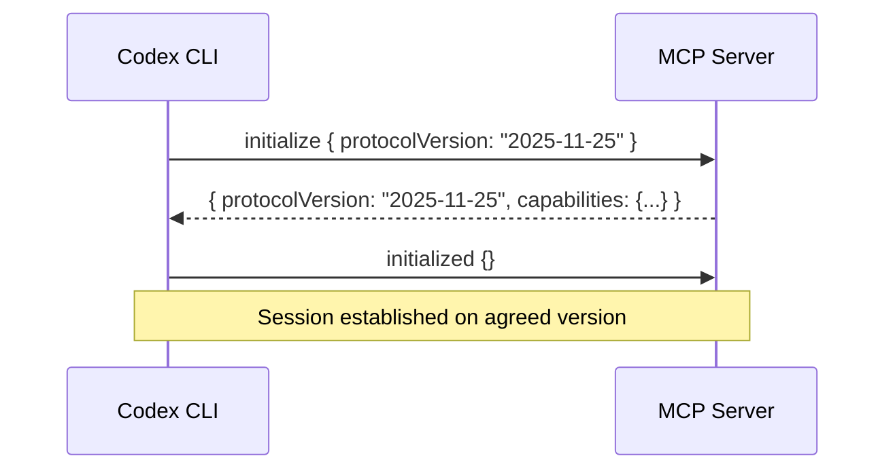
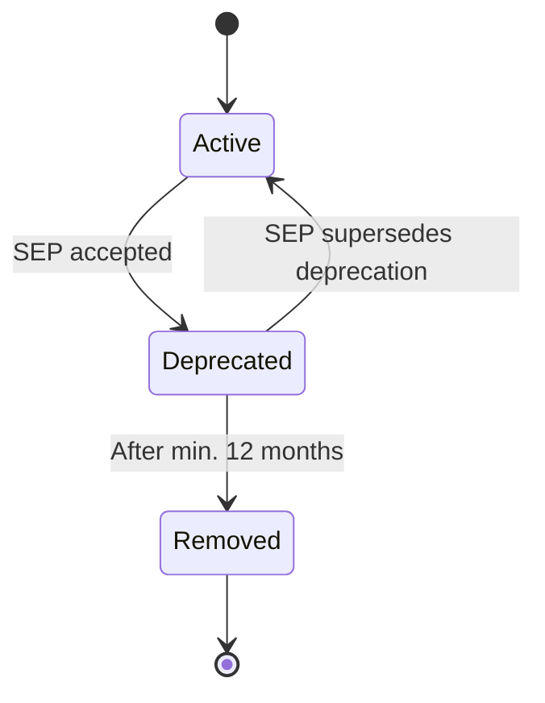
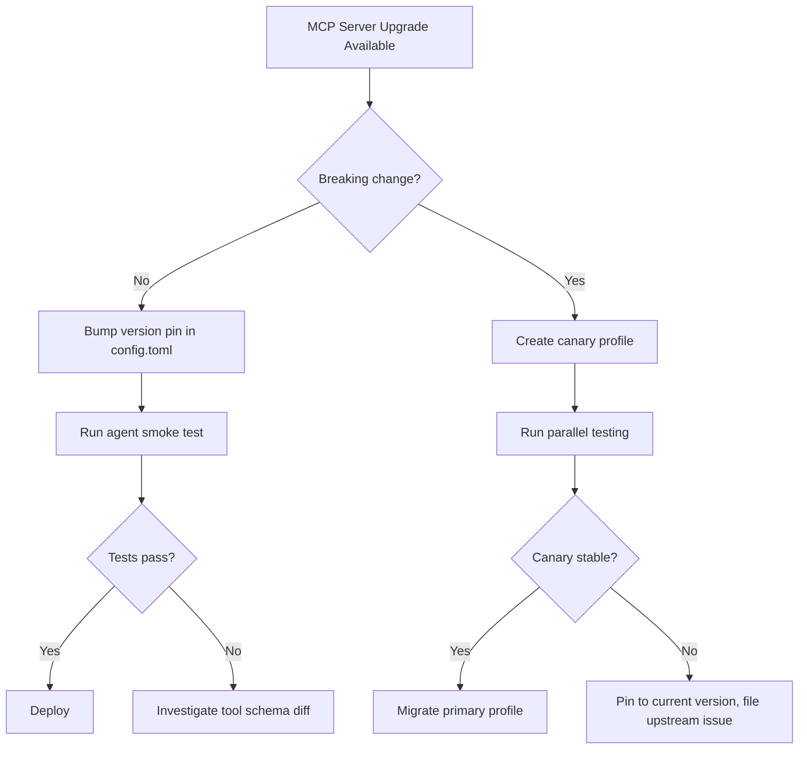

# MCP Server Versioning and Backwards Compatibility: Managing Breaking Changes Across MCP Server Upgrades


---

## Introduction

If you run more than a handful of MCP servers with Codex CLI, you have already felt the pain: a server upgrades its tool schema, your agent workflow silently breaks, and the first symptom is a cryptic `-32602 Invalid Params` error three pipeline stages downstream. The Model Context Protocol now has a formal versioning specification, a feature lifecycle policy, and — landing on 28 July 2026 — a release candidate that introduces genuinely breaking changes to the protocol itself[^1]. This article maps the full versioning landscape from protocol revisions through server-level SemVer to the practical Codex CLI configuration you need to survive an upgrade without downtime.

## Protocol-Level Versioning

MCP uses date-stamped version strings in `YYYY-MM-DD` format[^2]. The current protocol version is **2025-11-25**; the next revision, **2026-07-28**, is in its ten-week validation window with a release candidate locked on 21 May 2026[^1].

The version is **not** incremented for backwards-compatible changes — only for breaking ones[^2]. During the `initialize` handshake, the client sends its desired version and the server responds with the version it will use. If negotiation fails, the client must terminate gracefully[^2].



### What Changes in 2026-07-28

The upcoming revision introduces several breaking changes that every MCP consumer must prepare for[^1]:

| Change | Impact | Migration |
|--------|--------|-----------|
| Stateless architecture (SEP-2575) | `initialize`/`initialized` handshake removed | Adopt explicit handle patterns |
| Tasks API → extension | `tools/call` responses replaced with task handles | Use `tasks/get`, `tasks/update`, `tasks/cancel` |
| Error code `-32002` → `-32602` | Missing resource error code changes | Update error matching logic |
| JSON Schema 2020-12 for `inputSchema`/`outputSchema` | `oneOf`, `anyOf`, `allOf`, `$ref` now permitted | Validate against full JSON Schema |
| Mandatory `Mcp-Method` and `Mcp-Name` headers | Streamable HTTP transport routing | Add headers to HTTP server implementations |
| `ttlMs` and `cacheScope` metadata | List and resource responses include caching hints | Implement cache-aware client logic |

Three features are deprecated with a twelve-month removal window: **Roots**, **Sampling**, and **Logging**[^1]. Roots should be replaced with tool parameters or resource URIs; Logging should migrate to OpenTelemetry[^1].

## The Feature Lifecycle Policy

Adopted via SEP-2596, the feature lifecycle defines three states[^3]:



Key constraints:

- **Minimum deprecation window**: twelve months from the revision release, not from the SEP date[^3].
- **Expedited removal**: only for active security risks with a published advisory — still requires ninety days minimum[^3].
- **SDK obligation**: Tier 1 SDKs must mark deprecated APIs using native language mechanisms in their next release after the deprecation revision ships[^3].
- **Migration path**: every deprecation SEP must document one, or explicitly state none is required[^3].

This means any feature deprecated in the 2026-07-28 revision cannot be removed before approximately August 2027 at the earliest.

## Server-Level Versioning

The protocol version governs the wire format; individual MCP servers need their own versioning strategy. The MCP Registry (currently in preview) mandates a version string in `server.json` and recommends Semantic Versioning[^4]:

```json
{
  "$schema": "https://static.modelcontextprotocol.io/schemas/2025-12-11/server.schema.json",
  "name": "io.github.acme/database-mcp",
  "title": "Database Tools",
  "version": "2.1.0",
  "packages": [
    {
      "registryType": "npm",
      "identifier": "@acme/database-mcp",
      "version": "2.1.0",
      "transport": { "type": "stdio" }
    }
  ]
}
```

Critical rules from the registry specification[^4]:

- The version string **must** be unique per publication; once published, it is immutable.
- Server version **should** align with the underlying package version to avoid the confusion documented in GitHub Discussion #1176, where `server-everything` reported `1.0.0` while `package.json` listed `0.6.2`[^5].
- Version ranges (`^1.2.3`, `~1.2.3`, `1.x`) are **prohibited**.
- Servers **must not** change the behaviour of an existing `(name, version)` pair without bumping the version[^6].

### Tool Schema Evolution

The forthcoming tool versioning guidance (GitHub Issue #1915) proposes that tool names should remain stable across minor versions, with breaking schema changes requiring a major version bump[^6]. In practice, this means:

```toml
# Pin to a known-good version via container tag
[mcp_servers.database]
command = "docker"
args = ["run", "--rm", "-i", "acme/database-mcp:2.1.0"]
```

Rather than:

```toml
# Risky: :latest may introduce breaking tool schema changes
[mcp_servers.database]
command = "docker"
args = ["run", "--rm", "-i", "acme/database-mcp:latest"]
```

## Managing Upgrades in Codex CLI

### Version Pinning in config.toml

Codex CLI stores MCP server configuration in `~/.codex/config.toml` (global) or `.codex/config.toml` (project-scoped, trusted projects only)[^7]. The configuration supports several controls relevant to version management:

```toml
[mcp_servers.database]
command = "npx"
args = ["-y", "@acme/database-mcp@2.1.0"]
startup_timeout_sec = 15
tool_timeout_sec = 120
enabled = true
required = true
enabled_tools = ["query", "schema_inspect", "migrate"]
```

Key parameters for upgrade safety[^7]:

- **`required = true`**: Codex CLI will fail to start if this server cannot initialise, catching version incompatibilities early rather than mid-workflow.
- **`enabled_tools`**: allowlist specific tools you depend on — if a server upgrade renames or removes a tool, the missing tool is immediately visible.
- **`startup_timeout_sec`**: increase if a new server version has a heavier initialisation path.

### The Canary Upgrade Pattern

When upgrading an MCP server, run the old and new versions in parallel using Codex CLI profiles:

```toml
# ~/.codex/config.toml

[profiles.stable]
[profiles.stable.mcp_servers.database]
command = "npx"
args = ["-y", "@acme/database-mcp@2.1.0"]
enabled = true

[profiles.canary]
[profiles.canary.mcp_servers.database]
command = "npx"
args = ["-y", "@acme/database-mcp@3.0.0-rc.1"]
enabled = true
```

Test with the canary profile before cutting over:

```bash
# Run a targeted workflow against the new version
codex --profile canary "Run the database migration dry-run and report any tool errors"

# If stable, switch default
# In config.toml, set: profile = "canary"
```

The `--profile` flag is the primary profile selector in Codex CLI v0.50+, covering CLI, TUI permissions, and sandbox flows[^8].

### Handling the 2026-07-28 Protocol Migration

When Codex CLI ships support for the 2026-07-28 protocol revision, servers that still speak 2025-11-25 will continue to work during a transition period — but the following changes require attention:

1. **Error code matching**: if your agent scripts match on `-32002` for missing resources, update to `-32602`[^1].
2. **Tasks API consumers**: any workflow using `tools/call` task responses must migrate to the Tasks extension with `tasks/get` and `tasks/update`[^1].
3. **HTTP server headers**: remote MCP servers behind Streamable HTTP must add `Mcp-Method` and `Mcp-Name` headers[^1].



## Defensive Patterns for Multi-Server Configurations

When running multiple MCP servers, a single server's breaking change can cascade through your agent workflow. Apply these patterns:

### 1. Explicit Version Constraints

Pin every server to a specific version. For npm-based servers, use exact versions in `args`; for Docker-based servers, use immutable image digests rather than tags:

```toml
[mcp_servers.database]
command = "docker"
args = ["run", "--rm", "-i", "acme/database-mcp@sha256:a1b2c3d4..."]
```

### 2. Tool Allowlisting

Use `enabled_tools` to create an explicit contract between your agent workflow and the server's tool surface:

```toml
[mcp_servers.database]
enabled_tools = ["query", "schema_inspect"]
disabled_tools = ["drop_table"]
```

If version 3.0 renames `query` to `execute_query`, the missing tool surfaces immediately rather than producing silent failures[^7].

### 3. Last-Known-Good Branching

Maintain a Git branch with your last stable `.codex/config.toml`. If an upgrade breaks a downstream consumer, revert to the known-good configuration, fix forward, and retry[^8]:

```bash
git checkout last-known-good -- .codex/config.toml
codex "Verify all MCP tools are accessible and responding"
```

### 4. Read-Only Concurrency

Codex CLI now runs read-only MCP tools concurrently when they advertise `readOnlyHint`[^8]. When upgrading a server, verify that tools which previously ran sequentially still behave correctly under concurrent execution — a common source of subtle regressions.

## The MCP Registry and Aggregator Ecosystem

The MCP Registry (preview) provides a centralised publication point for server metadata[^4]. Aggregators should follow these version comparison rules:

1. If one version is marked "latest", treat it as later.
2. If both are valid SemVer, use SemVer comparison.
3. If neither is valid SemVer, compare by published timestamp.
4. If only one is valid SemVer, treat the SemVer version as later[^4].

This standardisation makes it feasible to build automated upgrade tooling that respects version ordering — though such tooling remains nascent in mid-2026.

## Conclusion

MCP's versioning story has matured significantly: protocol revisions use date stamps with formal lifecycle policies; the registry enforces SemVer for published servers; and the twelve-month deprecation window gives implementers a predictable migration timeline. The 2026-07-28 release candidate is the first real test of this machinery — with the stateless architecture shift, Tasks API redesign, and three feature deprecations landing simultaneously. Pin your versions, test with canary profiles, allowlist your tools, and keep a last-known-good branch. The protocol's governance structures are designed to prevent surprise breakage going forward; your job is to ensure your configuration is equally disciplined.

---

## Citations

[^1]: [The 2026-07-28 MCP Specification Release Candidate](https://blog.modelcontextprotocol.io/posts/2026-07-28-release-candidate/) — Model Context Protocol Blog
[^2]: [Versioning — Model Context Protocol](https://modelcontextprotocol.io/specification/versioning) — Official specification
[^3]: [Feature Lifecycle and Deprecation Policy](https://modelcontextprotocol.io/community/feature-lifecycle) — Model Context Protocol
[^4]: [Versioning Published MCP Servers](https://modelcontextprotocol.io/registry/versioning) — MCP Registry documentation
[^5]: [MCP Server Versioning Guidelines Proposal — Discussion #1176](https://github.com/modelcontextprotocol/modelcontextprotocol/discussions/1176) — GitHub
[^6]: [Document recommended tool versioning and naming patterns — Issue #1915](https://github.com/modelcontextprotocol/modelcontextprotocol/issues/1915) — GitHub
[^7]: [Model Context Protocol — Codex CLI](https://developers.openai.com/codex/mcp) — OpenAI Developers
[^8]: [Codex CLI Changelog](https://developers.openai.com/codex/changelog) — OpenAI Developers
