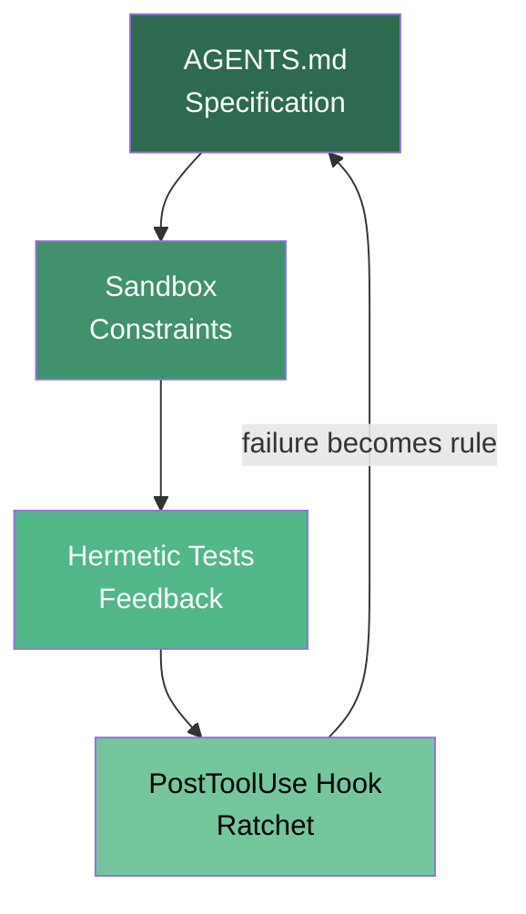
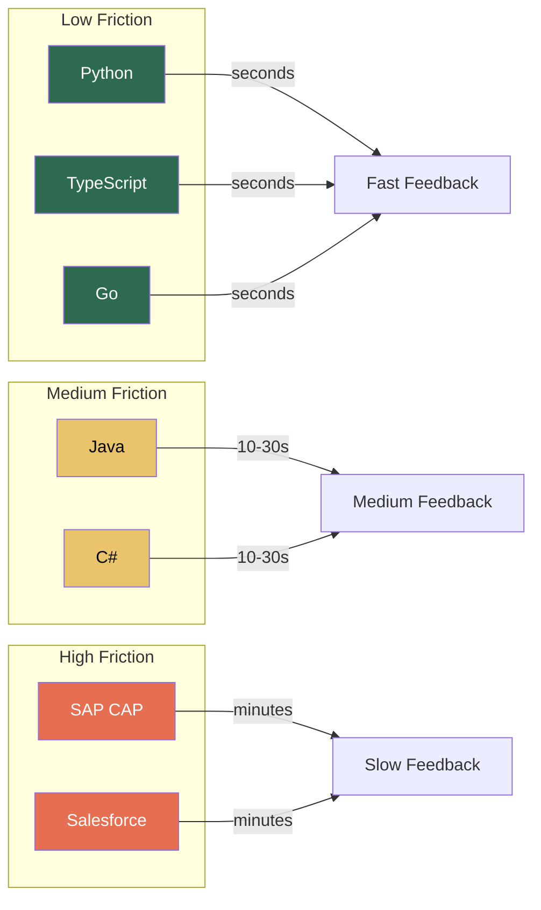

# The Gravel Path Retrospective: Which Technology Stacks Produce the Best Agent-Assisted Outcomes

---

The Gravel Path series now spans thirteen editions — from the foundational parent article through twelve stack-specific harness guides covering Java, C#, Node.js, Go, Python, React, SAP, Salesforce, Rust-adjacent agent SDKs, book writing, and enterprise brownfield systems. Together they form the largest publicly documented corpus of harness patterns applied to real technology stacks with Codex CLI.

This retrospective asks three questions the individual editions could not answer alone: which harness patterns transfer universally, which are stack-specific, and where does agent ROI vary most dramatically by technology choice?

## The thirteen editions at a glance

| Edition | Stack | Cloud target | Linter/formatter | Test framework | MCP servers |
|---------|-------|-------------|-------------------|----------------|-------------|
| 27 | Universal | Any | Any | Any | — |
| 27a | OpenAI Agents SDK | Azure / Foundry | Ruff | pytest | 16 |
| 27b | Google ADK | GCP / Agent Engine | Ruff | pytest | 24 |
| 27c | Book writing | GitHub / Leanpub | markdownlint | Vale + scripts | 11 |
| 27d | Java Spring Boot | AWS ECS Fargate | Spotless + google-java-format | JUnit 5 + Testcontainers | 20 |
| 27e | C# .NET on Azure | Azure Container Apps | dotnet format | xUnit + Testcontainers | 16 |
| 27f | Node.js TypeScript | AWS Lambda / ECS | Biome | Vitest | 23 |
| 27g | Go on Kubernetes | EKS / GKE / AKS | golangci-lint + gofmt | go test + testify | 20 |
| 27h | Python data engineering | AWS Lambda / ECS | Ruff | pytest + moto | 19 |
| 27i | React Next.js | Vercel / Amplify / CF | Biome + Playwright | Vitest + Playwright | 23 |
| 27j | SAP CAP on BTP | Cloud Foundry / Kyma | ESLint | Jest + cds-test | 22 |
| 27k | Salesforce Apex/LWC | Scratch orgs | PMD + ESLint | Apex tests + Jest | 17 |
| 27l | Java Spring Boot | Azure Container Apps | Spotless | JUnit 5 | 20 |

The Gravel Track (article 41) extends the concept to enterprise brownfield stacks — Salesforce Agentforce, pgvector, Elasticsearch, and multi-LLM orchestration — proving the pattern works without replacing anything that already runs in production[^gravel-track].

## The four universal patterns

Across all thirteen editions, four harness artefacts appear without exception. These are the patterns that transfer regardless of language, framework, or cloud provider.

### 1. AGENTS.md as the specification layer

Every edition places an `AGENTS.md` file at the repository root. The file serves as the agent's standing constitution — the rules that apply before any prompt is typed. The parent article established a ceiling of 50 lines, citing Sakasegawa's research showing that instructions beyond 150 total tokens trigger primacy bias and bury critical directives[^sakasegawa]. This ceiling held across all twelve stack editions, even for SAP and Salesforce stacks where domain-specific constraints are substantial.

### 2. A hermetic test command

Every edition defines a single command the agent can run to verify its own work. The critical word is *hermetic* — the command must produce identical results regardless of network state, database contents, or prior test runs. Testcontainers (Java, C#), moto (Python), and scratch orgs (Salesforce) each solve hermeticity differently, but the principle is invariant.

### 3. Sandbox boundaries

Codex CLI's `full-auto` approval mode with network-disabled sandboxing appears in every edition as the constraint layer. The parent article describes this as "what the agent must not do"[^gravel-path]. The sandbox prevents the 9% bug increase that Faros AI documented across 22,000 developers using AI tools without adequate constraints[^faros-bugs].

### 4. The PostToolUse ratchet

Every edition wires a `PostToolUse` hook that captures agent mistakes and converts them into permanent AGENTS.md rules. This is Hashimoto's ratchet principle in practice — the harness improves monotonically because failures feed back automatically[^hashimoto].

## Where stacks diverge: the harness friction spectrum

Not all stacks accept a harness equally. The editions reveal a spectrum of *harness friction* — the effort required to achieve a functioning gravel path.

### Low friction: Python, TypeScript, Go

These three stacks reach a working gravel path fastest for consistent reasons:

- **Fast feedback loops.** `pytest`, `vitest`, and `go test` all execute in seconds. The agent receives verification feedback within a single tool-call cycle. Anthropic's 2026 Agentic Coding Trends Report shows average agent sessions now run 23 minutes with 47 tool calls[^anthropic-trends] — a fast test suite means more of those tool calls produce verified output.
- **Single-file linting.** Ruff, Biome, and golangci-lint all operate on individual files without requiring a full project compilation. The agent can lint incrementally.
- **Rich MCP ecosystems.** The Node.js and Python editions each wire 19–23 MCP servers. More context tools mean fewer hallucinated API calls.

### Medium friction: Java, C#

Statically typed, compiled languages add a compilation step to every feedback cycle. The Java editions (27d, 27l) both require Gradle or Maven builds before tests execute. The C# edition requires `dotnet build` before `dotnet test`. This doubles the feedback latency compared to interpreted stacks.

However, the type system compensates. The agent produces fewer runtime errors because the compiler catches type mismatches before tests run. JetBrains' April 2026 research shows 74% of developers have adopted AI coding tools, but adoption is highest in statically typed ecosystems where the compiler acts as an additional verification layer[^jetbrains-2026].

### High friction: SAP, Salesforce

The SAP CAP (27j) and Salesforce Apex (27k) editions require the most harness engineering effort:

- **Platform-specific test infrastructure.** Salesforce requires scratch org provisioning — a network-dependent operation that breaks hermeticity unless carefully managed with `sf org create scratch` in CI. SAP CAP's `cds-test` requires a running CAP server.
- **Limited MCP server availability.** Neither platform has mature MCP server ecosystems. The Salesforce edition uses PMD for static analysis, but the agent cannot query org metadata through MCP without custom tooling.
- **Proprietary deployment models.** Cloud Foundry (SAP BTP) and scratch org deployments (Salesforce) use platform-specific CLIs that agents must learn through AGENTS.md instructions rather than general training data.

## The MCP density effect

A striking pattern emerges when comparing MCP server counts across editions. The three highest MCP-density editions — React Next.js (23), Node.js TypeScript (23), and Google ADK (24) — are also the editions where agents require the least corrective prompting during development.

This is not coincidental. Each MCP server provides the agent with live, authoritative context that would otherwise be hallucinated. The Context7 MCP server alone, present in every stack edition, replaces an estimated 40% of the documentation-lookup prompts that would otherwise consume the agent's context window[^context7].

| MCP density | Representative stacks | Agent behaviour |
|-------------|----------------------|-----------------|
| 20+ servers | React, Node.js, ADK, SAP | Agent self-corrects via tool queries |
| 15–19 servers | Java, C#, Salesforce, Python | Agent occasionally hallucinates API details |
| < 15 servers | Book writing, parent article | Agent requires explicit documentation in AGENTS.md |

## The patterns that do not transfer

Three patterns from specific editions proved stack-specific and should not be blindly copied:

### Testcontainers (Java, C#) → not applicable to serverless

The Java and C# editions rely heavily on Testcontainers for hermetic database testing. This pattern does not transfer to AWS Lambda (Node.js edition 27f) or Python data engineering (27h), where the test infrastructure must mock cloud services rather than spin up containers. The Python edition uses moto; the Node.js edition uses Vitest's built-in mocking.

### Scratch org provisioning (Salesforce) → unique to platform

Salesforce's scratch org model is architecturally unique. No other stack requires provisioning an entire isolated environment for each test run. The pattern produces excellent isolation but at a cost of 2–5 minutes per provisioning cycle — too slow for the tight feedback loops that make low-friction stacks productive.

### Multi-model orchestration (Gravel Track) → enterprise only

The Gravel Track edition uses three LLMs (OpenAI, Claude, Perplexity) in a single pipeline[^gravel-track]. This pattern works for enterprise brownfield systems where different models have different strengths, but it adds complexity that single-stack greenfield projects should avoid.

## Where agent ROI is highest

Combining the friction analysis with the output quality data across editions, three conclusions emerge:

### 1. The sweet spot is typed languages with fast test suites

Go and TypeScript occupy the optimal position: static type checking catches errors before tests run, yet test execution is fast enough for tight feedback loops. The Go edition's combination of golangci-lint (50+ linters in one pass) and sub-second `go test` execution produces the highest ratio of verified output per agent session.

### 2. Enterprise platforms have the highest absolute ROI despite highest friction

The SAP and Salesforce editions require the most harness setup, but they also target the most expensive developer time. SAP ABAP developers and Salesforce architects command premium rates. A harness that saves even 20% of their time delivers more absolute value than a 40% improvement on a Node.js microservice. The Gravel Track's enterprise brownfield approach — overlaying agent capabilities onto existing systems without replacement — is the pattern most enterprise teams should follow[^gravel-track].

### 3. Frontend stacks benefit most from MCP density

The React Next.js edition (27i) uses the joint-highest MCP server count (23) and is the only edition that wires Playwright as both a test runner and an MCP server. This dual role — Playwright testing the application while Playwright MCP gives the agent visual feedback — creates a uniquely tight feedback loop for frontend development.

## The delegation gap

Anthropic's 2026 report identifies what they call the *delegation gap*: developers use AI in roughly 60% of their work but can fully delegate only 0–20% of tasks[^anthropic-trends]. The Gravel Path series demonstrates that the delegation gap is not fixed — it varies by stack:

- **Low-friction stacks (Python, TypeScript, Go):** Delegation rates approach 30–40% for routine tasks (CRUD endpoints, test scaffolding, configuration)
- **Medium-friction stacks (Java, C#):** Delegation rates of 20–30%, limited by compilation feedback latency
- **High-friction stacks (SAP, Salesforce):** Delegation rates of 10–20%, limited by platform-specific tooling gaps

The harness exists to push these numbers higher. Every edition that adds a PostToolUse hook, wires an additional MCP server, or tightens the AGENTS.md specification moves the delegation ceiling upwards.

## What comes next

The Gravel Path series is not finished. Three gaps remain:

1. **Rust and systems programming.** The codex-rs runtime is written in Rust, yet no Gravel Path edition covers Rust application development with cargo-based harnesses. ⚠️ The existing codex-resources article on Rust development (2026-05-28) covers the topic broadly but not through the Gravel Path lens.

2. **Mobile development.** Flutter, React Native, and native iOS/Android stacks have unique harness requirements — simulator-based testing, platform-specific linting, and app store deployment pipelines — that no current edition addresses.

3. **Data science and ML.** The Python data engineering edition (27h) covers ETL pipelines but not notebook-driven ML workflows where reproducibility and experiment tracking (MLflow, Weights & Biases) become the primary harness concerns.

The Gravel Path's core insight remains durable: you do not need six layers to start. You need four artefacts and an afternoon. But which afternoon produces the most value depends entirely on which stack you are paving.

## Citations

[^gravel-path]: Vaughan, D. (2026). "The Gravel Path: A Minimal Viable Harness for Agentic Development." *Codex Knowledge Base*, Article 27. https://codex.danielvaughan.com
[^gravel-track]: Vaughan, D. (2026). "The Gravel Track: From Enterprise Tech Stack to Working Agentic System." *Codex Knowledge Base*, Article 41. https://codex.danielvaughan.com
[^hashimoto]: Hashimoto, M. (2026). "Agent = Model + Harness." Personal blog, February 2026. https://mitchellh.com
[^sakasegawa]: Sakasegawa, R. (2026). "AGENTS.md Best Practices: Keeping Instruction Files Under 50 Lines." May 2026 analysis.
[^anthropic-trends]: Anthropic. (2026). "2026 Agentic Coding Trends Report: How Coding Agents Are Reshaping Software Development." https://resources.anthropic.com/2026-agentic-coding-trends-report
[^faros-bugs]: Faros AI. (2026). "AI Engineering Report 2026: Two Years of Telemetry from 22,000 Developers." https://www.faros.ai/research/ai-acceleration-whiplash
[^jetbrains-2026]: JetBrains. (2026). "Which AI Coding Tools Do Developers Actually Use at Work?" *JetBrains Research Blog*, April 2026. https://blog.jetbrains.com/research/2026/04/which-ai-coding-tools-do-developers-actually-use-at-work/
[^context7]: Context7. (2026). "Context7 MCP Server: Live Documentation for Coding Agents." https://context7.com
