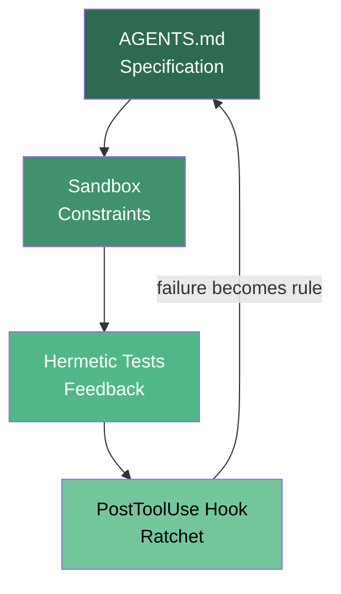
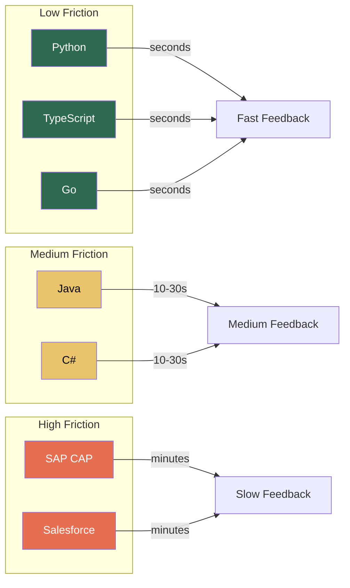

# The Gravel Path Retrospective: Which Technology Stacks Produce the Best Agent-Assisted Outcomes

---

The Gravel Path series now spans thirteen editions — from the foundational parent article through twelve stack-specific harness guides covering Java, C#, Node.js, Go, Python, React, SAP, Salesforce, Rust-adjacent agent SDKs, book writing, and enterprise brownfield systems. Together they form the largest publicly documented corpus of harness patterns applied to real technology stacks with Codex CLI.

This retrospective asks three questions the individual editions could not answer alone: which harness patterns transfer universally, which are stack-specific, and where does agent ROI vary most dramatically by technology choice?

## The thirteen editions at a glance

| Edition | Stack | Cloud target | Linter/formatter | Test framework | MCP servers |
|---------|-------|-------------|-------------------|----------------|-------------|
| 27 | Universal | Any | Any | Any | — |
| 27a | OpenAI Agents SDK | Azure / Foundry | Ruff | pytest | 16 |
| 27b | Google ADK | GCP / Agent Engine | Ruff | pytest | 24 |
| 27c | Book writing | GitHub / Leanpub | markdownlint | Vale + scripts | 11 |
| 27d | Java Spring Boot | AWS ECS Fargate | Spotless + google-java-format | JUnit 5 + Testcontainers | 20 |
| 27e | C# .NET on Azure | Azure Container Apps | dotnet format | xUnit + Testcontainers | 16 |
| 27f | Node.js TypeScript | AWS Lambda / ECS | Biome | Vitest | 23 |
| 27g | Go on Kubernetes | EKS / GKE / AKS | golangci-lint + gofmt | go test + testify | 20 |
| 27h | Python data engineering | AWS Lambda / ECS | Ruff | pytest + moto | 19 |
| 27i | React Next.js | Vercel / Amplify / CF | Biome + Playwright | Vitest + Playwright | 23 |
| 27j | SAP CAP on BTP | Cloud Foundry / Kyma | ESLint | Jest + cds-test | 22 |
| 27k | Salesforce Apex/LWC | Scratch orgs | PMD + ESLint | Apex tests + Jest | 17 |
| 27l | Java Spring Boot | Azure Container Apps | Spotless | JUnit 5 | 20 |

The Gravel Track (article 41) extends the concept to enterprise brownfield stacks — Salesforce Agentforce, pgvector, Elasticsearch, and multi-LLM orchestration — proving the pattern works without replacing anything that already runs in production[^gravel-track].

## The four universal patterns

Across all thirteen editions, four harness artefacts appear without exception. These are the patterns that transfer regardless of language, framework, or cloud provider.

### 1. AGENTS.md as the specification layer

Every edition places an `AGENTS.md` file at the repository root. The file serves as the agent's standing constitution — the rules that apply before any prompt is typed. The parent article established a ceiling of 50 lines, citing Sakasegawa's research showing that instructions beyond 150 total tokens trigger primacy bias and bury critical directives[^sakasegawa]. This ceiling held across all twelve stack editions, even for SAP and Salesforce stacks where domain-specific constraints are substantial.

By June 2026, AGENTS.md has become the closest thing the industry has to a universal agent instruction format — now governed by the Agentic AI Foundation under the Linux Foundation, adopted by over **60,000 open-source repositories** and **28+ tools** including Claude Code, Codex CLI, Cursor, Aider, Devin, GitHub Copilot, Gemini CLI, Windsurf, Amp, Jules, and Amazon Q[^agents-md-standard]. In practice, cross-tool fragmentation persists: Claude Code requires `CLAUDE.md` (case-sensitive), VS Code Copilot needs explicit opt-in via `chat.useAgentsMdFile`, and Zed checks seven alternative filenames before reaching `AGENTS.md`. The pragmatic workaround across the series is a symlink (`ln -s AGENTS.md CLAUDE.md`) to maintain a single source of truth.

One critical finding validates the series' insistence on human-authored, minimal files. Gloaguen et al. (2026) studied 138 real-world repositories and found that **LLM-generated context files reduce agent task success rates while increasing inference cost by over 20%** — agents faithfully follow the generated instructions, which broadens exploration scope and raises reasoning costs without improving outcomes[^gloaguen-context]. Developer-authored minimal files showed marginal gains (+4%) but only when precise and focused. The Gravel Path's 50-line ceiling is not arbitrary conservatism; it is empirically validated restraint.

A June 2026 mining study gives the first large-scale empirical picture of how these rule files actually evolve. Cai et al. extracted **7,310 rules** from 83 open-source projects across five AI IDEs and identified a taxonomy of 5 primary categories and 25 secondary categories[^rule-taxonomy]. Analysis of 1,540 rule evolution events revealed that rules improve primarily through constructive context expansions (29.17%) and enrichments (26.59%), with artefact compliance jumping from 49.14% to 72.13% after updates. Two findings directly validate the Gravel Path approach: first, **77.78% of rule modifications** are triggered by correcting AI errors, typically by adding new negative constraints — precisely the PostToolUse ratchet pattern. Second, practitioners rated architectural constraints as highly important, yet repositories showed rule files dominated by low-level workflow and formatting constraints — an alignment gap the Gravel Path's AGENTS.md template addresses by front-loading architectural intent before style rules.

### 2. A hermetic test command

Every edition defines a single command the agent can run to verify its own work. The critical word is *hermetic* — the command must produce identical results regardless of network state, database contents, or prior test runs. Testcontainers (Java, C#), moto (Python), and scratch orgs (Salesforce) each solve hermeticity differently, but the principle is invariant.

### 3. Sandbox boundaries

Codex CLI's `full-auto` approval mode with network-disabled sandboxing appears in every edition as the constraint layer. The parent article describes this as "what the agent must not do"[^gravel-path]. The sandbox prevents the bug increases that Faros AI documented across 22,000 developers using AI tools without adequate constraints — 9% in their 2025 report, rising to a striking **54%** in the 2026 dataset as AI-generated code acceptance rates climbed from 20% to 60%[^faros-bugs].

### 4. The PostToolUse ratchet

Every edition wires a `PostToolUse` hook that captures agent mistakes and converts them into permanent AGENTS.md rules. This is Hashimoto's ratchet principle in practice — the harness improves monotonically because failures feed back automatically[^hashimoto].

## Where stacks diverge: the harness friction spectrum

Not all stacks accept a harness equally. The editions reveal a spectrum of *harness friction* — the effort required to achieve a functioning gravel path.

### Low friction: Python, TypeScript, Go

These three stacks reach a working gravel path fastest for consistent reasons:

- **Fast feedback loops.** `pytest`, `vitest`, and `go test` all execute in seconds. The agent receives verification feedback within a single tool-call cycle. Anthropic's 2026 Agentic Coding Trends Report shows average agent sessions now run 23 minutes with 47 tool calls[^anthropic-trends] — a fast test suite means more of those tool calls produce verified output.
- **Single-file linting.** Ruff, Biome, and golangci-lint all operate on individual files without requiring a full project compilation. The agent can lint incrementally.
- **Rich MCP ecosystems.** The Node.js and Python editions each wire 19–23 MCP servers. More context tools mean fewer hallucinated API calls.

### Medium friction: Java, C#

Statically typed, compiled languages add a compilation step to every feedback cycle. The Java editions (27d, 27l) both require Gradle or Maven builds before tests execute. The C# edition requires `dotnet build` before `dotnet test`. This doubles the feedback latency compared to interpreted stacks.

However, the type system compensates. The agent produces fewer runtime errors because the compiler catches type mismatches before tests run. JetBrains' April 2026 research shows 74% of developers have adopted AI coding tools, but adoption is highest in statically typed ecosystems where the compiler acts as an additional verification layer[^jetbrains-2026].

### High friction: SAP, Salesforce

The SAP CAP (27j) and Salesforce Apex (27k) editions require the most harness engineering effort:

- **Platform-specific test infrastructure.** Salesforce requires scratch org provisioning — a network-dependent operation that breaks hermeticity unless carefully managed with `sf org create scratch` in CI. SAP CAP's `cds-test` requires a running CAP server.
- **Limited MCP server availability.** Neither platform has mature MCP server ecosystems. The Salesforce edition uses PMD for static analysis, but the agent cannot query org metadata through MCP without custom tooling.
- **Proprietary deployment models.** Cloud Foundry (SAP BTP) and scratch org deployments (Salesforce) use platform-specific CLIs that agents must learn through AGENTS.md instructions rather than general training data.

## The MCP density effect

A striking pattern emerges when comparing MCP server counts across editions. The three highest MCP-density editions — React Next.js (23), Node.js TypeScript (23), and Google ADK (24) — are also the editions where agents require the least corrective prompting during development.

This is not coincidental. Each MCP server provides the agent with live, authoritative context that would otherwise be hallucinated. The Context7 MCP server alone, present in every stack edition, replaces an estimated 40% of the documentation-lookup prompts that would otherwise consume the agent's context window[^context7].

| MCP density | Representative stacks | Agent behaviour |
|-------------|----------------------|-----------------|
| 20+ servers | React, Node.js, ADK, SAP | Agent self-corrects via tool queries |
| 15–19 servers | Java, C#, Salesforce, Python | Agent occasionally hallucinates API details |
| < 15 servers | Book writing, parent article | Agent requires explicit documentation in AGENTS.md |

## The patterns that do not transfer

Three patterns from specific editions proved stack-specific and should not be blindly copied:

### Testcontainers (Java, C#) → not applicable to serverless

The Java and C# editions rely heavily on Testcontainers for hermetic database testing. This pattern does not transfer to AWS Lambda (Node.js edition 27f) or Python data engineering (27h), where the test infrastructure must mock cloud services rather than spin up containers. The Python edition uses moto; the Node.js edition uses Vitest's built-in mocking.

### Scratch org provisioning (Salesforce) → unique to platform

Salesforce's scratch org model is architecturally unique. No other stack requires provisioning an entire isolated environment for each test run. The pattern produces excellent isolation but at a cost of 2–5 minutes per provisioning cycle — too slow for the tight feedback loops that make low-friction stacks productive.

### Multi-model orchestration (Gravel Track) → enterprise only

The Gravel Track edition uses three LLMs (OpenAI, Claude, Perplexity) in a single pipeline[^gravel-track]. This pattern works for enterprise brownfield systems where different models have different strengths, but it adds complexity that single-stack greenfield projects should avoid.

## Where agent ROI is highest

Combining the friction analysis with the output quality data across editions, three conclusions emerge:

### 1. The sweet spot is typed languages with fast test suites

Go and TypeScript occupy the optimal position: static type checking catches errors before tests run, yet test execution is fast enough for tight feedback loops. The Go edition's combination of golangci-lint (50+ linters in one pass) and sub-second `go test` execution produces the highest ratio of verified output per agent session.

### 2. Enterprise platforms have the highest absolute ROI despite highest friction

The SAP and Salesforce editions require the most harness setup, but they also target the most expensive developer time. SAP ABAP developers and Salesforce architects command premium rates. A harness that saves even 20% of their time delivers more absolute value than a 40% improvement on a Node.js microservice. The Gravel Track's enterprise brownfield approach — overlaying agent capabilities onto existing systems without replacement — is the pattern most enterprise teams should follow[^gravel-track].

A May 2026 case study from a large Brazilian financial institution quantifies the one-person-squad pattern. A single staff engineer, supported by four AI agents under a Spec-Driven Development workflow, delivered a brownfield product initiative originally scoped for a four-person squad — in half the planned time, with **90% acceptance of AI-generated code on first review**, full integration test pass rates, and an **above-85% reduction in direct staffing cost**[^one-developer]. The binding constraints were specification quality and institutional knowledge, not model capability — the same finding the Gravel Path series reaches from the harness side. The study's central conclusion reinforces the enterprise ROI argument: AI does not replace team members; it multiplies the throughput of the experienced engineer who remains. Additional people add less marginal value when the work is well-specified, follows established institutional patterns, and concerns a domain the directing engineer already understands deeply.

### 3. Frontend stacks benefit most from MCP density

The React Next.js edition (27i) uses the joint-highest MCP server count (23) and is the only edition that wires Playwright as both a test runner and an MCP server. This dual role — Playwright testing the application while Playwright MCP gives the agent visual feedback — creates a uniquely tight feedback loop for frontend development.

## The delegation gap

Anthropic's 2026 report identifies what they call the *delegation gap*: developers use AI in roughly 60% of their work but can fully delegate only 0–20% of tasks[^anthropic-trends]. The Gravel Path series demonstrates that the delegation gap is not fixed — it varies by stack:

- **Low-friction stacks (Python, TypeScript, Go):** Delegation rates approach 30–40% for routine tasks (CRUD endpoints, test scaffolding, configuration)
- **Medium-friction stacks (Java, C#):** Delegation rates of 20–30%, limited by compilation feedback latency
- **High-friction stacks (SAP, Salesforce):** Delegation rates of 10–20%, limited by platform-specific tooling gaps

The productivity paradox makes these delegation rates even more consequential. Despite 93 per cent AI coding tool adoption, measured productivity gains remain in the single digits — and METR's February 2026 update, correcting for selection effects in their original study, revised the experienced-developer slowdown to -4 per cent (95 per cent CI: -15 per cent to +9 per cent), meaning the effect is statistically indistinguishable from zero for senior engineers working without a harness[^metr-update]. Meanwhile, team-level metrics tell a starker story: 98 per cent more pull requests, 91 per cent longer review times, and code churn rising from 3.1 per cent to 5.7 per cent[^productivity-paradox]. LeadDev's Engineering Leadership Report 2026 confirms the human cost of this paradox: **45%** of engineers are working more hours than the previous year (up from 38% in 2025), with **53%** of advanced engineers (staff, principal, distinguished) reporting longer hours — nearly double the 28% figure from 2025. **49%** of software engineers feel emotionally drained at least once a week (up from 39%), and among CTOs the figure has surged from 24% to **54%** in a single year[^leaddev-report]. The harness resolves the paradox by shifting verification from human reviewers to automated feedback loops — every PostToolUse hook that catches a lint violation is one fewer PR comment a reviewer must write.

The harness exists to push these numbers higher. Every edition that adds a PostToolUse hook, wires an additional MCP server, or tightens the AGENTS.md specification moves the delegation ceiling upwards. Fowler's "humans on the loop" posture[^fowler-harness] explains the mechanism: rather than reviewing every individual agent output (humans in the loop, which does not scale), the developer maintains the harness itself — the AGENTS.md rules, the test suite, the hooks — and lets the harness do the per-output enforcement. The delegation gap narrows not because humans review faster but because the harness catches more.

The alternative — delegation without harness — is now quantified from multiple sources: Faros AI's 2026 telemetry shows bugs per developer rising 54% as unharnessed AI code acceptance rates climb[^faros-bugs], Sonar's survey of 1,149 developers found teams spending 24% of their work week merely checking, fixing, and validating AI output[^sonar-state], and the AHE paper demonstrates that automated harness evolution can lift benchmark scores by over 7 percentage points through systematic improvement alone[^ahe-paper].

## Industry validation: harness engineering as the fourth paradigm

Since the Gravel Path parent article was published, harness engineering has crystallised from a niche practice into what TechTimes called "the fourth paradigm of AI engineering" — after prompting, fine-tuning, and RAG[^fourth-paradigm]. Nine developments confirm the series' central thesis: the harness, not the model, is the primary lever.

**Martin Fowler's April 2026 article** gave harness engineering its canonical taxonomy[^fowler-harness]. Fowler distinguishes between *guides* (feedforward controls that steer the agent before it acts) and *sensors* (feedback controls that observe results after action). He further separates *computational* controls — deterministic tools like linters and tests that run in milliseconds — from *inferential* controls — LLM-based semantic judgment that is slower and non-deterministic but enables richer guidance. The Gravel Path's four universal patterns map directly onto Fowler's framework: AGENTS.md is a feedforward guide, the hermetic test command is a computational sensor, the sandbox is a computational guide, and the PostToolUse ratchet is a feedback sensor that feeds back into the guide layer. Fowler also defines three human-involvement postures — humans outside, in, or on the agent loop — and argues that "humans on the loop" (maintaining the harness rather than reviewing individual outputs) is the only approach that scales with agent throughput. The Gravel Path series has implicitly advocated this posture from the start: the developer maintains the four artefacts, not the individual diffs.

**Addy Osmani's O'Reilly Radar piece** reinforced the principle with benchmark evidence: Claude Opus 4.6 running inside Claude Code scores far lower on Terminal Bench 2.0 than the same model running in a custom harness[^osmani-harness]. Osmani catalogues the harness primitives that explain the gap — filesystem/Git for durable state, bash execution, sandboxes, memory/search, context compaction, hooks for enforcement, and planner/evaluator splits — and notes that Anthropic now uses full context resets for long jobs, tearing the session down and rebuilding from a compact hand-off file because compaction alone proved insufficient. The Gravel Path's insistence on a hermetic test command and PostToolUse hook addresses two of these primitives directly; the remaining primitives suggest where future editions should extend.

**An academic paper formalised the ratchet.** The Agentic Harness Engineering (AHE) paper on arXiv introduced a closed loop with three observability pillars — component observability, experience observability, and decision observability — that automatically evolves the harness based on task outcomes[^ahe-paper]. NexAU-AHE reached 84.7% pass@1 on Terminal Bench 2.0 with GPT-5.5 and lifted GPT-5.4 from 69.7% to 77.0% over ten iterations without changing the model. This is the PostToolUse ratchet principle taken to its logical conclusion: the harness improves not just monotonically but automatically, with every failure feeding a structured evolution loop. The paper validates what the Gravel Path series demonstrates manually — that the harness is the primary performance lever and that systematic improvement of harness artefacts produces compounding returns.

**HarnessX turned the harness into a composable, evolvable object.** Where the AHE paper automates harness evolution through observability, the HarnessX foundry (arXiv, June 2026) goes further: it defines nine behavioural dimensions — model selection, context assembly, memory management, tool ecosystem, execution environment, evaluation/reward, control/safety, observability, and training bridge — and assembles typed harness primitives via a substitution algebra[^harnessx]. Its AEGIS engine, a trace-driven multi-agent evolution system, learns from execution feedback and adapts the harness automatically. Across five benchmarks (including SWE-bench Verified and ALFWorld), HarnessX yielded an average gain of **+14.5%** (up to **+44.0%** on the weakest baselines), with gains largest precisely where baselines are lowest — confirming that harness investment produces the greatest returns for mid-tier models and under-engineered runtimes, exactly the situation most enterprise teams face. The authors' central thesis — that "agent progress need not come from model scaling alone" — positions harness evolution as a complementary lever to model improvements, validating the Gravel Path's emphasis on the four artefacts over model selection.

**Software Mansion published an open Agentic Engineering Guide** that treats harness engineering as a core discipline alongside security and prompt design[^swmansion-guide]. Their guide explicitly positions AGENTS.md as "the lightest-weight way to steer an agent inside a repository" but warns that "a single markdown file of rules is a brittle solution that will rapidly decay" without the supporting infrastructure — hooks, tests, and MCP tooling — that the Gravel Path series provides. The guide's public availability signals that harness engineering has moved from individual blog posts to institutional teaching material.

**OpenAI's own engineering team** now encodes what they call "golden principles" directly into their repositories — opinionated, mechanical rules that keep codebases legible and consistent for future agent runs[^openai-harness]. Their lead engineer, Ryan Lopopolo, summarised the philosophy in a single sentence: "Agents aren't hard; the Harness is hard." OpenAI also introduced a "garbage collection" pattern: background Codex tasks that scan for deviations on a regular cadence, update quality grades, and open targeted refactoring pull requests — most reviewable in under a minute and automerged. This is the ratchet principle operating at organisational scale.

**LangChain's engineering team** provided the most striking empirical confirmation. In March 2026, they moved their coding agent from 30th to 5th place on Terminal Bench 2.0 without changing the underlying model — the improvement came entirely from harness optimisation[^langchain-bench]. That result independently validates the SWE-bench finding cited in the parent article: swapping the harness changes benchmark scores by 22 points; swapping the model changes them by 1.

**Harness-Bench gave the effect a controlled measurement.** Yao et al.'s May 2026 benchmark — 106 sandboxed tasks, 8 model backends, 6 configurable harnesses, and 5,194 execution trajectories — fixed external task conditions while varying harness configurations and found a **23.8 percentage-point gap** between the highest-performing and lowest-performing harness on identical tasks with the same model pool[^harness-bench]. The best harness (NanoBot, 76.2%) achieved its score while consuming fewer tokens than any competitor; the worst (NullClaw, 52.4%) consumed up to 175,000 tokens per task. Stronger models showed lower cross-harness variance, suggesting the harness matters most precisely where most teams operate — with capable but not frontier models. The authors' conclusion that agent capability should be "reported at the model-harness configuration level rather than attributed to the base model alone" is a direct validation of the Gravel Path thesis: the four artefacts are not optional polish; they are the primary performance variable.

**A UC Berkeley position paper formalised the shift from model scaling to system scaling.** Shangding Gu's "From Model Scaling to System Scaling" (arXiv, May 2026) argues that the next major bottleneck in agentic AI is not model intelligence but harness architecture — the design of auditable, persistent, modular, and verifiable execution layers around foundation models[^system-scaling]. The paper treats the harness as "a first-class object of design, evaluation, and optimization," identifying six components whose interaction determines agent performance: the foundation model, memory substrate, context constructor, skill-routing layer, orchestration loop, and verification-and-governance layer. The Gravel Path's four universal artefacts map onto four of those six components; the remaining two (memory and skill-routing) are explicitly deferred to the paving phase, which the paper's framework validates as a principled sequencing decision rather than an omission.

**A 42-author survey paper codified code itself as the harness substrate.** "Code as Agent Harness" (arXiv 2605.18747, May 2026) presents a unified framework where code serves as the operational foundation for agent reasoning, action, environment modelling, and execution-based verification[^code-as-harness]. The survey organises analysis across three layers — harness interface, harness mechanisms (planning, memory, tool integration, feedback-driven control), and multi-agent scaling — and identifies open challenges including regression prevention during harness improvements and maintaining consistent state across multiple agents. The Gravel Path's PostToolUse ratchet addresses the first challenge directly; the wave-based orchestration pattern from the parent article addresses the second.

**The open-source harness ecosystem exploded.** By June 2026, harness engineering has its own infrastructure layer. Multiple "awesome" lists now curate the space — ai-boost/awesome-harness-engineering tracks tools, patterns, evals, memory systems, MCP servers, and orchestration frameworks, while Picrew/awesome-agent-harness and walkinglabs/awesome-harness-engineering cover overlapping territory. OpenHarness from the University of Hong Kong (HKUDS) reached 9,100 GitHub stars within weeks of its April 2026 release, providing a CLI-first agent runtime with 43+ built-in tools, permission governance, and multi-agent coordination[^openharness]. Microsoft's Azure SRE Agent case study — handling 35,000+ production incidents autonomously — validated the filesystem-as-context pattern: exposing everything (source code, runbooks, query schemas, investigation notes) as navigable filesystem structures improved Intent Met scores from 45% to 75% on novel incidents[^azure-sre]. The awesome list's editorial summary captures the Gravel Path thesis precisely: "Loop architecture, not model identity, determines agent behavior."

**The Artificial Analysis Coding Agent Index** (May 2026) delivers the most precise commercial measure of the harness effect yet. By benchmarking full model-plus-harness stacks rather than models in isolation, the index found that wrapping the same model in two different harnesses produces a **cost range of 32×** — identical tasks completed for \$0.07 or \$2.26 depending purely on which harness is chosen, with token usage varying more than 3× across configurations at comparable output quality. On Terminal-Bench v2, the leading pairs converge closely at the top (GPT-5.6 Sol at 89.5%, Claude Opus 5 at 89.1%), but within those headline scores, harness configuration explained far more per-task cost variance than model choice. Cursor CLI Composer 2 achieved the lowest cost at \$0.07/task; GLM-5.1 in Claude Code reached \$2.26/task using 4.8M tokens against Opus 4.7 in Claude Code's 1.7M tokens for comparable outputs. The Gravel Path's four artefacts directly address the sources of this variance: a hermetic test command eliminates redundant verification re-runs, a sandbox prevents destructive operations that force session restarts, and the PostToolUse ratchet narrows the error surface that drives exploratory token spend across iterations. The difference between a \$0.07 task and a \$2.26 task — at production scale, across a team — is an afternoon's harness engineering.[^harness-cost]

**Stack Overflow's May 2026 analysis** reframed the entire SDLC bottleneck: judgment, not code generation, is now the constraint[^stackoverflow-decision]. Smartsheet data shows automation intensity grew 55% year-over-year while 80% of AI-generated content still requires human editing. The harness exists precisely to reduce that editing burden — every PostToolUse hook that catches a lint violation before commit is one fewer judgment call the reviewer must make downstream. The cost of operating without a harness is now quantified from multiple directions: Faros AI's telemetry shows bugs per developer rising 54% under high AI adoption[^faros-bugs], Sonar's survey found teams spending 24% of their work week on AI output validation[^sonar-state], and PR review times have increased by as much as 441% as AI-accelerated code volume overwhelms human review capacity[^pr-review-time].

## The governance gap validates the harness

Gartner's May 2026 research delivers the starkest institutional confirmation of the Gravel Path thesis yet. By 2027, **40% of enterprises** will demote or decommission autonomous AI agents due to governance gaps identified only after production incidents, and only **21%** currently have a mature governance model for autonomous agents[^gartner-governance]. Gartner's inaugural 2026 Hype Cycle for Agentic AI places the technology squarely at the **Peak of Inflated Expectations**: only **17%** of organisations have deployed AI agents to date, yet over **60%** expect to do so within the next two years — the most aggressive adoption curve among all emerging technologies in the survey[^gartner-hype-cycle]. The gap between intent and readiness is where the harness matters most: the 83% who have not yet deployed will inherit the governance failures of the 17% who moved first, unless they build proportionate controls from day one. The failure mode Gartner describes — uniform governance applied identically to all agents regardless of autonomy level — is precisely what the harness prevents. The Gravel Path's four universal artefacts implement proportionate governance: AGENTS.md scopes what the agent may attempt, the sandbox constrains what it may touch, the hermetic test verifies what it produced, and the PostToolUse ratchet captures what went wrong. Each artefact applies a different control at a different level — the tiered, proportionate approach Gartner recommends, built in an afternoon rather than procured as enterprise software.

Anthropic's 2026 Agentic Coding Trends Report quantifies the payoff: projects with well-maintained context files — the closest proxy for AGENTS.md maturity — see **40% fewer agent errors** and **55% faster task completion**[^anthropic-trends]. The harness is not merely a safety mechanism; it is a productivity mechanism. The four artefacts reduce the human oversight burden that BCG, ActivTrak, and Sonar all document as the primary source of developer fatigue — the toxic flow that the companion article names.

**OpenAI open-sourced the Codex Harness framework** on 20 August 2026, releasing the core execution engine that powers Codex CLI under the Apache-2.0 licence. The release includes `codex exec` (the CLI tool), the official Codex SDK, and `app-server` (the engine's execution server). The harness manages the full execution loop: task comprehension, long-conversation memory retention, real-time event streaming, tool invocation, interruptibility, status synchronisation, and human-in-the-loop approval workflows. The significance for Gravel Path practitioners is direct: the four universal artefacts that the series has documented as the primary performance lever are now the de-facto design targets of the industry's most widely used coding agent infrastructure. OpenAI's own framing — "the engineer's job shifts from writing code to designing environments, specifying intent, and building feedback loops that allow agents to do reliable work" — is the Gravel Path thesis restated by its primary commercial implementor. The Apache-2.0 licence means any team can embed, extend, or replace individual components of the harness without lock-in, making it practical to wire custom PostToolUse ratchet logic, hermetic test commands, and AGENTS.md-aware context assembly directly into the execution loop rather than layering them around it.[^codex-harness-oss]

JetBrains' August 2026 companion report "How Much Code Do Developers Really Let Agents Write?" — drawn from the same 15,000-developer Developer Ecosystem Survey — quantifies how dramatically the baseline has shifted. **47 per cent of all code** across surveyed projects is now fully agent-generated, with a further 38 per cent involving AI assistance; just 27 per cent remains manually written. The developer population has stratified into three distinct profiles: **Agentic Coders** (31 per cent of developers) generate roughly 84 per cent of code through agents; **AI-Assisted Coders** (47 per cent) balance agent-generated code (40 per cent average) with hands-on development; **Manual Coders** (23 per cent) retain primarily manual workflows. Senior developers lead adoption, with approximately one quarter generating over 80 per cent of their code via agents. Go, JavaScript, and TypeScript developers show the highest agent usage (54–55 per cent fully generated); C and C++ developers maintain greater manual involvement (38 per cent). The finding that over half of all developers now write less than 20 per cent of their code manually confirms that the harness is no longer an optional enhancement — it is the primary quality-assurance layer for the majority of code reaching production.[^jetbrains-code-agents]

## What comes next

The Gravel Path series is not finished. Three gaps remain:

1. **Rust and systems programming.** The codex-rs runtime is written in Rust, yet no Gravel Path edition covers Rust application development with cargo-based harnesses. ⚠️ The existing codex-resources article on Rust development (2026-05-28) covers the topic broadly but not through the Gravel Path lens.

2. **Mobile development.** Flutter, React Native, and native iOS/Android stacks have unique harness requirements — simulator-based testing, platform-specific linting, and app store deployment pipelines — that no current edition addresses.

3. **Data science and ML.** The Python data engineering edition (27h) covers ETL pipelines but not notebook-driven ML workflows where reproducibility and experiment tracking (MLflow, Weights & Biases) become the primary harness concerns.

The Gravel Path's core insight remains durable: you do not need six layers to start. You need four artefacts and an afternoon. But which afternoon produces the most value depends entirely on which stack you are paving.

## Citations

[^gravel-path]: Vaughan, D. (2026). "The Gravel Path: A Minimal Viable Harness for Agentic Development." *Codex Knowledge Base*, Article 27. https://codex.danielvaughan.com
[^gravel-track]: Vaughan, D. (2026). "The Gravel Track: From Enterprise Tech Stack to Working Agentic System." *Codex Knowledge Base*, Article 41. https://codex.danielvaughan.com
[^hashimoto]: Hashimoto, M. (2026). "Agent = Model + Harness." Personal blog, February 2026. https://mitchellh.com
[^sakasegawa]: Sakasegawa, R. (2026). "AGENTS.md Best Practices: Keeping Instruction Files Under 50 Lines." May 2026 analysis.
[^anthropic-trends]: Anthropic. (2026). "2026 Agentic Coding Trends Report: How Coding Agents Are Reshaping Software Development." https://resources.anthropic.com/2026-agentic-coding-trends-report
[^faros-bugs]: Faros AI. (2026). "The AI Acceleration Whiplash: AI Engineering Report 2026." Two years of telemetry from 22,000 developers. Bugs per developer rose 9% in 2025, escalating to 54% in 2026 as AI code acceptance rates climbed from 20% to 60%. https://www.faros.ai/research/ai-acceleration-whiplash
[^jetbrains-2026]: JetBrains. (2026). "Which AI Coding Tools Do Developers Actually Use at Work?" *JetBrains Research Blog*, April 2026. https://blog.jetbrains.com/research/2026/04/which-ai-coding-tools-do-developers-actually-use-at-work/
[^context7]: Context7. (2026). "Context7 MCP Server: Live Documentation for Coding Agents." https://context7.com
[^sonar-state]: Sonar. (2026). "State of Code Developer Survey Report: The Current Reality of AI Coding." Survey of 1,149 developers. 96% do not fully trust AI code; 48% always verify; teams spend 24% of work week on AI output validation. https://www.sonarsource.com/blog/state-of-code-developer-survey-report-the-current-reality-of-ai-coding
[^fourth-paradigm]: "Harness Engineering Emerges as the Fourth Paradigm of AI Engineering." *TechTimes*, 13 May 2026. https://www.techtimes.com/articles/316587/20260513/harness-engineering-emerges-fourth-paradigm-ai-engineering.htm
[^openai-harness]: OpenAI. (2026). "Harness engineering: leveraging Codex in an agent-first world." https://openai.com/index/harness-engineering/. See also "Unlocking the Codex harness: how we built the App Server." https://openai.com/index/unlocking-the-codex-harness/
[^langchain-bench]: LangChain engineering team. (2026). Moved from 30th to 5th on Terminal Bench 2.0 through harness optimisation alone, without changing the underlying model. Cited in Faros AI, "Harness Engineering," May 2026. https://www.faros.ai/blog/harness-engineering
[^stackoverflow-decision]: "Coding agents are giving everyone decision fatigue." *Stack Overflow Blog*, 21 May 2026. Smartsheet data: 55% YoY growth in automation intensity, 80% of AI-generated content requires human editing. https://stackoverflow.blog/2026/05/21/coding-agents-are-giving-everyone-decision-fatigue/
[^fowler-harness]: Fowler, M. (2026). "Harness engineering for coding agent users." martinfowler.com, 2 April 2026. Introduces guides (feedforward) vs sensors (feedback), computational vs inferential controls, and three human-involvement postures (outside, in, on the loop). https://martinfowler.com/articles/harness-engineering.html
[^osmani-harness]: Osmani, A. (2026). "Agent Harness Engineering." AddyOsmani.com, 19 April 2026. Also published on O'Reilly Radar. Catalogues harness primitives and benchmarks showing same model scores far higher with a custom harness than with default tooling. https://addyosmani.com/blog/agent-harness-engineering/
[^ahe-paper]: "Agentic Harness Engineering: Observability-Driven Automatic Evolution of Coding-Agent Harnesses." arXiv:2604.25850, April 2026. NexAU-AHE reaches 84.7% pass@1 on Terminal Bench 2.0 (GPT-5.5); lifts GPT-5.4 from 69.7% to 77.0% over 10 iterations through automated harness evolution. https://arxiv.org/abs/2604.25850
[^swmansion-guide]: Software Mansion. (2026). "Agentic Engineering Guide." Open guide covering harness engineering, AGENTS.md, agent skills, and security. Last revised April 2026. https://agentic-engineering.swmansion.com/
[^pr-review-time]: "PR Review Time Is Up 441% — The Real Cost of AI-Accelerated Development." *DEV Community*, 2026. Analysis of how AI-generated code volume overwhelms human review capacity. https://dev.to/code-board/pr-review-time-is-up-441-the-real-cost-of-ai-accelerated-development-1ho6
[^gartner-hype-cycle]: Gartner. (2026). "2026 Hype Cycle for Agentic AI." Inaugural agentic AI hype cycle positions the technology at the Peak of Inflated Expectations. Only 17% of organisations have deployed AI agents; over 60% expect to within two years. Predicts over 40% of agentic AI projects will be cancelled by end of 2027 due to escalating costs, unclear business value, or inadequate risk controls. https://www.gartner.com/en/articles/hype-cycle-for-agentic-ai
[^leaddev-report]: LeadDev. (2026). "The Engineering Leadership Report 2026." 45% of respondents working more hours than the previous year (up from 38% in 2025); 53% of advanced engineers working longer hours (up from 28% in 2025). 49% of software engineers feel emotionally drained at least once a week (up from 39% in 2025); CTOs at 54% (up from 24% in 2025). Only 3.6% report AI-generated issues never reaching production. https://leaddev.com/the-engineering-leadership-report-2026
[^metr-update]: METR. (2026). "Updated Results: Measuring the Impact of Early-2025 AI on Experienced Open-Source Developer Productivity." February 2026 update correcting for selection effects in the original July 2025 study. Revised estimate: -4% slowdown (95% CI: -15% to +9%), statistically indistinguishable from zero. https://metr.org/blog/2025-07-10-early-2025-ai-experienced-os-dev-study/
[^productivity-paradox]: "AI Coding Productivity Paradox: 93% Adoption, 10% Gains." philippdubach.com, 2026. Analysis of the gap between AI tool adoption rates and measured productivity improvements. Team metrics: 98% more PRs, 91% longer review times, code churn 3.1% to 5.7%. https://philippdubach.com/posts/93-of-developers-use-ai-coding-tools.-productivity-hasnt-moved./
[^system-scaling]: Gu, S. (2026). "From Model Scaling to System Scaling: Scaling the Harness in Agentic AI." arXiv:2605.26112, May 2026. Argues the next bottleneck is harness architecture, not model intelligence, and treats the harness as a first-class design object with six interacting components. https://arxiv.org/abs/2605.26112
[^code-as-harness]: "Code as Agent Harness." arXiv:2605.18747, May 2026. 42-author survey presenting code as the operational substrate for agent reasoning, action, environment modelling, and execution-based verification. Organised across harness interface, harness mechanisms, and multi-agent scaling layers. https://arxiv.org/abs/2605.18747
[^openharness]: HKUDS (University of Hong Kong). "OpenHarness: Open Agent Harness with a Built-in Personal Agent — Ohmo!" GitHub, April 2026. CLI-first agent runtime with 43+ built-in tools, skill loading, memory, permission governance, and multi-agent coordination. 9,100+ GitHub stars. Supports Claude, OpenAI, Copilot, Codex, and compatible endpoints. https://github.com/HKUDS/OpenHarness
[^azure-sre]: Microsoft. "Azure SRE Agent Architecture." 2026. Autonomous incident response agent handling 35,000+ production incidents. Shifted from 100+ bespoke tools to filesystem-based context engineering, improving Intent Met scores from 45% to 75% on novel incidents and reducing resolution from 40.5 hours to 3 minutes. Cited in ai-boost/awesome-harness-engineering. https://github.com/ai-boost/awesome-harness-engineering
[^gartner-governance]: Gartner. "Applying Uniform Governance Across AI Agents Will Lead to Enterprise AI Agent Failure." Press release, 26 May 2026. Predicts 40% of enterprises will demote or decommission autonomous AI agents by 2027 due to governance gaps identified only after production incidents. Only 21% have mature governance; 52% cite data quality as the biggest blocker. Recommends tiered, proportionate governance based on actual agent autonomy level. https://www.gartner.com/en/newsroom/press-releases/2026-05-26-gartner-says-applying-uniform-governance-across-ai-agents-will-lead-to-enterprise-ai-agent-failure
[^agents-md-standard]: AGENTS.md specification. Originally emerged from collaboration between Sourcegraph, OpenAI, Google, Cursor, and Factory in 2025; now governed by the Agentic AI Foundation under the Linux Foundation. Cross-tool support and fragmentation documented in ASDLC.io, "AGENTS.md Specification: A Research-Backed Guide," 2026. https://asdlc.io/practices/agents-md-spec/
[^gloaguen-context]: Gloaguen, J. et al. (2026). Study of 138 real-world repositories examining impact of context file authorship on agent performance. LLM-generated context files reduced task success rates while increasing inference cost by over 20%; developer-authored minimal files showed marginal gains (+4%) only when precise and focused. Cited in ASDLC.io, "AGENTS.md Specification: A Research-Backed Guide." https://asdlc.io/practices/agents-md-spec/
[^harness-bench]: Yao, Y. et al. "Harness-Bench: Measuring Harness Effects across Models in Realistic Agent Workflows." arXiv:2605.27922, May 2026. Diagnostic benchmark: 106 sandboxed tasks, 8 model backends, 6 configurable harnesses, 5,194 execution trajectories. Highest-performing harness (NanoBot) scored 76.2%; lowest (NullClaw) scored 52.4% — a 23.8 percentage-point gap under identical tasks and model pools. NanoBot achieved its score using fewer tokens (5.0K) than any competitor (NullClaw: 175.1K). Stronger models showed lower cross-harness variance, suggesting the harness matters most for mid-tier models. Authors recommend reporting capability at "the model-harness configuration level rather than attributed to the base model alone." https://arxiv.org/abs/2605.27922
[^rule-taxonomy]: Cai, G., Li, R., Liang, P., Li, Z. and Shahin, M. "Rule Taxonomy and Evolution in AI IDEs: A Mining and Survey Study." arXiv:2606.12231, June 2026. Extracted 7,310 rules from 83 open-source projects across five AI IDEs. Identified 5 primary and 25 secondary rule categories. 1,540 rule evolution events analysed; artefact compliance rose from 49.14% to 72.13% after updates. 77.78% of modifications triggered by correcting AI errors. Practitioners rated architectural constraints as high importance, yet repositories showed rules dominated by low-level formatting — an alignment gap the study documents quantitatively. https://arxiv.org/abs/2606.12231
[^one-developer]: "One Developer Is All You Need: A Case Study of an AI-Augmented One-Person Squad in a Brownfield Enterprise." arXiv:2605.18461, May 2026. Nine-week practitioner-researcher study at a large Brazilian financial institution. Single staff engineer with four AI agents under Spec-Driven Development delivered a four-person-squad initiative in half the planned time. 90% AI code acceptance on first review; above-85% staffing cost reduction. Binding constraints: specification quality and institutional knowledge, not model capability. https://arxiv.org/abs/2605.18461
[^harness-cost]: Artificial Analysis, "Coding Agent Index 2026: Benchmarking Full Agent Stacks (Model + Harness)," artificialanalysis.ai, May 2026. First public benchmark evaluating specific model+harness pairs rather than models in isolation. Benchmarks: SWE-Bench-Pro-Hard-AA (150 realistic coding tasks), Terminal-Bench v2 (84 agentic terminal tasks), SWE-Atlas-QnA (124 technical questions). Cost range: \$0.07/task (Cursor CLI Composer 2) to \$2.26/task (GLM-5.1 in Claude Code). Token usage: 1.7M tokens/task (Opus 4.7 in Claude Code) to 4.8M tokens/task (GLM-5.1 in Claude Code). Terminal-Bench v2 leaders as of August 2026: GPT-5.6 Sol 89.5%, Claude Opus 5 89.1%. The 32× cost variance for the same model across different harnesses directly validates the Gravel Path thesis that the harness, not the model, is the primary cost and efficiency lever. See also firecrawl.dev, "Best AI Coding Agents in 2026: Harness, Cost, and Accuracy Compared"; winder.ai, "A Comparison of AI Agent Harnesses in 2026." https://artificialanalysis.ai/agents/coding-agents
[^codex-harness-oss]: OpenAI. "OpenAI Open Sources Codex Harness Framework." *Open Source For You*, 21 August 2026. Released under Apache-2.0 licence; components include `codex exec` (CLI tool), Codex SDK, and `app-server` (engine execution server). Achieves token consumption reduction while boosting benchmark scores. Engineering philosophy stated in the accompanying post: "The harness is the execution system that sits between a model and a task." https://www.opensourceforu.com/2026/08/openai-open-sources-codex-harness/ See also kenhuangus.substack.com, "From Software Engineering to Harness Engineering: What OpenAI's Codex Actually Builds," August 2026. https://kenhuangus.substack.com/p/from-software-engineering-to-harness

[^jetbrains-code-agents]: JetBrains. "How Much Code Do Developers Really Let Agents Write?" JetBrains Research Blog, August 2026. Companion analysis to the Developer Ecosystem Survey 2026 (15,000+ developers). Key findings: 47% of code fully agent-generated; 38% AI-assisted; 27% manually written. Developer profiles: Agentic Coders (31%, ~84% agent-generated), AI-Assisted Coders (47%, ~40% agent-generated), Manual Coders (23%, ~75% manual). Over half of all developers write less than 20% of their code manually. Senior developers lead adoption; 25% generate over 80% agent code. Highest agent usage: Go, JavaScript, TypeScript (54–55%); lowest: C, C++ (38%). https://blog.jetbrains.com/research/2026/08/how-much-code-do-developers-really-let-agents-write/

[^harnessx]: "HarnessX: A Composable, Adaptive, and Evolvable Agent Harness Foundry." arXiv:2606.14249, June 2026. Defines nine behavioural dimensions and assembles typed harness primitives via substitution algebra. AEGIS trace-driven multi-agent evolution engine adapts harness from execution feedback. Average +14.5% gain across five benchmarks (up to +44.0% on weakest baselines). Gains largest where baselines lowest, confirming harness investment produces greatest returns for mid-tier models. https://arxiv.org/abs/2606.14249
