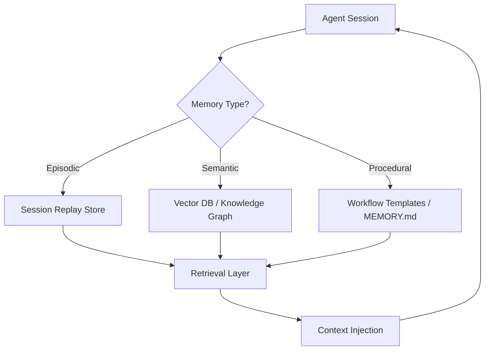
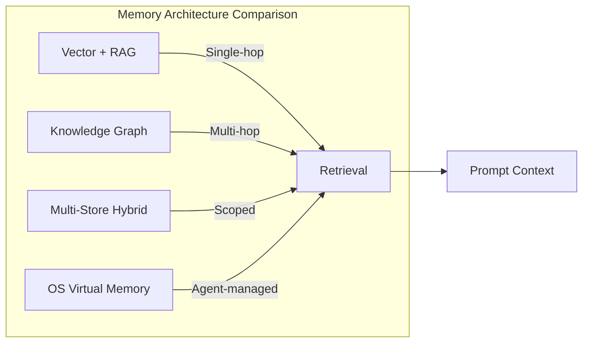
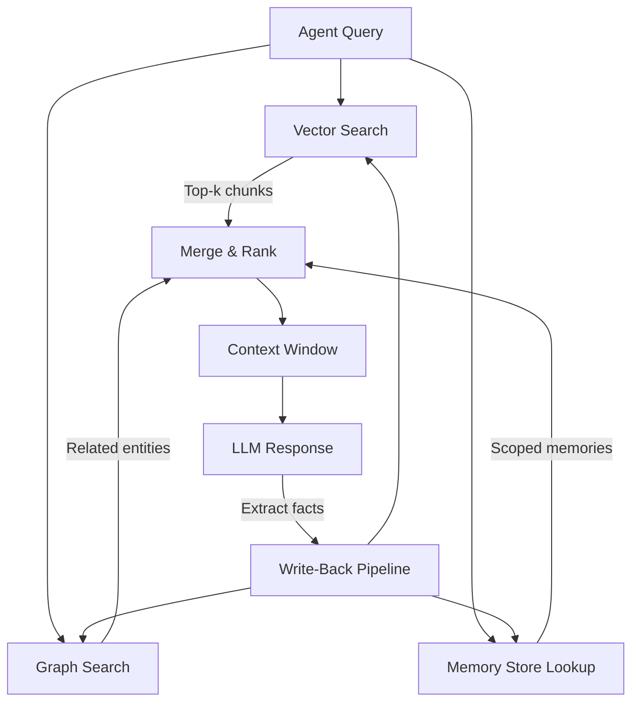

# Agent Memory Persistence Patterns: Long-Term Memory Stores, RAG for Agents, and Beyond Context Compaction


---

Context compaction keeps a single session alive when tokens run out. It does not, however, solve the harder problem: giving an agent durable knowledge that survives across sessions, machines, and teams. This article maps the persistence patterns that sit _above_ compaction — vector stores, knowledge graphs, multi-scope memory frameworks, and the MCP servers that wire them into Codex CLI.

## Why Compaction Is Not Memory

Codex CLI's compaction pipeline fires at two moments: before sending a new user message when accumulated tokens exceed a threshold, and during long tool-call chains at loop boundaries [^1]. The result is an encrypted `compact` blob that preserves latent understanding for the _current_ session. Once the session ends, that blob is gone.

Codex CLI v0.128 introduced a native Memories system to bridge this gap — a two-phase extraction-and-consolidation pipeline backed by SQLite (`~/.ctx-memory/store.db`) [^2]. When a thread has been idle for at least six hours (configurable via `min_rollout_idle_hours`), Codex spawns extraction jobs using `gpt-5.4-mini` to distil conversation into `raw_memory` and `rollout_summary`, which a consolidation agent later merges into `MEMORY.md` [^2]. In v0.135.0, memory runtime state migrated to a dedicated SQLite database [^3].

This is useful, but local-only. No cross-machine sync, no team sharing, no semantic retrieval beyond substring matching. Production agents need more.

## A Taxonomy of Agent Memory

Research from the ICLR 2026 MemAgents Workshop and production deployments converge on three memory types [^4]:

- **Episodic memory** — past reasoning traces and conversation history, used for replay and few-shot learning from prior sessions.
- **Semantic memory** — factual knowledge stored in vector embeddings or knowledge graph triples, retrieved by meaning rather than recency.
- **Procedural memory** — learned workflows, coding patterns, tool-use habits, and deployment steps the agent should apply consistently.

Each type demands a different storage backend and retrieval strategy.



## The Four Production Architectures

### 1. Vector Store + RAG

The baseline pattern. Conversation extracts are chunked, embedded, and stored in a vector database (Pinecone, Qdrant, Weaviate, pgvector). At query time, semantic search retrieves the top-_k_ chunks and injects them into the prompt.

**Strengths:** Simple to implement, good for single-hop factual recall.
**Weaknesses:** No relationship traversal, no temporal awareness, retrieval quality degrades as the store grows without careful chunking strategies [^5].

### 2. Knowledge Graph (Graphiti / Neo4j)

Graphiti, the temporal knowledge graph engine behind Zep, stores facts as nodes with start and end validity windows [^6]. Entity resolution tracks the same concept across unstructured conversation and structured business records. The MCP server (now at 1.0) exposes episode management, entity management, search, group management, and graph maintenance tools [^7].

On LongMemEval, Zep's Graphiti engine scores 15 points higher than competing solutions for temporal reasoning tasks [^8]. The architecture is peer-reviewed (arXiv 2501.13956) and cited at ICLR 2026 [^8].

**Strengths:** Multi-hop reasoning across entity relationships, temporal validity tracking, fact supersession.
**Weaknesses:** Higher operational complexity (requires Neo4j), extraction latency for real-time ingestion.

### 3. Multi-Store Hybrid (Mem0)

Mem0 combines three storage layers — vector search for semantic similarity, graph relationships for entity connections, and key-value storage for fast structured lookups — with a four-scope memory model: `user_id`, `agent_id`, `run_id`, `app_id`, plus an optional `org_id` [^9]. Rather than storing raw conversation chunks, Mem0 runs an extraction phase that distils salient facts into compact natural-language memories.

With 48,000+ GitHub stars and a \$24M Series A, Mem0 is the largest standalone agent memory community [^9]. AWS selected it as the exclusive memory provider in the AWS Agent SDK [^10].

**Strengths:** Framework-agnostic (LangChain, CrewAI, AutoGen, custom loops), managed cloud option, multi-scope scoping.
**Weaknesses:** Graph features locked to Pro tier (\$249/month), cloud dependency for full feature set.

### 4. OS-Level Virtual Memory (Letta / MemGPT)

Letta, the production evolution of the MemGPT research project, treats LLM context like an operating system manages virtual memory [^11]. Agents move information between three tiers:

- **Core memory** — always in-context, analogous to registers.
- **Archival memory** — external searchable store, analogous to disk.
- **Recall memory** — conversation history with pagination.

The agent _itself_ decides what to keep close, what to archive, and what to search — no external orchestration needed [^11].

**Strengths:** Deepest agent autonomy over memory management, pluggable backends.
**Weaknesses:** Highest evaluation complexity, tightly coupled to Letta's agent loop.



## Wiring Memory into Codex CLI via MCP

Codex CLI reads MCP server configuration from `~/.codex/config.toml` [^12]. Each memory backend can be added as an MCP server, giving Codex tools like `search_memories`, `add_memory`, and `add_episode` without modifying the agent loop.

### Mem0 MCP Server

```toml
[mcp_servers.mem0]
url = "https://mcp.mem0.ai/mcp"
bearer_token_env_var = "MEM0_API_KEY"
```

Mem0's MCP delivery moved to the Mem0 Plugin for AI Editors in early 2026, shipping nine MCP tools with lifecycle hooks [^13]. Memories are extracted automatically — no explicit save commands required.

### Graphiti MCP Server

```toml
[mcp_servers.graphiti]
command = "uvx"
args = ["graphiti-mcp-server"]
```

The Graphiti MCP server exposes pre-configured entity types, group management, and temporal search. It requires a running Neo4j instance and can be configured to use either Zep Cloud or a self-hosted Graphiti deployment [^7].

### BasicMemory

```bash
codex mcp add basic-memory bash -c "uvx basic-memory mcp"
```

BasicMemory stores knowledge as plain Markdown files on disk — human-readable, version-controllable, and searchable via MCP tools [^14]. It suits developers who want memory they can `git push`.

## Multi-Scope Memory Design

The critical architectural decision is scoping. A memory write should be tagged with one or more identity scopes [^4]:

| Scope | Persists across | Example |
|-------|----------------|---------|
| `user_id` | All sessions for one user | "Daniel prefers British English" |
| `agent_id` | All users for one agent | "This agent uses pytest, not unittest" |
| `run_id` | One execution only | "Current PR is #347" |
| `org_id` | All agents in an organisation | "Production DB is on port 5433" |

Without scoping, agents accumulate contradictory memories from different users or projects. With it, retrieval narrows to the relevant context automatically.

## The Hybrid Production Stack

The 2026 consensus architecture layers all three retrieval mechanisms [^5]:

1. **Vector search** identifies the most relevant documents and entity entry-points.
2. **Graph traversal** follows relationship edges from those entry-points to gather connected context.
3. **Memory retrieval** injects session-specific and user-specific context from scoped stores.



This is the "write path" argument from Lanham's 2026 analysis: agents need not just a retriever but also a structured write-back pipeline that extracts facts, resolves entities, and updates all three stores after every interaction [^15].

## Choosing a Pattern

| Criterion | Vector + RAG | Graphiti | Mem0 | Letta |
|-----------|-------------|---------|------|-------|
| Setup complexity | Low | High | Medium | High |
| Multi-hop reasoning | No | Yes | Partial (Pro) | Yes |
| Temporal awareness | No | Yes | No | No |
| Cross-agent sharing | Manual | Via groups | Via org scope | Via server |
| Codex CLI integration | Custom MCP | MCP 1.0 | MCP (9 tools) | Custom |
| Self-hosted option | Yes | Yes | OSS core | Yes |
| Cloud managed | Varies | Zep Cloud | Mem0 Platform | Letta Cloud |

For most Codex CLI workflows, **Mem0 via MCP** provides the best balance of simplicity and capability. For workflows requiring temporal reasoning or multi-hop entity traversal — compliance agents, long-running project assistants — **Graphiti** justifies the operational overhead. **Letta** suits teams building custom agent platforms where memory management is a core differentiator rather than a bolted-on feature.

## What Codex CLI's Native Memories Miss

Codex CLI's built-in Memories system handles the common case well: single-developer, single-machine, session-to-session continuity. But three gaps remain:

1. **No cross-machine sync** — `~/.codex/memories/` is local. A second laptop or CI container starts with a blank slate [^2].
2. **No semantic retrieval** — memories are injected wholesale or by recency, not by semantic relevance to the current query.
3. **No team sharing** — there is no mechanism to share learned patterns across a team's Codex instances.

Plugging an MCP memory server alongside native Memories creates a layered architecture: native Memories for Codex-specific session persistence, MCP for cross-agent, cross-machine, team-shared knowledge [^2].

## Conclusion

Context compaction keeps sessions alive. Memory persistence makes agents _learn_. The pattern you choose — vector RAG, temporal knowledge graphs, multi-store hybrids, or OS-level virtual memory — depends on whether your agent needs single-hop recall, multi-hop reasoning, temporal awareness, or full autonomy over its own memory management. In every case, MCP provides the integration seam that lets Codex CLI consume these systems without architectural lock-in.

---

## Citations

[^1]: Simon Zhou, "Investigating how Codex context compaction works", simzhou.com, 2026. [https://simzhou.com/en/posts/2026/how-codex-compacts-context/](https://simzhou.com/en/posts/2026/how-codex-compacts-context/)

[^2]: Daniel Vaughan, "Codex CLI Memories: Native Session Persistence, Third-Party Memory MCP Servers, and Cross-Session Context Strategies", codex.danielvaughan.com, 1 May 2026. [https://codex.danielvaughan.com/2026/05/01/codex-cli-memories-persistent-context-session-memory-ecosystem/](https://codex.danielvaughan.com/2026/05/01/codex-cli-memories-persistent-context-session-memory-ecosystem/)

[^3]: OpenAI, "Codex CLI Changelog", developers.openai.com, 2026. [https://developers.openai.com/codex/changelog](https://developers.openai.com/codex/changelog)

[^4]: Mem0, "State of AI Agent Memory 2026: Benchmarks, Architectures & Production Gaps", mem0.ai, 2026. [https://mem0.ai/blog/state-of-ai-agent-memory-2026](https://mem0.ai/blog/state-of-ai-agent-memory-2026)

[^5]: SparkCo, "RAG vs Vector Stores vs Graph-Based Approaches", sparkco.ai, 2026. [https://sparkco.ai/blog/ai-agent-memory-in-2026-comparing-rag-vector-stores-and-graph-based-approaches](https://sparkco.ai/blog/ai-agent-memory-in-2026-comparing-rag-vector-stores-and-graph-based-approaches)

[^6]: Neo4j, "Graphiti: Knowledge Graph Memory for an Agentic World", neo4j.com, 2026. [https://neo4j.com/blog/developer/graphiti-knowledge-graph-memory/](https://neo4j.com/blog/developer/graphiti-knowledge-graph-memory/)

[^7]: Zep, "Knowledge Graph MCP Server", help.getzep.com, 2026. [https://help.getzep.com/graphiti/getting-started/mcp-server](https://help.getzep.com/graphiti/getting-started/mcp-server)

[^8]: WeavAI, "Zep 2026 Review: AI Agent Temporal Memory King", weavai.app, 9 May 2026. [https://weavai.app/blog/en/2026/05/09/zep-2026-review-ai-agent-temporal-memory-king/](https://weavai.app/blog/en/2026/05/09/zep-2026-review-ai-agent-temporal-memory-king/)

[^9]: WeavAI, "Mem0 Review 2026: AI Agent Memory King, +26% Accuracy", weavai.app, 9 May 2026. [https://weavai.app/blog/en/2026/05/09/mem0-review-2026-ai-agent-memory-king-26-accuracy/](https://weavai.app/blog/en/2026/05/09/mem0-review-2026-ai-agent-memory-king-26-accuracy/)

[^10]: AgentMarketCap, "Agent Memory at Scale 2026: Letta, Zep, Mem0, and LangMem Compared", agentmarketcap.ai, 10 April 2026. [https://agentmarketcap.ai/blog/2026/04/10/agent-memory-vendor-landscape-2026-letta-zep-mem0-langmem](https://agentmarketcap.ai/blog/2026/04/10/agent-memory-vendor-landscape-2026-letta-zep-mem0-langmem)

[^11]: Vectorize, "Mem0 vs Letta (MemGPT): AI Agent Memory Compared (2026)", vectorize.io, 2026. [https://vectorize.io/articles/mem0-vs-letta](https://vectorize.io/articles/mem0-vs-letta)

[^12]: OpenAI, "Model Context Protocol — Codex", developers.openai.com, 2026. [https://developers.openai.com/codex/mcp](https://developers.openai.com/codex/mcp)

[^13]: Mem0, "Codex + Mem0 MCP: Build a Coding Agent That Remembers Your Codebase", mem0.ai, 2026. [https://mem0.ai/blog/codex-mem0-mcp-build-a-coding-agent-that-remembers-your-codebase](https://mem0.ai/blog/codex-mem0-mcp-build-a-coding-agent-that-remembers-your-codebase)

[^14]: BasicMemory, "Add Memory to OpenAI Codex — Persistent Development", docs.basicmemory.com, 2026. [https://docs.basicmemory.com/integrations/codex](https://docs.basicmemory.com/integrations/codex)

[^15]: Micheal Lanham, "Knowledge and Memory Beyond RAG: Why 2026 Agents Need a Write Path, Not Just a Retriever", Medium, April 2026. [https://medium.com/@Micheal-Lanham/knowledge-and-memory-beyond-rag-why-2026-agents-need-a-write-path-not-just-a-retriever-ae2547b7ffe9](https://medium.com/@Micheal-Lanham/knowledge-and-memory-beyond-rag-why-2026-agents-need-a-write-path-not-just-a-retriever-ae2547b7ffe9)
