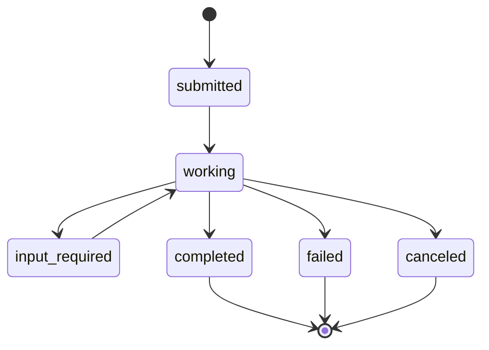
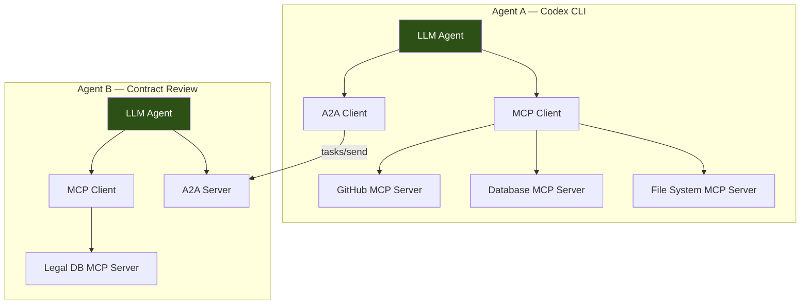
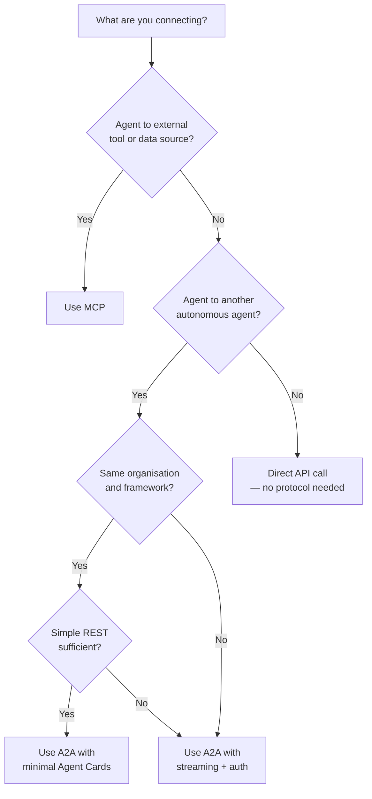

# Agent-to-Agent Communication Protocols: A2A vs ACP vs MCP Compared


The agentic AI stack in 2026 runs on three protocol acronyms — MCP, A2A, and ACP — yet most teams still treat them as interchangeable buzzwords. They are not. Each protocol targets a different layer of the communication stack, and understanding where one ends and the next begins is the difference between a clean architecture and a tangle of shims. This article maps the landscape, examines how ACP's merger into A2A reshaped the field, and shows how Codex CLI practitioners can wire these protocols into production workflows.

## The Three Protocols at a Glance

| Aspect | MCP | A2A | ACP |
|--------|-----|-----|-----|
| **Purpose** | Agent-to-tool connectivity | Agent-to-agent collaboration | Agent communication (merged into A2A) |
| **Created by** | Anthropic (Nov 2024) | Google (Apr 2025) | IBM Research (2025) |
| **Current status** | Active — spec 2025-11-25 [^1] | Active — v1.0 (early 2026) [^2] | Merged into A2A (Aug 2025) [^3] |
| **Transport** | JSON-RPC over Streamable HTTP | JSON-RPC 2.0 over HTTPS + SSE | REST/HTTP (historical) |
| **Governance** | Linux Foundation (Dec 2025) [^1] | Linux Foundation (Jun 2025) [^2] | N/A |

The shorthand: **MCP connects agents to tools; A2A connects agents to agents.** ACP no longer exists as a standalone specification.

## MCP: The Tool Connectivity Layer

Anthropic's Model Context Protocol acts as a universal adapter between an LLM-powered agent and external systems — databases, APIs, SaaS platforms, file systems [^4]. Think of it as USB-C for AI tooling.

### Core Primitives

MCP servers expose three primitive types to clients:

- **Tools** — callable functions with typed input/output schemas
- **Resources** — read-only data endpoints (files, database rows, API responses)
- **Prompts** — reusable prompt templates with arguments

Clients expose three primitives back to servers:

- **Sampling** — server-initiated LLM inference requests (now with tool use support as of spec 2025-11-25) [^5]
- **Roots** — workspace root URIs the client has access to
- **Elicitation** — structured data collection from the human user [^5]

### Transport

The current spec mandates Streamable HTTP as the recommended remote transport, replacing the earlier SSE-based approach [^1]. Local servers still use stdio, where the host process launches the MCP server as a child process communicating via stdin/stdout.

### MCP in Codex CLI

Codex CLI configures MCP servers in `config.toml`:

```toml
# ~/.codex/config.toml — global MCP server
[mcp_servers.github]
type = "url"
url = "https://api.githubcopilot.com/mcp/"
headers = { Authorization = "Bearer ${GITHUB_TOKEN}" }

[mcp_servers.filesystem]
type = "command"
command = ["npx", "-y", "@anthropic/mcp-filesystem-server", "/home/dev/project"]
```

The `codex mcp` CLI subcommand manages server lifecycle, and project-scoped servers can be defined in `.codex/config.toml` for trusted projects [^6].

### Scale Considerations

The 2026 roadmap acknowledges production gaps: horizontal scaling behind load balancers, stateless operation patterns, enterprise-managed auth with SSO integration, and audit trail observability [^7]. These are being addressed but are not yet in the stable spec.

## A2A: The Agent Collaboration Layer

Google's Agent-to-Agent Protocol solves a fundamentally different problem: how do autonomous agents — potentially built by different vendors, running in different organisations — discover each other, delegate tasks, and exchange results? [^2]

### Agent Cards

Every A2A server publishes a JSON document at `/.well-known/agent.json` describing its capabilities:

```json
{
  "name": "contract-review-agent",
  "description": "Reviews legal contracts for compliance issues",
  "skills": [
    {
      "id": "contract-review",
      "description": "Analyse contract clauses against regulatory requirements",
      "inputModes": ["text/plain", "application/pdf"],
      "outputModes": ["text/markdown"]
    }
  ],
  "authentication": {
    "schemes": ["bearer"]
  },
  "supportsStreaming": true
}
```

Agent Cards enable automated discovery: a client agent can crawl a registry of known endpoints, read their cards, and decide which remote agent is best suited for a subtask [^8].

### Task Lifecycle

Tasks are the unit of work in A2A. They follow a defined state machine:



The `input_required` state is particularly important — it preserves human-in-the-loop workflows across agent boundaries, allowing a remote agent to pause and request clarification from the calling agent or its human operator [^8].

### Transport

A2A uses JSON-RPC 2.0 over HTTPS with Server-Sent Events for streaming [^2]. The primary methods are:

- `tasks/send` — non-streaming request
- `tasks/sendSubscribe` — streaming with event subscriptions
- `tasks/get` — state polling
- `tasks/cancel` — task termination

Choosing HTTP as the transport was deliberate: it slots into existing enterprise infrastructure — load balancers, firewalls, mTLS termination, and OpenTelemetry instrumentation — without requiring custom networking [^8].

### Adoption

As of April 2026, over 150 organisations support A2A, including Google, Microsoft, AWS, Salesforce, SAP, ServiceNow, Workday, and IBM [^2]. Native A2A support ships in Google ADK, LangGraph, CrewAI, LlamaIndex Agents, Semantic Kernel, and AutoGen [^2].

## ACP: A Protocol Absorbed

IBM Research launched the Agent Communication Protocol in 2025 as a lightweight, REST-native alternative to A2A. ACP prioritised simplicity: plain HTTP verbs, minimal ceremony, and fast adoption for teams already running REST microservices [^3].

### Why It Merged

Maintaining two agent-to-agent standards created unnecessary fragmentation. In September 2025, IBM announced that ACP would officially merge into A2A under the Linux Foundation [^3]. Kate Blair, IBM's Director of Incubation overseeing ACP, joined the A2A Technical Steering Committee, and the ACP team began contributing technology directly to A2A [^3].

This was not abandonment — ACP's best ideas (REST simplicity, lightweight messaging patterns) are folded into A2A's roadmap. Migration documentation was provided for existing ACP users [^3].

### Practical Impact

If you built on ACP, the migration path is straightforward: replace ACP endpoints with A2A task methods, convert your service manifest to an Agent Card, and adopt JSON-RPC 2.0 transport. The conceptual model — agents as opaque services with discoverable capabilities — remains identical.

## The Layered Architecture

In production, these protocols are complementary, not competing. A well-architected agent system uses both:



Each agent is both an **MCP client** (accessing its own tools) and an **A2A client or server** (collaborating with peer agents). This mirrors traditional enterprise service design: individual services manage their own data stores (MCP) while communicating with peers through a shared protocol (A2A) [^9].

### Bridging MCP and A2A

An emerging pattern is the **A2A-MCP bridge**: an MCP server that wraps an A2A client, exposing remote agents as callable tools within the MCP tool registry. From the LLM's perspective, invoking a remote agent looks identical to calling a local tool:

```toml
# Expose a remote A2A agent as an MCP tool
[mcp_servers.contract_reviewer]
type = "command"
command = ["a2a-mcp-bridge", "--agent-url", "https://legal.internal/.well-known/agent.json"]
```

This pattern lets Codex CLI orchestrate multi-agent workflows without requiring native A2A support in the CLI itself [^9].

## Protocol Selection Decision Tree



## What About ANP?

The Agent Network Protocol (ANP) targets a fourth layer: cross-network agent discovery across the open internet, using DID-based identity and verifiable credentials [^10]. It remains early-stage and is not yet production-relevant for most teams, but it is worth monitoring as the protocol stack matures.

## Practical Recommendations for Codex CLI Users

1. **Start with MCP.** Every Codex CLI workflow benefits from MCP server integration. Configure your essential tools (GitHub, databases, documentation) as MCP servers first.

2. **Add A2A when you need agent delegation.** If your workflow requires handing subtasks to specialist agents — code review, security scanning, contract analysis — adopt A2A for that communication layer.

3. **Use the bridge pattern.** Wrap A2A agents as MCP tools to keep Codex CLI as the single orchestration point. This avoids protocol complexity leaking into your agent prompts.

4. **Ignore ACP.** If you encounter ACP references in older documentation, treat them as historical. Migrate to A2A.

5. **Watch the MCP 2026 roadmap.** Enterprise features (audit trails, SSO-integrated auth, stateless scaling) are coming but not yet stable [^7]. Plan accordingly.

## Citations

[^1]: "MCP Specification 2025-11-25", Model Context Protocol, [modelcontextprotocol.io/specification/2025-11-25](https://modelcontextprotocol.io/specification/2025-11-25)

[^2]: "A2A Protocol Explained: How Google's Agent-to-Agent Standard Grew to 150+ Organizations in One Year", Stellagent, 2026, [stellagent.ai/insights/a2a-protocol-google-agent-to-agent](https://stellagent.ai/insights/a2a-protocol-google-agent-to-agent)

[^3]: "ACP Joins Forces with A2A", Linux Foundation AI & Data, August 2025, [lfaidata.foundation/communityblog/2025/08/29/acp-joins-forces-with-a2a](https://lfaidata.foundation/communityblog/2025/08/29/acp-joins-forces-with-a2a-under-the-linux-foundations-lf-ai-data/)

[^4]: "Model Context Protocol", Wikipedia, [en.wikipedia.org/wiki/Model_Context_Protocol](https://en.wikipedia.org/wiki/Model_Context_Protocol)

[^5]: "MCP 2025-11-25 is here: async Tasks, better OAuth, extensions, and a smoother agentic future", WorkOS, [workos.com/blog/mcp-2025-11-25-spec-update](https://workos.com/blog/mcp-2025-11-25-spec-update)

[^6]: "Model Context Protocol — Codex CLI", OpenAI Developers, [developers.openai.com/codex/mcp](https://developers.openai.com/codex/mcp)

[^7]: "MCP's biggest growing pains for production use will soon be solved", The New Stack, 2026, [thenewstack.io/model-context-protocol-roadmap-2026](https://thenewstack.io/model-context-protocol-roadmap-2026/)

[^8]: "Google's A2A Protocol — The Complete Agent-to-Agent Guide", Rapid Claw, 2026, [rapidclaw.dev/blog/a2a-protocol-complete-guide-2026](https://rapidclaw.dev/blog/a2a-protocol-complete-guide-2026)

[^9]: "MCP vs A2A vs ACP: The 2026 Guide to AI Agent Communication Protocols", OptInAmPout, 2026, [optinampout.com/blogs/mcp-vs-a2a-vs-acp-agent-protocols-2026](https://optinampout.com/blogs/mcp-vs-a2a-vs-acp-agent-protocols-2026)

[^10]: "Agentic AI Protocols Comparison: MCP vs A2A vs ACP vs ANP", K21 Academy, [k21academy.com/agentic-ai/agentic-ai-protocols-comparison](https://k21academy.com/agentic-ai/agentic-ai-protocols-comparison/)
