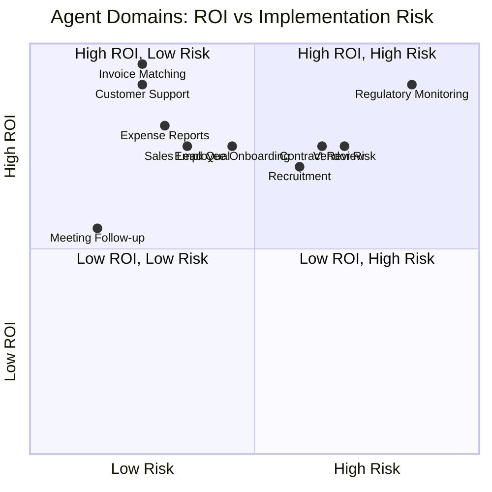
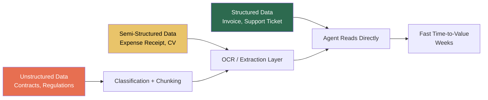

# Business Agents ROI Retrospective: Comparing Agent Outcomes Across Ten Enterprise Domains


---

## Introduction

Over the course of ten articles (numbers 44–53 in this knowledge base), we built business agents covering employee onboarding, invoice matching, customer support triage, contract review, expense report processing, vendor risk assessment, recruitment screening, sales lead qualification, meeting follow-up automation, and regulatory change monitoring. Each followed the same methodology: map the process in BPMN, write a SPEC.md, generate working OpenAI Agents SDK code with Codex CLI, and define an evaluation suite.

This retrospective steps back from individual implementations to answer the question that matters: **which domains deliver the highest return, the fastest time-to-value, and the lowest implementation risk?**

The timing is relevant. By mid-2026, 54 per cent of enterprises are running AI agents in production[^ibl], and 80 per cent of those deployments report measurable ROI[^ibl]. The average return stands at 3.5× within 12–18 months, with US enterprises reporting 192 per cent ROI from agentic AI[^onereach]. But these figures conceal enormous variance across domains. Understanding where agents excel and where they struggle is the difference between a successful deployment and an abandoned pilot.

## The Ten Domains Ranked

The table below ranks each domain across five dimensions, scored 1–5 from the series findings and cross-referenced against 2026 industry benchmarks.

| # | Domain | ROI Potential | Time-to-Value | Implementation Risk | Data Readiness | Regulatory Burden | Overall |
|---|--------|--------------|---------------|--------------------|----|---|----|
| 1 | Invoice Matching (AP) | 5 | 5 | 2 | 5 | 2 | **4.6** |
| 2 | Customer Support Triage | 5 | 5 | 2 | 4 | 2 | **4.4** |
| 3 | Expense Report Processing | 4 | 5 | 2 | 4 | 3 | **4.2** |
| 4 | Meeting Follow-up Automation | 3 | 5 | 1 | 5 | 1 | **4.0** |
| 5 | Employee Onboarding | 4 | 3 | 3 | 3 | 3 | **3.6** |
| 6 | Sales Lead Qualification | 4 | 4 | 2 | 3 | 2 | **3.6** |
| 7 | Recruitment Screening | 4 | 3 | 4 | 3 | 4 | **3.2** |
| 8 | Contract Review | 4 | 2 | 4 | 3 | 4 | **3.0** |
| 9 | Vendor Risk Assessment | 4 | 2 | 4 | 2 | 5 | **2.8** |
| 10 | Regulatory Change Monitoring | 5 | 2 | 5 | 2 | 5 | **2.6** |

Higher "Overall" is better. Regulatory Burden is scored inversely — 5 means the heaviest compliance overhead.

## Tier Analysis

### Tier 1 — High ROI, Fast Deployment (Score ≥ 4.0)

**Invoice Matching, Customer Support Triage, Expense Report Processing, Meeting Follow-up.**

These four domains share a critical characteristic: the input data is structured or semi-structured, the process follows a predictable sequence, and the cost of the current manual approach is well-quantified. Invoice matching alone costs \$12–\$30 per invoice manually, dropping to under \$2 with agent-assisted processing[^beancount]. At 5,000 invoices per month, a mid-sized company saves \$50,000–\$140,000 per year in direct labour costs.

Customer support triage delivers similarly clear returns. Salesforce reports 66 per cent of service organisations now run AI agents, up from 39 per cent in 2025[^salesforce]. Companies investing in AI customer service see average returns of \$3.50 for every \$1 spent[^digitalapplied]. The key enabler is that support tickets arrive as text, map cleanly to intent classification, and route through a finite decision tree — precisely the pattern the Agents SDK's handoff mechanism was designed for.

Meeting follow-up scores high on time-to-value and low on risk despite modest ROI because the process is entirely internal, the failure mode is benign (a missed action item, not a compliance violation), and the data — meeting transcripts — requires no integration with regulated systems.



### Tier 2 — High ROI, Moderate Complexity (Score 3.0–3.9)

**Employee Onboarding, Sales Lead Qualification, Recruitment Screening, Contract Review.**

These domains offer strong ROI but require cross-system integration or human-in-the-loop workflows that extend time-to-value. Employee onboarding crosses four organisational boundaries (HR, IT, hiring manager, new hire), and a failed first-year hire costs approximately \$14,900[^enboarder]. The agent reduces coordination overhead but cannot eliminate the human touchpoints entirely.

Recruitment screening is the domain where bias risk is highest. HR departments using AI agents reduce interview coordination time by 34 per cent[^digitalapplied], and Unilever reports \$1M+ annual savings with 75 per cent time-to-hire reduction[^masterofcode]. But the EU AI Act classifies employment-related AI as high-risk, requiring conformity assessments, transparency obligations, and human oversight[^euaiact]. Implementation risk is not technical — it is regulatory.

Contract review delivers high value per unit (a single missed liability clause can cost millions) but requires domain-specific fine-tuning. The 2026 industry consensus is that AI contract review works well for standard clause extraction and deviation flagging but still requires lawyer oversight for novel provisions[^gartner].

### Tier 3 — High Potential, High Risk (Score < 3.0)

**Vendor Risk Assessment, Regulatory Change Monitoring.**

These two domains present a paradox: the ROI ceiling is the highest of all ten (a single missed sanctions hit can trigger fines exceeding \$10M; a single missed regulatory change can trigger a failed audit), but the implementation risk is also the highest.

Vendor risk assessment requires integration with sanctions databases, financial data providers, and certification registries — external systems with varying data quality and availability. Only 13 per cent of companies have reached optimised maturity in third-party risk management[^ey]. The agent is powerful but depends on data infrastructure that most organisations have not built.

Regulatory change monitoring operates on unstructured, multi-jurisdictional text with nuanced interpretation requirements. The European Banking Authority alone published over 400 regulatory outputs in 2025[^fintech]. The agent can triage and classify at scale, but the compliance team must still validate every material assessment. This is the domain where the gap between "useful tool" and "autonomous agent" is widest.

## Cross-Cutting Patterns

### Pattern 1: Data readiness determines time-to-value

Across all ten domains, the single strongest predictor of fast deployment was not process complexity — it was whether the input data already existed in a structured, accessible format. Invoice data lives in ERP systems with well-defined schemas. Meeting transcripts are plain text. Regulatory feeds are RSS or API-based. Vendor documentation, by contrast, arrives as PDFs, spreadsheets, and email attachments with no consistent structure.



### Pattern 2: The human-in-the-loop spectrum

Not all human oversight is equal. The series revealed three distinct patterns:

- **Review-on-exception**: The agent processes autonomously and escalates only anomalies. Invoice matching and expense processing use this pattern. Human effort drops 70–90 per cent.
- **Review-before-action**: The agent prepares a recommendation; a human approves before execution. Vendor risk and contract review use this pattern. Human effort drops 40–60 per cent.
- **Continuous oversight**: The agent assists but a human remains in the loop for every decision. Regulatory monitoring uses this pattern. Human effort drops 20–40 per cent.

The ROI of each domain correlates directly with where it falls on this spectrum. Review-on-exception domains deliver the highest returns because the agent replaces, rather than merely assists, the manual workflow.

### Pattern 3: The Agents SDK's handoff model suits triage domains best

The OpenAI Agents SDK's core abstraction — an `Agent` with `handoff` targets — maps most naturally to domains with clear routing logic[^agentssdk]. Customer support triage (classify intent → route to specialist), invoice matching (receive → match → escalate or approve), and expense processing (scan → validate → route for approval) all decompose into a pipeline of specialist agents connected by handoffs.

Domains like contract review and regulatory monitoring, where the task is less "route to the right handler" and more "deeply analyse a single complex document," benefit less from handoffs and more from tool-augmented single agents with large context windows. The April 2026 Agents SDK update added hosted tool support and improved guardrail chaining, which helps these domains[^agentssdk_update], but the fundamental architectural mismatch remains.

### Pattern 4: Compliance burden is non-linear

The regulatory overhead of agent deployment is not proportional to the domain's own regulatory complexity. Expense processing (lightly regulated, internal) requires minimal compliance work. Recruitment screening (heavily regulated under the EU AI Act) requires conformity assessments, impact documentation, and ongoing monitoring that can exceed the cost of building the agent itself[^euaiact]. The lesson: budget for compliance as a first-class workstream, not an afterthought.

## Recommendations

Based on the retrospective, here is a prioritised deployment sequence for organisations beginning their business agent journey:

1. **Start with invoice matching or expense processing.** Highest ROI, lowest risk, fastest feedback loop. These build organisational confidence in agent deployment.

2. **Add customer support triage second.** External-facing but well-understood, with clear metrics (resolution rate, CSAT, cost per ticket) that demonstrate value to leadership.

3. **Deploy meeting follow-up as a quick win.** Low stakes, high visibility, builds internal familiarity with agent workflows without compliance overhead.

4. **Tackle recruitment and onboarding together.** Both are HR domains; shared data infrastructure reduces marginal deployment cost. Budget explicitly for bias testing and EU AI Act compliance.

5. **Reserve contract review and vendor risk for mature programmes.** These domains require established data pipelines, legal sign-off, and sophisticated evaluation suites. They reward organisations that have already built agent deployment muscle.

6. **Approach regulatory monitoring last.** The highest ceiling but the longest path. Consider hybrid approaches: agent-assisted triage with human-validated impact assessment.

```mermaid
gantt
    title Recommended Deployment Sequence
    dateFormat  YYYY-Q
    axisFormat  %Y-Q%q
    section Tier 1
    Invoice Matching / Expenses  :a1, 2026-Q3, 90d
    Customer Support Triage      :a2, after a1, 60d
    Meeting Follow-up            :a3, 2026-Q3, 45d
    section Tier 2
    Recruitment + Onboarding     :b1, after a2, 120d
    Sales Lead Qualification     :b2, after a2, 90d
    section Tier 3
    Contract Review              :c1, after b1, 120d
    Vendor Risk Assessment       :c2, after b1, 150d
    Regulatory Monitoring        :c3, after c1, 180d
```

## What the Industry Data Confirms

The series findings align with broader 2026 enterprise data. Finance and operations agents (including invoice matching and expense processing) pay back in 8.9 months on average[^onereach]. SDR agents (analogous to our sales lead qualification) pay back in 3.4 months[^onereach]. Customer support remains the domain with the clearest, most quantifiable ROI metrics: tickets answered, resolution rate, CSAT, cost per resolution[^fin].

The cautionary data also aligns. MIT found that 95 per cent of AI pilots deliver zero measurable P&L impact[^terminal_x]. IBM puts the number of initiatives delivering expected ROI at 25 per cent[^terminal_x]. The enterprises that succeed are those that built measurement infrastructure before deploying the technology — precisely the evaluation-first approach the series advocates with `codex exec` test suites and BPMN-derived acceptance criteria.

## Conclusion

Not all business agent domains are created equal. The ten domains in this series span a 1.8× range in overall deployment attractiveness (4.6 for invoice matching versus 2.6 for regulatory monitoring). The pattern is consistent: agents deliver the fastest, highest-confidence ROI in domains with structured data, predictable processes, quantifiable baselines, and review-on-exception human oversight. They deliver the highest potential ROI — but with the longest runway and highest risk — in domains with unstructured data, regulatory complexity, and continuous-oversight requirements.

The practical implication is sequencing. Start where the data is ready, the process is predictable, and the cost of the manual approach is already measured. Build deployment muscle. Then tackle the domains where agents can transform, rather than merely automate, the work.

---

## Citations

[^ibl]: "From Chatbots to Agents: Why 80% of Enterprise AI Deployments Now Show Measurable ROI," *IBL.AI*, May 2026. [https://ibl.ai/blog/enterprise-ai-agents-roi-2026](https://ibl.ai/blog/enterprise-ai-agents-roi-2026)

[^onereach]: "Agentic AI Stats 2026: Adoption Rates, ROI, & Market Trends," *OneReach.ai*, 2026. [https://onereach.ai/blog/agentic-ai-adoption-rates-roi-market-trends/](https://onereach.ai/blog/agentic-ai-adoption-rates-roi-market-trends/)

[^beancount]: Invoice processing cost and error rate data referenced in *Building an Invoice Matching Agent* (Article 45), sourced from BeanCount AP benchmarks, 2025.

[^salesforce]: Salesforce State of Service, 6th edition, 2026. Cited via "AI Customer Support 2026: 50+ Adoption + ROI Data Points," *Digital Applied*, 2026. [https://www.digitalapplied.com/blog/ai-customer-support-statistics-2026-adoption-roi-data](https://www.digitalapplied.com/blog/ai-customer-support-statistics-2026-adoption-roi-data)

[^digitalapplied]: "AI Agent Adoption 2026: 120+ Enterprise Data Points," *Digital Applied*, 2026. [https://www.digitalapplied.com/blog/ai-agent-adoption-2026-enterprise-data-points](https://www.digitalapplied.com/blog/ai-agent-adoption-2026-enterprise-data-points)

[^enboarder]: First-year hire failure cost data referenced in *Building an Employee Onboarding Agent* (Article 44), sourced from Enboarder/First HR research, 2025.

[^masterofcode]: "150+ AI Agent Statistics [2026]," *Master of Code*, 2026. [https://masterofcode.com/blog/ai-agent-statistics](https://masterofcode.com/blog/ai-agent-statistics)

[^euaiact]: EU Artificial Intelligence Act, Article 6 and Annex III — high-risk classification for employment, workers management, and access to self-employment. In force from August 2025.

[^gartner]: Gartner projects 40% of enterprise applications will embed task-specific AI agents by end of 2026. Cited via "Agentic AI Risk Management: Enterprise Guide 2026," *The JADA Squad*, 2026. [https://www.jadasquad.com/blog/agentic-ai-risk-management](https://www.jadasquad.com/blog/agentic-ai-risk-management)

[^ey]: EY Third-Party Risk Management maturity survey, 2025. Referenced in *Building a Vendor Risk Assessment Agent* (Article 49).

[^fintech]: European Banking Authority and ESMA publication volumes. Referenced in *Building a Regulatory Change Monitoring Agent* (Article 53).

[^agentssdk]: "The next evolution of the Agents SDK," *OpenAI*, April 2026. [https://openai.com/index/the-next-evolution-of-the-agents-sdk/](https://openai.com/index/the-next-evolution-of-the-agents-sdk/)

[^agentssdk_update]: "OpenAI updates its Agents SDK to help enterprises build safer, more capable agents," *TechCrunch*, 15 April 2026. [https://techcrunch.com/2026/04/15/openai-updates-its-agents-sdk-to-help-enterprises-build-safer-more-capable-agents/](https://techcrunch.com/2026/04/15/openai-updates-its-agents-sdk-to-help-enterprises-build-safer-more-capable-agents/)

[^terminal_x]: "AI ROI in 2026: Why Enterprise AI Fails & Works," *Terminal X*, 2026. [https://www.terminal-x.ai/research/ai-roi-in-2026-why-most-enterprise-ai-fails-and-what-actually-works](https://www.terminal-x.ai/research/ai-roi-in-2026-why-most-enterprise-ai-fails-and-what-actually-works)

[^fin]: "ROI of AI Customer Service: 2026 Benchmarks & Data," *Fin.ai*, 2026. [https://fin.ai/learn/roi-ai-customer-service-agents-benchmarks](https://fin.ai/learn/roi-ai-customer-service-agents-benchmarks)
