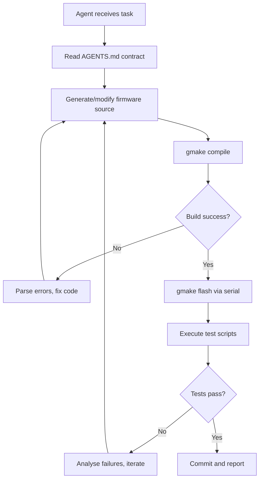
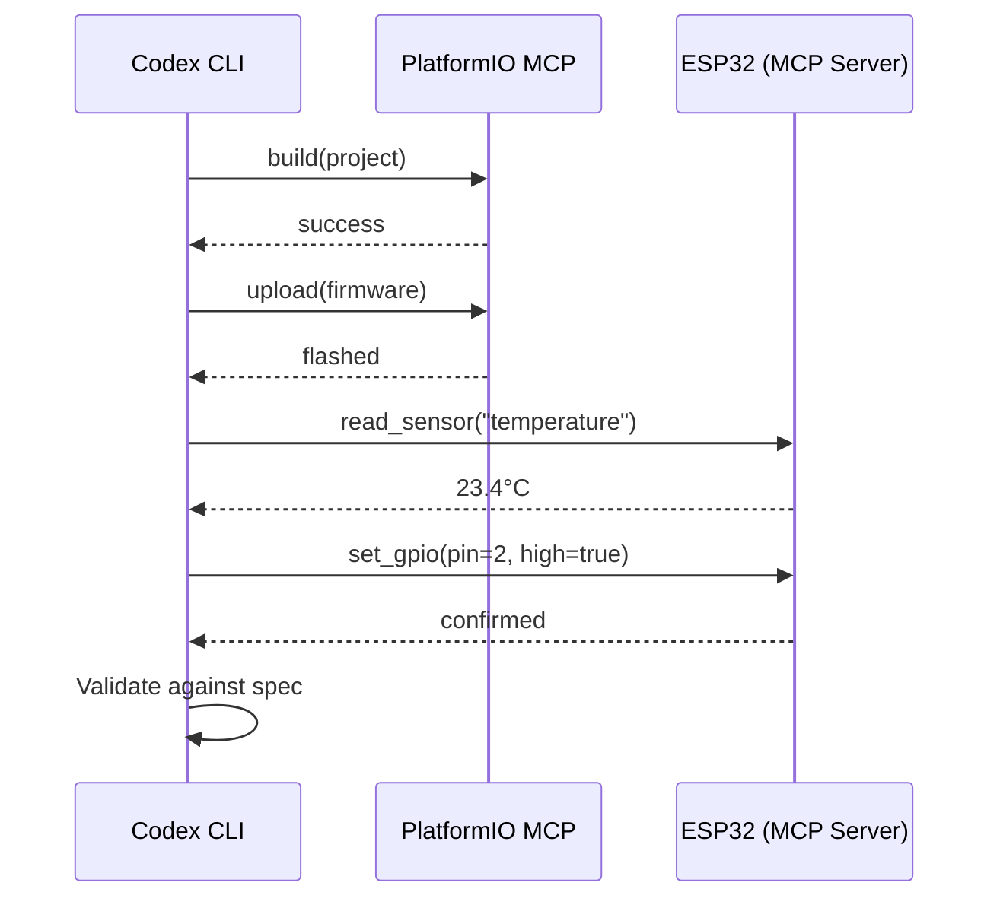

# Codex CLI for Embedded Systems: Arduino, ESP32, Raspberry Pi Pico, and Constrained-Environment Agent Workflows


---

## Introduction

Embedded development has historically resisted the agentic coding revolution. Memory-constrained targets, cross-compilation toolchains, binary flashing, and hardware-in-the-loop (HIL) testing all conspire against the "edit-save-run" loop that CLI agents excel at. Yet in 2026, a convergence of MCP servers, sandbox configuration options, and community-built skills has made Codex CLI a genuine contender for firmware development across Arduino, ESP32, and Raspberry Pi Pico targets.

This article maps the practical architecture: how to configure Codex CLI's sandbox for serial port access, which MCP servers bridge the gap to hardware, and what a fully autonomous build-flash-test loop looks like on real silicon.

---

## The Fundamental Challenge: Sandbox vs. Hardware

Codex CLI's default sandbox isolates the agent from the host network and filesystem beyond the workspace[^1]. For embedded work, this creates three specific problems:

1. **Serial port access** — flashing firmware requires `/dev/ttyUSB0` or equivalent
2. **Toolchain binaries** — `avr-gcc`, `xtensa-esp32-elf-gcc`, and `arm-none-eabi-gcc` live outside the workspace
3. **Network for OTA** — over-the-air updates need outbound connectivity to the device

The solution is to run Codex CLI in **full-access mode** for hardware-in-the-loop sessions, granting unrestricted filesystem and network access[^1]. For teams that prefer tighter controls, the `suggest` approval mode combined with explicit path allowlists provides a middle ground — the agent proposes flash commands and waits for human confirmation before executing.

```toml
# codex.toml — embedded development profile
[profile.embedded]
model = "o4-mini"
approval_mode = "suggest"
sandbox = "none"
```

---

## PlatformIO MCP Server: The Agent-First Hardware Layer

The **PlatformIO MCP Server v2**, launched May 2026[^2], is the single most important integration for embedded agent workflows. It exposes PlatformIO's entire workflow — board discovery, project initialisation, compilation, flashing, serial monitoring, and diagnostics — as structured MCP tools.

### Key Capabilities

| Tool | Description |
|------|-------------|
| `board_discovery` | Enumerates connected boards with FQBN and port |
| `project_init` | Scaffolds a PlatformIO project for a target board |
| `build` | Compiles with structured error categorisation |
| `upload` | Flashes firmware with safety policy checks |
| `monitor` | Streams serial output as structured data |
| `diagnostics` | GPIO safety audits informed by board specs |

### Safety Policies

PlatformIO MCP classifies operations into `allow`, `deny`, and `requires_approval`[^3]. Risky actions — firmware uploads, device resets, GPIO reconfiguration — demand explicit authorisation. Four built-in policy profiles govern this:

- `read_only` — build and inspect only
- `build_only` — compilation without flash
- `flash_requires_approval` — human gate before upload
- `lab_admin` — full autonomous access

```json
{
  "mcpServers": {
    "platformio": {
      "command": "npx",
      "args": ["-y", "platformio-mcp"],
      "env": {
        "PIO_POLICY": "flash_requires_approval"
      }
    }
  }
}
```

### The Web Dashboard

PlatformIO MCP v2 ships a web dashboard styled after PIO Home, providing real-time visibility into agent operations: build progress, serial logs, and historical operation records[^2]. This is invaluable for debugging autonomous firmware iterations without monitoring the terminal directly.

---

## Espressif Documentation MCP Server

Espressif released their official Documentation MCP Server in April 2026[^4], providing AI agents with semantic search across ESP-IDF documentation, technical reference manuals, datasheets, and design guidelines. The server exposes a single tool:

```
search_espressif_sources(query, language)
```

This eliminates a common failure mode where agents hallucinate register addresses or peripheral configurations. With the MCP server active, Codex CLI grounds its ESP32 code generation in verified official documentation rather than training data[^4].

Configuration for Codex CLI (the server is a remote service, not a local process):

```json
{
  "mcpServers": {
    "espressif-docs": {
      "command": "npx",
      "args": ["-y", "mcp-remote", "https://mcp.espressif.com/docs"]
    }
  }
}
```

Authentication is handled via browser-based OAuth (GitHub or WeChat account) rather than API tokens. Rate limits apply: 40 requests/hour, 200/day per authenticated user[^4].

---

## Hardware-in-the-Loop: The Autonomous Build-Flash-Test Cycle

The most compelling embedded workflow with Codex CLI is fully autonomous hardware-in-the-loop development. A practical implementation demonstrated on an ATmega2560 with ModBus RS485[^5] shows the pattern:



### The AGENTS.md Contract for Embedded

The `AGENTS.md` file becomes critical in embedded contexts. It must specify hardware constraints that the agent cannot infer from code alone[^5]:

```markdown
## Hardware Constraints
- Timer0 is reserved for system tick — do not reconfigure
- UART0 ISR must complete within 50μs
- Stack depth limited to 2KB on ATmega2560
- Flash writes wear the EEPROM — limit to <100K cycles

## Toolchain
- Compiler: avr-gcc 14.2 (do not use -O3, causes timing violations)
- Flasher: avrdude via /dev/ttyU0 at 115200 baud
- Test harness: Python scripts in ./tests/ using pyserial
```

### Autonomous Debugging on Silicon

In the ModBus RS485 example[^5], Codex autonomously:

1. Identified a device ID bug by injecting diagnostic firmware builds
2. Captured ModBus frame logs via Python test utilities
3. Distinguished pending vs. active device IDs in the logs
4. Refactored the state machine to separate configuration states
5. Verified the fix on hardware — all without human intervention

---

## ESP32 Development with Arduino CLI

For developers preferring Arduino over ESP-IDF, the **ESP32 Arduino Development skill**[^6] provides a complete workflow template:

### Supported Boards

ESP32-WROOM-32, ESP32-S2, ESP32-S3, ESP32-C3, ESP32-C6, NodeMCU-32S, and ESP32-CAM variants[^6].

### Typical Agent Workflow

```bash
# Board detection
arduino-cli board list

# Compile for ESP32-S3
arduino-cli compile --fqbn esp32:esp32:esp32s3 ./firmware

# Flash
arduino-cli upload -p /dev/ttyUSB0 --fqbn esp32:esp32:esp32s3 ./firmware

# Monitor serial output
arduino-cli monitor -p /dev/ttyUSB0 --config baudrate=115200
```

The skill handles common failure modes: "Failed to connect to ESP32" timeout errors, partition scheme mismatches, and FQBN selection for variant boards[^6].

---

## ESP32 as MCP Server: Bidirectional Agent-Hardware Communication

A fascinating inversion of the typical pattern: ESP32 devices can themselves run as MCP servers, exposing sensor data and GPIO control to AI agents[^7]. The ESP32 CYD MCP Server exposes display, touch input, GPIO pins, and attached sensors as standardised MCP tools[^7].

This enables workflows where Codex CLI not only builds and flashes firmware but subsequently communicates with the running device through MCP to validate behaviour:



---

## Raspberry Pi Pico and RP2040/RP2350

The Raspberry Pi Pico ecosystem brings its own constraints: the RP2040's 264KB SRAM and dual Cortex-M0+ cores demand careful memory management. For Codex CLI, the workflow typically routes through PlatformIO (which supports the `raspberrypi-pico` platform) or the Pico SDK directly.

### PlatformIO Configuration

```ini
; platformio.ini for Raspberry Pi Pico W
[env:pico]
platform = raspberrypi
board = pico
framework = arduino
upload_protocol = picotool
monitor_speed = 115200
```

### Memory-Constrained Patterns

When working with constrained targets, the `AGENTS.md` contract should specify memory budgets:

```markdown
## Memory Budget (RP2040)
- Total SRAM: 264KB
- Stack: 8KB per core
- Heap: Max 200KB (leave 64KB for USB stack)
- Flash: 2MB total, 1.5MB for application
- No dynamic allocation after init — use static pools
```

The Codex CLI **embedded-systems subagent**[^8] (from the awesome-codex-subagents registry) is specifically tuned for these constraints. Running on GPT-5.4 with high reasoning effort, it prioritises hardware constraint verification, timing determinism, and watchdog/reset path testing[^8].

---

## Practical Configuration: Putting It All Together

A complete embedded development setup combining all the pieces:

```json
{
  "mcpServers": {
    "platformio": {
      "command": "npx",
      "args": ["-y", "platformio-mcp"],
      "env": { "PIO_POLICY": "flash_requires_approval" }
    },
    "espressif-docs": {
      "command": "npx",
      "args": ["-y", "mcp-remote", "https://mcp.espressif.com/docs"]
    }
  }
}
```

```toml
# codex.toml
[profile.embedded]
model = "o4-mini"
approval_mode = "suggest"
sandbox = "none"

[profile.embedded-auto]
model = "o4-mini"
approval_mode = "auto"
sandbox = "none"
```

The `embedded` profile gates flash operations behind human approval. The `embedded-auto` profile enables fully autonomous HIL loops for trusted test bench environments.

---

## Limitations and Caveats

- **No JTAG/SWD debugging** — Codex CLI cannot drive hardware debuggers directly; you need OpenOCD or pyOCD as intermediary scripts
- **Timing-sensitive code** — agents struggle with cycle-accurate timing; always specify timing constraints in `AGENTS.md`
- **Binary blob dependencies** — proprietary WiFi/BLE stacks (e.g., ESP32's libbtdm_app.a) cannot be inspected or modified by the agent
- **Cost at scale** — HIL loops with multiple compile-flash-test iterations consume significant tokens; use `o4-mini` rather than `o3` for iterative firmware work

---

## Conclusion

Embedded development with Codex CLI in 2026 is not a toy demonstration — it is a production workflow. The combination of PlatformIO MCP v2 for safe build-flash orchestration, Espressif's documentation server for grounded code generation, and properly configured `AGENTS.md` contracts for hardware constraints enables autonomous firmware development on real silicon. The key architectural decision is clear: treat the hardware abstraction layer (PlatformIO, Arduino CLI) as the agent's API, and treat `AGENTS.md` as the hardware datasheet the agent actually reads.

---

## Citations

[^1]: OpenAI, "Sandbox – Codex CLI," OpenAI Developers, 2026. [https://developers.openai.com/codex/concepts/sandboxing](https://developers.openai.com/codex/concepts/sandboxing)

[^2]: Tony (jl-codes), "Launched: PlatformIO MCP Server v2," PlatformIO Community Forum, 6 May 2026. [https://community.platformio.org/t/launched-platformio-mcp-server-v2-antigravity-claude-codex-cline/54105](https://community.platformio.org/t/launched-platformio-mcp-server-v2-antigravity-claude-codex-cline/54105)

[^3]: jl-codes, "platformio-mcp," GitHub, 2026. [https://github.com/jl-codes/platformio-mcp](https://github.com/jl-codes/platformio-mcp)

[^4]: Espressif Systems, "Espressif Documentation MCP Server: Power Your AI Agents with Espressif Docs," Espressif Developer Portal, April 2026. [https://developer.espressif.com/blog/2026/04/doc-mcp-server/](https://developer.espressif.com/blog/2026/04/doc-mcp-server/)

[^5]: Thomas Spielauer, "Using Codex with Hardware In The Loop for Microcontrollers," tspi.at, 24 March 2026. [https://www.tspi.at/2026/03/24/hardwareloop.html](https://www.tspi.at/2026/03/24/hardwareloop.html)

[^6]: EricSun787, "esp32-arduino-development: A Claude Code skill for ESP32 firmware development," GitHub, 2026. [https://github.com/EricSun787/esp32-arduino-development](https://github.com/EricSun787/esp32-arduino-development)

[^7]: Various, "ESP32 MCP Server implementations," including ESP32MCPServer and ESP32 CYD MCP Server, 2025–2026. [https://github.com/navado/ESP32MCPServer](https://github.com/navado/ESP32MCPServer)

[^8]: VoltAgent, "awesome-codex-subagents: Embedded Systems," GitHub, 2026. [https://github.com/VoltAgent/awesome-codex-subagents/blob/main/categories/07-specialized-domains/embedded-systems.toml](https://github.com/VoltAgent/awesome-codex-subagents/blob/main/categories/07-specialized-domains/embedded-systems.toml)
