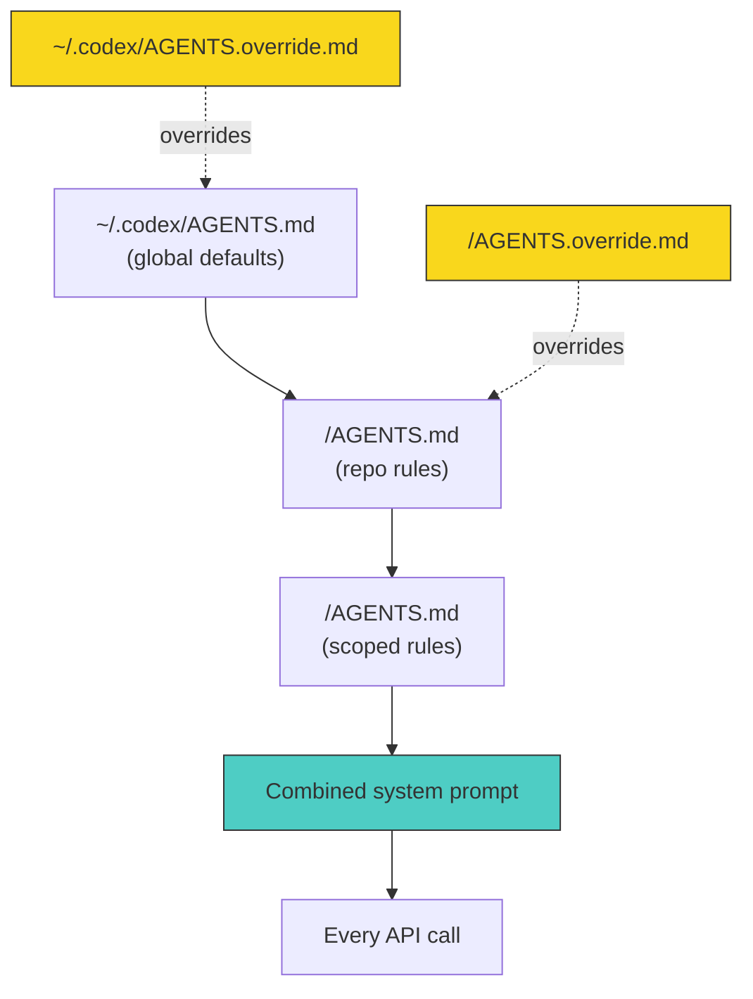

# Beyond the Prompt: Codex CLI Mastery


Most developers install Codex CLI, type a prompt and wait. When the output disappoints, they write a longer prompt. This is the wrong lever. The gap between passable suggestions and shipping entire features hands-free is not prompt quality. It is infrastructure: directory layout, AGENTS.md, skills, subagents, profiles, MCP servers and verification loops. This guide covers everything between installation and genuine mastery. *Current as of v0.135.0, May 2026.*

## The single most important principle

Give Codex a way to verify its own work.

Without a feedback loop, you are the only signal. With one, Codex iterates until the code passes. A single line in AGENTS.md transforms output quality:

```markdown
After every code change, run `npm test` and fix failures before responding.
```

That is not a prompt trick. It is a structural decision that turns Codex from a suggestion engine into a self-correcting agent. Every tactic in this guide follows the same logic: move intelligence from your prompts into your project configuration, where it compounds across sessions rather than evaporating at the end of each one.

Here is what this looks like in practice. Without a verification command, a typical session produces code that looks correct but fails at runtime:

```
You: "Add input validation to the signup endpoint"
Codex: [writes validation code with a typo in the schema field name]
→ You discover the bug manually 20 minutes later
```

With a verification command in AGENTS.md:

```
You: "Add input validation to the signup endpoint"
Codex: [writes validation code]
Codex: [runs npm test — sees 1 failure]
Codex: [fixes the typo — runs npm test — all green]
→ Working code, no manual review needed
```

The model already knows how to write tests and fix bugs. The missing piece is the instruction to do so automatically. That instruction lives in AGENTS.md, not in your prompt.

## AGENTS.md: the operating system for your agent

AGENTS.md is the most important file in a Codex CLI project. It loads at session start and ships with every API call as part of the system prompt[^1]. Think of it as the `.editorconfig` of the agentic era, except instead of tab width it governs reasoning, tool use, coding conventions and verification behaviour.

### The discovery hierarchy

Codex walks the filesystem on every run, concatenating instruction files from root downward[^1]:

```
1. ~/.codex/AGENTS.override.md    ← highest-precedence global override
   OR ~/.codex/AGENTS.md          ← standard global defaults

2. <git-root>/AGENTS.override.md  ← repo override
   OR <git-root>/AGENTS.md        ← repo-level instructions

3. <subdirectory>/AGENTS.md       ← directory-scoped rules
   (repeated for every subdirectory Codex enters)
```

Files closer to your current directory override earlier guidance because they appear later in the combined prompt[^1]. Codex stops adding files once their combined size reaches `project_doc_max_bytes` (32 KiB by default)[^1]. Each directory contributes at most one file.

You can verify which files loaded by running:

```bash
codex --ask-for-approval never "Summarise the current instructions."
```



### What belongs in AGENTS.md

Brevity matters. Every token in AGENTS.md is sent with every API call. Include only rules that would cause Codex to produce wrong output if removed[^2]:

- **Build and test commands.** `Run pytest -x after changes. Run mypy --strict before committing.`
- **Package manager.** `Use pnpm, not npm or yarn.`
- **Architecture constraints.** `All API handlers live in src/handlers/. Never import from src/internal/ outside that package.`
- **Type system distinctions.** `This project uses strict TypeScript. Never use any.`
- **Convention traps.** `Date fields use ISO 8601 with timezone. Never store epoch milliseconds.`

General programming knowledge does not belong here, nor do style preferences your linter already enforces. If ESLint catches it, AGENTS.md does not need to say it.

### How AGENTS.md evolves

A real AGENTS.md grows through failure. Here is how one might evolve over a month on a Node.js API project:

**Week one** (after installation):

```markdown
Run `npm test` after changes. Use pnpm.
```

**Week two** (after a PR reviewer catches missing types):

```markdown
Run `npm test` after changes. Use pnpm.
All exported functions must have explicit return types.
Never use `any` — use `unknown` and narrow.
```

**Week three** (after Codex writes a migration without updating the schema):

```markdown
Run `npm test` after changes. Use pnpm.
All exported functions must have explicit return types.
Never use `any` — use `unknown` and narrow.
When modifying a database table, update both the migration AND the Drizzle schema.
Run `pnpm db:generate` after schema changes.
```

**Week four** (after Codex imports from an internal package it should not touch):

```markdown
Run `npm test` after changes. Use pnpm.
All exported functions must have explicit return types.
Never use `any` — use `unknown` and narrow.
When modifying a database table, update both the migration AND the Drizzle schema.
Run `pnpm db:generate` after schema changes.
Never import from `@internal/` outside the `packages/internal` directory.
API route handlers live in `src/routes/`. Do not create handler files elsewhere.
```

Every line exists because something went wrong without it. That is the editorial standard: if removing a line would not cause a failure, it should not be there.

### AGENTS.local.md: your private layer

`AGENTS.local.md` sits alongside `AGENTS.md` but is gitignored. Use it for personal feedback loops that do not apply to the whole team. When a PR reviewer corrects the same mistake repeatedly, add it here. Over weeks, the local file accumulates the reviewer's patterns and Codex applies them automatically.

```markdown
<!-- AGENTS.local.md -->
- When adding a new database column, always generate a migration file.
- My PR reviewer insists on explicit return types for all exported functions.
- Prefer early returns over nested conditionals.
- Always run `pnpm lint:fix` before committing — I forget this constantly.
```

### Subdirectory scoping: rules that apply only where they matter

Not every rule belongs at the repo root. A payments service has different security requirements to a marketing site. Subdirectory AGENTS.md files let you scope rules precisely:

```
myproject/
├── AGENTS.md                    # Shared: pnpm, TypeScript strict, test commands
├── services/
│   ├── payments/
│   │   └── AGENTS.md            # PCI compliance: no logging of card data, audit trail required
│   └── marketing/
│       └── AGENTS.md            # Performance budget: no client bundle > 50KB
└── packages/
    └── shared/
        └── AGENTS.md            # No side effects, pure functions only, 100% test coverage
```

When Codex operates inside `services/payments/`, it sees the repo-root rules *plus* the payments-specific rules. When it operates in `services/marketing/`, it sees different scoped guidance. The model never needs the full rule set for every context; it only sees what is relevant.

## The .codex directory

The `.codex` directory at project root organises everything beyond AGENTS.md[^3]:

```
.codex/
├── config.toml          # Project-level configuration
├── skills/              # Reusable prompt-based capabilities
│   ├── tdd/
│   │   └── SKILL.md
│   └── review/
│       └── SKILL.md
├── agents/              # Subagent definitions (TOML)
│   └── security-audit.toml
└── hooks/               # Event-driven automation
    └── hooks.json
```

Understanding all four subsystems, skills, subagents, hooks and config, is what separates casual use from mastery.

## Skills: the unit of reusable expertise

A skill is a directory containing a `SKILL.md` file[^4]. The Agent Skills standard, governed at agentskills.io, is supported by more than 30 platforms including Codex CLI, Claude Code, Gemini CLI and Cursor[^4]. Any task you perform daily warrants conversion to a skill.

### Anatomy of a skill

```
.codex/skills/tdd/
├── SKILL.md           # Instructions and metadata
└── templates/
    └── test-scaffold.ts
```

The `SKILL.md` front matter declares when the skill activates:

```markdown
---
name: tdd
description: Enforce test-driven development workflow
trigger: when the user asks to implement a feature or fix a bug
---

## Instructions

1. Write a failing test first. Run it. Confirm it fails.
2. Write the minimum implementation to make it pass.
3. Run the full test suite.
4. Refactor if needed, re-running tests after each change.
5. Never skip the red-green-refactor cycle.
```

Invoke manually with `/tdd` in the TUI, or let Codex activate it automatically when the trigger matches.

### Skills worth building

| Skill | Purpose |
|-------|---------|
| `/tdd` | Enforce red-green-refactor before any implementation |
| `/grill-me` | Challenge your design before writing code, find edge cases |
| `/pr-prep` | Run linter, type-checker, tests, then draft a PR description |
| `/migration` | Generate database migration from schema diff |
| `/incident` | Structured incident response: gather logs, identify root cause, draft fix |
| `/security-scan` | Check for dependency vulnerabilities, secrets in code, injection vectors |
| `/perf-budget` | Measure bundle size and runtime performance against defined thresholds |

Skills encode *process*, not knowledge. A `/tdd` skill does not teach Codex what TDD is. It enforces the discipline of writing the test first, running it and iterating. That behavioural constraint produces better code.

### A worked example: `/pr-prep`

This skill runs before every pull request to catch the issues reviewers always find:

```markdown
---
name: pr-prep
description: Prepare code for pull request submission
trigger: when the user says "ready for PR" or "prepare for review"
---

## Instructions

1. Run the full test suite. If any test fails, fix it before continuing.
2. Run the linter (`pnpm lint`). Fix all warnings and errors.
3. Run the type checker (`pnpm typecheck`). Fix all type errors.
4. Check for `console.log` statements — remove any that are not intentional.
5. Check for TODO comments added in this branch — either resolve them or document why they remain.
6. Generate a PR description covering:
   - What changed and why
   - How to test the changes
   - Any migration or deployment notes
7. Show me the final diff and PR description for approval.
```

This eliminates the most common PR feedback loop. The reviewer no longer needs to say 'you left a console.log in' or 'the linter is failing'. Those issues are caught before the PR exists.

## Subagents: isolated context for specialised work

Subagents are child agents spawned by a parent session[^5]. Each runs in its own context window with its own system prompt, tools and permissions. The parent orchestrates; the children execute.

### When to use subagents

- **Code review.** A review subagent examines diffs without implementation bias, catching security issues, convention violations and missing tests.
- **Parallel exploration.** Three competing approaches investigated simultaneously, each in a separate context, with results compared afterwards.
- **Batch operations.** Refactoring the same pattern across dozens of files, each subagent handling a subset.
- **Long-running investigation.** Debugging a complex issue across many files without polluting the main session's context.

### Defining a subagent

Subagent definitions live in `.codex/agents/` as TOML files[^5]:

```toml
# .codex/agents/security-review.toml
name = "security-review"
description = "Review code changes for security vulnerabilities"
model = "gpt-5.4"
model_reasoning_effort = "high"

[instructions]
content = """
You are a security reviewer. Examine the diff for:
- Injection vulnerabilities (SQL, XSS, command injection)
- Authentication and authorisation gaps
- Secrets or credentials in code
- Unsafe deserialisation
Report findings with severity, location and recommended fix.
"""
```

### The cost trade-off

Subagents consume their own tokens. There is no free parallelism[^5]. A parent spawning three subagents pays for four separate model invocations. The value comes from three places:

1. **Context isolation.** Each subagent works with a clean context focused on its task, not a bloated shared history.
2. **Latency reduction.** Three parallel subagents return in wall-clock time equal to the slowest, not the sum of all three.
3. **Quality improvement.** A review subagent with its own instructions produces better reviews than asking the implementation agent to review its own work.

For a simple code change, subagents are overhead. For a 50-file refactor with a security audit, they pay for themselves.

## Profiles: match the tool to the task

Since v0.134.0, `--profile` is the sole activation path for named permission profiles[^6]. The legacy `[profile.*]` syntax is rejected. Profiles let you switch between configurations without editing files:

```toml
# ~/.codex/config.toml

[permissions.quick]
model = "gpt-5.4-mini"
model_reasoning_effort = "low"
model_verbosity = "low"

[permissions.deep]
model = "gpt-5.5"
model_reasoning_effort = "high"
plan_mode_reasoning_effort = "xhigh"

[permissions.review]
model = "gpt-5.4"
model_reasoning_effort = "high"

[permissions.ci]
model = "gpt-5.4-mini"
model_reasoning_effort = "low"
model_verbosity = "low"
```

```bash
# Routine file edits — fast, cheap
codex --profile quick "rename all .jsx files to .tsx"

# Complex architecture work — slow, expensive, high quality
codex --profile deep "design the event sourcing layer"

# Code review — balanced
codex --profile review "review the last 3 commits"

# CI pipeline — headless, minimal cost
codex --profile ci exec "check for type errors"
```

A quick profile on gpt-5.4-mini with low reasoning burns a fraction of the tokens that a deep session on gpt-5.5 with xhigh reasoning consumes[^7]. Matching profile to task is one of the most effective habits you can build.

### Built-in profiles

Codex ships with three built-in profiles you can extend[^3]:

- **`:read-only`** — can read files but cannot write or execute
- **`:workspace`** — can read and write within the project directory
- **`:danger-full-access`** — unrestricted filesystem and network access

Custom profiles support an `extends` key for inheritance:

```toml
[permissions.safe-write]
extends = ":workspace"
model = "gpt-5.4-mini"
model_reasoning_effort = "medium"
```

## The current model lineup

As of May 2026, these models are available in Codex CLI[^8]:

| Model | Best for |
|-------|----------|
| gpt-5.5 | Newest frontier model; complex coding, computer use, research workflows |
| gpt-5.4 | Flagship; recommended default for professional work |
| gpt-5.4-mini | Fast subagent work; responsive coding tasks |
| gpt-5.3-codex | Coding specialist for complex software engineering |
| gpt-5.3-codex-spark | Near-instant, real-time coding iteration (ChatGPT Pro only) |
| gpt-5.2 | Previous generation; coding and agentic tasks |

Set your default in config.toml:

```toml
model = "gpt-5.5"
```

Or override per session:

```bash
codex -m gpt-5.4-mini "quick formatting fix"
```

### Choosing the right model

The choice is not 'always use the best one'. Each model has a distinct cost-quality profile:

- **gpt-5.5** for architectural decisions, complex refactors, security audits, anything where a wrong answer costs more than the extra tokens.
- **gpt-5.4** as the daily driver. A solid default for most professional work.
- **gpt-5.4-mini** for routine operations: renaming, formatting, simple test writing, batch file changes. Fast and cheap.
- **gpt-5.3-codex** when you need deep code understanding without the general reasoning of gpt-5.4 or gpt-5.5.
- **gpt-5.3-codex-spark** for tight feedback loops where latency matters more than depth. Delivers 1,000+ tokens per second.

## MCP servers: making Codex stack-aware

Model Context Protocol (MCP) servers connect Codex to external systems: GitHub, Linear, Postgres, Figma, documentation sites and internal APIs[^9]. Without MCP, Codex can only read files. With it, Codex becomes aware of your entire stack.

### Configuration

```toml
# .codex/config.toml
[mcp_servers.github]
command = "npx"
args = ["-y", "@modelcontextprotocol/server-github"]

[mcp_servers.postgres]
command = "npx"
args = ["-y", "@modelcontextprotocol/server-postgres"]
env = { DATABASE_URL = "postgresql://localhost:5432/mydb" }

[mcp_servers.linear]
command = "npx"
args = ["-y", "@modelcontextprotocol/server-linear"]
env = { LINEAR_API_KEY = "${LINEAR_API_KEY}" }
```

### The token cost trap

Every MCP server injects its full tool catalogue into every request. A GitHub MCP server with 93 tools consumes roughly 55,000 tokens per turn[^10]. Before connecting five servers and wondering why your context window fills instantly, audit what you need. If you only use GitHub for PR creation, the built-in shell tools (`gh pr create`) cost a fraction of that.

**Rule of thumb:** connect MCP servers you use every session. For occasional needs, use shell commands or enable the server only when required.

### A three-tier memory pattern

For knowledge-intensive work, MCP servers enable a three-tier memory system:

1. **Hot storage** — the conversation context (current session, ephemeral)
2. **Warm storage** — project documentation and notes accessible via a filesystem or dedicated notes MCP server
3. **Cold storage** — external systems (Notion, Obsidian, Confluence) holding architectural decisions and historical context

```toml
[mcp_servers.obsidian]
command = "npx"
args = ["-y", "obsidian-mcp-server"]
env = { VAULT_PATH = "/path/to/engineering-vault" }
```

This lets Codex pull architectural decision records when making design choices, check historical incident reports when debugging, or reference meeting notes when implementing a feature request, without loading that context permanently into the conversation window.

## Parallel sessions with git worktrees

Running multiple Codex instances across git worktrees is the single biggest productivity unlock available today. Three independent sessions, one implementing, one reviewing, one exploring, operate on isolated copies of your repository without interference.

```bash
# Create worktrees for parallel work
git worktree add ../myproject-review review-branch
git worktree add ../myproject-explore explore-branch

# Terminal 1: implementation
cd myproject && codex --profile deep

# Terminal 2: code review
cd ../myproject-review && codex --profile review

# Terminal 3: exploration
cd ../myproject-explore && codex --profile quick
```

Each session has its own working directory, git state and context window. The implementing agent never sees the reviewer's findings until you merge. This isolation prevents context contamination and lets each agent focus on its specialised task.

### When worktrees beat subagents

Worktrees and subagents both enable parallelism, but they serve different purposes:

| Dimension | Worktrees | Subagents |
|-----------|-----------|-----------|
| Isolation | Full filesystem isolation | Shared filesystem, separate context |
| Persistence | Survives session end | Ephemeral, dies with parent |
| Cost | One API session each | Tokens from parent's quota |
| Use case | Long-running parallel workstreams | Short-lived delegated tasks |
| Orchestration | Manual (you switch terminals) | Automatic (parent manages) |

Use worktrees for independent, long-running sessions. Use subagents when a parent needs to delegate and collect results within a single session.

## Essential slash commands

The TUI exposes commands that control sessions, context and behaviour without leaving the terminal[^11]:

| Command | What it does |
|---------|-------------|
| `/compact` | Lossy summarisation of conversation history; frees context capacity |
| `/status` | Shows model, token usage, git branch and sandbox mode |
| `/clear` | Resets session history completely |
| `/permissions` | Inspects the active permission profile |
| `/model <name>` | Switches model mid-session |
| `/plugins` | Lists installed plugins |
| `/undo` | Reverts the last file changes made by Codex |
| `/diff` | Shows pending file changes as a unified diff |

### The compaction discipline

Manual `/compact` at roughly 60 per cent context usage produces better summaries than waiting for automatic compaction at 95 per cent[^12]. After two or three automatic compactions, the model loses track of early decisions. Treat compaction as a deliberate phase transition: finish investigation, compact, then start implementation with a clean context.

Customise the compaction prompt in config.toml to preserve what matters most:

```toml
compact_prompt = "Summarise focusing on architectural decisions, file paths modified, and test results. Discard exploration dead-ends."
```

## Hooks: event-driven automation

Hooks execute shell commands at specific points in the Codex workflow[^13]. Configure them via `hooks.json` in the `.codex` directory or inline in config.toml.

### Available hook events

| Event | Fires when |
|-------|-----------|
| `PreToolUse` | Before any tool execution |
| `PostToolUse` | After a tool completes |
| `PreCompact` | Before history compaction |
| `PostCompact` | After compaction finishes |
| `SessionStart` | When a new session begins |
| `SubagentStart` | When a subagent is spawned |
| `SubagentStop` | When a subagent completes |
| `UserPromptSubmit` | When the user submits a prompt |
| `Stop` | When the session ends |

### Practical hook examples

**Auto-format after every tool execution:**

```json
{
  "hooks": [
    {
      "event": "PostToolUse",
      "command": "npx prettier --write ${CHANGED_FILES}",
      "condition": "tool == 'write_file' || tool == 'edit_file'"
    }
  ]
}
```

**Log session duration for cost tracking:**

```json
{
  "hooks": [
    {
      "event": "SessionStart",
      "command": "echo $(date -Iseconds) session_start >> ~/.codex/session-log.csv"
    },
    {
      "event": "Stop",
      "command": "echo $(date -Iseconds) session_stop >> ~/.codex/session-log.csv"
    }
  ]
}
```

Hooks run outside the model's context. They consume no tokens and cannot be overridden by the model's reasoning. This makes them ideal for enforcement the model should not negotiate away.

## The `codex exec` pipeline

For automation and CI/CD, `codex exec` skips the TUI entirely and returns structured output[^14]:

```bash
# Single-shot execution
codex exec "write unit tests for src/auth.ts" --model gpt-5.4-mini

# Piped workflows
cat failing-tests.txt | codex exec "fix these test failures" --model gpt-5.4

# Structured JSON output
codex exec "list all TODO comments" --output-format json

# With a specific profile for CI
codex --profile ci exec "run type-check and report errors"
```

Combined with `--profile ci`, this is the most token-efficient way to run batch operations. Use it in CI pipelines, pre-commit hooks and scripted maintenance tasks.

### A CI integration example

```yaml
# .github/workflows/codex-review.yml
name: Codex Code Review
on: [pull_request]
jobs:
  review:
    runs-on: ubuntu-latest
    steps:
      - uses: actions/checkout@v4
      - name: Install Codex CLI
        run: npm install -g @openai/codex
      - name: Review PR diff
        run: |
          git diff origin/main...HEAD > /tmp/diff.txt
          codex --profile ci exec \
            "Review this diff for security issues, missing tests, and convention violations. Output as JSON." \
            --input /tmp/diff.txt \
            --output-format json > review-results.json
      - name: Post review comments
        run: node scripts/post-review-comments.js review-results.json
```

## Session management: resume, clear, restart

### Resuming sessions

The `--resume` flag continues a previous session, preserving context and conversation history:

```bash
# Resume the last session
codex --resume

# Resume a specific session by ID
codex --resume <session-id>
```

This is valuable for multi-day tasks or when you step away and return. Prompt caching means resumed sessions benefit from cached system prompts, reducing token costs on the first turn back[^7].

### When to clear versus when to resume

- **Resume** when you are continuing the same task and need the earlier context (debugging, iterative implementation).
- **Clear** (`/clear`) when you are switching tasks and the old context would be noise.
- **New session** when the previous session has been compacted multiple times and quality is degrading.

## Codex doctor

Since v0.135.0, `codex doctor` diagnoses configuration and environment issues before they derail a session[^15]:

```bash
codex doctor
```

It checks:

- API key validity and permissions
- Model access (can you reach your configured model?)
- MCP server connectivity (are all declared servers responding?)
- config.toml syntax and key validity
- Sandbox compatibility (is your OS and kernel supported?)
- AGENTS.md file discovery (which files would load?)

Run it after installation, after changing configuration and whenever something feels wrong. Five seconds of diagnostics saves 20 minutes of debugging a cryptic error three turns into an expensive session.

## Troubleshooting common problems

### Context window exceeded on the first turn

Your MCP servers are injecting too many tool definitions. Run `/status` to check token usage, then audit your MCP configuration. Remove servers you do not need for this session.

### Codex ignores AGENTS.md rules

Check the file size. If your combined AGENTS.md files exceed `project_doc_max_bytes` (32 KiB by default), later files are silently dropped[^1]. Verify file names too: only `AGENTS.md` and `AGENTS.override.md` are discovered by default unless you configure `project_doc_fallback_filenames`.

### Quality degrades mid-session

You are probably past two compactions. Check `/status` for context usage. Either `/compact` manually with a targeted summary prompt, or start a fresh session. Long sessions with multiple compactions produce measurably worse output[^12].

### Subagents produce generic output

The subagent inherits the parent's model unless overridden. Check your TOML definition. If the subagent runs on gpt-5.4-mini with low reasoning but needs deep analysis, override the model and reasoning settings in the agent definition.

### Profile not activating

Since v0.134.0, the only valid syntax is `[permissions.<name>]` in config.toml, activated with `codex --profile <name>`[^6]. The old `[profile.*]` syntax is silently rejected. Run `/permissions` in the TUI to inspect your active profile.

## Daily habits of effective Codex users

The patterns that separate productive Codex users from frustrated ones are not about prompting:

1. **Edit AGENTS.md multiple times per week.** It is a living document. When Codex makes a mistake, add a rule. When a rule becomes unnecessary, remove it.

2. **Use gpt-5.5 with high or xhigh reasoning for complex work.** Do not default to the cheapest model for everything. The cost difference between gpt-5.4-mini and gpt-5.5 is large, but so is the quality difference on architectural decisions and complex refactors.

3. **Start fresh sessions between phases.** Investigation and implementation have different context needs. Compact or clear between them.

4. **Treat configuration as the primary work.** Writing a good skill or tuning a profile takes 30 minutes and pays off across hundreds of sessions. Writing a better prompt takes 30 seconds and pays off once.

5. **Run `codex doctor` after any config change.** Catch problems before they cost you tokens and time.

6. **Audit MCP servers quarterly.** Remove servers you have not used in a month. Each idle server burns tokens silently on every turn.

7. **Build one skill per week.** Start with your most repetitive task. Within a month you will have a library that eliminates your most common friction points.

8. **Check `/status` frequently.** Context awareness prevents surprise compactions and degraded output. Make it a habit every few turns on long sessions.

## The mastery progression

| Level | Focus | Key investment |
|-------|-------|----------------|
| **Beginner** | Typing prompts, waiting for output | None |
| **Intermediate** | AGENTS.md, profiles, `/compact` discipline | Two hours of config work |
| **Advanced** | Skills, subagents, MCP servers, worktree parallelism | One to two days building infrastructure |
| **Expert** | Hooks, `codex exec` pipelines, CI integration, cross-agent orchestration | Ongoing refinement |

Most developers plateau at intermediate. The jump to advanced requires investing time in infrastructure rather than prompts, and accepting that the 30 minutes spent writing a skill saves hours across future sessions.

## Conclusion

Codex CLI becomes powerful through infrastructure investment, not superior prompting. The prompt is the last mile. Everything before it, AGENTS.md, skills, subagents, profiles, MCP servers, hooks and worktree isolation, determines whether that last mile produces throwaway suggestions or production-ready code.

The developers who get the most from Codex CLI are not writing better prompts. They are building better environments for the agent to operate in. Start with AGENTS.md. Add a verification command. Create one skill for your most common task. The compound returns begin immediately.

## Citations

[^1]: [AGENTS.md Guide — Codex CLI — OpenAI Developers](https://developers.openai.com/codex/guides/agents-md)

[^2]: [Boris Cherny — CLAUDE.md design philosophy, adapted for AGENTS.md](https://www.cherny.dev)

[^3]: [Codex CLI Configuration Reference — OpenAI Developers](https://developers.openai.com/codex/config-reference)

[^4]: [Agent Skills Standard — agentskills.io](https://agentskills.io)

[^5]: [Codex CLI Subagents: TOML Format, Parallelism and spawn_agents_on_csv — Codex Resources](https://danielvaughan.github.io/codex-resources/articles/2026-03-26-codex-cli-subagents-toml-parallelism/)

[^6]: [Codex CLI v0.134.0 Release Notes — GitHub](https://github.com/openai/codex/releases)

[^7]: [Codex CLI Performance Optimisation: Token Overhead, Hidden Costs and Tuning Tactics — Codex Resources](https://danielvaughan.github.io/codex-resources/articles/2026-04-08-codex-cli-performance-optimization/)

[^8]: [Codex Models — OpenAI Developers](https://developers.openai.com/codex/models)

[^9]: [Codex CLI MCP Integration — Codex Resources](https://danielvaughan.github.io/codex-resources/articles/2026-03-26-codex-cli-mcp-integration/)

[^10]: [MCP Token Trap: Why Your AI Agent Burns 35x More Tokens Than a CLI — OnlyCLI](https://onlycli.github.io/OnlyCLI/blog/mcp-token-cost-benchmark/)

[^11]: [Codex CLI TUI Shortcuts and Slash Commands: The Complete Reference — Codex Resources](https://danielvaughan.github.io/codex-resources/articles/2026-04-08-codex-cli-tui-shortcuts-slash-commands/)

[^12]: [Why Is My Codex CLI Token Usage Suddenly So High? — BSWEN](https://docs.bswen.com/blog/2026-03-02-codex-cli-token-usage-spike/)

[^13]: [Codex CLI Hooks: Complete Guide to Events, Policy and Patterns — Codex Resources](https://danielvaughan.github.io/codex-resources/articles/2026-04-15-codex-cli-hooks-complete-guide-events-policy-patterns/)

[^14]: [codex exec: Unix Pipeline Integration and Structured Output — Codex Resources](https://danielvaughan.github.io/codex-resources/articles/2026-04-01-codex-exec-unix-pipeline-structured-output/)

[^15]: [Codex CLI v0.135.0 Release Notes — GitHub](https://github.com/openai/codex/releases/tag/v0.135.0)
