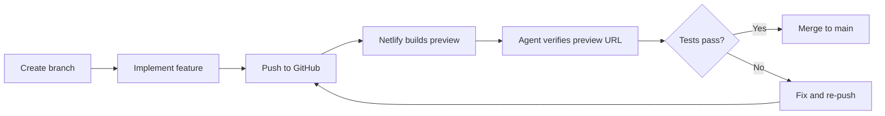

# Codex CLI for Netlify Development: MCP Server, Deploy Previews, Agent Runners, and Edge Function Workflows


---

Netlify remains one of the most widely adopted platforms for shipping modern web applications, serving over 4 million developers with Git-connected deployments, edge functions, serverless compute, and a growing AI agent infrastructure[^1]. The official Netlify MCP server (`@netlify/mcp`) exposes project creation, deployment management, environment configuration, and extension installation to any MCP-compatible agent — including Codex CLI[^2]. Netlify's Agent Runners, launched in March 2026, take this further by running Claude Code, Codex, and Gemini CLI in isolated sandboxes with full production context[^3].

This article covers wiring the Netlify MCP server into Codex CLI, building practical workflows around deploy previews and edge functions, and combining Netlify's agent infrastructure with Codex CLI's local capabilities.

---

## The Netlify MCP Server

The official server at `@netlify/mcp` is maintained by Netlify and communicates over STDIO via `npx`[^2]. It wraps the Netlify CLI and API, exposing tools for:

- **Project management** — create, configure, and delete sites
- **Deployments** — trigger builds, inspect deploy logs, manage deploy previews
- **Environment variables** — create and update secrets per-site or per-context (production, deploy-preview, branch-deploy)
- **Extensions** — install and uninstall platform extensions (Auth0, Supabase, analytics)
- **Access controls** — modify team permissions and site-level access
- **Forms** — enable and manage form submissions
- **User and team info** — fetch account details and team membership[^2]

A community-maintained alternative, DynamicEndpoints/Netlify-MCP-Server, extends coverage to 43 tools including Blobs, analytics, and the local dev server[^4], though the official server is the recommended starting point.

### Prerequisites

The server requires Node.js 22 or later and the Netlify CLI (`npm install -g netlify-cli`)[^2]. Authenticate beforehand:

```bash
netlify login
netlify status  # verify authentication
```

---

## Configuration

### Adding via `codex mcp add`

The quickest route is the CLI shorthand:

```bash
codex mcp add netlify -- npx -y @netlify/mcp
```

To pass a Personal Access Token instead of relying on the CLI session:

```bash
codex mcp add netlify \
  --env NETLIFY_PERSONAL_ACCESS_TOKEN=nfp_xxxxxxxxxxxx \
  -- npx -y @netlify/mcp
```

### config.toml

For team-shared configuration, declare the server in `~/.codex/config.toml` or the project-scoped `.codex/config.toml`:

```toml
[mcp_servers.netlify]
command = "npx"
args = ["-y", "@netlify/mcp"]
env_vars = ["NETLIFY_PERSONAL_ACCESS_TOKEN"]
startup_timeout_sec = 15
tool_timeout_sec = 120

[mcp_servers.netlify.tools.netlify_deploy]
approval_mode = "approve"
```

Setting `approval_mode = "approve"` on the deploy tool ensures a human confirms before any production deployment fires — a sensible guardrail for a tool that can push live changes.

### Profile-Based Configuration

With Codex CLI v0.134.0's `--profile` standardisation[^5], you can create a Netlify-specific profile:

```toml
# ~/.codex/netlify.config.toml
[mcp_servers.netlify]
command = "npx"
args = ["-y", "@netlify/mcp"]
env_vars = ["NETLIFY_PERSONAL_ACCESS_TOKEN"]

[mcp_servers.netlify.tools.netlify_deploy]
approval_mode = "auto"
```

Activate with `codex --profile netlify` or `CODEX_PROFILE=netlify`.

---

## AGENTS.md for Netlify Projects

Drop this into your repository root to give Codex CLI project-specific context:

```markdown
# AGENTS.md — Netlify Project

## Stack
- Framework: [Astro/Next.js/SvelteKit/Remix] on Netlify
- Functions: Netlify Functions (Node.js 20) at netlify/functions/
- Edge Functions: Deno runtime at netlify/edge-functions/
- Blobs: @netlify/blobs for key/value storage

## Deployment
- Production branch: main
- Deploy previews: enabled on all PRs
- Build command: npm run build
- Publish directory: dist/

## Rules
- NEVER hardcode environment variables; use Netlify env vars
- Edge Functions must import from "https://deno.land/std/" or npm:
- All redirects go in netlify.toml, not _redirects files
- Test locally with `netlify dev` before deploying
- Prefer `netlify deploy --prod` only after preview verification
```

---

## Workflow Patterns

### 1. Feature Branch to Deploy Preview Verification

This is the bread-and-butter Netlify workflow: push a branch, get a preview URL, verify it works.



Prompt Codex CLI with the Netlify MCP server active:

```
Create a new edge function at netlify/edge-functions/geo-redirect.ts
that redirects /pricing to /pricing-eu for visitors from EU countries.
Deploy to a preview and verify the function appears in the deploy log.
```

The agent can:
1. Write the edge function
2. Commit and push to a feature branch
3. Use the Netlify MCP to check the deploy status
4. Inspect the deploy log for the edge function bundle
5. Report the preview URL for manual verification

### 2. Environment Variable Management

Managing secrets across contexts (production, deploy-preview, branch-deploy) is error-prone. Let the agent handle it:

```
Set up the following environment variables for the site "acme-app":
- STRIPE_SECRET_KEY: use the test key for deploy-preview context,
  production key for production context
- DATABASE_URL: same value across all contexts
- FEATURE_FLAGS_API: only in deploy-preview context

Show me what's configured when done.
```

The MCP server's environment variable tools handle context scoping, and Codex CLI's approval mode ensures you confirm before secrets are written.

### 3. Edge Function Development Loop

Edge functions run on Deno at the network edge and are ideal for auth checks, geolocation, A/B testing, and response transforms[^6]. The development loop benefits from agent assistance because the Deno import model and Netlify-specific APIs (`Netlify.env`, geo object, context) differ from standard Node.js:

```
Write an edge function that adds a Cache-Control header
of "public, max-age=3600, s-maxage=86400" to all responses
under /api/*, and a "no-store" header for /api/auth/*.
Test it with netlify dev.
```

### 4. Batch Site Audit with `codex exec`

For teams managing multiple Netlify sites, `codex exec` can audit configuration drift:

```bash
codex exec --output-schema '{
  "type": "object",
  "properties": {
    "site_name": {"type": "string"},
    "has_headers_config": {"type": "boolean"},
    "has_csp": {"type": "boolean"},
    "functions_count": {"type": "integer"},
    "edge_functions_count": {"type": "integer"},
    "env_var_contexts": {"type": "array", "items": {"type": "string"}}
  }
}' "Audit the Netlify site linked in this directory. Check netlify.toml
for security headers (especially Content-Security-Policy), count
functions and edge functions, and list which env var contexts are used."
```

Pipe this across repositories for a fleet-wide report:

```bash
for dir in sites/*/; do
  (cd "$dir" && codex exec --output-schema '...' "Audit this Netlify site")
done | jq -s '.' > audit-report.json
```

---

## Netlify Agent Runners and Codex CLI

Netlify Agent Runners, launched in March 2026, run AI coding agents (including Codex) in isolated cloud sandboxes with production context[^3]. Every change creates a deploy preview, a pull request, and a full diff — nothing touches production until approved[^3].

Agent Runners complement Codex CLI rather than replacing it:

| Capability | Codex CLI (local) | Agent Runners (cloud) |
|---|---|---|
| Execution environment | Your terminal | Netlify sandbox |
| Git context | Full local repo | Linked GitHub repo |
| MCP servers | Any configured | Netlify-scoped |
| Sandbox control | config.toml profiles | Platform-managed |
| Trigger | CLI invocation | Dashboard, Linear, GitHub PR comment |
| Best for | Development, complex multi-file changes | Quick fixes, dashboard-triggered tasks |

A practical pattern: use Codex CLI locally for feature development with the Netlify MCP server, then use Agent Runners from the Netlify dashboard for production hotfixes triggered by monitoring alerts.

---

## Deploying Custom MCP Servers to Netlify

Netlify can also *host* your own MCP servers as serverless functions, using the Streamable HTTP transport[^7]. This is useful for exposing internal tools to Codex CLI without running a persistent server:

```typescript
// netlify/functions/mcp.ts
import { McpServer } from "@modelcontextprotocol/sdk/server/mcp.js";
import { StreamableHTTPServerTransport } from
  "@modelcontextprotocol/sdk/server/streamablehttp.js";

const server = new McpServer({ name: "internal-tools", version: "1.0.0" });

server.tool("check-inventory", { sku: z.string() }, async ({ sku }) => {
  const stock = await db.query("SELECT qty FROM products WHERE sku = $1", [sku]);
  return { content: [{ type: "text", text: JSON.stringify(stock.rows[0]) }] };
});

export default async (req: Request) => {
  const transport = new StreamableHTTPServerTransport({ sessionIdGenerator: undefined });
  await server.connect(transport);
  return transport.handleRequest(req);
};
```

Configure Codex CLI to use this remote MCP server:

```toml
[mcp_servers.internal-tools]
url = "https://your-site.netlify.app/.netlify/functions/mcp"
bearer_token_env_var = "INTERNAL_MCP_TOKEN"
```

This pattern keeps MCP servers close to your data whilst leveraging Netlify's global edge network and automatic scaling[^7].

---

## Server Composition

The Netlify MCP server pairs naturally with other servers for full-stack workflows:

```toml
# Platform operations
[mcp_servers.netlify]
command = "npx"
args = ["-y", "@netlify/mcp"]
env_vars = ["NETLIFY_PERSONAL_ACCESS_TOKEN"]

# Code context
[mcp_servers.github]
command = "npx"
args = ["-y", "@modelcontextprotocol/server-github"]
env_vars = ["GITHUB_PERSONAL_ACCESS_TOKEN"]

# Error tracking
[mcp_servers.sentry]
command = "npx"
args = ["-y", "@sentry/mcp-server"]
env_vars = ["SENTRY_AUTH_TOKEN"]
```

This composition enables workflows like: "Check Sentry for the top unresolved error on acme-app, find the relevant code on GitHub, fix it, deploy a preview to Netlify, and verify the error doesn't reproduce."

---

## Model Selection

Netlify MCP tools are straightforward API calls, so model selection follows the usual Codex CLI guidelines[^8]:

- **o4-mini** — sufficient for deploy management, environment variables, and configuration tasks
- **o3** — better for complex edge function logic, debugging build failures, or multi-step deploy-then-verify workflows
- **GPT-5.5** — useful when the agent needs to reason across large `netlify.toml` configurations and framework-specific build settings

---

## Security Considerations

- **Token scope**: Personal Access Tokens grant broad access. Use site-scoped tokens where Netlify supports them, and store tokens in environment variables rather than config files[^2]
- **Approval gating**: Set `approval_mode = "approve"` on deploy and environment-variable tools to prevent unintended production changes
- **Network access**: The Netlify MCP server requires network access to reach the Netlify API. Configure sandbox permissions accordingly:

```toml
[sandbox_workspace_write]
network_access = true
```

- **Deploy previews as safety net**: Netlify's deploy preview model means the agent can verify changes on an isolated URL before anything reaches production[^1]

---

## Limitations

- ⚠️ The official `@netlify/mcp` server's tool count is narrower than the community DynamicEndpoints alternative; Blobs, analytics, and dev-server tools are not yet exposed officially
- ⚠️ Edge function debugging via MCP is limited — `netlify dev` provides better local feedback than remote deploy log inspection
- ⚠️ Agent Runners are only available on credit-based plans, not the free Starter tier[^3]
- ⚠️ The MCP server wraps the Netlify CLI, so CLI version skew can introduce unexpected behaviour — pin `netlify-cli` in your project's `package.json`
- ⚠️ Build log streaming is not real-time through MCP; the agent polls for deploy status rather than receiving push updates

---

## Citations

[^1]: Netlify Platform Overview. [https://www.netlify.com/platform/](https://www.netlify.com/platform/)
[^2]: Netlify MCP Server Documentation. [https://docs.netlify.com/build/build-with-ai/netlify-mcp-server/](https://docs.netlify.com/build/build-with-ai/netlify-mcp-server/)
[^3]: Netlify Agent Runners Overview. [https://docs.netlify.com/build/build-with-ai/agent-runners/overview/](https://docs.netlify.com/build/build-with-ai/agent-runners/overview/)
[^4]: DynamicEndpoints Netlify MCP Server. [https://glama.ai/mcp/servers/@DynamicEndpoints/Netlify-MCP-Server](https://glama.ai/mcp/servers/@DynamicEndpoints/Netlify-MCP-Server)
[^5]: Codex CLI v0.134.0 Release Notes. [https://github.com/openai/codex/releases/tag/rust-v0.134.0](https://github.com/openai/codex/releases/tag/rust-v0.134.0)
[^6]: Netlify Edge Functions Documentation. [https://docs.netlify.com/build/functions/overview/](https://docs.netlify.com/build/functions/overview/)
[^7]: Building MCPs with Netlify. [https://developers.netlify.com/guides/write-mcps-on-netlify/](https://developers.netlify.com/guides/write-mcps-on-netlify/)
[^8]: Codex CLI MCP Configuration. [https://developers.openai.com/codex/mcp](https://developers.openai.com/codex/mcp)
