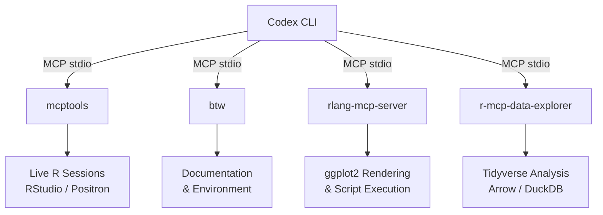
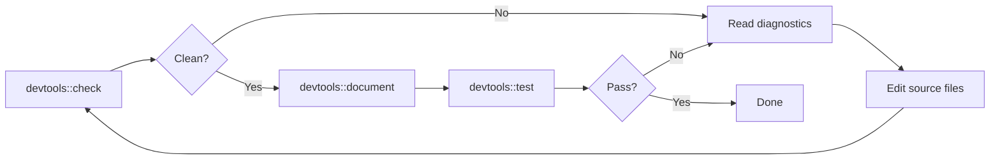

# Codex CLI for R Language Development: MCP Servers, mcptools, btw, and Statistical Computing Agent Workflows


---

R remains the lingua franca for statistical computing, with R 4.6.0 shipping in April 2026[^1] and over 21,000 packages on CRAN[^2]. Despite this, most AI coding agent tooling has concentrated on Python data science workflows. Codex CLI changes that calculus: its MCP server architecture lets an agent reach directly into a running R session, execute code, inspect data frames, query documentation, and render ggplot2 visualisations — all without leaving the terminal.

This article maps the R MCP server ecosystem as it stands in May 2026, walks through Codex CLI configuration for each server, and demonstrates practical workflows for statistical analysis, package development, and reproducible research.

## The R MCP Server Landscape

Four MCP servers cover the R ecosystem, each targeting a different slice of the workflow.



### mcptools (Posit)

The official Posit package, `mcptools` v0.2.1 on CRAN, implements the Model Context Protocol in R[^3]. It operates in two modes: R as an MCP server (exposing R sessions to AI agents) and R as an MCP client (registering third-party MCP servers with `ellmer` chats). The server supports both `stdio` and `http` transports[^4].

Key capabilities:

- **Session discovery**: `list_r_sessions()` finds running R environments (RStudio, Positron, terminal) and `select_r_session()` switches between them persistently within a conversation[^4].
- **Multi-client support**: multiple agents can connect simultaneously — one in Codex CLI, another in Claude Code — each targeting different R sessions[^4].
- **Custom tools**: any function wrappable with `ellmer::tool()` can be exposed as an MCP tool, enabling bespoke statistical workflows[^4].

### btw (Posit)

The companion `btw` package provides the default tool set for `mcptools`, giving agents access to R documentation (help pages, vignettes, NEWS files), environment inspection (installed packages, platform details, session info), and package development utilities (testing, checking, documenting via `devtools`)[^5]. It ships its own MCP entry point via `btw::btw_mcp_server()`, which can be registered independently[^5].

### rlang-mcp-server (gdbelvin)

A standalone MCP server written in Python that wraps R's ggplot2 rendering pipeline[^6]. It exposes two tools:

- `render_ggplot` — takes R code containing ggplot2 commands, renders the plot, and returns the image in PNG, JPEG, PDF, or SVG format.
- `execute_r_script` — runs arbitrary R code and returns text output.

Useful when the agent needs to generate publication-quality visualisations without an interactive R session.

### r-mcp-data-explorer (xiaosongz)

A tidyverse-native MCP server for data exploration[^7]. Supports CSV and Parquet ingestion via Arrow, DuckDB-backed SQL queries on loaded datasets, ggplot2 visualisation, and tidyverse code execution. Particularly suited to exploratory data analysis workflows where the agent needs to load, transform, and summarise large datasets.

## Configuring Codex CLI for R

Codex CLI stores MCP configuration in `~/.codex/config.toml` (global) or `.codex/config.toml` (project-scoped, trusted projects only)[^8]. Each server gets a `[mcp_servers.<name>]` table.

### mcptools + btw

The recommended production configuration registers mcptools with btw's extended tool set:

```toml
[mcp_servers.r-session]
command = "Rscript"
args = ["-e", "mcptools::mcp_server(tools = btw::btw_tools())"]
```

For session discovery across multiple R environments, add `mcptools::mcp_session()` to your `.Rprofile`:

```r
# ~/.Rprofile or project .Rprofile
if (requireNamespace("mcptools", quietly = TRUE)) {
  mcptools::mcp_session()
}
```

### rlang-mcp-server

```toml
[mcp_servers.r-plots]
command = "python"
args = ["-m", "rlang_mcp_server"]

[mcp_servers.r-plots.env]
R_HOME = "/usr/lib/R"
```

### r-mcp-data-explorer

```toml
[mcp_servers.r-explorer]
command = "python"
args = ["-m", "r_mcp_data_explorer"]
```

### CLI shorthand

For quick setup without editing TOML:

```bash
codex mcp add r-session -- Rscript -e "mcptools::mcp_server(tools = btw::btw_tools())"
codex mcp add r-plots -- python -m rlang_mcp_server
```

Verify registration:

```bash
codex mcp list
```

## Workflow 1: Exploratory Data Analysis

With `mcptools` and `btw` configured, Codex CLI can drive an end-to-end EDA workflow against a running R session.

```bash
codex "Load the penguins dataset from palmerpenguins, summarise body mass
by species and sex, then create a faceted box plot with ggplot2.
Save the plot as penguins_mass.png"
```

The agent will:

1. Call `list_r_sessions()` to find the active R environment.
2. Execute `library(palmerpenguins); data(penguins)` in the session.
3. Run a `dplyr` pipeline: `penguins %>% group_by(species, sex) %>% summarise(...)`.
4. Generate and save a ggplot2 visualisation.

Because `mcptools` executes in your live R session, the agent has access to any packages you have loaded, any objects in your global environment, and your full `.Rprofile` configuration.

## Workflow 2: R Package Development

The `btw` tools expose `devtools` and `testthat` primitives, making Codex CLI effective for R package development cycles.

```bash
codex "Run devtools::check() on the current package. If any NOTEs or
WARNINGs appear, fix them and re-run until clean"
```

A typical agent loop:



The `btw` package gives the agent access to help pages and vignettes for any installed package, so it can look up function signatures and parameter documentation before making changes[^5].

## Workflow 3: Reproducible Statistical Reports

Combining Codex CLI with R Markdown or Quarto documents enables agent-driven reproducible research.

```bash
codex "Read analysis.Rmd, update the linear mixed-effects model in the
modelling chunk to use lme4::lmer with random intercepts for subject,
re-knit the document, and check that the AIC improved"
```

The agent edits the `.Rmd` source directly (Codex CLI's native file operations), then calls `rmarkdown::render()` through the MCP server to knit the document, and finally inspects the rendered output for model fit statistics.

## Workflow 4: ggplot2 Visualisation with rlang-mcp-server

When you need plot generation without a live R session — for example, in CI or a headless environment — `rlang-mcp-server` provides a self-contained rendering pipeline:

```bash
codex "Using the r-plots MCP server, create a heatmap of the mtcars
correlation matrix with a viridis colour scale. Output as SVG"
```

The agent calls `render_ggplot` with the R code, and the server returns the rendered image. This is particularly useful for generating figures in automated documentation pipelines.

## R 4.6.0 Considerations

R 4.6.0, released 24 April 2026, introduced several changes relevant to agent-assisted development[^1]:

- **`%notin%` operator**: a built-in negation of `%in%`, eliminating the need for the ad-hoc `!x %in% y` pattern that agents frequently generate. Codex CLI can now use the idiomatic form directly.
- **Enhanced `summary()` for character vectors**: returns `N.unique`, `N.blank`, and `nchar` range — more informative for agent-driven EDA.
- **C++20 as default standard**: relevant for packages with compiled code; the agent should target C++20 when generating `src/` files.
- **`messageCondition()` function**: enables structured message objects, useful for agent-parseable diagnostic output from R packages.

Ensure your R installation is ≥ 4.6.0 to take advantage of these features. The agent can verify the version through the MCP session:

```bash
codex "Check the R version in the active session and list loaded packages"
```

## Sandbox Considerations

Codex CLI's sandbox restricts filesystem and network access by default[^8]. R sessions started via `mcptools` run outside the sandbox (they are separate processes started by the MCP server command), but the agent's own file operations remain sandboxed. Key adjustments:

- **Network access**: if R packages need to download data (e.g., `curl`, `httr2`), the MCP server process inherits the calling environment's network access, which is unrestricted.
- **File paths**: the agent can read/write files within its sandbox, but R session output (plots, rendered documents) lands in the R session's working directory. Use absolute paths or configure `cwd` in the MCP server table.
- **Package installation**: `install.packages()` in the R session works normally since it runs outside the sandbox. The agent can install missing dependencies on demand.

## Custom MCP Tools for Domain-Specific Analysis

The `ellmer::tool()` interface lets you expose arbitrary R functions as MCP tools. This is powerful for domain-specific statistical workflows:

```r
# custom_tools.R — loaded in .Rprofile
library(ellmer)
library(mcptools)

survival_analysis <- tool(
  function(formula_str, data_name, ...) {
    library(survival)
    f <- as.formula(formula_str)
    d <- get(data_name, envir = .GlobalEnv)
    fit <- survfit(f, data = d)
    summary(fit)
  },
  "Run a Kaplan-Meier survival analysis on a dataset in the global environment",
  formula_str = type_string("Survival formula, e.g. 'Surv(time, status) ~ group'"),
  data_name = type_string("Name of the data frame in the global environment")
)

mcp_server(tools = c(btw::btw_tools(), list(survival_analysis = survival_analysis)))
```

Register this custom server:

```toml
[mcp_servers.r-custom]
command = "Rscript"
args = ["custom_tools.R"]
```

The agent now has a dedicated `survival_analysis` tool alongside the standard `btw` documentation and environment tools.

## Multi-Server Configuration

For comprehensive R development, register multiple servers targeting different capabilities:

```toml
# Live session with docs and dev tools
[mcp_servers.r-session]
command = "Rscript"
args = ["-e", "mcptools::mcp_server(tools = btw::btw_tools())"]

# Headless ggplot2 rendering
[mcp_servers.r-plots]
command = "python"
args = ["-m", "rlang_mcp_server"]

# Large dataset exploration with Arrow/DuckDB
[mcp_servers.r-explorer]
command = "python"
args = ["-m", "r_mcp_data_explorer"]
```

Codex CLI v0.134.0's `readOnlyHint` concurrent execution means read-only tools across these servers (documentation lookups, session listing, data summaries) can run in parallel, reducing round-trip latency[^9].

## Posit Connect Deployment

For team environments, Posit Connect 2026.04 supports deploying MCP servers as hosted endpoints with OAuth 2.1 authentication[^10]. This enables:

- Shared R environments with consistent package versions across a team.
- Centralised data access without distributing credentials.
- Codex CLI connecting to remote R sessions via Streamable HTTP transport.

Configure the remote server:

```toml
[mcp_servers.r-remote]
url = "https://connect.example.com/content/r-mcp/mcp"
bearer_token_env_var = "POSIT_CONNECT_TOKEN"
```

## Conclusion

The R MCP ecosystem — anchored by Posit's `mcptools` and `btw` packages — gives Codex CLI full access to R's statistical computing capabilities. Whether you are running exploratory analysis against a live session, developing packages with automated check-test-fix loops, rendering publication-quality ggplot2 figures, or driving reproducible research documents, the integration works through the same MCP configuration pattern used for every other language in Codex CLI's toolchain.

The key advantage over Python-centric workflows: R sessions maintain state, so the agent can build iteratively on previous computations within the same session — loading data once, fitting progressively complex models, and refining visualisations without reloading datasets on each turn.

## Citations

[^1]: [What's new in R 4.6.0? — Jumping Rivers](https://www.jumpingrivers.com/blog/whats-new-r46/)
[^2]: [The Comprehensive R Archive Network — CRAN](https://cran.r-project.org/)
[^3]: [mcptools: Model Context Protocol Servers and Clients — CRAN](https://cran.r-project.org/package=mcptools)
[^4]: [R as an MCP server — mcptools documentation](https://posit-dev.github.io/mcptools/articles/server.html)
[^5]: [btw: A Toolkit for Connecting R and Large Language Models — Posit](https://posit-dev.github.io/btw/)
[^6]: [rlang-mcp-server — GitHub (gdbelvin)](https://github.com/gdbelvin/rlang-mcp-server)
[^7]: [r-mcp-data-explorer — GitHub (xiaosongz)](https://github.com/xiaosongz/r-mcp-data-explorer)
[^8]: [Model Context Protocol — Codex CLI Developer Documentation](https://developers.openai.com/codex/mcp)
[^9]: [Codex CLI v0.134.0 Release — GitHub](https://github.com/openai/codex/releases)
[^10]: [MCP Servers — Posit Connect Documentation 2026.04.1](https://docs.posit.co/connect/user/mcp-servers/)
