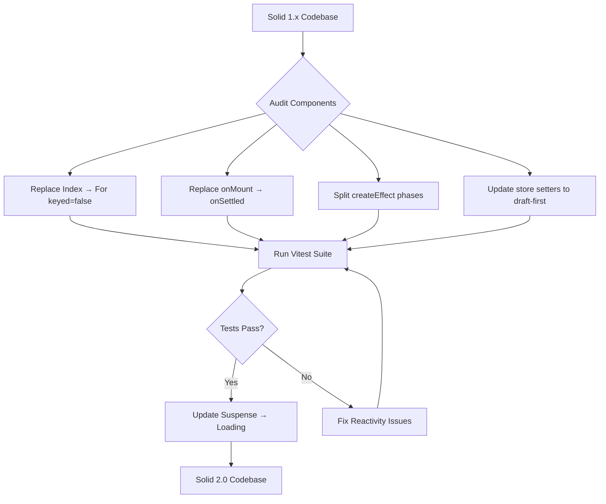

# Codex CLI for SolidJS and SolidStart Development: Fine-Grained Reactivity, MCP Tooling, and Agent-Driven Workflows


---

SolidJS occupies a unique position in the frontend landscape. Its fine-grained reactivity model — where components execute once and only the affected DOM nodes update — makes it fundamentally different from virtual-DOM frameworks like React. With Solid 2.0 Beta shipping first-class async primitives in May 2026 [^1], SolidStart 2.0 entering alpha with a pure Vite-based architecture [^2], and a growing MCP server ecosystem, the framework has matured into a serious choice for production applications. This article covers how to configure Codex CLI for effective SolidJS development, from AGENTS.md patterns through testing workflows and the emerging MCP tooling.

## Why SolidJS Requires Framework-Specific Agent Configuration

Most AI coding agents default to React patterns: re-rendering components, using `useEffect` for side effects, and assuming a virtual DOM. SolidJS breaks all three assumptions. Components run exactly once during initialisation. Reactive state changes propagate through a dependency graph to update only the specific DOM nodes that depend on the changed signal [^3]. There is no diffing, no reconciliation, and no component re-execution.

This matters for Codex CLI because unconfigured agents will:

- Wrap signal accessors in unnecessary `useMemo` equivalents
- Destructure props (breaking reactivity tracking)
- Use React-style conditional rendering instead of Solid's `<Show>` and `<Switch>` components
- Miss that `createEffect` has been split into separate compute and apply phases in Solid 2.0 [^1]

A well-crafted `AGENTS.md` eliminates these failure modes.

## AGENTS.md Configuration for SolidJS Projects

The following `AGENTS.md` establishes the reactive model as a hard constraint:

```markdown
# SolidJS Project — Agent Instructions

## Framework: SolidJS 2.0 Beta / SolidStart 2.0 Alpha

### Reactivity Rules (CRITICAL)
- Components execute ONCE. Never assume re-rendering.
- Access signals via function calls: `count()` not `count`.
- NEVER destructure props — use `props.name` or `mergeProps`.
- Use `<Show>` for conditional rendering, `<For>` for lists.
- `<Index>` is removed in Solid 2.0; use `<For keyed={false}>`.
- `onMount` is replaced by `onSettled` in Solid 2.0.
- `createEffect` now has separate compute and apply phases.

### State Management
- Prefer signals (`createSignal`) for local state.
- Use stores (`createStore`) for nested/complex state.
- Store setters use draft-first semantics in Solid 2.0.
- Use `action()` + `createOptimisticStore` for server writes.

### SolidStart Conventions
- File-based routing in `src/routes/`.
- Server functions via `"use server"` directive.
- `createAsync` for data loading in routes.
- API routes in `src/routes/api/`.

### Testing
- Vitest + @solidjs/testing-library.
- `render()` takes a function returning a component, not the component itself.
- No `rerender` method exists — Solid does not re-render.
- Rarely need `waitFor` — reactive changes are near-instantaneous.

### Build
- Vite with vite-plugin-solid.
- SolidStart uses `@solidjs/start/config` for defineConfig.
```

Place this at the repository root. For monorepos with a SolidJS package alongside other frameworks, use a package-level `AGENTS.md` in the Solid workspace directory [^4].

## Project Scaffolding with Codex CLI

SolidStart projects scaffold cleanly via Codex CLI:

```bash
codex "Create a new SolidStart project with TypeScript, \
  Tailwind CSS v4, and Vitest configured. Use the latest \
  SolidStart 2.0 alpha. Set up file-based routing with a \
  home page and an about page."
```

Codex will run `npm create solid@latest` or set up the project manually. The key configuration file is `app.config.ts`:

```typescript
import { defineConfig } from "@solidjs/start/config";

export default defineConfig({
  server: {
    preset: "node-server",
  },
  vite: {
    plugins: [],
  },
});
```

For the Vite plugin in non-SolidStart projects:

```typescript
import { defineConfig } from "vite";
import solidPlugin from "vite-plugin-solid";

export default defineConfig({
  plugins: [solidPlugin()],
  test: {
    environment: "jsdom",
    globals: true,
    deps: {
      optimizer: {
        web: {
          include: ["solid-js"],
        },
      },
    },
  },
});
```

Since vite-plugin-solid v2.8.2, the plugin configures the test environment automatically, so manual Vitest configuration for Solid-specific transforms is no longer necessary [^5].

## The SolidJS Skills MCP Server

The solidJSkills MCP server [^6] provides document browsing tools for SolidJS development guides, skills, and templates. It covers component building, refactoring, code review, and scaffolding workflows — specifically targeting Solid 2.0 patterns.

Configure it in `codex.toml`:

```toml
[mcp.solidjs-skills]
command = "node"
args = ["/path/to/solidJSkills/mcp-server/src/index.js"]
```

The server exposes:

- **Component guides** — Solid 2.0 reactivity patterns, routing, and SSR
- **Validation tools** — scripts that check code follows SolidJS best practices
- **Scaffolding templates** — for components, routes, and server functions

For teams, add new skills by creating a directory under `skills/` with a `SKILL.md` file following the included template [^6].

## Agent-Driven Component Development

SolidJS's signal-based reactivity makes component generation more predictable for agents than virtual-DOM frameworks. A signal dependency graph is explicit and static — the agent does not need to reason about when or whether a component will re-render.

```bash
codex "Create a SolidJS component that fetches user data \
  using createResource, displays it with loading and error \
  states using Show, and includes a refresh button that \
  invalidates the resource."
```

A well-configured agent produces:

```tsx
import { createResource, createSignal, Show } from "solid-js";

interface User {
  id: number;
  name: string;
  email: string;
}

const fetchUser = async (id: number): Promise<User> => {
  const response = await fetch(`/api/users/${id}`);
  if (!response.ok) throw new Error("Failed to fetch user");
  return response.json();
};

export default function UserProfile(props: { userId: number }) {
  const [refreshKey, setRefreshKey] = createSignal(0);
  const [user] = createResource(
    () => [props.userId, refreshKey()] as const,
    ([id]) => fetchUser(id)
  );

  return (
    <div class="user-profile">
      <Show when={user.loading}>
        <p>Loading...</p>
      </Show>
      <Show when={user.error}>
        <p class="error">Error: {user.error.message}</p>
      </Show>
      <Show when={user()}>
        {(userData) => (
          <div>
            <h2>{userData().name}</h2>
            <p>{userData().email}</p>
          </div>
        )}
      </Show>
      <button onClick={() => setRefreshKey((k) => k + 1)}>
        Refresh
      </button>
    </div>
  );
}
```

Note the Solid-specific patterns: `props.userId` accessed without destructuring, `<Show>` for conditional rendering, and the callback form `{(userData) => ...}` for narrowing the resource value.

## Testing Workflows with Vitest

SolidJS testing has a critical difference from React: the `render` function takes a function returning a component, not the component directly [^5]:

```typescript
import { render } from "@solidjs/testing-library";
import { describe, it, expect } from "vitest";
import UserProfile from "./UserProfile";

describe("UserProfile", () => {
  it("renders user data", async () => {
    const { findByText } = render(() => (
      <UserProfile userId={1} />
    ));

    expect(await findByText("Alice")).toBeInTheDocument();
  });
});
```

Configure Codex CLI to run tests on component changes:

```bash
codex "Run vitest in watch mode for the UserProfile \
  component. Fix any failing tests, but remember that \
  Solid does not re-render — reactive changes are \
  near-instantaneous, so avoid unnecessary waitFor calls."
```

The vitest-mcp server (covered in the Vite 8 article) also works with SolidJS projects, providing AI-optimised test execution and failure analysis [^7].

## Solid 2.0 Migration Patterns

With Solid 2.0 Beta released on 15 May 2026 [^1], teams face several breaking changes. Codex CLI can automate the mechanical parts of migration:

```bash
codex "Migrate this SolidJS 1.x codebase to Solid 2.0. \
  Replace Index with For keyed={false}. Replace onMount \
  with onSettled. Update createEffect to use the new \
  split compute/apply phases. Update store setters to \
  draft-first semantics."
```

The key migration steps are:



The Solid team provides a comprehensive migration guide [^1], and the solidJSkills MCP server includes Solid 2.0 pattern references that help agents generate correct code during migration [^6].

## SolidStart Server Functions and API Routes

SolidStart's server functions use the `"use server"` directive, similar to React Server Actions but integrated with Solid's reactivity:

```bash
codex "Create a SolidStart API route for user \
  authentication using server functions. Include \
  createAsync for the session check and action() \
  for the login mutation with optimistic updates."
```

In Solid 2.0, the new `action()` primitive combined with `createOptimisticStore` provides a clean pattern for mutations [^1]:

```typescript
"use server";

import { action } from "@solidjs/router";

export const loginAction = action(async (formData: FormData) => {
  const email = formData.get("email") as string;
  const password = formData.get("password") as string;

  const session = await authenticate(email, password);
  if (!session) throw new Error("Invalid credentials");

  return redirect("/dashboard");
});
```

## Performance Characteristics That Matter for Agents

SolidJS's ~7.6 KB minified and gzipped core [^3] and its near-vanilla-JavaScript benchmark performance make it attractive for performance-sensitive applications. Radware reported Solid bundles at approximately 80 KB versus React's 290 KB for equivalent functionality [^3].

For Codex CLI workflows, this translates to:

- **Smaller generated bundles** — agents can be more aggressive with component composition without bundle-size anxiety
- **No re-render optimisation needed** — no `React.memo`, `useMemo`, or `useCallback` equivalents to reason about
- **Explicit dependency tracking** — the agent can trace exactly which signals affect which DOM nodes

## Ecosystem Libraries for Agent Workflows

The SolidJS component ecosystem has matured significantly [^3]:

| Library | Stars | Components | Use Case |
|---------|-------|------------|----------|
| Kobalte | 1,700+ | 40+ | Accessible headless components |
| Ark UI | — | 45+ | Multi-framework component library |
| Solid UI | 1,300+ | — | Tailwind-based component system |
| Corvu | — | — | Animated primitives |

When prompting Codex CLI, specify which UI library to use:

```bash
codex "Build a data table component using Kobalte \
  for accessible primitives and Tailwind CSS for \
  styling. Include sorting, filtering, and pagination \
  with SolidJS signals for state management."
```

## Hooks Configuration for SolidJS Projects

Configure Codex CLI hooks to enforce SolidJS patterns:

```toml
[hooks.on_agent_write]
command = "bash"
args = ["-c", """
  # Check for common React patterns that break Solid
  if grep -rn 'useEffect\|useState\|useMemo' src/; then
    echo 'ERROR: React hooks detected in SolidJS project'
    exit 1
  fi
  # Check for destructured props
  if grep -Pn 'function\s+\w+\(\s*\{' src/components/; then
    echo 'WARNING: Possible prop destructuring detected'
  fi
"""]
```

This catches the most common agent mistakes before they reach the codebase.

## What Comes Next

SolidStart 2.0 is replacing its Vinxi layer with a pure Vite-based system called "DeVinxi" [^2], which will simplify the build pipeline and make it more compatible with the broader Vite plugin ecosystem. The Nitro v3 upgrade is also planned before the 2.0 stable release [^2]. As TC39's Signals proposal (currently Stage 1) progresses toward standardisation [^3], Solid's reactive model may become the native JavaScript pattern — making framework-specific agent configuration less necessary over time, but essential today.

## Citations

[^1]: SolidJS 2.0 Beta: First-Class Async, Reworked Suspense and Deterministic Batching — InfoQ, May 2026. [https://www.infoq.com/news/2026/05/solidjs-2-async/](https://www.infoq.com/news/2026/05/solidjs-2-async/)

[^2]: SolidStart: Public Roadmap — DeVinxi and Beyond — GitHub Discussion. [https://github.com/solidjs/solid-start/discussions/1960](https://github.com/solidjs/solid-start/discussions/1960)

[^3]: The state of Solid.js in 2026: signals, performance, and growing influence — Listiak.dev. [https://listiak.dev/blog/the-state-of-solid-js-in-2026-signals-performance-and-growing-influence](https://listiak.dev/blog/the-state-of-solid-js-in-2026-signals-performance-and-growing-influence)

[^4]: Custom instructions with AGENTS.md — Codex CLI, OpenAI Developers. [https://developers.openai.com/codex/guides/agents-md](https://developers.openai.com/codex/guides/agents-md)

[^5]: Testing — SolidJS Documentation. [https://docs.solidjs.com/guides/testing](https://docs.solidjs.com/guides/testing)

[^6]: solidJSkills MCP Server — GitHub (lvcoi). [https://github.com/lvcoi/solidJSkills](https://github.com/lvcoi/solidJSkills)

[^7]: Vitest MCP Server — referenced in Vite 8 article. See vitest-mcp for AI-optimised test execution integration.
