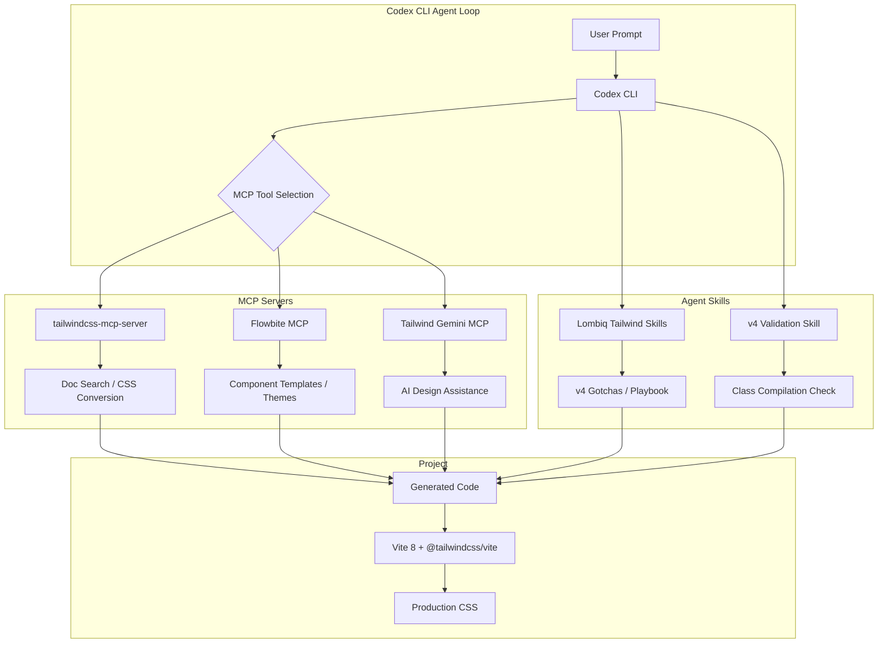

# Codex CLI for Tailwind CSS v4: MCP Servers, Agent Skills, and Utility-First Styling Workflows


---

Tailwind CSS v4 rewrote the engine from scratch, delivering full builds up to 5× faster and incremental rebuilds measured in microseconds rather than milliseconds [^1]. Configuration moved entirely into CSS via `@theme` directives, template discovery became automatic, and the framework adopted modern CSS primitives — cascade layers, `@property`, and OKLCH colour spaces [^1]. With v4.3 shipping first-party scrollbar styling and expanded logical property utilities in May 2026 [^2], the framework sits at the centre of modern frontend work.

This article covers how to wire Codex CLI into Tailwind CSS v4 projects using MCP servers for documentation and component access, agent skills for v4-specific guidance, and practical patterns for migration, component generation, and design-system enforcement.

## The Tailwind v4 Paradigm Shift

Tailwind v4's Oxide engine (written in Rust) eliminated the JavaScript configuration file [^1]. Where v3 projects maintained a `tailwind.config.js` exporting theme overrides, v4 projects declare everything in CSS:

```css
/* app.css — Tailwind v4 configuration */
@import "tailwindcss";

@theme {
  --color-brand-500: oklch(0.637 0.237 25.331);
  --color-brand-600: oklch(0.537 0.237 25.331);
  --font-family-display: "Inter Variable", sans-serif;
  --breakpoint-3xl: 120rem;
}
```

This has a direct consequence for agent workflows: the configuration is now co-located with CSS, making it visible to any tool that reads stylesheets. No separate JavaScript AST parsing is required.

The most common breaking change from v3 is the gradient rename — `bg-gradient-to-*` becomes `bg-linear-to-*` across all gradient utilities [^3]. Agents performing migrations need to handle this systematically.

## MCP Server Ecosystem

Three MCP servers stand out for Tailwind development with Codex CLI.

### tailwindcss-mcp-server

The `tailwindcss-mcp-server` npm package [^4] provides eight tools covering documentation lookup, CSS-to-Tailwind conversion, colour palette generation, and component templating. It supports both v3 and v4 with version-specific guidance.

```toml
# codex.toml — Tailwind MCP server configuration
[mcp.tailwind]
command = "npx"
args = ["tailwindcss-mcp-server"]
```

Key tools exposed:

| Tool | Purpose |
|---|---|
| `search_tailwind_docs` | Full-text search across Tailwind documentation |
| `convert_css_to_tailwind` | Transform raw CSS into utility classes |
| `get_tailwind_utilities` | Retrieve utilities by category |
| `generate_component_template` | Scaffold component markup |
| `get_tailwind_colors` | Access the complete colour palette |
| `generate_color_palette` | Create custom palettes from brand colours |

### Flowbite MCP

Flowbite MCP [^5] goes beyond documentation — it provides access to 60+ pre-built UI components (buttons, cards, modals, dropdowns, form elements) with framework-specific output for HTML, React, Svelte, and Vue. It also offers Figma-to-code conversion and theme generation from branded colours.

```toml
[mcp.flowbite]
command = "npx"
args = ["flowbite-mcp"]
```

This is particularly useful when Codex CLI is generating UI: rather than hallucinating component markup, the agent retrieves battle-tested Flowbite components and adapts them to the project's design tokens.

### MCP Tailwind Gemini

For teams wanting AI-augmented design assistance, the `mcp-tailwind-gemini` server [^6] integrates Gemini for intelligent CSS generation and cross-platform framework support. It bridges the gap between design intent and Tailwind implementation.

## Agent Skills for Tailwind v4

Two open-source agent skills provide Tailwind-specific context that dramatically improves code generation quality.

### Lombiq Tailwind Agent Skills

The Lombiq `Tailwind-Agent-Skills` repository [^7] packages agent-optimised Tailwind v4 documentation with a curated gotchas list, an implementation playbook, and a local documentation snapshot. After installation, it generates a `docs-index.tsx` mapping categories and slugs to MDX files so agents load only the documentation they need.

```bash
# Install via the skills CLI
skills install lombiq/tailwind-agent-skills
```

The skill includes an engineering playbook covering implementation, refactoring, and review tasks — the kind of structured guidance that prevents agents from generating v3 syntax in a v4 project.

### tlq5l Tailwind CSS v4 Skill

The `tailwindcss-v4-skill` [^8] takes a different approach: it includes unfakeable CLI validation, meaning the skill verifies that generated Tailwind classes actually compile against the project's configuration. This catches phantom utilities that look plausible but do not exist.

## Practical Workflows

### Migration from v3 to v4

The v3-to-v4 migration is well-suited to `codex exec` batch processing. The key changes are: config migration from JavaScript to CSS `@theme`, gradient utility renames, and removal of deprecated utilities [^3].

```bash
# Batch-migrate gradient utilities across the codebase
codex exec "Find all files using bg-gradient-to-* classes and rename \
them to bg-linear-to-*. Update both JSX className props and HTML class \
attributes. Do not change any other classes."
```

A more comprehensive migration prompt:

```bash
codex exec "Migrate this project from Tailwind CSS v3 to v4: \
1. Convert tailwind.config.js theme overrides to @theme directives in app.css \
2. Replace bg-gradient-to-* with bg-linear-to-* everywhere \
3. Remove the @tailwind directives and replace with @import 'tailwindcss' \
4. Remove tailwind.config.js if fully migrated \
5. Run the build to verify no errors"
```

### Component Generation with Design Tokens

When a project defines design tokens in `@theme`, Codex CLI can generate components that respect those tokens:

```bash
codex "Create a pricing card component using our brand-500 and brand-600 \
colours from @theme. Use the Flowbite card pattern as a base but adapt \
it to our design system. Include dark mode variants."
```

With the Flowbite MCP server connected, the agent retrieves the card component template, then adapts it to the project's `@theme` tokens rather than inventing arbitrary colour values.

### Design System Enforcement via Hooks

Codex CLI hooks can enforce Tailwind conventions on every file write:

```toml
# codex.toml — hook to catch arbitrary values
[hooks.on_file_write]
command = "bash"
args = ["-c", "grep -rn 'class.*\\[#[0-9a-fA-F]' $FILE && echo 'ERROR: Use @theme tokens, not arbitrary hex values' && exit 1 || exit 0"]
```

This prevents the agent from writing arbitrary values like `bg-[#ff5733]` when a design token should be used instead.

### Tailwind with Vite 8

Given that Vite is the recommended build tool for Tailwind v4 [^1], and Vite 8 shipped with the Rolldown bundler [^9], the combination is the current standard frontend stack. The `@tailwindcss/vite` plugin integrates directly:

```typescript
// vite.config.ts
import tailwindcss from "@tailwindcss/vite";
import { defineConfig } from "vite";

export default defineConfig({
  plugins: [tailwindcss()],
});
```

With both the Tailwind and Vite MCP servers connected, Codex CLI has full visibility into the build pipeline and styling system simultaneously.

## Architecture: Agent-Assisted Tailwind Development



## AGENTS.md Configuration

A well-crafted `AGENTS.md` is the single highest-impact investment for Tailwind projects [^10]. Here is a battle-tested template:

```markdown
## Styling Rules

- This project uses Tailwind CSS v4.3 with @theme configuration in `src/app.css`
- NEVER use arbitrary hex values in classes — use design tokens from @theme
- NEVER generate Tailwind v3 syntax (no bg-gradient-to-*, no tailwind.config.js references)
- Use OKLCH colour values for any new colour definitions
- Dark mode uses the `dark:` variant with class-based toggling
- Prefer logical properties (ps-*, ms-*, pbs-*) over physical (pl-*, ml-*, pt-*)
- Component files live in `src/components/` with co-located styles
- Use the Flowbite MCP server for component scaffolding before writing from scratch
```

## v4.2 and v4.3 Features Worth Knowing

Tailwind v4.2 (February 2026) shipped a first-class webpack plugin for Next.js projects and improved recompilation speed by 3.8× [^11]. Four new colour palettes (mauve, olive, mist, taupe) expanded the neutral options.

Tailwind v4.3 (May 2026) [^2] added:

- **First-party scrollbar styling** — `scrollbar-*` utilities replacing the need for plugins
- **Expanded logical property utilities** — `pbs-*`, `mbs-*`, `inline-*`, `block-*` and logical inset utilities
- **`zoom-*` and `tab-size-*` utilities** — previously requiring arbitrary values
- **`font-features-*` utility** — OpenType feature control without custom CSS
- **`@container-size`** — size containers for height-aware container queries
- **Better `@variant` support** — cleaner custom variant definitions

Agents configured with the Lombiq skill or an up-to-date `AGENTS.md` will use these v4.3 utilities rather than falling back to older workarounds.

## Cost and Performance Considerations

Tailwind's utility-first approach generates less unique CSS than component-based frameworks. A typical production build with v4's Oxide engine produces CSS files under 10 KB (gzipped), with full rebuilds completing in under 100 ms [^1]. This means the Codex CLI feedback loop — edit, rebuild, verify — stays fast even on large projects.

The MCP server overhead is minimal: `tailwindcss-mcp-server` runs as a lightweight Node.js process, and its documentation search is local after initial load. Flowbite MCP adds component retrieval but keeps payloads small by returning only the requested component's markup.

## Conclusion

Tailwind CSS v4 and Codex CLI are a natural pairing. The framework's move to CSS-native configuration makes styling visible to agents without special parsers. The MCP server ecosystem provides documentation, components, and conversion tools. Agent skills add v4-specific guardrails that prevent version confusion. Combined with an explicit `AGENTS.md` and hook-based enforcement, this stack delivers reliable, design-system-compliant UI generation at senior-developer quality.

---

## Citations

[^1]: Tailwind CSS v4.0 release announcement — [https://tailwindcss.com/blog/tailwindcss-v4](https://tailwindcss.com/blog/tailwindcss-v4)
[^2]: Tailwind CSS v4.3 release announcement — [https://tailwindcss.com/blog/tailwindcss-v4-3](https://tailwindcss.com/blog/tailwindcss-v4-3)
[^3]: Tailwind CSS v4 Migration Best Practices 2026 — [https://www.digitalapplied.com/blog/tailwind-css-v4-2026-migration-best-practices](https://www.digitalapplied.com/blog/tailwind-css-v4-2026-migration-best-practices)
[^4]: tailwindcss-mcp-server npm package — [https://www.npmjs.com/package/tailwindcss-mcp-server](https://www.npmjs.com/package/tailwindcss-mcp-server)
[^5]: Flowbite MCP Server — [https://flowbite.com/docs/getting-started/mcp/](https://flowbite.com/docs/getting-started/mcp/)
[^6]: MCP Tailwind Gemini — [https://github.com/Tai-DT/mcp-tailwind-gemini](https://github.com/Tai-DT/mcp-tailwind-gemini)
[^7]: Lombiq Tailwind Agent Skills — [https://github.com/Lombiq/Tailwind-Agent-Skills](https://github.com/Lombiq/Tailwind-Agent-Skills)
[^8]: Tailwind CSS v4 Skill with CLI validation — [https://github.com/tlq5l/tailwindcss-v4-skill](https://github.com/tlq5l/tailwindcss-v4-skill)
[^9]: Codex CLI for Vite 8 article — `2026-05-29-codex-cli-vite-8-development-rolldown-mcp-servers-agent-driven-frontend-workflows.md`
[^10]: OpenAI Codex Agent Skills documentation — [https://developers.openai.com/codex/skills](https://developers.openai.com/codex/skills)
[^11]: Tailwind CSS 4.2 Ships Webpack Plugin, New Palettes — [https://www.infoq.com/news/2026/04/tailwind-css-4-2-webpack/](https://www.infoq.com/news/2026/04/tailwind-css-4-2-webpack/)
