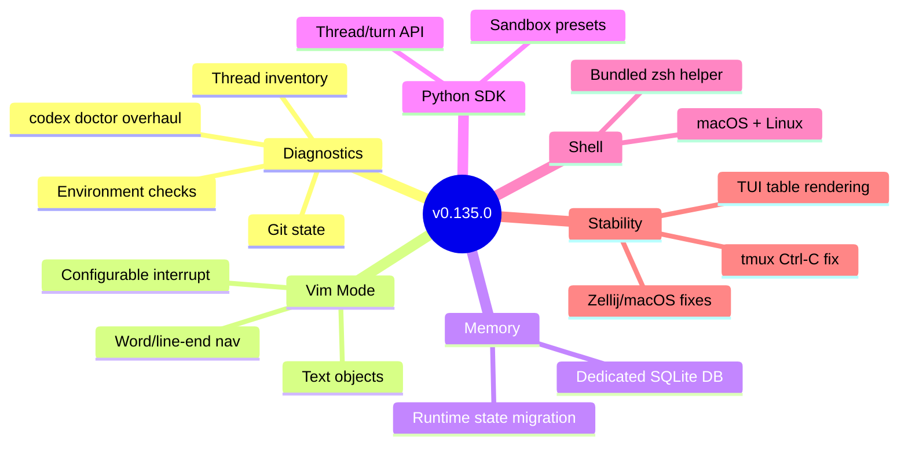
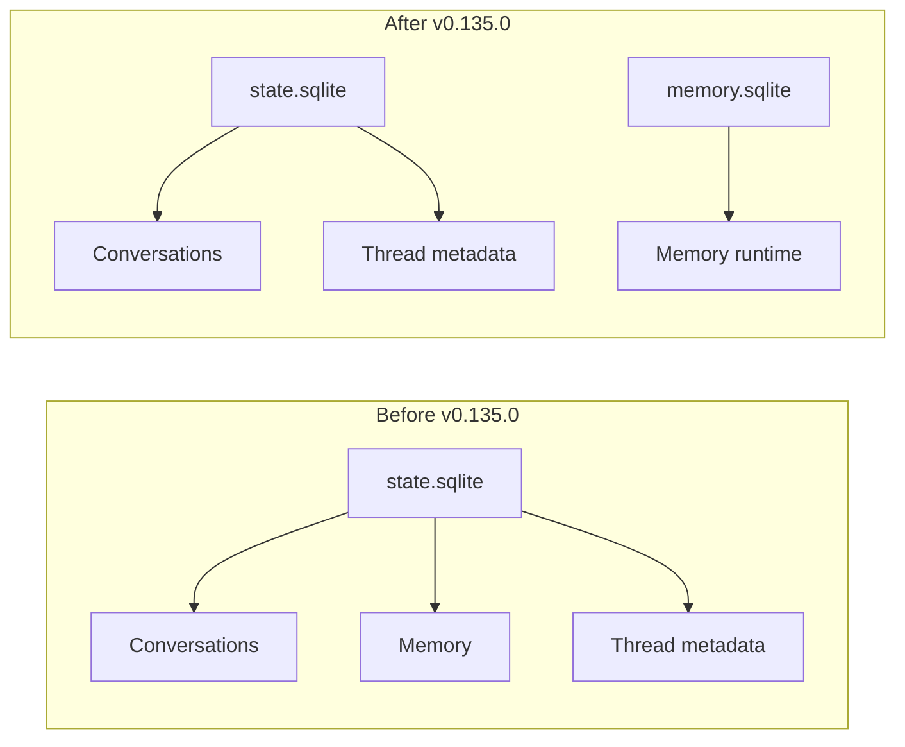

# Codex CLI v0.135.0 Release Guide: Enhanced Doctor Diagnostics, Vim Text Objects, Memory SQLite Migration, and Python SDK Sandbox Presets


---

Codex CLI v0.135.0 shipped on 28 May 2026 [^1], arriving just two days after v0.134.0's conversation history search and profile unification. Where v0.134.0 focused on discovery and configuration, v0.135.0 turns inward: richer self-diagnostics, a more capable modal editor, a cleaner memory storage architecture, and friendlier SDK ergonomics. This guide covers every change that matters for day-to-day use.

## What Shipped

The release spans six areas: diagnostics, remote status, Vim mode editing, permission profiles, shell integration, and the Python SDK. Alongside these features sit targeted bug fixes for TUI rendering, terminal compatibility, and session resume flows [^1].



## Enhanced `codex doctor` Diagnostics

The `codex doctor` command has existed since v0.131.0, but v0.135.0 substantially broadens its scope [^2]. The command now reports across five diagnostic categories: environment, Git, terminal, app-server, and thread inventory [^1].

### What It Checks

Previously, `codex doctor` focused on authentication and network reachability. The expanded version now captures:

- **Environment**: OS version, architecture, Codex binary version, Node/Rust runtime versions, proxy configuration, and `PATH` anomalies
- **Git**: Repository state, branch, remote URLs, credential helper, and whether the working tree is clean
- **Terminal**: `TERM` value, locale, terminal dimensions, `TERMINFO` paths, and multiplexer detection (tmux, Zellij, screen) [^3]
- **App-server**: Whether the local app-server process is running, its PID, socket path, and health endpoint status
- **Thread inventory**: Count of local conversation threads, storage size, and any corrupted session files

### Usage Patterns

```bash
# Full diagnostic output (now the default)
codex doctor

# Machine-readable JSON with PII redaction
codex doctor --json

# Condensed summary for quick triage
codex doctor --summary
```

The JSON output integrates with feedback uploads, attaching a `codex-doctor-report.json` to Sentry reports and deriving tags from failing or warning checks [^2]. This makes support triage substantially faster — instead of asking users to run five separate commands, a single `codex doctor --json` captures the full picture.

### Practical Impact

If you maintain team documentation or onboarding scripts, update your troubleshooting runbooks. The old advice of "check `codex doctor` and paste the output" now yields genuinely useful diagnostic data rather than a narrow auth-and-network check.

## `/status` Displays Remote Connection Details

When connected to a remote app-server via WebSocket, the `/status` slash command now shows the server version and connection specifics [^1]. This is particularly useful when debugging version mismatches between local CLI and remote server instances — a common source of subtle failures in enterprise deployments where app-server upgrades lag behind CLI updates.

## Vim Mode: Text Objects and Navigation

Codex CLI's built-in Vim mode, introduced in v0.129.0, gains meaningful editing power in this release [^1].

### New Capabilities

- **Text-object editing**: `ci"`, `da(`, `yi{`, and similar text-object operations now work in the composer. This is the feature most frequently requested since Vim mode launched [^4].
- **Word and line-end navigation**: `w`, `e`, `b`, `W`, `E`, `B` now handle punctuation boundaries correctly. `$` and `0` respect soft-wrapped lines.
- **Configurable interrupt-turn binding**: The key that interrupts a running turn (default: `Ctrl-C` in normal mode) can now be remapped via the keymap configuration.

### Configuration

Vim mode keybindings live in your Codex configuration under the keymap stack:

```toml
[tui.keymap]
mode = "vim"

[tui.keymap.vim]
interrupt_turn = "ctrl-c"  # Customisable since v0.135.0
```

For developers who live in Vim or Neovim, this closes the gap between the Codex composer and a proper modal editor. Combined with the existing `/fork` and `/side` commands, you can now edit complex multi-line prompts with the same muscle memory you use for code.

## `/permissions` Understands Named Profiles

The `/permissions` slash command now recognises named permission profiles and displays their custom configurations [^1]. Previously, `/permissions` only showed the active approval mode (Auto, Read-only, Full Access). With v0.135.0, if you've defined named profiles in your configuration:

```toml
[profiles.ci]
sandbox = "read-only"
model = "o4-mini"

[profiles.develop]
sandbox = "workspace-write"
model = "gpt-5.5"
```

Running `/permissions` will display the active profile name alongside its specific sandbox scope and any custom tool allowlists. This pairs with v0.134.0's `--profile` unification — profiles are now the canonical way to manage permission contexts across CLI, TUI, and sandbox flows.

## Bundled Zsh Helper for Packaged Builds

Packaged Codex builds (Homebrew, `.deb`, `.rpm`) can now locate and use a bundled patched zsh helper on both macOS and Linux [^1]. Previously, the zsh integration relied on the system zsh, which on macOS ships an outdated version (5.8.1) lacking features Codex needs for shell completions and inline suggestions. The bundled helper eliminates version-dependent failures without requiring users to install a newer zsh.

## Python SDK: Sandbox Presets

The Python SDK exposes friendly `Sandbox` presets for the thread and turn APIs [^1] [^5]. This simplifies programmatic agent embedding by replacing raw string sandbox modes with typed presets:

```python
from codex_app_server import Codex, Sandbox

with Codex() as codex:
    # Before v0.135.0: sandbox="workspace-write"
    # After v0.135.0: typed preset
    thread = codex.thread_start(
        model="gpt-5.5",
        sandbox=Sandbox.WORKSPACE_WRITE
    )
    result = thread.run("Refactor the auth module to use dependency injection")
    print(result.final_response)
```

The available presets are:

| Preset | Behaviour |
|--------|-----------|
| `Sandbox.READ_ONLY` | Can read files and run safe commands; no writes |
| `Sandbox.WORKSPACE_WRITE` | Can write inside the working directory and added directories |
| `Sandbox.FULL_ACCESS` | Unrestricted filesystem and command access |

This is a small but welcome ergonomic improvement. Passing raw strings for safety-critical configuration was always a code smell; typed presets catch typos at import time rather than runtime [^5].

## Memory Runtime State: Dedicated SQLite Database

Under the hood, v0.135.0 migrates memory runtime state into a dedicated SQLite database [^1]. Previously, memory state shared a database with conversation history and other local state, creating contention during concurrent reads and writes — particularly noticeable when running multiple `codex exec` processes in CI pipelines.



The migration happens automatically on first launch after upgrading. If you're running Codex in ephemeral CI environments, the split means you can mount only the memory database for cross-session persistence without carrying the full state directory [^6].

### Recovery Considerations

Earlier versions had SQLite migration issues that caused startup crashes (notably the 0.130→0.131 transition) [^6]. The v0.135.0 migration includes safeguards: it preserves existing data, fails closed when state cannot open, and exposes recovery paths. If you encounter issues, `codex doctor` will now flag database integrity problems in its thread inventory check.

## Bug Fixes Worth Noting

Several fixes in this release address long-standing paper cuts:

- **TUI markdown rendering**: Table column sizing and multiline list rendering improved significantly. Wide tables no longer overflow the terminal width [^1].
- **macOS and Zellij stability**: Fixed stderr corruption and raw-output overlap that caused garbled output when using Codex inside Zellij on macOS [^1].
- **tmux/iTerm `Ctrl-C` handling**: Older tmux sessions with keyboard enhancement limitations no longer lose `Ctrl-C` handling mid-session [^1].
- **Slash-command completion**: Typing `/model gpt` and then backspacing no longer clears your draft text. The completion engine preserves existing composer content [^1].
- **App mentions**: The `@` mention picker now excludes disabled or inaccessible apps, reducing noise in the suggestion list [^1].
- **Resume flows**: `codex resume` now includes non-interactive `exec` sessions in its listing and honours working directory overrides for cached threads [^1].

## Upgrade Path

```bash
# Homebrew
brew upgrade codex

# npm
npm install -g @openai/codex@latest

# Verify
codex --version
# 0.135.0

# Run the enhanced diagnostics to confirm
codex doctor --summary
```

The memory SQLite migration runs automatically. No manual intervention is required unless you have custom tooling that reads the raw SQLite state files directly — in which case, update those paths to account for the new `memory.sqlite` alongside the existing `state.sqlite`.

## What's Next

The alpha channel already shows v0.136.0-alpha.1 [^1], suggesting the next stable release is imminent. Based on the current development cadence of roughly one stable release per week, expect v0.136.0 in early June 2026.

## Citations

[^1]: [Codex CLI Releases — GitHub](https://github.com/openai/codex/releases)
[^2]: [feat(cli): add codex doctor diagnostics — PR #22336, openai/codex](https://github.com/openai/codex/pull/22336)
[^3]: [Codex CLI Changelog — OpenAI Developers](https://developers.openai.com/codex/changelog?type=codex-cli)
[^4]: [Support VIM editor commands in CLI text input — Issue #4757, openai/codex](https://github.com/openai/codex/issues/4757)
[^5]: [Codex SDK — OpenAI Developers](https://developers.openai.com/codex/sdk)
[^6]: [Recovery tool for Codex App SQLx checksum drift — Issue #23787, openai/codex](https://github.com/openai/codex/issues/23787)
