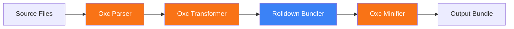
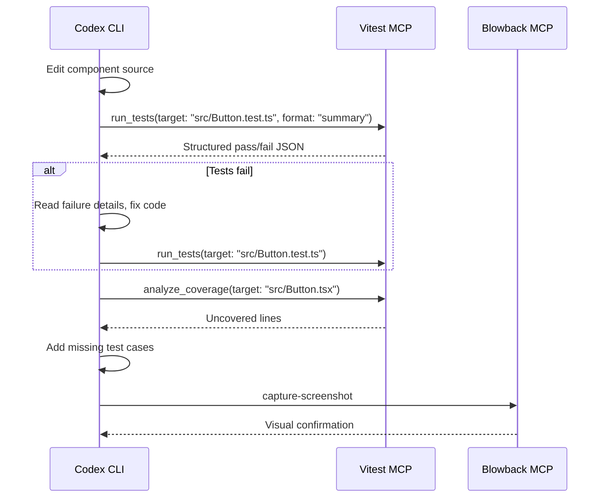

# Codex CLI for Vite 8 Development: Rolldown, MCP Servers, and Agent-Driven Frontend Workflows


---

Vite 8 shipped in March 2026 with the most significant architectural change since Vite 2: Rolldown replaced both esbuild and Rollup as a unified Rust-based bundler, delivering 10–30× faster builds [^1]. With 65 million weekly npm downloads [^2], Vite is the dominant frontend build tool — yet most agent-assisted development articles focus on frameworks built atop it rather than the build layer itself. This article covers how to integrate Codex CLI (v0.134.0) with Vite 8's toolchain, leverage the emerging MCP server ecosystem for real-time development feedback, and wire Vitest into agent-driven test loops.

## Vite 8's Rust-Powered Architecture

Vite 8 replaces the previous dual-bundler approach with a unified stack: **Rolldown** bundles and minifies, **Oxc** handles parsing, resolving, and transpiling TypeScript/JSX [^1]. The practical impact is dramatic — Linear reported build times dropping from 46 seconds to 6 seconds, and Mercedes-Benz.io saw up to 38% reductions [^2].



Key changes relevant to agent workflows:

- **Full Bundle Mode** (experimental): bundles modules during development, yielding 3× faster dev server startup and 40% faster full reloads [^2]. This reduces the feedback latency that previously made agent-driven iterative development sluggish on large codebases.
- **Built-in `resolve.tsconfigPaths`**: eliminates the need for alias plugins [^2], removing a common source of agent confusion when path resolution fails.
- **`server.forwardConsole`**: forwards browser console errors to the dev server terminal [^2], giving Codex CLI direct visibility into runtime errors without a browser MCP.

## AGENTS.md for Vite Projects

A well-structured `AGENTS.md` is the single highest-leverage configuration for agent-assisted Vite development [^3]. Here is a production-ready example:

```markdown
## Build Tool
- Vite 8 with Rolldown bundler — do NOT use esbuild or webpack commands
- Config lives in `vite.config.ts`, NOT `webpack.config.js`
- Run `npm run dev` for dev server, `npm run build` for production

## Path Resolution
- TypeScript path aliases are handled by `resolve.tsconfigPaths: true`
- Do NOT install `vite-tsconfig-paths` — it is redundant in Vite 8

## Testing
- Vitest for all tests — do NOT use Jest
- Run `npx vitest run` for single pass, `npx vitest run --coverage` for coverage
- Test files live in `__tests__/` or alongside source as `*.test.ts`

## Styling
- Tailwind CSS v4 with `@import "tailwindcss"` — no PostCSS config needed
- CSS Modules supported natively — use `.module.css` suffix

## Environment
- `.env.local` for secrets — NEVER commit this file
- `import.meta.env.VITE_*` prefix for client-exposed variables
```

This prevents common agent errors: attempting to install webpack loaders, using `process.env` instead of `import.meta.env`, or running Jest commands against a Vitest-configured project.

## MCP Server Ecosystem for Vite

Four MCP servers currently provide agent-level integration with Vite's development workflow.

### Blowback (formerly vite-mcp-server)

Blowback bridges Codex CLI with a running Vite dev server, exposing HMR events, browser console logs, screenshots, and DOM inspection via STDIO transport [^4].

```json
{
  "mcpServers": {
    "blowback": {
      "command": "npx",
      "args": ["-y", "blowback-context"],
      "env": {
        "PROJECT_ROOT": "."
      }
    }
  }
}
```

Key tools:

| Tool | Purpose |
|------|---------|
| `get-hmr-events` | Retrieve recent Hot Module Replacement updates |
| `check-hmr-status` | Verify HMR connection is live |
| `capture-screenshot` | Take page or element-level screenshots |
| `get-console-logs` | Access browser console output |
| `get-element-properties` | Inspect DOM element state |
| `monitor-network` | Track network requests |

The agent workflow this enables: Codex CLI edits a component, Blowback detects the HMR update, the agent checks `get-console-logs` for errors, and if clean, proceeds. If errors appear, the agent reads the console output and self-corrects — all without leaving the terminal.

### vite-plugin-vue-mcp

For Vue projects, this plugin exposes the component tree, Pinia state, and Vue Router configuration as MCP tools [^5]. It runs as an SSE server on the Vite dev server's port:

```typescript
// vite.config.ts
import { VueMcp } from 'vite-plugin-vue-mcp'

export default defineConfig({
  plugins: [VueMcp()],
})
```

Tools include `get-component-tree`, `get-component-state`, `edit-component-state`, `get-router-info`, `get-pinia-tree`, and `get-pinia-state` [^5]. This gives Codex CLI the ability to query runtime component state — a capability that static code analysis alone cannot provide.

### vite-react-mcp

The React equivalent provides component tree extraction, props/state/context inspection in JSON format, and component highlighting [^6]. It enables Codex CLI to verify that a React component renders with the expected props after an edit, closing the feedback loop between code changes and runtime behaviour.

### vite-plugin-mcp

A framework-agnostic Vite plugin exposing module graphs and build configuration as MCP resources [^7]. Useful for debugging dependency resolution issues — the agent can query the module graph to understand why a specific import fails.

## Vitest MCP: Agent-Optimised Test Execution

The `vitest-mcp` server deserves special attention. Standard Vitest output is verbose and wastes tokens when fed to an LLM. The Vitest MCP server provides structured, AI-optimised test results with safety guards that prevent accidental full-suite runs [^8].

```json
{
  "mcpServers": {
    "vitest": {
      "command": "npx",
      "args": ["-y", "@djankies/vitest-mcp"]
    }
  }
}
```

The server exposes four tools [^8]:

- **`set_project_root`** — establishes the working directory (required first call)
- **`list_tests`** — discovers test files in a directory
- **`run_tests`** — executes tests with `summary` or `detailed` output format
- **`analyze_coverage`** — provides line-by-line coverage gaps, auto-filtering test utilities and mocks

### Agent Test Loop Pattern



This pattern keeps the agent scoped to relevant tests. The safety guards in `vitest-mcp` prevent the agent from running `vitest` without a target — a common failure mode where the agent inadvertently executes thousands of tests and exhausts its context window.

## Practical Workflow: Scaffolding a Vite 8 Component

Here is a concrete Codex CLI session for adding a new component to a Vite 8 + React project:

```bash
# Scaffold with explicit instructions
codex "Create a <DataTable> component in src/components/DataTable.tsx that:
- Accepts columns: Column[] and data: Record<string, unknown>[]
- Supports sorting by clicking column headers
- Uses CSS Modules for styling (DataTable.module.css)
- Has a companion test file DataTable.test.tsx with Vitest
- Follows the patterns in src/components/Button/ as a reference"
```

With the Vitest MCP server configured, Codex CLI will:

1. Read the existing `Button` component for pattern reference
2. Create `DataTable.tsx`, `DataTable.module.css`, and `DataTable.test.tsx`
3. Run `run_tests` via the MCP server to verify the tests pass
4. Run `analyze_coverage` to check for coverage gaps
5. Add any missing edge-case tests

## Vite 8 Configuration for Agent Sandboxes

Codex CLI runs commands inside a sandbox. Vite's dev server needs network access, which requires sandbox configuration in `codex.toml`:

```toml
[sandbox]
# Allow Vite dev server to bind
allow-network = ["localhost:5173", "localhost:4173"]

# Allow Vite to read node_modules and source files
writable-paths = ["./src", "./public", "./dist"]
```

For `full-auto` mode where the agent manages the dev server lifecycle:

```toml
[sandbox]
allow-network = ["localhost:*"]
writable-paths = [".", "!./.env.local"]
```

Note the exclusion of `.env.local` — this prevents the agent from accidentally exposing secrets in commits.

## Build Verification with Hooks

Codex CLI hooks can enforce build integrity after every agent edit:

```toml
# codex.toml
[hooks.post-edit]
command = "npm run build -- --mode production 2>&1 | tail -20"
description = "Verify production build succeeds"
timeout = 30000
```

With Rolldown's speed, production builds that previously took 45 seconds now complete in under 10 [^2], making post-edit build verification practical rather than prohibitively slow.

## Migration from Vite 7

If the agent encounters a Vite 7 project, the migration path is straightforward. Vite 8 includes a compatibility layer that auto-converts existing esbuild and Rollup options [^2]. Add this to `AGENTS.md`:

```markdown
## Migration Notes
- `build.rollupOptions` still works — Rolldown's compatibility layer handles it
- Remove `optimizeDeps.esbuildOptions` — Oxc handles transpilation now
- Replace `@vitejs/plugin-react` v5 with v6 (drops Babel dependency)
- Set `resolve.tsconfigPaths: true` and remove `vite-tsconfig-paths` plugin
```

The agent can then execute a migration with:

```bash
codex "Migrate this project from Vite 7 to Vite 8:
- Update vite to ^8.0.14
- Update @vitejs/plugin-react to ^6.0.0
- Remove vite-tsconfig-paths and enable resolve.tsconfigPaths
- Remove any esbuild-specific config
- Run the build to verify"
```

## Performance Monitoring

Vite 8 ships with integrated Devtools, enabled via the `devtools` config option [^2]. For agent workflows, the more useful signal is build timing. A simple hook captures this:

```bash
# In AGENTS.md or codex.toml post-build hook
time npm run build 2>&1 | grep -E 'built in|error|warning'
```

If builds regress beyond a threshold, the agent can flag it in the session output — useful for catching accidental dependency bloat introduced during agent-driven feature work.

## Citations

[^1]: [Vite 8 Rolldown & Oxc 2026: Rust JS Toolchain](https://www.alexcloudstar.com/blog/vite-8-rolldown-oxc-2026/) — Vite 8 architectural overview with Rolldown and Oxc integration details
[^2]: [Vite 8.0 is out! — Official Vite Blog](https://vite.dev/blog/announcing-vite8) — Official release announcement with performance benchmarks, feature list, and migration guide
[^3]: [OpenAI Codex CLI Workflows and Best Practices](https://developers.openai.com/codex/workflows) — Official AGENTS.md guidance and workflow documentation
[^4]: [Blowback (formerly vite-mcp-server) — GitHub](https://github.com/ESnark/blowback) — MCP server for frontend dev environment integration with Vite
[^5]: [vite-plugin-vue-mcp — GitHub](https://github.com/webfansplz/vite-plugin-vue-mcp) — Vue-specific MCP plugin exposing component tree, Pinia state, and router info
[^6]: [vite-react-mcp — GitHub](https://github.com/jazelly/vite-react-mcp) — React MCP plugin for component tree and state inspection
[^7]: [vite-plugin-mcp — npm](https://www.npmjs.com/package/vite-plugin-mcp) — Framework-agnostic Vite MCP plugin for module graph inspection
[^8]: [vitest-mcp — GitHub](https://github.com/djankies/vitest-mcp) — AI-optimised Vitest runner with structured output and coverage analysis
