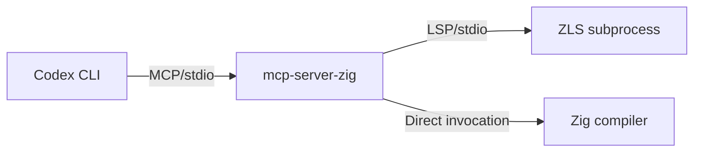
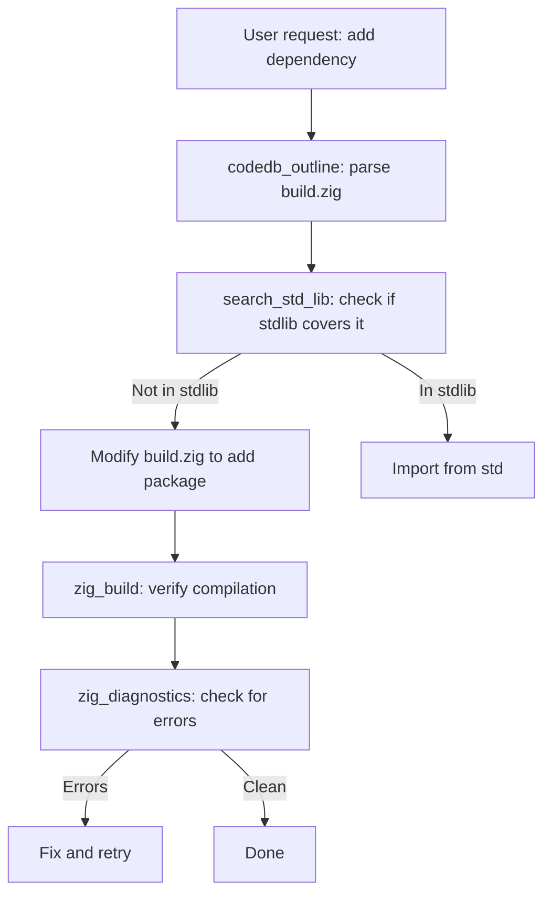

# Codex CLI for Zig Development: Build System, Cross-Compilation, and Agent Workflows for Systems Programming


---

Zig occupies a distinctive niche in the systems programming landscape. Where Rust trades ceremony for safety guarantees and C trades safety for simplicity, Zig aims for explicit, auditable control with a build system that doubles as a package manager — all without hidden control flow or a garbage collector [^1]. With Zig 0.16.0 shipping in April 2026 [^2] and a growing MCP server ecosystem, the language is now well-served by Codex CLI's agentic workflows.

This article covers the MCP servers available for Zig development, practical `config.toml` configurations, and agent-driven patterns for cross-compilation, build system management, and code intelligence.

## The Zig 0.16.0 Landscape

Zig 0.16.0 introduced I/O as an Interface — the most significant architectural change in the language's history. All input and output functionality now requires an `Io` instance, enabling `Io.Threaded`, experimental `Io.Evented`, and futures-based abstractions [^2]. The release also upgraded to LLVM 21, replaced `@Type` with specialised builtins (`@Int`, `@Struct`, `@Union`), and deprecated `@cImport` in favour of build-system-based C translation [^2].

For agent workflows, the breaking changes in 0.16.0 matter: Codex CLI needs current documentation context to generate valid code. Three MCP server ecosystems address this directly.

## MCP Server Ecosystem for Zig

### zig-mcp: Documentation Server

The `zig-mcp` server from zig-wasm provides four documentation tools: `list_builtin_functions`, `get_builtin_function`, `search_std_lib`, and `get_std_lib_item` [^3]. Its local-first design uses your installed Zig compiler via `zig std`, meaning documentation always matches your actual Zig version — critical when 0.16.0 renamed so many builtins.

```bash
codex mcp add zig-docs -- npx -y zig-mcp@latest
```

For remote documentation targeting a specific release:

```bash
codex mcp add zig-docs -- npx -y zig-mcp@latest --doc-source remote --version 0.16.0
```

### mcp-server-zig: ZLS Bridge

The `mcp-server-zig` server wraps ZLS (Zig Language Server) to expose eight language intelligence tools over MCP: `zig_diagnostics`, `zig_format`, `zig_hover`, `zig_definition`, `zig_references`, `zig_completions`, `zig_document_symbols`, and `zig_build` [^4]. The architecture layers cleanly:



ZLS initialises on first use and restarts automatically on crash. Format and build commands bypass ZLS entirely, invoking the compiler directly [^4].

```bash
codex mcp add zig-zls -- npx -y mcp-server-zig
```

**Note:** ZLS and the Zig compiler must be on your `PATH`. The server waits approximately 200ms for ZLS analysis before returning diagnostics — larger projects may need adjustment [^4].

### CodeDB: Structural Code Intelligence

CodeDB is a pure-Zig code intelligence server providing 21 MCP tools including `codedb_tree`, `codedb_outline`, `codedb_symbol`, `codedb_search`, `codedb_deps`, and `codedb_context` [^5]. Unlike grep-based tools, CodeDB builds in-memory indexes at startup — trigram search, word indexes, and dependency graphs — delivering sub-millisecond query latency versus the ~53ms typical of CLI tools [^5].

```bash
curl -fsSL https://codedb.codegraff.com/install.sh | bash
```

The installer auto-registers CodeDB as an MCP server in Codex CLI, Claude Code, Gemini CLI, and Cursor [^5]. For manual registration:

```toml
[mcp_servers.codedb]
type = "local"
command = ["npx", "-y", "codedeebee"]
args = ["mcp"]
enabled = true
```

CodeDB supports full parsing for Zig, C/C++, Python, TypeScript, Rust, Go, and several other languages — making it particularly useful for Zig projects that interface with C libraries [^5].

## Recommended config.toml for Zig Development

A production configuration combining all three servers:

```toml
# ~/.codex/config.toml

model = "o4-mini"

[mcp_servers.zig-docs]
type = "local"
command = ["npx", "-y", "zig-mcp@latest"]
args = ["--doc-source", "local"]
enabled = true

[mcp_servers.zig-zls]
type = "local"
command = ["npx", "-y", "mcp-server-zig"]
enabled = true

[mcp_servers.codedb]
type = "local"
command = ["npx", "-y", "codedeebee"]
args = ["mcp"]
enabled = true
```

Each server serves a distinct purpose: `zig-docs` for standard library and builtin documentation, `zig-zls` for live diagnostics and navigation, and `codedb` for structural search and dependency analysis.

## Cross-Compilation Workflows

Zig's cross-compilation is one of its strongest selling points — the compiler ships with target support for over 60 architectures and operating systems, using its bundled libc headers to cross-compile C dependencies without external toolchains [^1]. This makes Zig projects ideal candidates for agent-driven build matrices.

### Agent-Driven Cross-Compilation

With the ZLS bridge providing `zig_build` and CodeDB providing dependency analysis, Codex CLI can orchestrate cross-compilation workflows:

```bash
codex "Cross-compile this project for linux-x86_64, linux-aarch64, \
  and macos-aarch64. Run zig build for each target, capture any \
  diagnostics, and summarise the results."
```

The agent can invoke `zig_build` with target-specific flags, use `zig_diagnostics` to detect platform-specific issues, and use `codedb_deps` to understand which modules depend on platform-specific code.

### Build System Patterns

Zig's `build.zig` is executable Zig code, not a declarative configuration file. This means Codex CLI can both read and modify build definitions using standard code intelligence tools. A typical agent workflow for adding a new dependency:



## Building MCP Servers in Zig with mcp.zig

The `mcp.zig` library provides a native Zig implementation of the Model Context Protocol — the first comprehensive MCP library for the language [^6]. It supports STDIO and HTTP transports with zero external dependencies and minimal binary size (~100KB) [^6].

This is relevant for teams building custom tooling: rather than wrapping Zig tools in Node.js MCP servers, you can build native MCP servers that benefit from Zig's compile-time optimisations and cross-compilation. A server built with mcp.zig compiles to a single static binary deployable to any target architecture.

```zig
const mcp = @import("mcp");

pub fn main() !void {
    var server = mcp.Server.init("my-zig-tool", "0.1.0");
    try server.addTool("analyse", "Analyse Zig source files", handleAnalyse);
    try server.run(.stdio);
}
```

⚠️ The mcp.zig API may have evolved since its initial release — verify the current API against the repository documentation before use.

## Practical Agent Workflows

### Migration Assistant for 0.16.0 Breaking Changes

Zig 0.16.0's breaking changes are extensive. An effective agent prompt:

```bash
codex "Migrate this codebase from Zig 0.15 to 0.16. Key changes: \
  replace @Type with @Int/@Struct/@Union, update @cImport to \
  build-system C translation, add Io parameters to all I/O functions. \
  Run diagnostics after each file change."
```

The agent uses `zig_diagnostics` after each modification to verify the migration incrementally, rather than attempting a wholesale rewrite.

### C Interop and FFI

Zig's seamless C interop means many Zig projects wrap C libraries. CodeDB's multi-language parsing (Zig + C/C++) combined with its dependency graph tools lets the agent understand cross-language boundaries:

```bash
codex "This project wraps libcurl via C interop. Find all C function \
  declarations we import, check they match the libcurl 8.x API, and \
  update any deprecated calls."
```

### Fuzz Testing with Agent Oversight

Zig 0.16.0 includes an integrated fuzzer [^2]. Codex CLI can orchestrate fuzz campaigns:

```bash
codex "Run the fuzz tests in src/parser.zig for 60 seconds. If any \
  crashes are found, analyse the failing inputs, create minimal \
  reproduction cases, and propose fixes."
```

## Performance Considerations

The combination of CodeDB's indexed queries and ZLS's incremental analysis creates a responsive agent experience even on large codebases. CodeDB reports 1,253x faster MCP queries compared to CLI-based alternatives on benchmarked workloads [^5]. For Zig projects with significant C dependencies, CodeDB's multi-language parsing avoids the need for separate C-specific tooling.

Memory usage scales with project size: CodeDB holds indexes in-process, whilst ZLS maintains its own incremental state. For very large monorepos, consider running CodeDB with project-scoped paths rather than repository root.

## Conclusion

Zig's explicit design philosophy — no hidden allocators, no hidden control flow, no garbage collector — pairs well with agentic workflows that benefit from predictable, auditable code. The MCP ecosystem now provides documentation context (zig-mcp), live language intelligence (mcp-server-zig via ZLS), and structural code search (CodeDB), covering the three pillars needed for effective agent-driven development. With Zig 0.16.0's breaking changes still rippling through the ecosystem and 0.17.0 expected imminently [^7], having these tools configured in your Codex CLI setup is not merely convenient — it is essential for keeping pace.

## Citations

[^1]: Zig Programming Language — official site. [https://ziglang.org/](https://ziglang.org/)
[^2]: Zig 0.16.0 Release Notes — April 2026. [https://ziglang.org/download/0.16.0/release-notes.html](https://ziglang.org/download/0.16.0/release-notes.html)
[^3]: zig-wasm/zig-mcp — Zig documentation MCP server. [https://github.com/zig-wasm/zig-mcp](https://github.com/zig-wasm/zig-mcp)
[^4]: sadopc/mcp-server-zig — ZLS bridge MCP server. [https://github.com/sadopc/mcp-server-zig](https://github.com/sadopc/mcp-server-zig)
[^5]: justrach/codedb — Code intelligence server for AI agents. [https://github.com/justrach/codedb](https://github.com/justrach/codedb)
[^6]: mcp.zig — Model Context Protocol for Zig. [https://muhammad-fiaz.github.io/mcp.zig/](https://muhammad-fiaz.github.io/mcp.zig/)
[^7]: The Register — Zig creator seeks uncompromising perfection before blessing 1.0, May 2026. [https://www.theregister.com/software/2026/05/28/zig-creator-seeks-uncompromising-perfection-before-blessing-10/5247916](https://www.theregister.com/software/2026/05/28/zig-creator-seeks-uncompromising-perfection-before-blessing-10/5247916)
