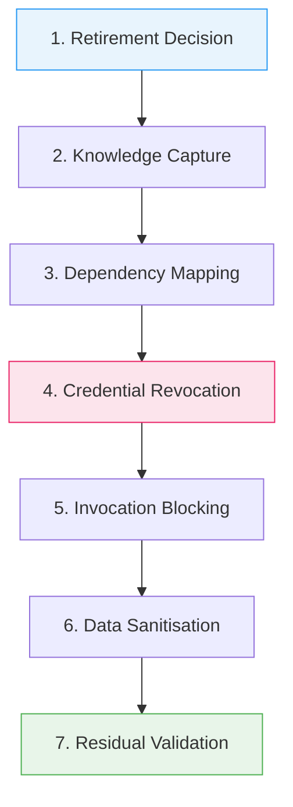
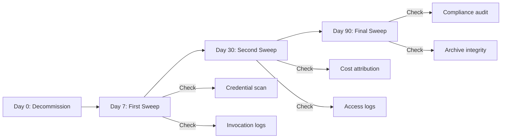

# Agent Decommissioning and Retirement: Lifecycle Management for Production Agents


---

Every engineering team has a process for deploying agents. Precious few have a process for killing them. As agentic AI adoption accelerates—Gartner predicts over 40 per cent of agentic AI projects will be cancelled by end of 2027 due to escalating costs, unclear value, or inadequate risk controls [^1]—the question of how to *retire* agents safely becomes as critical as how to build them. A 2026 Cloud Security Alliance survey found that 82 per cent of enterprises have unknown AI agents running in their infrastructure, and 65 per cent have already experienced agent-related security incidents [^2]. Many of those incidents trace back to "ghost agents": decommissioned identities that retain credentials, permissions, or operational hooks long after their purpose has expired [^3].

This article presents a structured decommissioning framework for production agents, with practical guidance for Codex CLI workflows.

## Why Decommissioning Matters

Agents are cheap to create and expensive to forget. A Codex CLI session spun up for a one-off migration task may accumulate MCP server connections, API tokens, memory artefacts, and cross-agent trust relationships. Without a formal retirement process, those artefacts persist indefinitely.

The risks are concrete:

- **Ghost agent credentials** — Unused API keys and OAuth tokens remain valid attack vectors. Token Security research found that orphaned agent credentials consistently rank among the top three breach entry vectors [^4].
- **Compliance exposure** — GDPR, HIPAA, and SOC 2 all require demonstrable control over automated data access. An agent that still holds database read permissions after retirement is a compliance gap.
- **Cost bleed** — Agents consuming model inference credits, MCP server connections, or cloud compute after they cease to provide value drain budgets silently.
- **Knowledge loss** — An agent's accumulated memory, learned preferences, and discovered patterns vanish without trace unless explicitly captured before shutdown.

## The Seven-Stage Decommissioning Framework

Drawing on enterprise lifecycle management patterns [^5] and agent identity security guidance [^6], a robust decommissioning process follows seven stages:



### 1. Retirement Decision

Every retirement requires a formal trigger and an accountable owner. The trigger may be a project completion, a capability superseded by a newer agent, a cost threshold breach, or a security incident. Document the rationale in an immutable record—a Git commit message, a ticket, or an audit log entry.

For Codex CLI agents, the decision should be captured in the project's `AGENTS.md`:

```markdown
## Retired Agents

### migration-agent-v2
- **Retired:** 2026-05-30
- **Reason:** Database migration complete; superseded by schema-sync-agent-v3
- **Owner:** platform-team
- **Audit ref:** JIRA-4521
```

### 2. Knowledge Capture

Before any credentials are revoked, extract the agent's accumulated knowledge. For Codex CLI, this means exporting memory artefacts:

```bash
# Export all memories to a portable format before cleanup
cp -r ~/.codex/memory/ ./agent-archive/migration-agent-v2/memory/

# Export session history for audit
cp ~/.codex/sessions/<session-id>.jsonl \
   ./agent-archive/migration-agent-v2/sessions/
```

Capture the following:

- **Memory artefacts** — The SQLite state database and consolidated memory files under `~/.codex/memory/` [^7]
- **Session transcripts** — JSONL session logs that record every tool invocation, model call, and decision
- **Configuration snapshots** — The agent's `config.toml`, any project-scoped `codex.toml`, and relevant `AGENTS.md` sections
- **Learned patterns** — Any custom instructions, prompt templates, or discovered workflows that should transfer to successor agents

### 3. Dependency Mapping

Map every external integration the agent touches. For a Codex CLI agent with MCP servers, this includes:

```bash
# List all configured MCP servers for the agent
codex mcp list
```

Build a dependency register:

| Dependency | Type | Access Method | Revocation Owner |
|---|---|---|---|
| GitHub API | OAuth token | MCP server (github) | Platform team |
| PostgreSQL | Connection string | MCP server (postgres-mcp-pro) | DBA team |
| Slack | Bot token | Webhook | Comms team |
| S3 bucket | IAM role | AWS SDK | Cloud team |

Every row needs a named revocation owner. Unowned dependencies are the primary source of ghost agent risk.

### 4. Credential Revocation

This is the most security-critical stage. Execute credential revocation in a single, atomic operation where possible [^6]:

- **API keys and tokens** — Invalidate immediately; do not merely rotate
- **OAuth grants** — Revoke at the identity provider, not just the client
- **Service accounts** — Delete or disable in IAM; removing permissions alone is insufficient
- **MCP server connections** — Remove entries from `config.toml` and any project-level `codex.toml`
- **Federated trust** — If the agent participated in agent-to-agent communication (A2A), revoke its agent card and remove it from peer trust stores

```toml
# BEFORE: config.toml with active MCP servers
[mcp_servers.postgres]
command = "npx"
args = ["-y", "@anthropic/postgres-mcp-server"]
env = { DATABASE_URL = "postgresql://..." }

# AFTER: Remove the entire section. Do not comment it out.
```

For Codex CLI memory and session data:

```bash
# Delete agent-specific memories after archival
codex debug clear-memories

# Or target specific memories
/m_drop migration-agent-v2
```

### 5. Invocation Blocking

Disable every pathway through which the agent could be triggered:

- **API endpoints** — Deregister webhook URLs and API routes
- **Cron jobs and schedulers** — Remove scheduled invocations from CI/CD pipelines, crontabs, and orchestration platforms
- **Orchestration triggers** — If the agent was part of a multi-agent system, remove it from the orchestrator's agent registry
- **CLI aliases and scripts** — Remove shell aliases, wrapper scripts, and PATH entries

For Codex CLI, ensure the agent's session cannot be resumed:

```bash
# Verify the session file has been archived and removed
ls ~/.codex/sessions/ | grep <session-id>
```

### 6. Data Sanitisation

Handle stored data according to policy and regulatory requirements:

- **Vector databases** — Delete or tombstone embeddings generated by the agent
- **Log data** — Apply tiered retention: hot (30 days), warm (90 days), cold (regulatory horizon, typically 7 years) [^8]
- **Cached artefacts** — Clear any locally cached model responses, tool outputs, or intermediate files
- **PII scrubbing** — Apply field-level redaction to audit trails: hash structured PII fields whilst preserving non-PII context for queryability [^8]

```bash
# Clean up Codex CLI local artefacts
rm -rf ~/.codex/sessions/<session-id>.jsonl
rm -rf /tmp/codex-sandbox-<agent-id>/
```

### 7. Residual Validation

The final stage confirms the decommissioning is complete. Run a validation sweep 7, 30, and 90 days after retirement:



Validation checks include:

- **Credential scanning** — Confirm no active tokens, keys, or certificates remain associated with the agent identity
- **Invocation log analysis** — Verify zero invocations since retirement date
- **Cost attribution review** — Confirm no inference credits or compute charges are accruing
- **Access log audit** — Check downstream systems for any access attempts from the retired agent's identity
- **Archive integrity** — Verify knowledge archives are intact and accessible

## Automating Decommissioning with Codex CLI

For teams managing multiple agents, manual decommissioning does not scale. Codex CLI's hook system provides automation points:

```toml
# codex.toml — lifecycle hooks for decommissioning
[hooks]
# Archive session data on agent stop
Stop = "scripts/archive-session.sh"

# Clean up temporary artefacts on subagent completion
SubagentStop = "scripts/cleanup-subagent.sh"
```

A decommissioning script might look like:

```bash
#!/usr/bin/env bash
# decommission-agent.sh — automated agent retirement
set -euo pipefail

AGENT_ID="${1:?Usage: decommission-agent.sh <agent-id>}"
ARCHIVE_DIR="./agent-archive/${AGENT_ID}"
TIMESTAMP=$(date -u +"%Y-%m-%dT%H:%M:%SZ")

echo "=== Decommissioning ${AGENT_ID} at ${TIMESTAMP} ==="

# Step 1: Archive memories and sessions
mkdir -p "${ARCHIVE_DIR}"
cp -r ~/.codex/memory/ "${ARCHIVE_DIR}/memory/" 2>/dev/null || true
cp ~/.codex/sessions/${AGENT_ID}*.jsonl "${ARCHIVE_DIR}/sessions/" 2>/dev/null || true

# Step 2: Clear agent memories
codex debug clear-memories

# Step 3: Remove MCP server configurations
# (requires manual review — automated removal is risky)
echo "MANUAL: Review and remove MCP servers from config.toml"

# Step 4: Log the retirement event
echo "${TIMESTAMP} | DECOMMISSIONED | ${AGENT_ID}" >> ./audit/retirement-log.csv

echo "=== Decommissioning complete. Run residual validation in 7 days. ==="
```

## The Ghost Agent Audit

For existing deployments, run a ghost agent audit before the problem compounds. The audit answers three questions:

1. **How many agents exist?** — Enumerate all agent identities across IAM, MCP server registries, CI/CD pipelines, and orchestration platforms.
2. **Which are still active?** — Cross-reference agent identities against recent invocation logs (last 90 days).
3. **Which have orphaned credentials?** — Scan for API keys, tokens, and service accounts associated with inactive agents.

Only 21 per cent of organisations report having formal decommissioning processes, and only 19 per cent express high confidence that unused agents are fully removed [^4]. The audit is the first step toward closing that gap.

## Conclusion

Agent decommissioning is not an afterthought—it is a security control, a compliance requirement, and a cost management discipline. As agentic AI matures from experimental tooling into production infrastructure, the retirement process must be as rigorous as the deployment pipeline. The seven-stage framework presented here—decision, knowledge capture, dependency mapping, credential revocation, invocation blocking, data sanitisation, and residual validation—provides a repeatable structure for teams managing agents at any scale.

Start with the ghost agent audit. You will find more than you expect.

---

## Citations

[^1]: Gartner, "Gartner Predicts Over 40% of Agentic AI Projects Will Be Canceled by End of 2027," June 2025. [https://www.gartner.com/en/newsroom/press-releases/2025-06-25-gartner-predicts-over-40-percent-of-agentic-ai-projects-will-be-canceled-by-end-of-2027](https://www.gartner.com/en/newsroom/press-releases/2025-06-25-gartner-predicts-over-40-percent-of-agentic-ai-projects-will-be-canceled-by-end-of-2027)

[^2]: Cloud Security Alliance, "New Cloud Security Alliance Survey Reveals 82% of Enterprises Have Unknown AI Agents in Their Environments," April 2026. [https://cloudsecurityalliance.org/press-releases/2026/04/21/new-cloud-security-alliance-survey-reveals-82-of-enterprises-have-unknown-ai-agents-in-their-environments](https://cloudsecurityalliance.org/press-releases/2026/04/21/new-cloud-security-alliance-survey-reveals-82-of-enterprises-have-unknown-ai-agents-in-their-environments)

[^3]: Saviynt, "Managing AI Agent Lifecycles: Birth to Retirement," 2026. [https://saviynt.com/blog/ai-agent-lifecycle-management](https://saviynt.com/blog/ai-agent-lifecycle-management)

[^4]: Token Security, "65 Percent of Enterprises Have Already Experienced AI Agent Security Incidents," 2026. [https://www.token.security/blog/65-percent-of-enterprises-have-already-experienced-ai-agent-security-incidents](https://www.token.security/blog/65-percent-of-enterprises-have-already-experienced-ai-agent-security-incidents)

[^5]: OneReach.ai, "Agent Lifecycle Management 2026: 6 Stages, Governance & ROI," 2026. [https://onereach.ai/blog/agent-lifecycle-management-stages-governance-roi/](https://onereach.ai/blog/agent-lifecycle-management-stages-governance-roi/)

[^6]: UnoSecur, "AI Agent Lifecycle Security Guide: Provisioning to Decommissioning," 2026. [https://www.unosecur.com/resources/blog/the-ultimate-guide-to-ai-agent-lifecycle-security-from-provisioning-to-decommissioning](https://www.unosecur.com/resources/blog/the-ultimate-guide-to-ai-agent-lifecycle-security-from-provisioning-to-decommissioning)

[^7]: Daniel Vaughan, "Memory Lifecycle Management: Create, Consolidate, Clean, Delete in Codex CLI," April 2026. [https://codex.danielvaughan.com/2026/04/15/memory-lifecycle-management-codex-cli/](https://codex.danielvaughan.com/2026/04/15/memory-lifecycle-management-codex-cli/)

[^8]: Digital Applied, "Agent Audit Trail Design: 7 Best Practices for 2026," 2026. [https://www.digitalapplied.com/blog/agent-audit-trail-design-7-best-practices-2026](https://www.digitalapplied.com/blog/agent-audit-trail-design-7-best-practices-2026)
