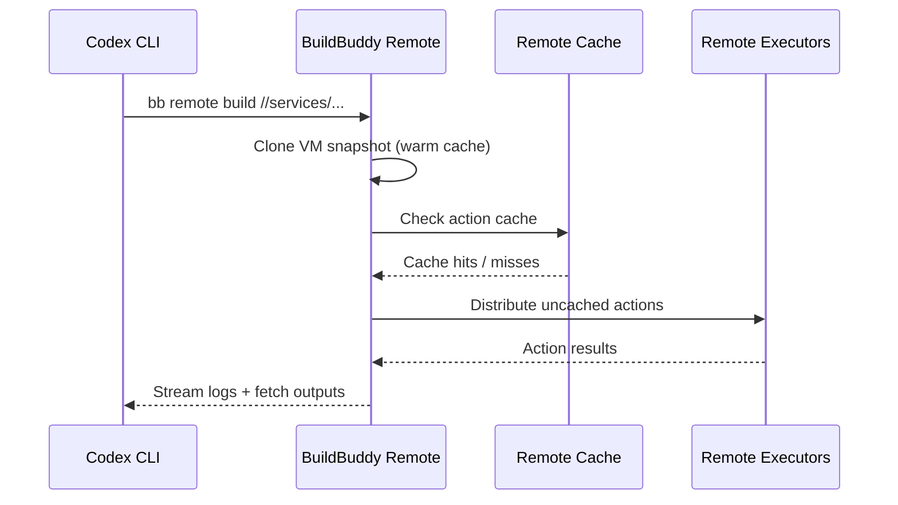
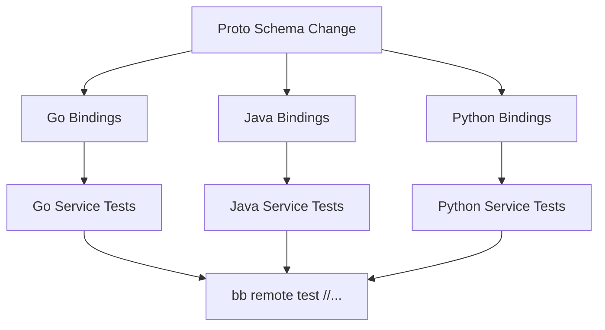

# Codex CLI for Bazel Builds: Remote Execution, Monorepo Patterns, and Agent-Driven Build Intelligence


---

Bazel remains the build system of choice for polyglot monorepos at scale. With Bazel 9 LTS now shipping alongside the mature Bazel 8 LTS track [^1], bzlmod as the sole external-dependency mechanism [^2], and remote execution as a first-class concern, the surface area where an AI coding agent can add value is enormous. This article explores how Codex CLI integrates with Bazel — from MCP servers that expose build intelligence to BuildBuddy's `rules_codex` that turn Codex prompts into hermetic build actions.

## The Bazel Landscape in 2026

Bazel 8.0 disabled the legacy `WORKSPACE` system by default, making bzlmod the standard for dependency management [^2]. Bazel 9.0, announced in January 2026, completed the transition by removing `WORKSPACE` entirely [^3]. If your monorepo still relies on `WORKSPACE` files, migration is no longer optional — and it is precisely the kind of large-scale, mechanical refactoring where Codex CLI excels.

The current LTS releases are Bazel 8.7.x and Bazel 9.1.x [^1], both fully backward-compatible within their respective major tracks.

## Bazel MCP Servers

Three MCP server implementations bring Bazel build intelligence directly into Codex CLI sessions.

### nacgarg/bazel-mcp-server (TypeScript)

The most feature-complete option, exposing six tools [^4]:

| Tool | Purpose |
|---|---|
| `bazel_build_target` | Compile specified targets |
| `bazel_query_target` | Query the dependency graph |
| `bazel_test_target` | Execute test targets |
| `bazel_list_targets` | Enumerate targets at a path |
| `bazel_fetch_dependencies` | Fetch external dependencies |
| `bazel_set_workspace_path` | Switch workspace at runtime |

Configuration supports CLI flags, environment variables, and a config file. Add it to your project's `.codex/config.toml`:

```toml
[mcp_servers.bazel]
command = "npx"
args = ["-y", "github:nacgarg/bazel-mcp-server"]

[mcp_servers.bazel.env]
MCP_WORKSPACE_PATH = "/home/dev/monorepo"
```

Or via the CLI:

```bash
codex mcp add bazel -- npx -y github:nacgarg/bazel-mcp-server
```

### aaomidi/mcp-bazel (Go)

A leaner alternative focused on dependency analysis [^5]. It provides `build`, `test`, `deps`, `rdeps`, and `sources` tools. The reverse-dependency lookup (`rdeps`) is particularly useful for impact analysis — ask Codex "what will break if I change this target?" and the agent can answer with precision.

```bash
go install github.com/aaomidi/mcp-bazel@latest
codex mcp add mcp-bazel -- mcp-bazel
```

### bazel-mcp (Python)

A zero-configuration Python server that auto-discovers all Bazel targets in the workspace [^6]. Install from PyPI and register:

```bash
pip install bazel-mcp
codex mcp add bazel-mcp -- bazel-mcp
```

## BuildBuddy: Remote Execution Meets Agent Workflows

BuildBuddy's Remote Bazel infrastructure solves the core bottleneck in agent-driven development: validating the code an agent writes [^7]. When Codex generates changes across a monorepo, building and testing locally is impractical. Remote execution shifts that work to colocated runners with sub-millisecond cache RTT.



Key capabilities of the `bb remote` command [^7]:

- **Automatic git state mirroring** — uncommitted changes are synced to the remote runner
- **VM snapshots** — Firecracker-based cloning preserves warm analysis caches between builds
- **Cross-platform builds** — `--os=linux --arch=amd64` flags test against different platforms
- **Custom containers** — `--container_image=docker://gcr.io/project/image:latest` for hermetic environments
- **Multi-step scripts** — `bb remote --script='./setup.sh && bazel run :gazelle'`

```bash
# Build and test a service remotely
bb remote build //services/payment/...
bb remote test //services/payment/... --test_output=errors

# Cross-platform verification
bb remote --os=linux --arch=amd64 test //...
```

### BuildBuddy MCP Endpoint

BuildBuddy exposes an MCP endpoint for coding agents, providing read-only access to build and test metadata, logs, artifacts, and target statuses [^8]. Connect it to Codex CLI as a Streamable HTTP server:

```toml
[mcp_servers.buildbuddy]
url = "https://app.buildbuddy.io/mcp"
bearer_token_env_var = "BUILDBUDDY_API_KEY"
```

This lets Codex query build history, inspect flaky tests, and correlate failures across runs without leaving the terminal.

## rules_codex: Codex as a Build Action

BuildBuddy's `rules_codex` library takes integration further by embedding Codex prompts directly into the Bazel build graph [^9]. Three rules cover different execution contexts:

- **`codex`** — generates build artifacts from prompts (build time)
- **`codex_run`** — interactive prompt execution via `bazel run`
- **`codex_test`** — runs prompts as Bazel tests, reporting PASS/FAIL

### Setup

Add to `MODULE.bazel`:

```python
bazel_dep(name = "rules_codex", version = "0.1.0")
git_override(
    module_name = "rules_codex",
    remote = "https://github.com/buildbuddy-io/rules_codex.git",
    commit = "d77731f186b7070e174800bc1b8161c11cd7e4d4",
)
```

The toolchain defaults to Codex `rust-v0.92.0` with SHA256 verification for reproducibility [^9]. Pin a different version if needed:

```python
codex = use_extension("@rules_codex//codex:extensions.bzl", "codex")
codex.download(version = "rust-v0.90.0")
```

### Practical Examples

**Generate documentation from source:**

```python
codex(
    name = "api_docs",
    prompt = "Generate API documentation in Markdown for all public functions",
    srcs = glob(["src/**/*.py"]),
    out = "API.md",
)
```

**Validate documentation accuracy as a test:**

```python
codex_test(
    name = "readme_accuracy",
    prompt = "Walk through the README setup steps and verify they work",
    data = [":readme", "//tools:setup_script"],
)
```

Authentication uses `CODEX_API_KEY` via `.bazelrc`:

```bash
# .bazelrc
common --action_env=CODEX_API_KEY
```

## Monorepo Patterns with Codex CLI

### bzlmod Migration

Migrating from `WORKSPACE` to bzlmod across a large monorepo is a strong use case for Codex CLI. The agent can systematically convert `http_archive` and `git_repository` calls to `bazel_dep` declarations in `MODULE.bazel`, updating hundreds of `BUILD` files in a single session [^2].

```bash
codex "Migrate all WORKSPACE dependencies to bzlmod in MODULE.bazel. \
  Convert http_archive calls to bazel_dep entries. \
  Remove the WORKSPACE file when complete. \
  Run bazel build //... to verify."
```

### Dependency Graph Analysis

With a Bazel MCP server connected, Codex can answer structural questions about your monorepo:

```bash
codex "Using the bazel MCP tools, find all targets that transitively \
  depend on //libs/auth:core. List them grouped by package."
```

### Cross-Language Build Orchestration

Bazel's polyglot strength — building Go, Java, Python, TypeScript, and C++ in a single graph — aligns well with Codex CLI's language flexibility. The agent can modify a protobuf schema, regenerate bindings across languages, update dependent services, and verify the entire graph builds cleanly.



## Best Practices

1. **Register the Bazel MCP server at project scope** — place the `[mcp_servers.bazel]` block in `.codex/config.toml` within the repo so all contributors share the same configuration [^10].

2. **Use remote execution for agent-generated changes** — local builds compete for resources with the agent itself. Remote execution on BuildBuddy isolates builds on dedicated runners [^7].

3. **Leverage `codex_test` for documentation drift** — treat documentation accuracy as a build signal. When docs fall out of sync with code, the test fails [^9].

4. **Pin Codex versions in `rules_codex`** — hermetic builds require deterministic toolchains. Avoid `use_latest = True` in CI [^9].

5. **Scope MCP server credentials carefully** — use `bearer_token_env_var` rather than hardcoding tokens in committed TOML files [^10].

## Conclusion

Bazel's precise dependency graph, hermetic builds, and remote execution infrastructure make it an ideal target for AI agent integration. The combination of Bazel MCP servers for build intelligence, BuildBuddy's remote runners for fast validation, and `rules_codex` for embedding agent prompts directly into the build graph represents a mature workflow for monorepo teams adopting Codex CLI at scale.

---

## Citations

[^1]: [Bazel Documentation Versions](https://bazel.build/versions) — Bazel 8.7.x and 9.1.x LTS release tracks, accessed May 2026.
[^2]: [Bzlmod Migration Guide](https://bazel.build/external/migration) — Official migration guide from WORKSPACE to bzlmod, Bazel documentation.
[^3]: [Bazel 9 LTS Announcement](https://blog.bazel.build/2026/01/20/bazel-9.html) — Bazel 9 removes WORKSPACE entirely, January 2026.
[^4]: [nacgarg/bazel-mcp-server](https://github.com/nacgarg/bazel-mcp-server) — TypeScript MCP server for Bazel with six build tools.
[^5]: [aaomidi/mcp-bazel](https://github.com/aaomidi/mcp-bazel) — Go-based Bazel MCP server with dependency analysis tools.
[^6]: [bazel-mcp on PyPI](https://pypi.org/project/bazel-mcp/) — Zero-configuration Python MCP server for Bazel, released October 2025.
[^7]: [Remote Bazel: The Missing Piece for AI Coding Agents](https://www.buildbuddy.io/blog/remote-bazel-with-agents/) — BuildBuddy blog on remote execution for agents.
[^8]: [Configuring Remote Bazel with Agents](https://www.buildbuddy.io/blog/configuring-remote-bazel-with-agents/) — BuildBuddy MCP endpoint and agent configuration guide.
[^9]: [buildbuddy-io/rules_codex](https://github.com/buildbuddy-io/rules_codex) — Bazel rules for running Codex prompts as build, test, and run actions.
[^10]: [Codex CLI MCP Configuration Reference](https://developers.openai.com/codex/mcp) — Official MCP setup documentation for Codex CLI.
