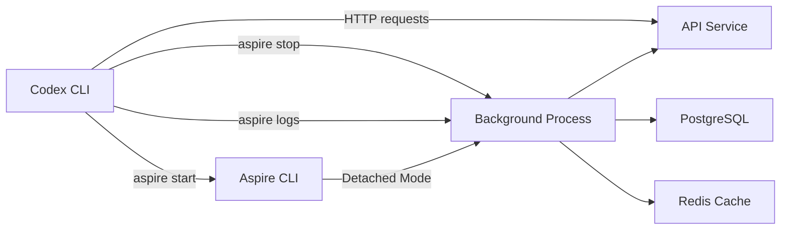

# Codex CLI for .NET 10 and C# 14: Aspire Integration, MCP Servers, and the dotnet/skills Ecosystem


---

The .NET ecosystem has quietly assembled one of the richest AI-agent integration stories of any platform. Between the official `dotnet/skills` repository maintained by the .NET platform team, the community-driven `managedcode/dotnet-skills` catalogue with 166 installable skills, the stable C# MCP SDK at v1.3.0, and Aspire 13.2's agent-native CLI, a well-configured .NET 10 project gives Codex CLI more domain-specific context than almost any other stack [^1][^2][^3].

This article covers the practical integration points: installing .NET skills, building and consuming C# MCP servers, leveraging Aspire's detached mode for agent-driven development, and configuring `AGENTS.md` for C# 14's new language features.

## The .NET 10 and C# 14 Landscape

.NET 10, released November 2025 as an LTS release supported until November 2028, ships with C# 14 and brings several features that directly affect how Codex CLI generates code [^4].

### C# 14 Features That Matter for Agent Workflows

**Field-backed properties** eliminate boilerplate. Where previously you needed an explicit backing field:

```csharp
private string _name;
public string Name
{
    get => _name;
    set => _name = value ?? throw new ArgumentNullException(nameof(value));
}
```

C# 14 allows the `field` keyword directly in accessors [^5]:

```csharp
public string Name
{
    get;
    set => field = value ?? throw new ArgumentNullException(nameof(value));
}
```

**Extension members** generalise the old extension method pattern to include properties and static members [^5]:

```csharp
public static class Enumerable
{
    extension<TSource>(IEnumerable<TSource> source)
    {
        public bool IsEmpty => !source.Any();
    }
}
```

**Null-conditional assignment** and **unbound generic `nameof`** round out the release. These features require `AGENTS.md` guidance to ensure Codex CLI generates idiomatic C# 14 rather than falling back to older patterns.

### AGENTS.md Configuration for C# 14

```markdown
## C# Style

- Target C# 14 / .NET 10. Use `field` keyword in property accessors
  instead of explicit backing fields where validation is needed.
- Prefer the new `extension` block syntax over static extension methods.
- Use `nameof(List<>)` for unbound generics — do not supply a dummy
  type argument.
- All projects use nullable reference types. Never suppress with `!`
  without a comment explaining why.
```

## The dotnet/skills Ecosystem

### Official Skills (dotnet/skills)

The .NET platform team maintains 13 curated plugins in the `dotnet/skills` repository, released under MIT licence [^1]. Each skill follows the `agentskills.io` open standard, making them portable across Codex CLI, Claude Code, GitHub Copilot, and Visual Studio 2026 [^6].

| Plugin | Purpose |
|---|---|
| `dotnet` | Core .NET coding tasks |
| `dotnet-data` | Entity Framework and data access |
| `dotnet-diag` | Performance investigation and debugging |
| `dotnet-msbuild` | Build diagnostics and optimisation |
| `dotnet-nuget` | Package management and dependency modernisation |
| `dotnet-upgrade` | Framework migration and compatibility |
| `dotnet-maui` | Mobile app development |
| `dotnet-ai` | LLM integration, RAG pipelines, MCP, ML.NET |
| `dotnet-template-engine` | Project scaffolding |
| `dotnet-test` | Test execution and MSTest workflows |
| `dotnet-aspnet` | ASP.NET Core middleware and API patterns |
| `dotnet-blazor` | Component authoring and interactive web |
| `dotnet11` | .NET 11 preview APIs and features |

Installation in Codex CLI uses the standard skill installation flow. Clone the repository and point your project's skill configuration at the relevant plugin directories, or reference them via the marketplace [^1].

### Community Skills (managedcode/dotnet-skills)

The `managedcode/dotnet-skills` project extends coverage to 166 skills spanning ASP.NET Core, Blazor, gRPC, SignalR, Aspire, Orleans, WPF, WinUI, MAUI, and Semantic Kernel [^2]. It ships its own `dotnet` tool:

```bash
dotnet tool install -g dotnet-skills
dotnet skills recommend          # Analyses project, suggests skills
dotnet skills install dotnet-aspnet-core
dotnet skills install dotnet-aspire
```

The `recommend` subcommand inspects your `.csproj` files and NuGet references to suggest relevant skills — a useful bootstrap for new repositories.

## Building MCP Servers in C#

The official C# MCP SDK, maintained jointly by Anthropic and Microsoft, reached v1.3.0 stable on 8 May 2026 [^3]. It targets `netstandard2.0`, running on .NET 8 LTS, .NET 9, and .NET 10.

### Package Structure

```xml
<!-- Core SDK — minimal client and low-level server APIs -->
<PackageReference Include="ModelContextProtocol.Core" Version="1.3.0" />

<!-- Full SDK — hosting, DI extensions -->
<PackageReference Include="ModelContextProtocol" Version="1.3.0" />

<!-- ASP.NET Core hosting for Streamable HTTP transport -->
<PackageReference Include="ModelContextProtocol.AspNetCore" Version="1.3.0" />
```

### Minimal MCP Server Example

```csharp
using ModelContextProtocol;
using Microsoft.Extensions.Hosting;

var builder = Host.CreateApplicationBuilder(args);
builder.Services.AddMcpServer()
    .WithStdioTransport()
    .WithTools<ProjectTools>();

await builder.Build().RunAsync();

[McpTool("analyse_solution", "Analyse .NET solution structure")]
public static class ProjectTools
{
    [McpTool]
    public static async Task<string> AnalyseSolution(
        [McpParameter("path", "Path to .sln file")] string path)
    {
        // Parse solution, return structure summary
        var content = await File.ReadAllTextAsync(path);
        var projects = content.Split('\n')
            .Where(l => l.StartsWith("Project("))
            .Select(l => l.Split('"')[3]);
        return string.Join("\n", projects);
    }
}
```

### Registering with Codex CLI

Add the server to your project-level `.codex/config.toml`:

```toml
[mcp_servers.dotnet-tools]
command = "dotnet"
args = ["run", "--project", "./tools/McpServer/McpServer.csproj"]
```

For Streamable HTTP servers using ASP.NET Core and Kestrel, use the `url` form instead [^7]:

```toml
[mcp_servers.dotnet-api]
type = "url"
url = "http://localhost:5100/mcp"
```

The C# SDK's advantages over Python or TypeScript implementations include Native AOT publishing for sub-second cold starts in stdio mode, and first-party ASP.NET Core hosting with Kestrel, OpenTelemetry, and JWT bearer auth out of the box [^3].

### The NuGet MCP Server

Microsoft ships an official NuGet MCP server that gives Codex CLI direct access to package search, version resolution, and dependency analysis [^8]. Configure it alongside your project tools:

```toml
[mcp_servers.nuget]
command = "dotnet"
args = ["tool", "run", "nuget-mcp-server"]
```

## Aspire 13.2: The Agent-Native Application Platform

Aspire (formerly .NET Aspire) reached v13.2 in March 2026, with the current stable at v13.3.5 [^9]. The 13.2 release was purpose-built for AI coding agents, introducing detached mode, structured output, health-check blocking, and telemetry streaming [^10].

### Why Aspire Matters for Codex CLI

Aspire describes your entire distributed application — services, containers, databases, caches, and connections — in code. The CLI can start the whole stack in the background, letting Codex CLI interact with running services without blocking the terminal.



### Agent Workflow with Aspire

```bash
# Start the application stack in detached mode
aspire start

# Wait for all resources to become healthy
aspire wait --all

# Codex can now interact with running services
codex exec "Run integration tests against the live API at localhost:5000"

# Inspect logs for failures
aspire logs --resource api-service --tail 50

# Shut down when done
aspire stop
```

The `aspire docs` command brings `aspire.dev` documentation directly into agent workflows, and `aspire doctor` validates the entire environment before an agent starts building [^10].

### Aspire MCP and Skills

Running `aspire new` or `aspire init` automatically generates Aspire-specific skills and an MCP server configuration, so coding agents can discover and interact with application resources from the start [^10]. This means a fresh Aspire project is agent-ready out of the box — no manual MCP configuration required.

## Putting It Together: A Complete .NET 10 Agent Configuration

A production-ready `.codex/config.toml` for a .NET 10 Aspire project:

```toml
model = "o3"
sandbox_mode = "workspace-write"

[mcp_servers.dotnet-tools]
command = "dotnet"
args = ["run", "--project", "./tools/McpServer/McpServer.csproj"]

[mcp_servers.nuget]
command = "dotnet"
args = ["tool", "run", "nuget-mcp-server"]

[sandbox_workspace_write]
writable_roots = ["./src", "./tests", "./tools"]

[shell_environment_policy]
inherit = "core"
set = { DOTNET_CLI_TELEMETRY_OPTOUT = "1", ASPNETCORE_ENVIRONMENT = "Development" }
```

Pair this with an `AGENTS.md` that references the installed skills and establishes .NET conventions:

```markdown
## Project Structure

This is a .NET 10 Aspire solution. Use `aspire start` to bring up all
services in detached mode. Run `aspire logs` to check service health.

## Skills

The following dotnet/skills plugins are installed:
- dotnet-aspnet (ASP.NET Core patterns)
- dotnet-data (Entity Framework Core)
- dotnet-test (test execution)

## Build and Test

- `dotnet build` — builds the entire solution
- `dotnet test --no-build` — runs all tests
- Never commit without running `dotnet format --verify-no-changes`

## Review Checklist

- All public APIs must have XML doc comments
- Use field-backed properties (C# 14) for validation
- Prefer extension blocks over static extension methods
- Check NuGet vulnerability audit: `dotnet list package --vulnerable`
```

## Configuration Precedence for Enterprise Teams

For enterprise deployments, use managed configuration to enforce .NET-specific policies across teams [^11]:

```toml
# requirements.toml — deployed via MDM or cloud-managed config
[rules]
[[rules.entries]]
pattern = "rm -rf"
decision = "forbidden"

[[rules.entries]]
pattern = "dotnet publish"
decision = "prompt"

[[rules.entries]]
pattern = "dotnet nuget push"
decision = "forbidden"
```

This prevents agents from publishing packages or deleting directories whilst allowing builds and tests to run autonomously.

## What Is Coming Next

The .NET 11 preview (expected November 2026) already has a dedicated `dotnet11` skill in the official catalogue [^1]. The MCP C# SDK roadmap includes improved streaming support and tighter Aspire integration. ⚠️ Exact .NET 11 features and MCP SDK v2.0 timelines are unconfirmed at time of writing.

The convergence of platform-team-maintained skills, a stable MCP SDK, and Aspire's agent-native CLI means .NET is no longer playing catch-up in the AI-assisted development space — it is setting the pace for how platform teams should support coding agents.

## Citations

[^1]: [dotnet/skills — Repository for skills to assist AI coding agents with .NET and C#](https://github.com/dotnet/skills)
[^2]: [managedcode/dotnet-skills — Installable .NET skill catalog and CLI](https://github.com/managedcode/dotnet-skills)
[^3]: [modelcontextprotocol/csharp-sdk — The official C# SDK for Model Context Protocol](https://github.com/modelcontextprotocol/csharp-sdk)
[^4]: [What's new in .NET 10 — Microsoft Learn](https://learn.microsoft.com/en-us/dotnet/core/whats-new/dotnet-10/overview)
[^5]: [What's new in C# 14 — Microsoft Learn](https://learn.microsoft.com/en-us/dotnet/csharp/whats-new/csharp-14)
[^6]: [Extend your coding agent with .NET Skills — .NET Blog](https://devblogs.microsoft.com/dotnet/extend-your-coding-agent-with-dotnet-skills/)
[^7]: [Build a Model Context Protocol (MCP) server in C# — .NET Blog](https://devblogs.microsoft.com/dotnet/build-a-model-context-protocol-mcp-server-in-csharp/)
[^8]: [Using the NuGet Model Context Protocol (MCP) Server — Microsoft Learn](https://learn.microsoft.com/en-us/nuget/concepts/nuget-mcp-server)
[^9]: [Aspire releases — GitHub](https://github.com/microsoft/aspire/releases)
[^10]: [Announcing Aspire 13.2 — Aspire Blog](https://devblogs.microsoft.com/aspire/aspire-13-2-announcement/)
[^11]: [Managed configuration — Codex OpenAI Developers](https://developers.openai.com/codex/enterprise/managed-configuration)
