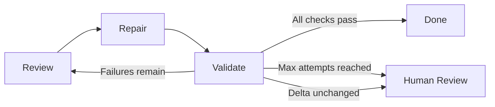
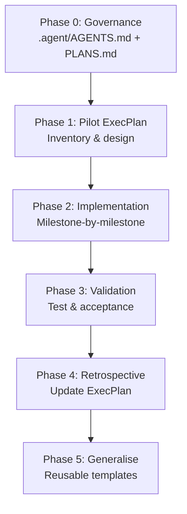

# ExecPlans and PLANS.md: Driving Multi-Hour Autonomous Codex CLI Sessions


---

Most Codex CLI sessions last minutes. A well-structured prompt, a handful of tool calls, a commit — done. But some tasks resist that cadence: migrating a legacy service to a new framework, refactoring a cross-cutting concern across dozens of files, or modernising a COBOL codebase module by module. These problems demand hours, not minutes.

OpenAI's answer is the **ExecPlan** — a living design document stored in `PLANS.md` that gives Codex CLI the context, structure, and self-correction mechanisms to sustain productive autonomous sessions lasting seven hours or more from a single prompt[^1]. Aaron Friel, credited with the longest recorded Codex sessions, presented the pattern at OpenAI DevDay and subsequently contributed the template to the official OpenAI Cookbook[^2].

This article explains how ExecPlans work, how to write them, and how to integrate them into `codex exec` workflows for extended autonomous operation.

---

## Why Sessions Drift

Before ExecPlans, long Codex CLI sessions suffered from three failure modes:

1. **Context decay.** As the conversation grows, earlier instructions fall out of the effective attention window. The agent forgets constraints established 40 minutes ago.
2. **Ambiguity accumulation.** Unresolved design decisions compound. The agent makes a guess in step 3 that contradicts an assumption from step 1, and neither gets revisited.
3. **Progress amnesia.** Without a persistent record of what has been completed, the agent re-does work or skips steps it believes are finished.

ExecPlans solve all three by externalising state into a file the agent reads and writes at every milestone.

---

## The PLANS.md Contract

The framework starts with a `.agent/PLANS.md` file (or `.ai/plans/PLANS.md` — the path is configurable) that defines the ExecPlan format[^1]. This file is referenced from `AGENTS.md`:

```markdown
## Planning

When writing complex features or significant refactors, use an ExecPlan
(as described in .agent/PLANS.md) from design to implementation.
```

The `PLANS.md` file itself is a meta-document: it tells Codex *how to write* an ExecPlan, not the plan itself. Individual plans are created per task — for example, `pilot_execplan.md` or `migration_execplan.md`[^3].

### Non-Negotiable Requirements

Every ExecPlan must satisfy five constraints[^1]:

| Requirement | Rationale |
|---|---|
| **Self-contained** | Contains all knowledge needed — a novice with no repo context can execute it |
| **Living document** | Updated at every stopping point with current progress and discoveries |
| **Observable outcomes** | Success criteria are human-verifiable behaviours, not internal attributes |
| **Plain-language definitions** | All specialised terms defined inline — no assumed vocabulary |
| **Demonstrably working** | The plan produces working behaviour, not merely code changes |

---

## Anatomy of an ExecPlan

An ExecPlan is a single Markdown document with mandated sections[^1][^2]. Here is the skeleton:

```markdown
# ExecPlan: [Feature or Task Name]

## Purpose / Big Picture
What user-visible behaviour becomes possible when this plan is complete.
Anchor on observable outcomes: HTTP responses, test passage, UI states.

## Progress
- [x] 2026-05-30T09:12Z — Scaffolded service skeleton, verified `cargo check` passes
- [x] 2026-05-30T09:38Z — Implemented repository layer, integration tests green
- [ ] Implement API handlers
- [ ] Wire authentication middleware
- [ ] End-to-end validation

## Surprises & Discoveries
- The existing auth middleware expects a `X-Tenant-Id` header not documented
  in the OpenAPI spec. Evidence: `grep -rn X-Tenant-Id src/middleware/`.

## Decision Log
| When | Decision | Rationale |
|------|----------|-----------|
| 09:20 | Use SQLx over Diesel | Async support required for the event loop |

## Context and Orientation
Describe the current repository state assuming the reader has zero prior
knowledge. Include directory structure, key dependencies, and build commands.

## Plan of Work
Prose-format sequence of edits. Each milestone is independently verifiable
and incrementally advances the goal.

### Milestone 1: Repository Layer
Edit `src/repo.rs` to implement...

### Milestone 2: API Handlers
Create `src/handlers/` with...

## Concrete Steps
Exact commands with expected output transcripts:

    cargo test --lib repo
    # Expected: 4 tests passed, 0 failed

## Validation and Acceptance
Observable behaviours proving success:
1. `curl localhost:8080/health` returns `{"status":"ok"}`
2. `cargo test` exits 0 with no warnings
3. `docker compose up` starts all services within 30 seconds
```

### The Living Document Sections

Four sections require continuous maintenance[^1]:

- **Progress** — timestamped checkboxes reflecting actual state, not planned state
- **Surprises & Discoveries** — unexpected behaviours documented with evidence (commands, outputs, stack traces)
- **Decision Log** — every directional choice with rationale, enabling future readers to understand *why*
- **Outcomes & Retrospective** — filled at completion, summarising what was delivered, what was deferred, and lessons learned

---

## Integrating with `codex exec`

The `codex exec` subcommand runs Codex non-interactively — ideal for CI pipelines, cron jobs, and unattended multi-hour sessions[^4]. Combined with an ExecPlan, the invocation looks like this:

```bash
codex exec \
  --model gpt-5.5 \
  --approval-mode full-auto \
  "Implement the plan in .agent/plans/migration_execplan.md. \
   Update the plan's Progress section after each milestone. \
   Commit after each milestone with a descriptive message."
```

The `--approval-mode full-auto` flag is critical for autonomous operation — it allows Codex to execute commands without human confirmation[^4]. For sensitive repositories, combine this with a permission profile that restricts write access:

```bash
codex exec \
  --model gpt-5.5 \
  --approval-mode full-auto \
  --profile workspace-only \
  "Follow the ExecPlan at .agent/plans/refactor_execplan.md"
```

### Environment Variables for Non-Interactive Sessions

When running `codex exec` in a headless environment (CI runner, tmux session, remote SSH), set `CODEX_NON_INTERACTIVE=1` to suppress TUI prompts[^5]:

```bash
export CODEX_NON_INTERACTIVE=1
export OPENAI_API_KEY=sk-...
codex exec "Follow .agent/plans/feature_execplan.md"
```

---

## The Iterative Repair Loop

ExecPlans compose naturally with another official pattern: the **iterative repair loop**[^6]. In this pattern, Codex cycles through three phases:

1. **Review** — inspect the current artefact and return structured findings without editing files
2. **Repair** — apply focused edits using the findings and the latest validation feedback
3. **Validate** — run checks and report what still needs work



Within an ExecPlan, each milestone can use this loop internally. The **Surprises & Discoveries** section captures repair-loop findings, and the **Progress** section timestamps each successful validation[^6].

A loop should terminate for one of four reasons: validation passes, maximum attempts reached, the remaining delta stops changing between iterations, or the next decision requires human judgement[^6].

---

## Practical Tips from Production Use

### Start with the Validation Section

Write your acceptance criteria *first*. When Codex can see what "done" looks like before starting work, it plans backwards from observable outcomes rather than forward from implementation hunches[^1].

### Keep Milestones Small and Independently Verifiable

Each milestone should produce a commit that passes tests. If Codex derails at milestone 4, you can revert to the commit from milestone 3 and resume from a known-good state[^2].

### Use Prose, Not Checklists, for the Plan of Work

The official guidance explicitly discourages checklist-style planning in the main body[^1]. Prose forces the plan author to explain *context* — why a file needs changing, what the surrounding code expects — rather than issuing terse directives that leave ambiguity for the agent to fill incorrectly.

### Commit the ExecPlan to Version Control

The ExecPlan is a first-class artefact. Committing it alongside code changes creates an audit trail of decisions and discoveries. If a colleague picks up the work (human or agent), the plan contains everything needed to continue[^2].

### Store Plans in a Consistent Directory

Kaushik Gopal recommends `.ai/plans/` with temporary working plans in `.ai/plans/tmp/` (gitignored)[^7]. This keeps the repository tidy while allowing Codex to use scratch space:

```
.ai/
├── plans/
│   ├── PLANS.md              # Meta-template
│   ├── migration_execplan.md  # Active plan
│   └── tmp/                   # Gitignored scratch
│       └── wip_notes.md
```

### Use Goal Mode for Progress Tracking

Since Codex CLI v0.133.0, Goal Mode is enabled by default[^8]. When combined with an ExecPlan, Goal Mode's per-turn progress tracking complements the plan's **Progress** section — Codex can report milestone completion against the stated goal automatically.

---

## Code Modernisation Workflow

The official OpenAI Cookbook demonstrates ExecPlans in a five-phase code modernisation pipeline[^3]:



Phase 0 establishes the `.agent/AGENTS.md` and `.agent/PLANS.md` files. Phase 1 creates the pilot ExecPlan following the template. Phases 2–4 iterate through the plan's milestones, updating the living document sections at each stop. Phase 5 extracts reusable patterns into templates for future modernisation work[^3].

The key insight: the ExecPlan itself becomes institutional knowledge. Future modernisation efforts start from the template rather than from scratch.

---

## When Not to Use ExecPlans

ExecPlans add overhead. For tasks under an hour — bug fixes, small features, configuration changes — the standard interactive Codex CLI session is faster and simpler. The official guidance suggests the threshold: "multi-step or multi-file work, new features, refactors, or tasks expected to take more than about an hour"[^1].

For tasks between 30 minutes and an hour, consider a lightweight variant: write just the **Purpose**, **Validation**, and **Plan of Work** sections, omitting the living document sections until the task proves complex enough to need them.

---

## Summary

| Concept | What It Does |
|---------|--------------|
| `PLANS.md` | Meta-template defining how to write ExecPlans |
| ExecPlan | Living design document for a specific task |
| `AGENTS.md` | Triggers ExecPlan creation for complex work |
| `codex exec` | Runs Codex non-interactively against an ExecPlan |
| Iterative repair loop | Review → Repair → Validate cycle within milestones |
| Goal Mode | Per-turn progress tracking complementing ExecPlan milestones |

ExecPlans turn Codex CLI from a reactive assistant into a self-directing agent that maintains context, records decisions, and validates its own work across hours of autonomous operation. The pattern is straightforward — a Markdown file with mandated sections — but the discipline it imposes on both the human planner and the AI executor is what makes seven-hour sessions productive rather than chaotic.

---

## Citations

[^1]: OpenAI, "Using PLANS.md for multi-hour problem solving," OpenAI Cookbook, 2026. [https://developers.openai.com/cookbook/articles/codex_exec_plans](https://developers.openai.com/cookbook/articles/codex_exec_plans)

[^2]: Kaushik Gopal, "ExecPlans – How to get your coding agent to run for hours," kau.sh, 2026. [https://kau.sh/blog/exec-plans/](https://kau.sh/blog/exec-plans/)

[^3]: OpenAI, "Modernizing your Codebase with Codex," OpenAI Cookbook, 2026. [https://developers.openai.com/cookbook/examples/codex/code_modernization](https://developers.openai.com/cookbook/examples/codex/code_modernization)

[^4]: OpenAI, "Command line options – Codex CLI," OpenAI Developers, 2026. [https://developers.openai.com/codex/cli/reference](https://developers.openai.com/codex/cli/reference)

[^5]: OpenAI, "Codex CLI Changelog," OpenAI Developers, May 2026. [https://developers.openai.com/codex/changelog](https://developers.openai.com/codex/changelog)

[^6]: OpenAI, "Build iterative repair loops with Codex," OpenAI Cookbook, 2026. [https://developers.openai.com/cookbook/examples/codex/build_iterative_repair_loops_with_codex](https://developers.openai.com/cookbook/examples/codex/build_iterative_repair_loops_with_codex)

[^7]: Kaushik Gopal, "ExecPlans – Directory structure," kau.sh, 2026. [https://kau.sh/blog/exec-plans/](https://kau.sh/blog/exec-plans/)

[^8]: OpenAI, "Codex CLI v0.133.0 Release Notes," OpenAI Developers Changelog, 21 May 2026. [https://developers.openai.com/codex/changelog](https://developers.openai.com/codex/changelog)
