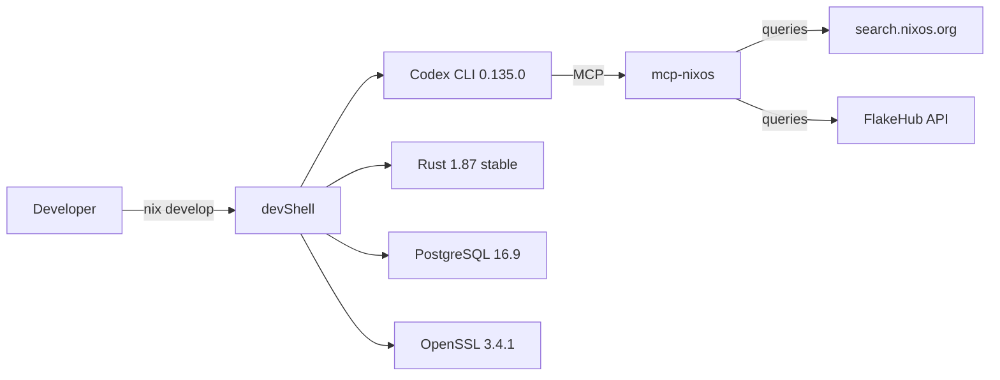
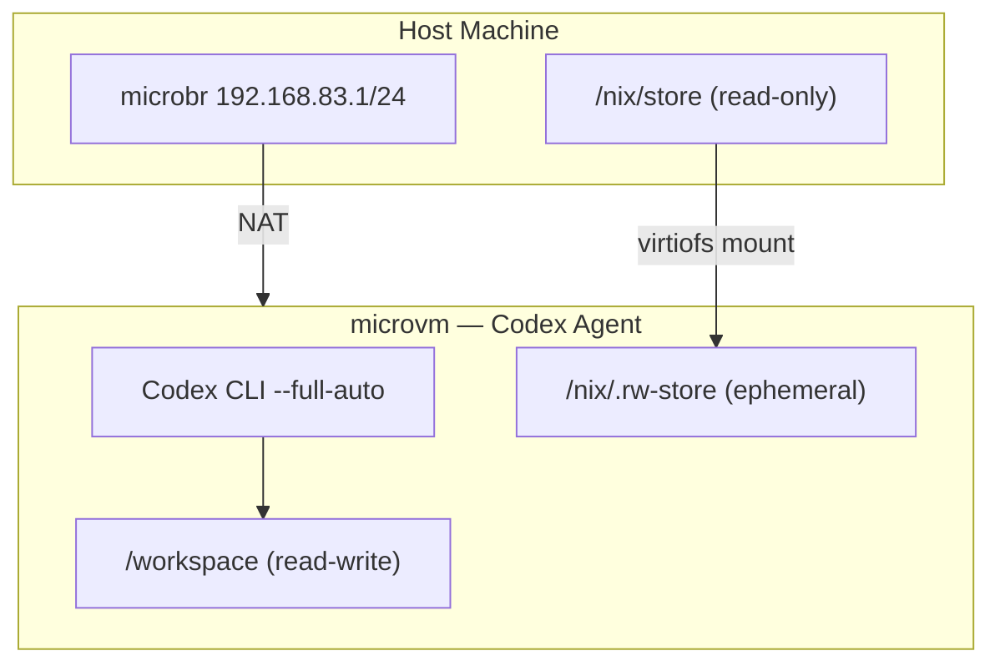

# Codex CLI for Nix Development: mcp-nixos, Flakes, and Reproducible Agent Environments


---

Nix's core promise — identical builds across machines and time — aligns naturally with agentic coding. When Codex CLI operates inside a Nix-managed environment, every tool version, library path, and system dependency is pinned. The agent cannot silently drift to a different compiler or runtime between sessions. This article covers the practical integration points: installing Codex itself via Nix flakes, connecting the mcp-nixos MCP server for package and option queries, structuring `AGENTS.md` for Nix projects, and using microvm.nix to sandbox agents in ephemeral virtual machines.

## Installing Codex CLI via Nix Flakes

The official Codex repository ships a `flake.nix` that builds the Rust-native `codex-rs` binary[^1]. On any machine with Nix 2.4+ and flakes enabled, a single command runs the latest release:

```bash
nix run github:openai/codex#codex-rs
```

For persistent installation, add the flake to your system configuration or Home Manager profile:

```nix
# flake.nix
{
  inputs = {
    nixpkgs.url = "github:NixOS/nixpkgs/nixos-unstable";
    codex-cli.url = "github:sadjow/codex-cli-nix";
  };

  outputs = { nixpkgs, codex-cli, ... }:
    let
      system = "x86_64-linux";
      pkgs = nixpkgs.legacyPackages.${system};
    in {
      devShells.${system}.default = pkgs.mkShell {
        packages = [
          codex-cli.packages.${system}.default
        ];
      };
    };
}
```

The `codex-cli-nix` flake from Sadjow packages the native Rust binary with hourly automated updates, multi-platform caching via Cachix, and zero runtime dependencies[^2]. This solves the common pain point where developers switching Node.js versions via `nvm` or `asdf` lose their globally installed Codex from `$PATH`.

### The Official Development Shell

If you are contributing to Codex itself, the upstream flake provides two devShells[^1]:

```bash
# Full Rust development environment with rust-analyzer
nix develop github:openai/codex#codex-rs

# Node.js-based CLI variant
nix develop github:openai/codex#codex-cli
```

The Rust devShell includes the stable toolchain with `rust-src` and `rust-analyzer` extensions, plus `pkg-config`, OpenSSL, CMake, and Clang configured for BoringSSL compilation[^1].

## The mcp-nixos MCP Server

AI models hallucinate Nix package names. This is not a minor inconvenience — a single wrong attribute path cascades into a broken build. The mcp-nixos server eliminates this by querying live data sources rather than relying on training data[^3].

### What It Provides

The server consolidates six Nix ecosystems into two MCP tools consuming roughly 1,030 tokens[^3]:

| Resource | Count | Source |
|---|---|---|
| NixOS packages | 130,000+ | search.nixos.org |
| NixOS options | 23,000+ | NixOS options API |
| Home Manager options | 5,000+ | Home Manager docs |
| nix-darwin settings | 1,000+ | nix-darwin docs |
| Nixvim options | 5,000+ | Nixvim docs |
| FlakeHub flakes | 600+ | FlakeHub API |

### Configuration with Codex CLI

Add mcp-nixos to your Codex `config.toml`:

```toml
[mcp_servers.nixos]
command = "uvx"
args = ["mcp-nixos"]
```

Or register it via the CLI:

```bash
codex mcp add nixos -- uvx mcp-nixos
```

The server requires Python 3.11+ but does not require Nix itself — it queries public APIs and works on Windows, macOS, and any Linux distribution[^3].

### Practical Usage Patterns

Once connected, Codex can verify package names before writing configurations:

```bash
codex "Add PostgreSQL 16 and pgvector to my NixOS configuration.
Use the mcp-nixos server to find the exact attribute paths."
```

The `nix_versions()` tool is particularly valuable for reproducibility. It returns version history with the exact nixpkgs commit hash for each release, enabling configurations pinned to bit-for-bit reproducible builds[^3]:

```bash
codex "What versions of Node.js 22 are available in nixpkgs?
Pin my devShell to the latest 22.x with an exact commit hash."
```

## Structuring AGENTS.md for Nix Projects

Nix's expression language and the flake ecosystem have enough idiosyncrasies that a well-crafted `AGENTS.md` dramatically improves Codex's output quality. A minimal example:

```markdown
# AGENTS.md

## Build System
This project uses Nix flakes. The entrypoint is `flake.nix`.

## Rules
- Never use `nix-env`. All packages go through the flake's devShell or overlay.
- Use `pkgs.lib` functions rather than reimplementing list/set operations.
- Pin nixpkgs to a specific commit in `flake.lock` — never use `follows`
  without an explicit override.
- All NixOS modules go in `modules/`. Each module is a single `.nix` file
  with `options` and `config` attributes.
- Use the mcp-nixos MCP server to verify package attribute paths before
  adding them to any configuration.

## Testing
Run `nix flake check` before committing. All packages must build
on x86_64-linux and aarch64-linux.
```

The key instruction is the MCP verification step. Without it, Codex will guess attribute paths from training data, and those guesses are wrong often enough to be dangerous in production NixOS configurations.

## Reproducible Agent Environments with devShells

A Nix devShell gives Codex CLI a hermetic environment where every tool is version-pinned. This matters for agent reliability: if Codex generates a build command that works today, it will work identically in six months when another developer (or another agent) enters the same shell.

```nix
# flake.nix — project devShell with Codex
{
  inputs = {
    nixpkgs.url = "github:NixOS/nixpkgs/nixos-unstable";
    codex-cli.url = "github:sadjow/codex-cli-nix";
    rust-overlay.url = "github:oxalica/rust-overlay";
  };

  outputs = { nixpkgs, codex-cli, rust-overlay, ... }:
    let
      system = "x86_64-linux";
      pkgs = import nixpkgs {
        inherit system;
        overlays = [ rust-overlay.overlays.default ];
      };
      rust = pkgs.rust-bin.stable.latest.default.override {
        extensions = [ "rust-src" "rust-analyzer" ];
      };
    in {
      devShells.${system}.default = pkgs.mkShell {
        packages = [
          rust
          pkgs.pkg-config
          pkgs.openssl
          pkgs.postgresql_16
          codex-cli.packages.${system}.default
        ];

        shellHook = ''
          export OPENAI_KEY="$(cat ~/.secrets/openai-key)"
          echo "Codex $(codex --version) ready in Nix devShell"
        '';
      };
    };
}
```

Every team member enters the environment with `nix develop`, getting identical versions of Rust, PostgreSQL, and Codex CLI. The `flake.lock` file pins every input to a specific Git revision, making the environment fully reproducible[^4].



## Agent Sandboxing with microvm.nix

For teams running agents with elevated permissions, microvm.nix provides lightweight virtual machines that boot in seconds and persist nothing to disk[^5]. Michael Stapelberg's architecture demonstrates the pattern: each coding agent runs inside a cloud-hypervisor VM with 8 vCPUs, 4 GB RAM, and an 8 GB ephemeral disk overlay.

The critical design decisions:

- **Shared Nix store**: The host's `/nix/store` is mounted read-only inside the VM, so agents benefit from cached builds without being able to modify the store.
- **Workspace passthrough**: Only the project directory is bind-mounted read-write.
- **Network isolation**: A dedicated bridge (`192.168.83.1/24`) with NAT prevents lateral movement.
- **Ephemeral by default**: If an agent compromises its environment, destroy the VM and start fresh.

```nix
# microvm configuration for a Codex agent sandbox
{
  microvm = {
    hypervisor = "cloud-hypervisor";
    vcpu = 8;
    mem = 4096;
    writableStoreOverlay = "/nix/.rw-store";

    shares = [{
      tag = "workspace";
      source = "/home/dev/projects/my-app";
      mountPoint = "/workspace";
      proto = "virtiofs";
    }];

    interfaces = [{
      type = "tap";
      id = "codex-agent";
    }];
  };
}
```

This approach lets teams run Codex with `--full-auto` approval mode inside the VM, bypassing the interactive permission prompts safely because the blast radius is contained[^5].



## The llm-agents.nix Package Collection

The numtide/llm-agents.nix repository packages 50+ AI coding agents as Nix flakes with daily automated updates[^6]. For teams standardising on multiple agents, this provides a single source of truth:

```bash
# Run Codex CLI without installing
nix run github:numtide/llm-agents.nix#codex-cli

# Run Claude Code for comparison
nix run github:numtide/llm-agents.nix#claude-code

# Run Gemini CLI
nix run github:numtide/llm-agents.nix#gemini-cli
```

The collection includes agent orchestrators, analytics tools like `ccusage` for token cost tracking, and ACP ecosystem tools like `codex-acp` for Agent Client Protocol compatibility[^6]. For organisations evaluating multiple coding agents, Nix eliminates the installation ceremony — each agent runs in isolation with no global state pollution.

## NixOS Module for Codex Configuration

For NixOS systems, you can declare Codex's own configuration declaratively:

```nix
# modules/codex.nix
{ config, pkgs, lib, ... }:
{
  environment.systemPackages = [ pkgs.codex-cli ];

  # Codex configuration as a NixOS module
  environment.etc."codex/config.toml".text = ''
    model = "o4-mini"
    approval_mode = "suggest"

    [mcp_servers.nixos]
    command = "${pkgs.python312}/bin/python"
    args = ["-m", "mcp_nixos"]

    [mcp_servers.filesystem]
    command = "npx"
    args = ["-y", "@anthropic/mcp-filesystem", "/etc/nixos"]
  '';
}
```

This approach version-controls the agent's configuration alongside the system configuration, ensuring every machine in a fleet runs Codex with identical settings.

## Practical Workflows

### Generating NixOS Modules

```bash
codex "Create a NixOS module for a PostgreSQL 16 server with
pgvector enabled, WAL archiving to S3, and a systemd timer
for daily backups. Verify all package names with mcp-nixos."
```

### Updating Flake Inputs

```bash
codex "Update all flake inputs to their latest versions, run
nix flake check, and fix any breaking changes. Commit each
input update separately."
```

### Home Manager Configuration

```bash
codex "Set up a Home Manager configuration for Neovim with
LSP support for Rust, TypeScript, and Nix. Use Nixvim options
from mcp-nixos to find the correct attribute paths."
```

## Caveats and Limitations

**Sandbox compatibility**: Codex CLI's built-in sandbox uses `landlock` on Linux and `seatbelt` on macOS[^7]. Inside a Nix devShell, the sandbox generally works without issues. Inside a microvm, the agent typically runs unsandboxed (relying on VM isolation instead).

**Flake evaluation speed**: Large flake evaluations can exceed Codex's default command timeout. For projects with heavy overlays, consider increasing the timeout via `--exec-timeout` or pre-building with `nix build` before invoking the agent.

**mcp-nixos latency**: The server queries remote APIs. On slow connections, initial package searches can take 2-3 seconds per query. Subsequent queries benefit from the server's internal caching.

## Conclusion

Nix and Codex CLI share a philosophical commitment to reproducibility and declarative configuration. By installing Codex through flakes, querying package data through mcp-nixos, and sandboxing agents inside ephemeral microvms, teams get an agent workflow where every component — from the agent binary to the build toolchain to the system configuration — is version-pinned, auditable, and reproducible across machines and time.

## Citations

[^1]: [OpenAI Codex `flake.nix`](https://github.com/openai/codex/blob/main/flake.nix) — Official Nix flake with devShells for codex-rs and codex-cli development.

[^2]: [codex-cli-nix](https://github.com/sadjow/codex-cli-nix) — Nix flake packaging for Codex CLI with hourly automated updates, Cachix binary cache, and multi-platform support.

[^3]: [mcp-nixos](https://github.com/utensils/mcp-nixos) — MCP server providing AI assistants with real-time NixOS package, option, Home Manager, nix-darwin, Nixvim, and FlakeHub data.

[^4]: [Nix Flakes — NixOS Wiki](https://wiki.nixos.org/wiki/Flakes) — Reference documentation for flake inputs, lockfiles, and devShell configuration.

[^5]: [Coding Agent VMs on NixOS with microvm.nix — Michael Stapelberg](https://michael.stapelberg.ch/posts/2026-02-01-coding-agent-microvm-nix/) — Architecture for ephemeral microVM-based agent sandboxing with shared Nix stores and network isolation.

[^6]: [llm-agents.nix](https://github.com/numtide/llm-agents.nix) — Nix package collection for 50+ AI coding agents and development tools, automatically updated daily.

[^7]: [Codex CLI Features — OpenAI Developers](https://developers.openai.com/codex/cli/features) — Documentation for Codex CLI sandbox modes, approval policies, and platform-specific isolation mechanisms.
