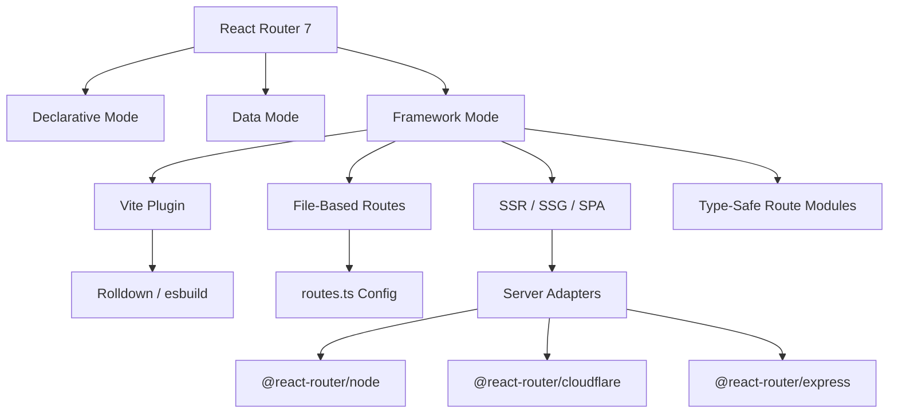
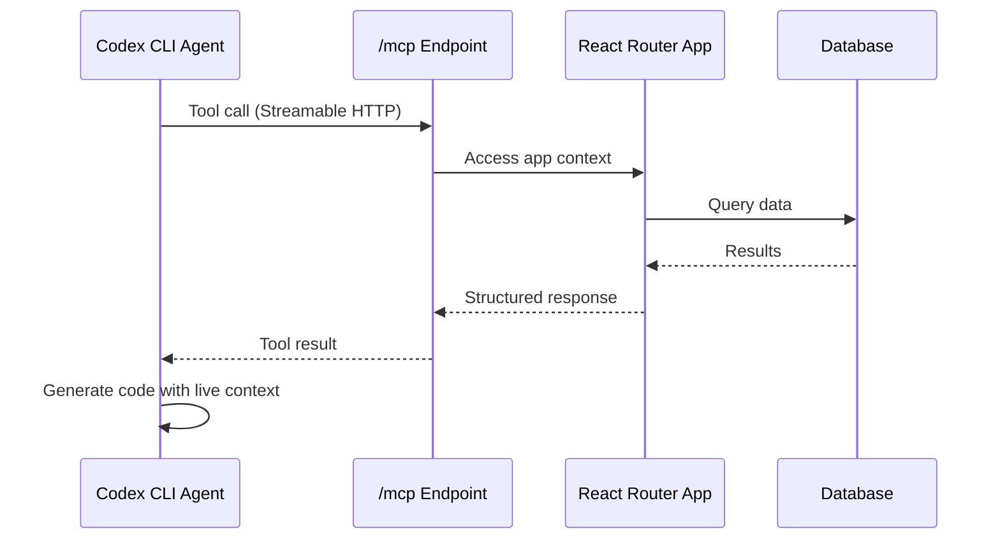
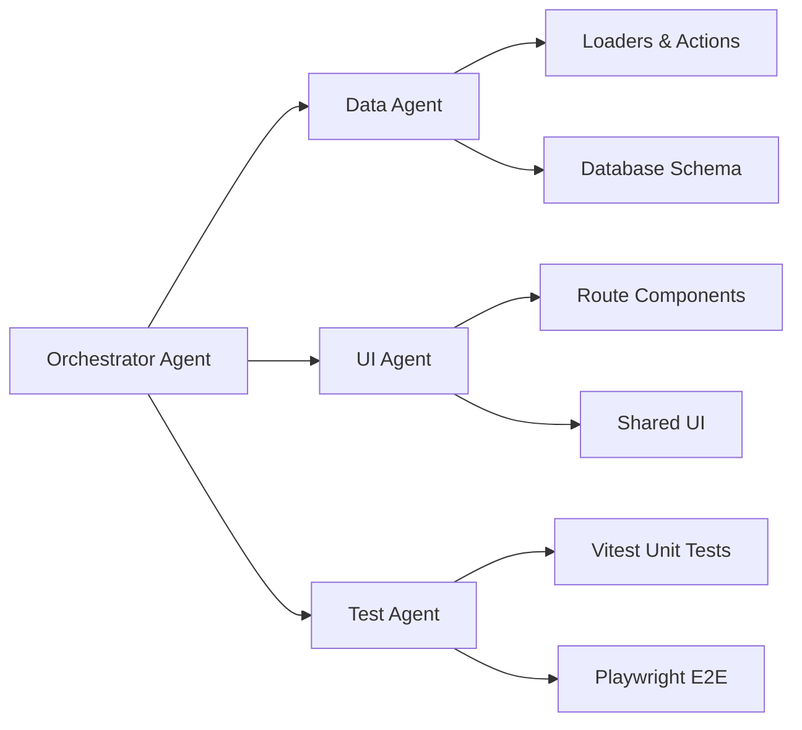

# Codex CLI for React Router 7 Development: Framework Mode, MCP Servers, and Full-Stack Agent Workflows


---

React Router 7 is no longer just a routing library. With the absorption of Remix into React Router's framework mode, it has become a full-stack React framework rivalling Next.js — complete with server-side rendering, file-based routing, typed loaders and actions, and a Vite-powered build pipeline [^1]. Version 7.16.0, released on 28 May 2026, stabilises several v8 future flags and continues the march toward middleware and split route modules [^2]. This article covers how to configure Codex CLI for React Router 7 projects, wire up MCP servers for documentation and tooling, and build agent-driven workflows across all three of React Router's operational modes.

## React Router 7: Three Modes, One Router

React Router 7 offers three distinct modes, each adding a layer of capability [^3]:

| Mode | Key Features | Rendering |
|------|-------------|-----------|
| **Declarative** | `<Link>`, `useNavigate`, `useLocation` — basic URL matching | SPA only |
| **Data** | `loader`, `action`, `useFetcher` — data orchestration with pending states | SPA only |
| **Framework** | Vite plugin, file routes, type-safe Route Module API, SSR/SSG/SPA | SSR, SSG, SPA |

Framework mode is the successor to Remix v2 and the recommended starting point for new projects [^1]. It ships automatic code splitting, intelligent route-level type generation, and server adapters for Node, Cloudflare Workers, and Express [^3].



## AGENTS.md for React Router 7 Projects

React Router's own repository ships an `AGENTS.md` that documents its five modes (including unstable RSC variants), monorepo architecture, testing conventions, and future flag strategy [^4]. For your own project, a well-crafted `AGENTS.md` prevents Codex from generating Remix v2 patterns when you need React Router v7 idioms.

A practical example:

```markdown
# AGENTS.md

## Stack
- React Router 7.16.x (Framework Mode)
- React 19 with TypeScript strict mode
- Vite 8 with @react-router/dev plugin
- Vitest + Testing Library for unit/integration tests
- Playwright for E2E

## Conventions
- Route modules export `loader`, `action`, `default`, `ErrorBoundary`
- Use typed `Route.LoaderArgs` and `Route.ComponentProps` from `./+types/`
- File routes follow flatRoutes() convention: `_index.tsx`, `blog.$slug.tsx`
- Data mutations use `<Form>` with `action` exports, never raw `fetch`
- SSR is the default strategy; SPA fallback via `ssr: false` in react-router.config.ts

## Testing
- Every loader/action has a co-located `.test.ts` with mocked dependencies
- E2E tests cover critical user flows in `tests/e2e/`
- Run `pnpm test` before committing

## Do NOT
- Import from `react-router-dom` — use `react-router` directly
- Use `createBrowserRouter` — we are in Framework Mode
- Generate Remix v2 code (no `remix.config.js`, no `@remix-run/*` imports)
```

This prevents a common agent failure mode: generating `createBrowserRouter` boilerplate when the project uses framework mode's `routes.ts` configuration [^3].

## Configuring Codex CLI for React Router 7

### Project-Level Configuration

Create `.codex/config.toml` in your project root:

```toml
[project]
sandbox = "workspace-write"

[model]
default = "o4-mini"

[instructions]
system = """
This is a React Router 7 project in Framework Mode.
Route modules live in app/routes/ and export loader, action, default, ErrorBoundary.
Use typed Route.LoaderArgs from ./+types/ for all loader parameters.
Never import from react-router-dom; use react-router directly.
"""
```

### MCP Server Integration

React Router has strong MCP server support from multiple directions.

**Documentation MCP via GitMCP:**

```bash
codex mcp add react-router-docs \
  --url https://gitmcp.io/remix-run/react-router
```

This exposes the entire React Router documentation to Codex's context, enabling the agent to look up loader signatures, server adapter APIs, and future flag semantics without hallucinating [^5].

**React DevTools MCP for component inspection:**

```bash
codex mcp add react-devtools \
  --command npx \
  --args -y react-devtools-mcp
```

**Vitest MCP for test execution:**

```bash
codex mcp add vitest \
  --command npx \
  --args -y @anthropic-ai/vitest-mcp
```

## Framework Mode Workflows with Codex CLI

### Scaffolding a New Route Module

React Router 7's route modules follow a consistent pattern. Codex excels at generating these when given proper instructions:

```bash
codex "Create a route module at app/routes/products.\$productId.tsx \
  with a loader that fetches from /api/products/:id, \
  an action that handles PUT for updates and DELETE for removal, \
  a default component showing product details with an edit form, \
  and an ErrorBoundary for 404 and server errors. \
  Add the route to routes.ts."
```

The generated route module should follow the typed pattern:

```typescript
// app/routes/products.$productId.tsx
import type { Route } from "./+types/products.$productId";

export async function loader({ params }: Route.LoaderArgs) {
  const product = await getProduct(params.productId);
  if (!product) throw new Response("Not found", { status: 404 });
  return { product };
}

export async function action({ params, request }: Route.ActionArgs) {
  const formData = await request.formData();
  const intent = formData.get("intent");

  if (intent === "delete") {
    await deleteProduct(params.productId);
    return redirect("/products");
  }

  await updateProduct(params.productId, Object.fromEntries(formData));
  return { success: true };
}

export default function Product({ loaderData }: Route.ComponentProps) {
  const { product } = loaderData;
  return (
    <div>
      <h1>{product.name}</h1>
      <Form method="post">
        <input name="name" defaultValue={product.name} />
        <button type="submit">Update</button>
        <button type="submit" name="intent" value="delete">
          Delete
        </button>
      </Form>
    </div>
  );
}

export function ErrorBoundary() {
  return <div>Something went wrong loading this product.</div>;
}
```

### SSR and Server Adapter Configuration

Framework mode supports multiple server adapters. Use Codex to configure deployment targets:

```bash
codex "Configure this React Router 7 app for Cloudflare Workers \
  deployment. Update react-router.config.ts to use the Cloudflare \
  adapter, add wrangler.toml, and ensure loaders use \
  Cloudflare-compatible APIs (no Node fs or path)."
```

The `react-router.config.ts` is the central configuration point:

```typescript
import type { Config } from "@react-router/dev/config";

export default {
  ssr: true,
  future: {
    v8_middleware: true,
    v8_splitRouteModules: true,
  },
} satisfies Config;
```

### Data Loading Patterns

React Router 7 supports both server loaders and client loaders in the same route, allowing progressive enhancement patterns [^3]:

```bash
codex "Add a clientLoader to the products list route that caches \
  loader data in sessionStorage for instant back-navigation. \
  The server loader should remain the source of truth on first load."
```

## Building an MCP Endpoint in React Router

Kent C. Dodds demonstrated that React Router v7 apps can serve MCP endpoints directly, eliminating the need for a separate MCP server project [^6]. This pattern embeds MCP tools within your existing application:



This approach enables agents to interact with your application's live data during development, querying real database schemas, testing API endpoints, and validating business logic against production-like data [^6].

## Agent-Driven Testing Workflows

### Loader and Action Unit Tests

```bash
codex "Write Vitest tests for the products route module. \
  Test the loader with valid and invalid product IDs. \
  Test the action for both update and delete intents. \
  Mock the data layer, not the HTTP layer."
```

### E2E with Playwright

```bash
codex "Write Playwright E2E tests for the product CRUD flow: \
  navigate to products list, click into a product, edit the name, \
  verify the update persists, then delete and verify redirect. \
  Use the dev server at localhost:5173."
```

### Type Generation Verification

React Router 7's typegen produces route-specific types in `.react-router/types/`. Codex should verify these after route changes:

```bash
codex exec --full-auto "Run npx react-router typegen and verify \
  no TypeScript errors in the generated +types/ directories. \
  Fix any type mismatches in route modules."
```

## Future Flags and v8 Migration

React Router 7.16.0 introduces warnings for five v8 future flags [^2]:

- `v8_middleware` — route-level middleware chains
- `v8_splitRouteModules` — granular code splitting per export
- `v8_viteEnvironmentApi` — Vite environment API integration
- `v8_passThroughRequests` — unmatched request pass-through
- `v8_trailingSlashAwareDataRequests` — trailing slash consistency

Use Codex to adopt these flags incrementally:

```bash
codex "Enable the v8_middleware future flag in react-router.config.ts. \
  Audit all routes for middleware compatibility. Add an auth middleware \
  to protected routes using the new middleware export pattern."
```

## Subagent Patterns for Full-Stack React Router Work

For larger features spanning loaders, components, and tests, decompose with subagents:

```bash
codex "Build a blog section with these routes: \
  /blog (list with pagination), \
  /blog/:slug (individual post with MDX rendering), \
  /blog/new (authenticated, form with action). \
  Use subagents: one for the data layer and loaders, \
  one for the UI components, one for the tests."
```



## Common Pitfalls

**Remix v2 code generation.** Without explicit `AGENTS.md` instructions, agents may generate `@remix-run/react` imports or `remix.config.js` files. React Router 7 uses `react-router` imports exclusively [^1].

**createBrowserRouter in framework mode.** Framework mode handles router creation via the Vite plugin. Agents sometimes generate `createBrowserRouter` boilerplate, which conflicts with the framework mode entry point [^3].

**Missing type generation.** Route types in `./+types/` are generated, not hand-written. If an agent creates manual type definitions instead of running `npx react-router typegen`, the types will drift from the actual route configuration [^4].

**Server adapter mismatch.** Loaders using Node-specific APIs (e.g., `fs.readFile`) will fail on Cloudflare Workers. The `AGENTS.md` should specify the target runtime to prevent this.

## Citations

[^1]: [React Router v7 — Remix Blog](https://remix.run/blog/react-router-v7) — Official announcement of Remix merging into React Router 7.

[^2]: [React Router Changelog — v7.16.0](https://reactrouter.com/changelog) — Release notes for v7.16.0, 28 May 2026, stabilising v8 future flags.

[^3]: [Picking a Mode — React Router Documentation](https://reactrouter.com/start/modes) — Official guide to declarative, data, and framework modes.

[^4]: [AGENTS.md — remix-run/react-router](https://github.com/remix-run/react-router/blob/main/AGENTS.md) — React Router's own agent instruction file documenting modes, testing, and conventions.

[^5]: [GitMCP — remix-run/react-router](https://gitmcp.io/remix-run/react-router) — Documentation MCP server for React Router, compatible with Codex CLI and other agent tools.

[^6]: [Kent C. Dodds — Interactive MCP with React Router](https://kentcdodds.com/talks/interactive-mcp-with-react-router) — Talk on embedding MCP endpoints directly within React Router v7 applications.

[^7]: [React Router Official Documentation](https://reactrouter.com/) — Comprehensive reference for all React Router 7 APIs and patterns.

[^8]: [Codex CLI MCP Configuration — OpenAI Developers](https://developers.openai.com/codex/mcp) — Official guide for configuring MCP servers with Codex CLI.
