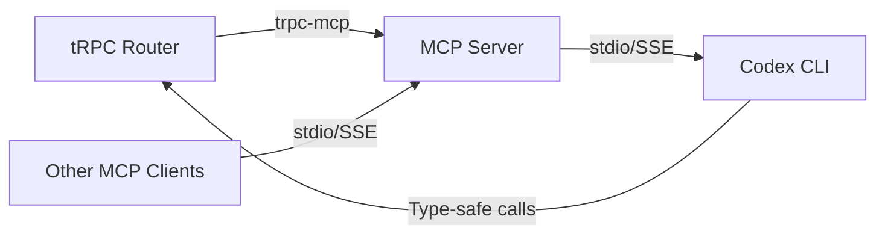
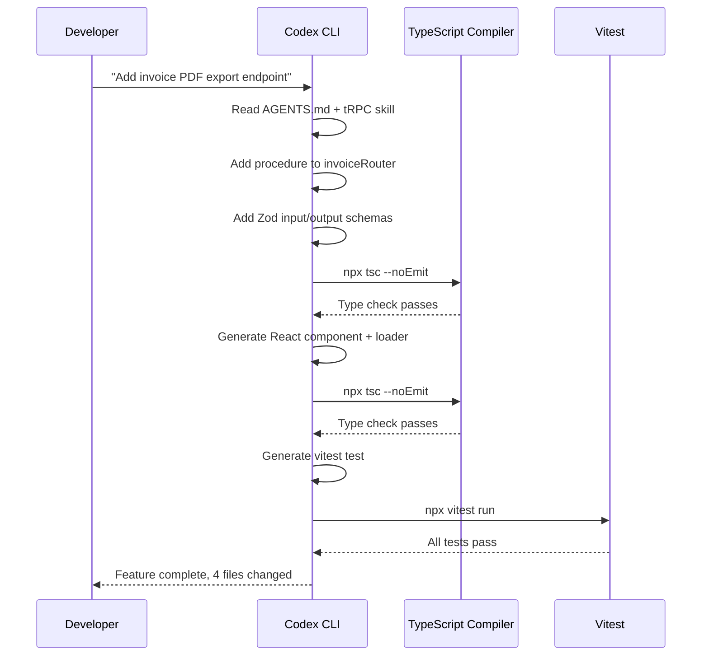

# Codex CLI for tRPC v11 Development: Type-Safe APIs, TanStack Integration, and MCP-Bridged Agent Workflows


---

tRPC v11 shipped with streaming responses, FormData support, SSE subscriptions, and a revamped TanStack Query integration[^1]. Combined with TanStack Start reaching Release Candidate status[^2], the TypeScript full-stack ecosystem now offers end-to-end type safety from database to component without code generation. Codex CLI slots neatly into this stack: its TypeScript-native sandbox, MCP server support, and agent skills system let you scaffold routers, generate Zod schemas, and even expose tRPC procedures as MCP tools — all from the terminal.

This article covers the practical integration points between Codex CLI and the tRPC v11 + TanStack ecosystem, including project setup, agent skills, the trpc-mcp bridge, and production workflow patterns.

## Why tRPC Suits Agent-Driven Development

tRPC's core promise — types *are* the contract[^3] — aligns with how coding agents work best. When an agent modifies a server procedure, TypeScript immediately surfaces every callsite that breaks. No OpenAPI spec drift, no generated client staleness, no runtime schema mismatch. The compiler becomes the agent's guardrail.

Key tRPC v11 features that matter for agent workflows:

- **Shorthand router syntax** — plain objects as sub-routers reduce boilerplate the agent must generate[^1]
- **`httpBatchStreamLink`** — streaming query responses let agents process large datasets incrementally[^1]
- **FormData and binary inputs** — `octetInputParser` handles file uploads without custom middleware[^1]
- **SSE subscriptions** — real-time features via `httpSubscriptionLink` without WebSocket complexity[^1]
- **TanStack Query v5 integration** — native `QueryOptions`/`MutationOptions` interfaces replace the classic wrapper API[^4]

## Project Setup with Codex CLI

### Scaffolding a tRPC + TanStack Start Project

```bash
# Create a TanStack Start project with tRPC
npx create-start-app my-app --template with-trpc-react-query
cd my-app

# Initialise Codex CLI configuration
codex init
```

Add tRPC-specific guidance to your `AGENTS.md`:

```markdown
## tRPC Conventions

- All procedures use Zod v3 input/output validators
- Business logic lives in `src/server/services/`, not in procedure handlers
- Use `TRPCError` with appropriate HTTP codes, never raw `throw`
- Procedures are thin: validate → delegate → return
- Router files map 1:1 to domain entities in `src/server/routers/`
```

### Configuring Codex CLI for Type-Safe Workflows

In your project-scoped `.codex/config.toml`, set the sandbox to permit TypeScript compilation checks:

```toml
[sandbox]
allow_commands = [
  "npx tsc --noEmit",
  "npx vitest run",
  "npm run build",
]

[model]
default = "o3"
```

This ensures Codex CLI runs the TypeScript compiler after every mutation, catching type errors before they propagate.

## The tRPC Agent Skill

A dedicated tRPC agent skill is available for Codex CLI[^5], encoding best practices directly into the agent's instruction set:

```bash
# Install the tRPC skill
codex skills add trpc
```

The skill instructs the agent to:

1. Initialise tRPC with `initTRPC.create()` and define context factories for session and database access
2. Create `publicProcedure` and `protectedProcedure` bases with middleware chains
3. Validate all inputs with Zod schemas
4. Use `TRPCError` with appropriate codes for error handling
5. Extract business logic into service functions[^5]

When you prompt Codex CLI to add a new API endpoint, the skill ensures the generated code follows these conventions automatically.

## Bridging tRPC and MCP with trpc-mcp

The `trpc-mcp` library[^6] lets you expose tRPC procedures as MCP tools, creating a bridge between your API layer and any MCP-compatible agent — including Codex CLI itself.



### Setting Up trpc-mcp

Install and configure the bridge:

```bash
npm install trpc-mcp
```

```typescript
// src/server/mcp.ts
import { initTRPC } from "@trpc/server";
import { McpMeta, createMcpServer } from "trpc-mcp";
import { StdioServerTransport } from "@modelcontextprotocol/sdk/server/stdio.js";
import { z } from "zod";

const t = initTRPC.meta<McpMeta>().create();

const appRouter = t.router({
  getUser: t.procedure
    .meta({ openapi: { enabled: true, description: "Fetch user by ID" } })
    .input(z.object({ id: z.string().uuid() }))
    .output(z.object({ name: z.string(), email: z.string() }))
    .query(({ input }) => userService.findById(input.id)),

  createInvoice: t.procedure
    .meta({ openapi: { enabled: true, description: "Create a new invoice" } })
    .input(z.object({
      customerId: z.string().uuid(),
      items: z.array(z.object({
        description: z.string(),
        amount: z.number().positive(),
      })),
    }))
    .mutation(({ input }) => invoiceService.create(input)),
});

const server = createMcpServer({
  name: "my-api",
  version: "1.0.0",
  router: appRouter,
});

const transport = new StdioServerTransport();
await server.connect(transport);
```

Each procedure annotated with `meta({ openapi: { enabled: true } })` becomes a callable MCP tool[^6]. Zod schemas translate directly to MCP tool input schemas — no manual mapping required.

### Registering with Codex CLI

```bash
codex mcp add my-api -- npx tsx src/server/mcp.ts
```

Now Codex CLI can invoke your tRPC procedures as MCP tools during development sessions, enabling patterns like:

- Querying your API to understand data shapes before writing frontend components
- Creating test fixtures via mutation tools
- Validating business logic against live (or local) data

## TanStack Integration Patterns

### TanStack Query v5 with tRPC v11

The new TanStack Query integration[^4] uses native `QueryOptions` rather than wrapping `useQuery`:

```typescript
// src/hooks/useUser.ts
import { trpc } from "~/utils/trpc";

// v11 style — uses native TanStack Query options
export function useUser(id: string) {
  return trpc.getUser.useQuery({ id });
}

// Prefetching in a TanStack Start loader
export const Route = createFileRoute("/users/$userId")({
  loader: async ({ params, context }) => {
    await context.trpc.getUser.ensureQueryData({ id: params.userId });
  },
  component: UserPage,
});
```

Codex CLI understands this pattern and will generate loaders with proper prefetching when you ask it to "add a user detail page with server-side data loading".

### TanStack Start Server Functions

TanStack Start's server functions[^2] complement tRPC for cases where a full procedure is overkill:

```typescript
// src/server/functions/sendEmail.ts
import { createServerFn } from "@tanstack/start";
import { z } from "zod";

export const sendWelcomeEmail = createServerFn()
  .validator(z.object({ userId: z.string().uuid() }))
  .handler(async ({ data }) => {
    const user = await db.user.findUnique({ where: { id: data.userId } });
    await emailService.sendWelcome(user);
    return { sent: true };
  });
```

The guidance in `AGENTS.md` should clarify when to use tRPC (shared API layer, multiple consumers) versus server functions (page-specific logic, form actions).

## Streaming and Real-Time Patterns

tRPC v11's streaming capabilities[^1] open up agent-assisted real-time feature development:

### Streaming Query Responses

```typescript
// Server: streaming a large dataset
const logsRouter = t.router({
  streamLogs: t.procedure
    .input(z.object({ since: z.date() }))
    .query(async function* ({ input }) {
      const cursor = db.logs.findStream({ since: input.since });
      for await (const batch of cursor) {
        yield batch;
      }
    }),
});
```

```typescript
// Client: consuming the stream
const { data } = trpc.streamLogs.useQuery(
  { since: yesterday },
  { trpcOptions: { httpBatchStreamLink: true } }
);
```

### SSE Subscriptions

```typescript
// Server: real-time notifications
const notificationsRouter = t.router({
  onNewMessage: t.procedure
    .input(z.object({ channelId: z.string() }))
    .subscription(async function* ({ input }) {
      for await (const msg of messageStream(input.channelId)) {
        yield msg;
      }
    }),
});
```

When building these patterns with Codex CLI, the agent handles the boilerplate — generator functions, Zod validators, client-side subscription hooks — while you focus on the business logic.

## Testing with Codex CLI

tRPC's type safety extends to testing. Codex CLI can generate type-safe test suites:

```bash
codex "Generate vitest tests for the invoiceRouter covering
create, list, and getById procedures. Use createCallerFactory
for direct procedure testing without HTTP."
```

The generated tests follow tRPC v11 conventions:

```typescript
// src/server/routers/__tests__/invoice.test.ts
import { createCallerFactory } from "@trpc/server";
import { appRouter } from "../root";
import { createTestContext } from "~/test/helpers";

const createCaller = createCallerFactory(appRouter);

describe("invoiceRouter", () => {
  it("creates an invoice with valid input", async () => {
    const ctx = await createTestContext({ userId: "test-user" });
    const caller = createCaller(ctx);

    const result = await caller.createInvoice({
      customerId: "cust-123",
      items: [{ description: "Consulting", amount: 500 }],
    });

    expect(result.id).toBeDefined();
    expect(result.total).toBe(500);
  });
});
```

## Workflow: Full-Stack Feature with Codex CLI

A typical feature addition follows this flow:



The TypeScript compiler runs after each mutation step, catching type mismatches immediately. This is the core advantage of tRPC in agent workflows — the type system acts as a continuous verification layer.

## Production Considerations

### Router Organisation at Scale

For large applications, structure routers by domain:

```
src/server/routers/
├── root.ts          # mergeRouters entry point
├── user.ts
├── invoice.ts
├── notification.ts
└── _app.ts          # type export for client
```

Codex CLI's codebase understanding means it will place new procedures in the correct domain router and update the root merge automatically.

### MCP Tool Exposure Policies

Not every procedure should be an MCP tool. Use the `meta.openapi.enabled` flag selectively:

- **Enable** for read-heavy queries and idempotent mutations useful during development
- **Disable** for destructive operations (delete, bulk update) and sensitive endpoints (auth, billing)
- Consider a separate `dev-mcp.ts` entrypoint that exposes a wider set of tools than production

### Type Export Strategy

Export the router type for client consumption:

```typescript
// src/server/routers/_app.ts
export type AppRouter = typeof appRouter;
```

This single type export is what makes the entire client type-safe. Codex CLI preserves this pattern when refactoring routers.

## Citations

[^1]: [Announcing tRPC v11](https://trpc.io/blog/announcing-trpc-v11) — tRPC blog, March 2025. Covers streaming, FormData, SSE subscriptions, shorthand syntax, and TanStack Query v5 support.

[^2]: [TanStack Start v1 Release Candidate](https://tanstack.com/blog/announcing-tanstack-start-v1) — TanStack blog, September 2025. Type-safe routing, server functions, TanStack Query integration, no vendor lock-in.

[^3]: [tRPC — Move Fast and Break Nothing](https://trpc.io/) — Official tRPC documentation. End-to-end type-safe APIs without code generation.

[^4]: [Introducing the new TanStack React Query integration](https://trpc.io/blog/introducing-tanstack-react-query-client) — tRPC blog. Native QueryOptions/MutationOptions interfaces replacing the classic wrapper API.

[^5]: [tRPC Agent Skill](https://terminalskills.io/skills/trpc) — Terminal Skills marketplace. Agent skill encoding tRPC best practices for procedure creation, Zod validation, and error handling.

[^6]: [trpc-mcp — Serve tRPC routes as an MCP server](https://github.com/Jacse/trpc-mcp) — GitHub. MIT-licensed bridge converting annotated tRPC procedures to MCP tools via stdio transport.
