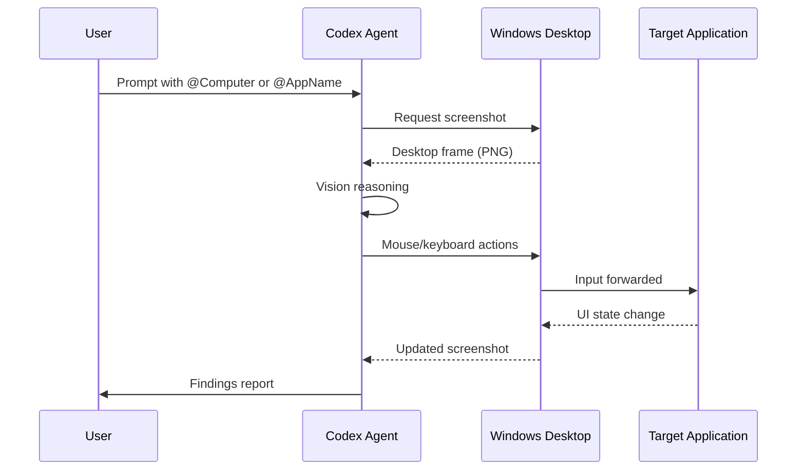
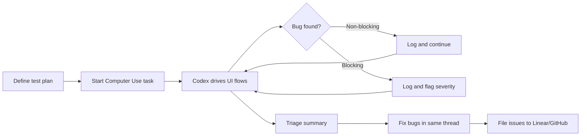

# Codex Computer Use on Windows: Desktop Automation, QA Testing, and GUI-Driven Agent Workflows


---

Computer Use landed on Windows with Codex app version 26.527, released on 29 May 2026 [^1]. For the first time, Codex can see, click, and type inside Windows desktop applications — operating the graphical interface the same way a human tester would. This article covers the architecture, configuration, practical QA workflows, and the community MCP plugin that extends Computer Use beyond what ships in the box.

## What Computer Use Actually Does

Computer Use gives Codex the ability to interact with graphical user interfaces rather than being confined to the terminal and file system [^2]. The agent captures screenshots of the active desktop, reasons about what it sees, and then issues mouse clicks, keyboard input, and scroll actions to drive applications through their flows.

On macOS, Computer Use debuted in April 2026 and supports background operation via a locked-desktop feature that temporarily unlocks the display during active turns [^2]. On Windows, the model is simpler and more constrained: Codex takes over the foreground, and you cannot use the same desktop session while a Computer Use task runs [^2].



## Setup and Prerequisites

### Installing the Computer Use Plugin

Computer Use is delivered as a first-party plugin, not baked into the core runtime [^2]. Install it from the Codex app settings before requesting any desktop operations:

1. Open **Settings → Plugins** in the Codex desktop app.
2. Locate **Computer Use** and click **Install**.
3. Restart the app if prompted.

No additional permissions are required on Windows beyond keeping the target application visible on the active desktop [^2]. This contrasts with macOS, which requires both Screen Recording and Accessibility permissions at the OS level [^2].

### System Requirements

| Requirement | Detail |
|---|---|
| OS | Windows 11 recommended; Windows 10 build 1809+ best effort [^3] |
| Codex app | Version 26.527 or later [^1] |
| Sandbox | Elevated sandbox preferred for strongest isolation [^3] |
| Desktop | Interactive session — no headless or RDP-minimised windows |

### Sandbox Configuration

Codex on Windows ships with two native sandbox modes [^3]. When running Computer Use, the elevated sandbox provides stronger isolation through dedicated lower-privilege users and firewall rules:

```toml
[windows]
sandbox = "elevated"
```

File edits and shell commands still follow your configured approval and sandbox settings even while Computer Use is active [^2]. Desktop GUI interactions sit outside the sandbox boundary — Codex can click anything visible on screen — which is why the per-app approval prompt exists.

## Activation and Prompting

Trigger Computer Use by mentioning `@Computer` in your prompt, referencing a specific application by name (e.g. `@Chrome`, `@Paint`), or simply describing the GUI workflow you want performed [^2]. Codex requests approval before interacting with each application. You can allow one-time access or select "Always allow" for trusted applications [^2].

### Effective Prompting Patterns

The official QA use-case guide recommends being explicit about environment state, naming the issue types you care about, and specifying whether blocking bugs should halt the test run [^4]:

```
@Computer Test my app running at http://localhost:3000.

Test these flows:
- User registration with email and password
- Dashboard data load after login
- Settings page form validation

For every bug you find, include:
- Repro steps
- Expected result
- Actual result
- Severity (critical / major / minor / cosmetic)

Keep going past non-blocking issues and end with a
short triage summary.
```

Including account state, test data, and feature flags upfront produces significantly better results than leaving the agent to guess [^4].

## Windows-Specific Constraints

### Foreground Takeover

On Windows, Computer Use operates on the active desktop and takes over the pointer and keyboard [^2]. You cannot use the same session concurrently. Three workarounds exist:

1. **Secondary device** — monitor and steer the task from ChatGPT on iOS or Android [^1].
2. **Virtual machine** — run Codex inside a Windows VM and continue working on the host.
3. **Walk away** — let the task run unattended and review the findings when it finishes.

The macOS locked-use feature, which temporarily unlocks the display during active Computer Use turns and relocks on local input [^2], has no Windows equivalent at the time of writing.

### What Computer Use Cannot Do

Several operations are explicitly blocked for security reasons [^2]:

- **Terminal applications** — Codex already has shell access; Computer Use adds GUI, not terminal, control.
- **Self-automation** — Codex cannot drive its own UI, preventing sandbox or approval policy bypass.
- **Administrator authentication** — UAC prompts and security dialogs are out of scope.
- **Background operation** — unlike macOS, Windows Computer Use requires the foreground.

### Regional Availability

Computer Use on Windows is unavailable in the European Economic Area, the United Kingdom, and Switzerland at launch [^2]. ⚠️ OpenAI has not published a timeline for expanding availability to these regions.

## QA Testing Workflows

Computer Use is a natural fit for QA because it exercises the same interface a real user sees [^4]. It can catch functional bugs, layout regressions, broken interactions, and confusing copy in a single pass.



### Post-Run Triage

After the QA pass completes, the thread remains active [^4]. You can:

- Ask Codex to fix identified bugs directly in the codebase.
- Convert findings into GitHub or Linear issues with structured fields.
- Narrow subsequent passes to specific failing flows for regression checks.

### Combining Computer Use with CLI Testing

A powerful pattern combines GUI-level Computer Use with Codex's existing CLI capabilities. Run unit and integration tests through the terminal, then use Computer Use to verify the visual output:

```
Run `npm test` to check unit tests pass, then @Computer open
http://localhost:3000 in Chrome and verify the dashboard renders
correctly with the test fixtures. Compare what you see against
the design spec in docs/dashboard-spec.png.
```

This catches the class of bugs where tests pass but the rendered output is visually broken — misaligned layouts, missing icons, incorrect colour values.

## Community MCP Plugin: Extended Desktop Control

The official Computer Use plugin covers common workflows, but the community `ezpzai/codex-computer-use-windows` plugin provides over 30 additional tools through a local MCP server [^5]. These include:

| Category | Tools |
|---|---|
| Screen | `screenshot`, `screenshot_active_window`, `observe_screen`, `get_screen_size`, `extract_text` |
| Input | `click`, `move_mouse`, `drag_mouse`, `type_text`, `press_key`, `hotkey`, `scroll` |
| Window | `list_windows`, `focus_window`, `run_program`, `open_app`, `get_window_text` |
| Chrome | `get_url`, `get_tab_title`, `navigate`, `search`, `read_page_content` |
| UI Automation | Element tree inspection, element detection and interaction |
| Clipboard | Read and write clipboard content |

### Installation

```powershell
git clone https://github.com/ezpzai/codex-computer-use-windows.git `
  "$HOME\.codex\plugins\computer-use-windows"
```

Then create or update `~/.agents/plugins/marketplace.json` with a local plugin entry pointing to `./.codex/plugins/computer-use-windows` [^5]. After restarting Codex, install from **Plugins → Local Plugins**. The plugin requires Python 3.10+ with the `py` launcher [^5].

This MCP-based approach means the tools are also available from Codex CLI via `codex mcp add`, not just the desktop app — enabling headless automation scenarios where the CLI drives a visible desktop session.

## Safety and Security Considerations

Computer Use on Windows demands more caution than CLI-only workflows because the agent interacts with your live desktop session:

- **Browser sessions** — Codex interacts with pages where you are already signed in. Sites treat clicks and form submissions as your account actions [^2].
- **Sensitive applications** — keep applications with credentials, payment details, or security settings closed unless they are the explicit target of the task [^2].
- **Per-app approval** — review each application approval prompt rather than blanket-allowing everything. Use "Always allow" only for trusted, low-risk applications [^2].
- **Stay present for sensitive operations** — account settings, payment flows, and security configurations should not run unattended [^2].

Screenshots captured during Computer Use are subject to your ChatGPT data controls and privacy settings [^2].

## Practical Recipe: Windows Desktop Application Testing

Here is a complete workflow for testing a Windows Forms or WPF application:

```
@Computer Launch MyApp.exe from C:\Projects\MyApp\bin\Release.

Test plan:
1. Main window — verify all toolbar buttons are enabled and correctly labelled
2. File → New — create a new document, type sample text, verify it appears
3. File → Save As — save to Desktop, close and reopen, verify content persists
4. Edit → Preferences — change theme to Dark, verify the UI repaints
5. Window → Split View — verify both panes show content
6. Help → About — verify version string matches 2.4.1

For each issue found, capture a screenshot and note:
- Exact menu path or button
- Expected vs actual behaviour
- Severity

End with a summary table of all findings.
```

This approach works for any Windows GUI application — Electron apps, WinUI 3, WPF, Win32, or browser-based tools accessed through Chrome.

## What This Means for Development Teams

Computer Use on Windows closes the last major gap in Codex's testing capabilities. CLI-driven test suites catch logic errors; Computer Use catches the visual and interaction bugs that only appear when a human (or agent) actually uses the interface.

For teams already using Codex CLI for code generation and review, adding Computer Use to the QA phase creates an end-to-end workflow: write the code with the CLI agent, then verify the result with the GUI agent — all within the same Codex thread. The limitation is real — you lose your desktop while tasks run — but for overnight regression suites, CI-triggered VM sessions, or quick pre-merge smoke tests, that trade-off is worthwhile.

---

## Citations

[^1]: OpenAI, "Codex for (almost) everything" (May 2026), [https://openai.com/index/codex-for-almost-everything/](https://openai.com/index/codex-for-almost-everything/)

[^2]: OpenAI Developers, "Computer Use – Codex app" (2026), [https://developers.openai.com/codex/app/computer-use](https://developers.openai.com/codex/app/computer-use)

[^3]: OpenAI Developers, "Windows – Codex" (2026), [https://developers.openai.com/codex/windows](https://developers.openai.com/codex/windows)

[^4]: OpenAI Developers, "QA your app with Computer Use" (2026), [https://developers.openai.com/codex/use-cases/qa-your-app-with-computer-use](https://developers.openai.com/codex/use-cases/qa-your-app-with-computer-use)

[^5]: ezpzai, "codex-computer-use-windows" (2026), [https://github.com/ezpzai/codex-computer-use-windows](https://github.com/ezpzai/codex-computer-use-windows)
