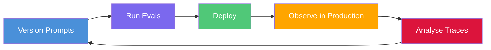
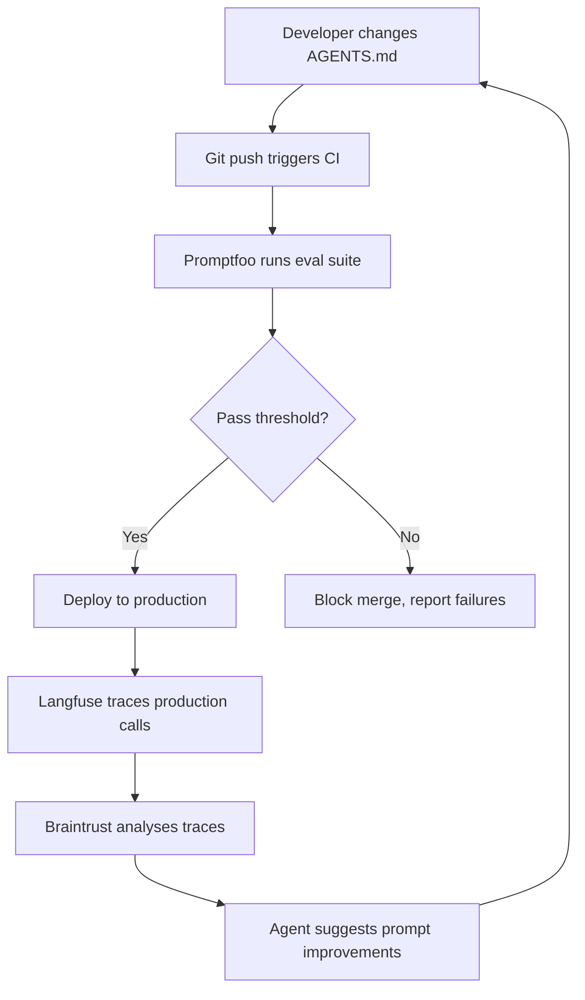

# LLMOps with Codex CLI: Prompt Versioning, Eval Pipelines, and Production Observability


---

LLMOps — the discipline of deploying, versioning, evaluating, and monitoring large language model applications in production — has matured from a buzzword into a \$7.14 billion market in 2026 [^1]. Yet most guides treat it as a platform concern, separate from the coding agent that writes and ships your code. That separation is artificial. Codex CLI sits at the intersection of development and operations: it generates the code, runs the evals, and — via MCP — connects directly to the observability platforms that track production behaviour.

This article maps the complete LLMOps loop through Codex CLI: versioning prompts as code, running eval pipelines in CI, tracing agent behaviour in production, and closing the feedback loop.

## The LLMOps Loop

The four failure modes that make LLMOps non-negotiable are silent degradation, prompt-driven outages, uncontrolled token spend, and compliance exposure from unlogged inference [^2]. Codex CLI touches each of these through its instruction hierarchy, non-interactive execution mode, and MCP integrations.



## Prompt Versioning: AGENTS.md as Code

Codex CLI's instruction hierarchy is already a prompt versioning system. It concatenates files from your global `~/.codex/AGENTS.md` through every `AGENTS.md` along the directory tree to your working directory, capped at 32 KiB [^3]. Each file is checked into Git, which means every prompt change gets a commit hash, a diff, and a blame trail.

### The Instruction Stack

```
~/.codex/AGENTS.md          → Global defaults (model preferences, house style)
repo-root/AGENTS.md          → Project-wide conventions
repo-root/src/AGENTS.md      → Module-specific guidance
repo-root/src/api/AGENTS.md  → Endpoint-specific rules
```

Codex checks each directory for `AGENTS.override.md`, `AGENTS.md`, `TEAM_GUIDE.md`, and `.agents.md` in that order [^3]. Files closer to the working directory appear later in the concatenated prompt, effectively overriding earlier guidance.

### Treat Prompt Changes Like Code Changes

The discipline transfers directly from software engineering:

- **Branch per prompt change.** Create a feature branch for each AGENTS.md modification.
- **Run evals on the branch** before merging (covered below).
- **Review diffs.** A one-line change in AGENTS.md can shift model behaviour dramatically. Treat these diffs with the same scrutiny as API contract changes.
- **Tag releases.** When a prompt set ships to production, tag the commit. If behaviour regresses, you can `git bisect` through prompt versions.

### Skills Replace Custom Prompts

Codex CLI deprecated custom prompts (`~/.codex/prompts/*.md`) in favour of Skills [^4]. Skills support implicit invocation, repository-based sharing, and structured metadata — making them the proper unit of reusable prompt logic. Store them in `.agents/skills/<name>/SKILL.md` and version them alongside your code.

## Eval Pipelines with Promptfoo

Promptfoo is the open-source backbone for Codex CLI evaluation. Its provider makes the Codex SDK available for agent evals, capturing final response text, token usage, thread and session IDs, skill usage, and traced shell, MCP, search, and file steps [^5].

### Basic Eval Configuration


```yaml
# promptfooconfig.yaml
providers:
  - id: openai:codex-sdk
    config:
      model: o4-mini
      working_dir: ./src
      sandbox_mode: read-only
      enable_streaming: true

prompts:
  - "Refactor the {{module}} module to reduce cyclomatic complexity"

tests:
  - vars:
      module: auth
    assert:
      - type: contains
        value: "function"
      - type: trajectory:step-count
        value:
          type: command
          min: 1
      - type: cost
        threshold: 0.50
```


### Trajectory Assertions

Promptfoo's trajectory assertions let you verify agent *behaviour*, not just output. With `enable_streaming: true`, you can assert on shell commands executed, MCP tool calls made, files modified, and reasoning steps taken [^5]:

```yaml
tests:
  - vars:
      task: "Add input validation to the user registration endpoint"
    assert:
      - type: trajectory:tool-used
        value: grep
      - type: trajectory:tool-args-match
        value: "validation"
      - type: skill-used
        value: test-driven-development
```

### Deep Tracing

For full visibility into CLI-level spans, enable deep tracing. This propagates OpenTelemetry context into the Codex process itself [^5]:

```yaml
providers:
  - id: openai:codex-sdk
    config:
      enable_streaming: true
      deep_tracing: true
```

Note: deep tracing is incompatible with thread persistence. When `deep_tracing: true`, `persist_threads`, `thread_id`, and `thread_pool_size` are silently ignored [^5].

## CI Integration with `codex exec`

`codex exec` (or `codex e`) runs Codex non-interactively for scripted and CI workflows [^6]. Combined with Promptfoo, this creates a proper eval gate in your pipeline.

### GitHub Actions Eval Gate


```yaml
# .github/workflows/prompt-eval.yml
name: Prompt Eval Gate
on:
  pull_request:
    paths:
      - '**/AGENTS.md'
      - '**/AGENTS.override.md'
      - '.agents/**'

jobs:
  eval:
    runs-on: ubuntu-latest
    steps:
      - uses: actions/checkout@v4
      - uses: actions/setup-node@v4
        with:
          node-version: 22
      - run: npm install -g promptfoo @openai/codex-sdk
      - run: promptfoo eval --ci --output results.json
        env:
          OPENAI_API_KEY: ${{ secrets.OPENAI_API_KEY }}
      - run: promptfoo eval assert --input results.json --threshold 0.8
```


This triggers evaluations only when instruction files change, keeping CI costs proportional to prompt churn rather than every commit.

### Batch Evaluation with Structured Output

For larger eval suites, use `codex exec` with `--output-schema` to produce structured JSON that downstream tools can parse [^6]:

```bash
codex exec \
  --model o4-mini \
  --output-schema '{"type":"object","properties":{"score":{"type":"number"},"reasoning":{"type":"string"}},"required":["score","reasoning"]}' \
  "Evaluate whether this code follows our security guidelines" \
  < src/auth/handler.ts
```

The `--json` flag emits newline-delimited JSON events covering the execution lifecycle: `thread.started`, `turn.started`, `item.completed`, and `turn.completed` [^6].

## Production Observability

Once prompts ship, you need to observe their behaviour in production. Two MCP-integrated platforms dominate this space.

### Langfuse: Open-Source Tracing

Langfuse provides end-to-end tracing of MCP applications by tracking both client and server operations [^7]. It supports two tracing modes:

- **Separate traces** — client and server generate independent traces, useful for service boundary separation.
- **Linked traces** — propagate trace context from client to server using MCP's `_meta` field with W3C Trace Context format [^7].

#### Adding Langfuse to Codex CLI

```bash
codex mcp add langfuse -- \
  uvx langfuse-mcp
```

Set the required environment variables in your Codex config:

```toml
[mcp_servers.langfuse]
command = "uvx"
args = ["langfuse-mcp"]

[mcp_servers.langfuse.env]
LANGFUSE_PUBLIC_KEY = "pk-lf-..."
LANGFUSE_SECRET_KEY = "sk-lf-..."
LANGFUSE_HOST = "https://cloud.langfuse.com"
```

The Langfuse MCP server exposes tool groups for traces, observations, sessions, exceptions, prompts, datasets, annotation queues, and scores [^8]. Use `--read-only` for safer production access.

### Braintrust: Managed Eval + Observability

Braintrust connects evals to production monitoring in a single platform. Its MCP server lets you query experiments, search documentation, and analyse production logs directly from Codex CLI [^9]:

```toml
[mcp_servers.braintrust]
url = "https://api.braintrust.dev/mcp"

[mcp_servers.braintrust.env]
BRAINTRUST_API_KEY = "br-..."
```

The `bt eval --watch` command re-runs your eval every time underlying code changes. Pair this with a coding agent iterating on a prompt, and you get a tight feedback loop where the agent sees the impact of each change in seconds [^9].



## Closing the Loop: Agent-Driven Prompt Optimisation

The most powerful pattern combines all three layers. Codex CLI can:

1. **Read production traces** via the Langfuse MCP server — identifying slow responses, high-cost turns, or degraded output quality.
2. **Run evals** against proposed prompt changes using Promptfoo's trajectory assertions.
3. **Suggest AGENTS.md modifications** based on observed failure patterns.
4. **Verify improvements** by re-running the eval suite before committing.

This creates a genuine feedback loop where the agent that writes code also maintains the prompts that govern its own behaviour.

### Practical Example: Cost Optimisation

```bash
# Ask Codex to analyse token spend and suggest prompt changes
codex exec \
  --model o4-mini \
  "Query the Langfuse MCP for traces from the last 24 hours. \
   Identify the top 3 most expensive prompt patterns. \
   Suggest AGENTS.md changes that would reduce token usage \
   without degrading output quality. \
   Run promptfoo eval to verify the changes."
```

## Model and Tool Currency

At the time of writing, Codex CLI stable is at v0.135.0 (28 May 2026) [^10]. Promptfoo supports Codex SDK models including GPT-5.5, GPT-5.4, GPT-5.3 Codex, GPT-5.2, and GPT-5.1 Codex variants [^5]. The `o4-mini` model referenced in examples above remains the recommended default for cost-efficient agent work. Langfuse MCP tracing uses OpenTelemetry with W3C Trace Context propagation via MCP's `_meta` field [^7].

## Key Takeaways

- **Version prompts in Git.** AGENTS.md files are production artefacts — treat them with the same rigour as application code.
- **Gate merges on evals.** Use Promptfoo with trajectory assertions to catch behavioural regressions before they ship.
- **Trace everything.** Langfuse and Braintrust MCP servers give Codex CLI direct access to production telemetry.
- **Close the loop.** Let the agent that writes code also optimise the prompts that govern it.

The LLMOps market is projected to reach \$15.59 billion by 2030 [^1]. The tooling is mature. The integration points exist. The only missing piece is the discipline to wire them together — and with Codex CLI's MCP ecosystem, that wiring is a configuration file away.

## Citations

[^1]: The Business Research Company, "Large Language Model Operationalization (LLMOps) Software Global Market Report 2026," [giiresearch.com](https://www.giiresearch.com/report/tbrc1994653-large-language-model-operationalization-llmops.html)

[^2]: MLOps Lab, "2026 LLMOps Crash Course: Master Deployment, Monitoring & Lifecycle," [mlopslab.org](https://mlopslab.org/llmops-tutorial-a-beginners-guide-to-llm-operations-lifecycle-workflow/)

[^3]: OpenAI, "Custom instructions with AGENTS.md – Codex," [developers.openai.com](https://developers.openai.com/codex/guides/agents-md)

[^4]: OpenAI, "Custom Prompts – Codex CLI," [developers.openai.com](https://developers.openai.com/codex/custom-prompts)

[^5]: Promptfoo, "OpenAI Codex SDK Provider," [promptfoo.dev](https://www.promptfoo.dev/docs/providers/openai-codex-sdk/)

[^6]: OpenAI, "Non-interactive mode – Codex," [developers.openai.com](https://developers.openai.com/codex/noninteractive)

[^7]: Langfuse, "MCP Tracing," [langfuse.com](https://langfuse.com/docs/observability/features/mcp-tracing)

[^8]: avivsinai, "langfuse-mcp: MCP server for Langfuse," [github.com](https://github.com/avivsinai/langfuse-mcp)

[^9]: Braintrust, "Braintrust CLI and MCP," [braintrust.dev](https://www.braintrust.dev/blog/cli-and-mcp)

[^10]: OpenAI, "Releases – openai/codex," [github.com](https://github.com/openai/codex/releases)
