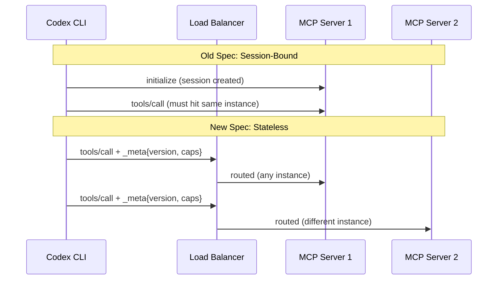
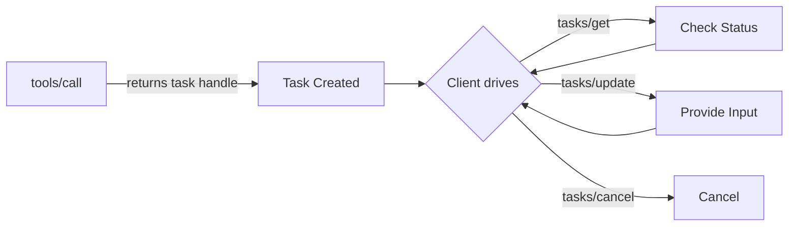
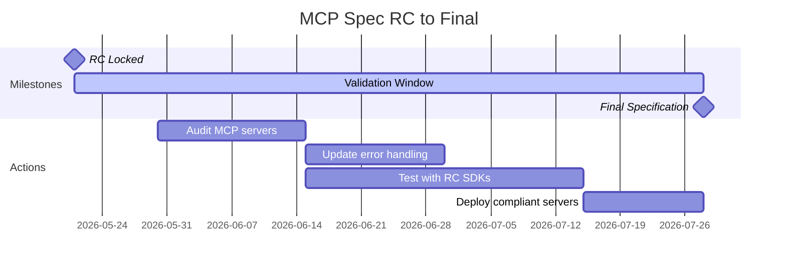

# The MCP 2026-07-28 Specification RC: What Codex CLI Users Need to Know


The largest revision to the Model Context Protocol since its launch dropped as a release candidate on 21 May 2026, with the final specification shipping on 28 July 2026 [^1]. For Codex CLI users who rely on MCP servers daily, this is not an abstract standards discussion — it reshapes how your tools connect, authenticate, and scale.

This article covers what changed, what breaks, and what you should do before July.

## The Headline: MCP Goes Stateless

The previous MCP specification required clients and servers to maintain a persistent, bidirectional session. Clients opened a connection, completed an `initialize`/`initialized` handshake, and routed all subsequent requests through that same session. Scaling required sticky sessions or distributed session stores [^2].

The 2026-07-28 RC eliminates this entirely. SEP-2575 removes the initialisation handshake and replaces it with a "pay as you go" model where every request is self-contained [^3]. Protocol version, client info, and capabilities now travel in `_meta` fields on each request. Any MCP request can land on any server instance.



### What Replaces the Handshake

The monolithic `initialize` call is unbundled into discrete, single-purpose RPCs [^3]:

- **Version negotiation** moves inline: the client sends an `MCP-Protocol-Version` header. If the server does not support it, it returns `UnsupportedProtocolVersionError` with its supported versions, and the client retries [^3].
- **Capability discovery** uses the new `server/discover` method, callable on demand rather than at connection time [^1].
- **Session IDs** (`Mcp-Session-Id` header) are eliminated entirely (SEP-2567) [^1].

### Operational Impact for Codex CLI

Remote MCP servers can now run behind a plain round-robin load balancer with no sticky sessions [^2]. For Codex CLI users running MCP servers via `codex mcp add` in `config.toml`, local stdio servers are largely unaffected — the stateless changes matter most for remote Streamable HTTP servers. If you run MCP servers as shared team infrastructure, this is the change that simplifies your deployment topology.

## Application State: Explicit Handles

Stateless does not mean memory-free. The spec introduces explicit state handles — servers mint identifiers (e.g. `basket_id`, `session_ref`) that models thread between tool calls [^1]. This makes state visible to the model, enabling cross-tool composition and reasoning about state transitions.

```toml
# Example: MCP server returning a state handle
# tools/call response includes a handle the model passes to subsequent calls
# Old pattern: server tracked state internally via session
# New pattern: handle returned to client, echoed back on next call
```

For Codex CLI workflows, this means tool sequences that previously relied on server-side session state will need to return handles explicitly. If you maintain custom MCP servers, audit any tools that assume persistent server-side state between calls.

## Three Features Deprecated

The RC formally deprecates three MCP features under the new lifecycle policy (SEP-2577) [^1][^4]:

| Feature | Purpose | Replacement |
|---------|---------|-------------|
| **Roots** | Workspace boundary scoping | Tool parameters, resource URIs, or configuration |
| **Sampling** | Server-initiated model completions via client | Direct LLM provider integration |
| **Logging** | Protocol-level server logging | `stderr` (stdio) or OpenTelemetry |

These are annotation-only deprecations — methods continue functioning for at least 12 months post-release before removal consideration [^4]. However, new implementations should not adopt them.

For Codex CLI users, the **Sampling** deprecation is most relevant. MCP servers that requested model completions through the client will need to integrate directly with LLM provider APIs instead. The **Logging** deprecation aligns with a broader industry shift towards OpenTelemetry — Codex CLI v0.135.0 already supports W3C Trace Context fields in its MCP interactions [^5].

## The Extensions Framework

New capabilities now ship as opt-in extensions rather than core spec additions [^1]. Extensions use reverse-DNS naming, are versioned independently, and are negotiated via an `extensions` map in capabilities. They live in dedicated `ext-*` repositories with delegated maintainers.

Two extensions ship with the RC:

### MCP Apps (SEP-1865)

Servers can ship sandboxed HTML interfaces rendered in iframes. Tools declare UI templates ahead of time so hosts can prefetch, cache, and security-review them [^1]. For Codex CLI, this is primarily relevant to the Codex desktop app and IDE extensions — the terminal CLI will not render HTML, but tools built for multi-surface deployment should be aware of this capability.

### Tasks Extension

Tasks were experimental in the 2025-11-25 spec. The RC reshapes them around statelessness [^1]:



Key changes:
- Servers answer `tools/call` with task handles
- Clients drive via `tasks/get`, `tasks/update`, `tasks/cancel`
- `tasks/list` removed — scoping without sessions proved impractical
- Projects using the 2025-11-25 Tasks API **must migrate** [^1]

## Multi-Round-Trip Requests

SEP-2322 replaces the pattern of holding SSE streams open for server-initiated requests [^1]. Servers now return `InputRequiredResult` objects containing prompts and encoded state. Clients resubmit with answers and the echoed state, allowing any server instance to resume processing.

This matters for Codex CLI's `codex exec` workflows in CI pipelines. Non-interactive runs that hit MCP servers requiring multi-step input will need to handle the new `InputRequiredResult` pattern rather than relying on persistent SSE connections.

## Routing, Caching, and Observability

Three operational improvements ship together:

**Routing headers** (SEP-2243): Required `Mcp-Method` and `Mcp-Name` headers enable stateless load balancers to route without inspecting JSON-RPC payloads [^1].

**Result caching** (SEP-2549): Responses include `ttlMs` and `cacheScope` fields modelled on HTTP `Cache-Control`. Clients determine freshness without long-lived connections [^1].

**Distributed tracing** (SEP-414): W3C Trace Context fields (`traceparent`, `tracestate`, `baggage`) standardised in `_meta`, enabling end-to-end tracing across MCP tool chains via OpenTelemetry backends [^1].

For Codex CLI users running multiple MCP servers, the tracing support is immediately valuable — you can correlate tool calls across servers in the same trace. Codex CLI v0.134.0's `readOnlyHint` support for parallel MCP tool execution [^5] combines naturally with the new caching semantics.

## Authorisation Hardening

Six SEPs tighten OAuth 2.0/OIDC compliance [^1]:

- Clients must validate `iss` parameter per RFC 9207 (SEP-2468)
- `application_type` declaration during Dynamic Client Registration (SEP-837)
- Credentials bound to issuing authorisation server (SEP-2352)
- Refresh token request documentation (SEP-2207)
- Scope accumulation and discovery clarification (SEP-2350, SEP-2351)

Codex CLI v0.134.0 already added OAuth options for Streamable HTTP MCP servers [^5]. These spec changes formalise what Codex CLI's implementation was converging towards.

## Schema Expansion

Tool `inputSchema` and `outputSchema` upgrade to full JSON Schema 2020-12 (SEP-2106) [^1]. Input schemas now support `oneOf`, `anyOf`, `allOf`, conditionals, `$ref`, and `$defs`. Output schemas are unrestricted, and `structuredContent` accepts any JSON value.

One breaking change: missing resource errors shift from MCP-custom `-32002` to JSON-RPC standard `-32602` Invalid Params (SEP-2164) [^1]. If you have error handling that matches on `-32002`, update it.

## Migration Checklist for Codex CLI Users

Here is a practical checklist for preparing before July 28:

### If you consume MCP servers (most users)

1. **Update Codex CLI** — stay on v0.135.0+ to pick up Streamable HTTP and OAuth improvements [^5]
2. **Check MCP server compatibility** — ask your server maintainers about their spec RC timeline
3. **Test `readOnlyHint`** — parallel tool execution works with spec-compliant servers now [^5]
4. **Watch for error code changes** — `-32002` becomes `-32602` for missing resources [^1]

### If you maintain custom MCP servers

1. **Remove session state assumptions** — audit tools that rely on server-side session state between calls
2. **Implement `server/discover`** — replace the `initialize` handshake [^3]
3. **Return explicit state handles** — if tools need cross-call state, mint and return handles
4. **Migrate from experimental Tasks API** — adopt the new extension lifecycle [^1]
5. **Add `Mcp-Method` and `Mcp-Name` headers** — required for stateless routing [^1]
6. **Stop adopting deprecated features** — do not build new functionality on Roots, Sampling, or Logging [^4]
7. **Update error codes** — use `-32602` for missing resources [^1]

### Timeline



## What This Means Long-Term

The governance framework is arguably more important than any individual change. The feature lifecycle policy (Active → Deprecated → Removed with 12+ month windows), the extensions track for stabilising new capabilities before spec inclusion, and the conformance requirements (SEP-2484) that mandate matching test scenarios before finalisation — these ensure this is the last time the spec makes a clean break [^1].

For Codex CLI users, the practical effect is stability. Once you migrate to the stateless model, future spec evolution will be additive and opt-in via extensions. The days of protocol-level breaking changes should be behind us.

⚠️ The ten-week validation window closes on 28 July 2026. Tier 1 SDKs (including the TypeScript and Python SDKs used by most MCP servers) are expected to ship support within this window [^1]. If you maintain production MCP servers, start testing against the RC now.

## Citations

[^1]: [The 2026-07-28 MCP Specification Release Candidate](https://blog.modelcontextprotocol.io/posts/2026-07-28-release-candidate/) — Model Context Protocol Blog
[^2]: [MCP Goes Session-less — What the 2026-07-28 Release Candidate Actually Changes](https://medium.com/@sainitesh/mcp-goes-session-less-what-the-2026-07-28-release-candidate-actually-changes-99b669ad1f61) — Medium
[^3]: [SEP-2575: Make MCP Stateless](https://modelcontextprotocol.io/seps/2575-stateless-mcp) — Model Context Protocol
[^4]: [SEP-2577: Deprecate Roots, Sampling, and Logging](https://github.com/modelcontextprotocol/modelcontextprotocol/pull/2577) — GitHub
[^5]: [Codex CLI Changelog](https://developers.openai.com/codex/changelog) — OpenAI Developers
