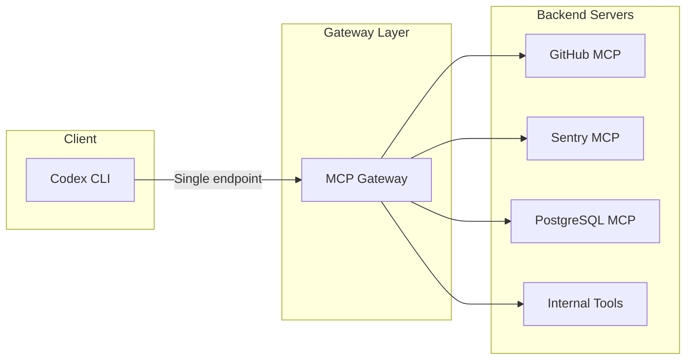
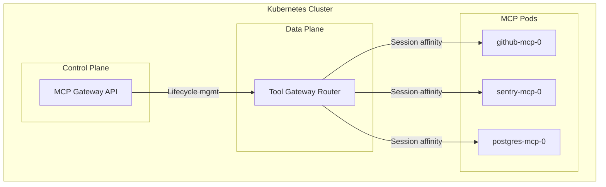

# MCP Gateway and Proxy Patterns: Aggregating, Securing, and Scaling MCP Servers with Codex CLI


---

Once your Codex CLI configuration grows past a handful of MCP servers, you hit a wall. Each server consumes a tool-definition slot in the context window, every `tools/list` round-trip adds latency, and there is no central point to enforce authentication, rate-limiting, or audit logging. MCP gateways solve this by sitting between the client and the backend servers — aggregating tools, bridging transports, and applying governance in a single layer.

This article surveys the gateway and proxy landscape as of mid-2026, compares the leading open-source options, and shows how to wire them into Codex CLI for production workloads.

## Why Gateways Matter Now

Enterprise MCP adoption has crossed 78 per cent in production AI teams, and the public MCP registry lists over 9,400 servers [^1]. A typical senior-developer setup might register a dozen servers — GitHub, Sentry, a database, a documentation service, cloud-provider CLIs, and several internal tools. Without a gateway, each server advertises its full tool schema directly to the model, inflating the system prompt and burning tokens before the first user message arrives.

A Q1 2026 ecosystem survey evaluated 17 gateway, proxy, and aggregator tools [^2]. The core value propositions fall into four categories:

1. **Tool aggregation** — exposing N backend servers behind a single MCP endpoint
2. **Transport bridging** — converting STDIO servers to Streamable HTTP (or vice versa) so remote and local servers look identical to the client
3. **Security and governance** — centralised auth, RBAC, tool-level allowlists, and audit trails
4. **Observability** — distributed tracing across federated gateways via OpenTelemetry



## The Gateway Taxonomy

Not every intermediary does the same job. The Q1 2026 survey [^2] distinguishes three architectural tiers:

### Proxies

Lightweight processes that translate one MCP transport to another without modifying the tool set. **Supergateway** converts a local STDIO server to a Streamable HTTP endpoint (or SSE), letting remote clients reach a process that was designed to run locally [^3]. **mcp-proxy** adds tool-filtering on top: you can expose only a subset of a server's tools to a particular client [^2].

### Aggregators

Aggregators merge multiple backend servers into a single virtual server. **MetaMCP** offers a three-level hierarchy — Servers, Namespaces, and Endpoints — with tool overrides at each level [^2]. **MCPJungle** provides Tool Groups with include/exclude lists and per-client allowlisting [^2]. **IBM ContextForge** supports seven transport protocols (HTTP, JSON-RPC, WebSocket, SSE, STDIO, Streamable HTTP, and automatic gRPC-to-MCP translation via server reflection) and adds multi-cluster Kubernetes federation with Redis-backed caching [^4].

### Full Gateways

Full gateways combine aggregation with enterprise-grade control-plane features. **agentgateway**, now a Linux Foundation project under the Agentic AI Foundation, provides multi-tenancy, OpenAPI integration, A2A protocol support, and OAuth authentication across STDIO, HTTP, SSE, and Streamable HTTP transports [^5]. **Microsoft MCP Gateway** runs on Kubernetes with StatefulSets for session-aware stateful routing, Azure Entra ID integration, and a RESTful control plane for adapter lifecycle management [^6].

| Tool | Category | Transport bridging | RBAC | Federation | Codex CLI integration |
|------|----------|-------------------|------|------------|----------------------|
| Supergateway | Proxy | STDIO ↔ HTTP | — | — | Via `url` config |
| mcp-proxy | Proxy | STDIO ↔ HTTP | Tool filter | — | Via `url` config |
| MetaMCP | Aggregator | Multi | Namespace | — | Via `url` config |
| MCPJungle | Aggregator | Multi | Per-client | — | Via `url` config |
| IBM ContextForge | Aggregator | 7 protocols | OAuth | K8s + Redis | Via `url` config |
| agentgateway | Gateway | Multi + A2A | OAuth + RBAC | Multi-tenant | Via `url` config |
| Microsoft MCP Gateway | Gateway | Streamable HTTP | Azure AD | K8s StatefulSets | Via `url` config |

## Wiring a Gateway into Codex CLI

Codex CLI supports two MCP transport types: STDIO (local commands) and Streamable HTTP (remote URLs) [^7]. Every gateway that exposes a Streamable HTTP endpoint can be registered as a single remote server in `config.toml`, replacing N individual server entries.

### Before: Multiple Direct Servers

```toml
[mcp_servers.github]
command = "npx"
args = ["-y", "@modelcontextprotocol/server-github"]
env_vars = ["GITHUB_TOKEN"]

[mcp_servers.sentry]
command = "npx"
args = ["-y", "@sentry/mcp-server"]
env_vars = ["SENTRY_AUTH_TOKEN"]

[mcp_servers.postgres]
command = "npx"
args = ["-y", "@modelcontextprotocol/server-postgres"]
env_vars = ["DATABASE_URL"]
```

### After: Single Gateway Endpoint

```toml
[mcp_servers.gateway]
url = "http://localhost:8080/mcp"
bearer_token_env_var = "MCP_GATEWAY_TOKEN"
startup_timeout_sec = 15
```

The gateway handles spawning and managing the backend servers. Codex CLI sees one server with all tools aggregated.

### Using Supergateway for Transport Bridging

If you have STDIO-only servers that need to be accessible from a remote Codex CLI session (e.g. running in a CI pipeline or Codespace), Supergateway bridges the gap [^3]:

```bash
npx -y supergateway \
  --streamableHttp http://0.0.0.0:8080/mcp \
  -- npx -y @modelcontextprotocol/server-github
```

Then point Codex CLI at the HTTP endpoint:

```toml
[mcp_servers.github-remote]
url = "http://gateway-host:8080/mcp"
bearer_token_env_var = "GITHUB_TOKEN"
```

### Using agentgateway with Codex CLI

agentgateway uses a YAML configuration to define backend server targets and routing policies [^5]:

```yaml
listeners:
  - name: codex-listener
    protocol: MCP
    sse:
      address: 0.0.0.0:8080
      path: /mcp

targets:
  - name: github-tools
    protocol: MCP
    stdio:
      cmd: npx
      args: ["-y", "@modelcontextprotocol/server-github"]
      env:
        GITHUB_TOKEN: "${GITHUB_TOKEN}"

  - name: sentry-tools
    protocol: MCP
    stdio:
      cmd: npx
      args: ["-y", "@sentry/mcp-server"]
      env:
        SENTRY_AUTH_TOKEN: "${SENTRY_AUTH_TOKEN}"
```

Start the gateway and register it once:

```bash
agentgateway --config gateway.yaml &
```

Then register it in your Codex configuration:

```toml
[mcp_servers.agent-gateway]
url = "http://localhost:8080/mcp"
```

## The Code Mode Pattern: Collapsing Tool Definitions

One of the most impactful gateway patterns in 2026 is **Code Mode**, pioneered by Maxim's Bifrost gateway [^8]. Instead of advertising N tool definitions to the model, the gateway compiles all MCP tools into a Python module and exposes a single `execute_python(code)` tool. The model writes Python that calls the compiled functions; the gateway runs it in a sandbox and returns the result as a single content block.

This collapses the tool-definition tax from N descriptions to one and reduces multi-step tool chains from N round-trips to one. For Codex CLI users with large tool sets, this can cut token costs by 40–60 per cent on tool-heavy sessions [^8].

```mermaid
sequenceDiagram
    participant Codex as Codex CLI
    participant GW as Bifrost Gateway
    participant S1 as GitHub MCP
    participant S2 as Sentry MCP

    Note over Codex,GW: Traditional: N tool defs, N round-trips
    Codex->>GW: tools/list
    GW-->>Codex: 1 tool: execute_python(code)
    Codex->>GW: execute_python("github.list_prs(); sentry.get_issues()")
    GW->>S1: list_prs
    GW->>S2: get_issues
    S1-->>GW: PR data
    S2-->>GW: Issue data
    GW-->>Codex: Combined result
```

## Security Patterns for Production

### Tool-Level Access Control

The **mcp-routing-gateway** project addresses a specific threat: LLMs selecting tools unintended by the user [^9]. It sits between the agent and the backend servers, presenting only safely curated tools. This is particularly relevant for Codex CLI in `full-auto` approval mode, where the model can invoke any approved tool without human confirmation.

Configure tool visibility per client:

```yaml
clients:
  codex-ci:
    allowed_tools:
      - github.create_pull_request
      - github.list_files
    denied_tools:
      - github.delete_repository
      - sentry.delete_project
```

### Authentication Centralisation

Rather than distributing API keys across every MCP server entry in `config.toml`, a gateway centralises credential management. IBM ContextForge supports user-scoped OAuth tokens with an `X-Upstream-Authorization` header [^4], so each backend server receives the correct credentials without the Codex CLI user managing them individually.

### Audit Trails

For regulated environments, gateways provide the audit layer that MCP itself does not mandate. agentgateway logs every tool invocation with timestamps, client identity, and request/response payloads — essential for SOC 2 and ISO 27001 compliance [^5].

## Scaling Patterns

### Kubernetes-Native Deployment

Microsoft MCP Gateway uses StatefulSets and headless services for DNS-based discovery of MCP server pods [^6]. Each backend server runs as a separate pod, and the gateway routes requests with session affinity:



### Federation Across Boundaries

IBM ContextForge supports multi-cluster federation, allowing teams in different regions or security zones to maintain their own MCP server pools whilst exposing a unified tool catalogue to Codex CLI clients [^4]. This uses Redis-backed state synchronisation and mDNS for local discovery within each cluster.

## Choosing a Gateway

The right choice depends on your scale and constraints:

- **Solo developer, few servers**: Skip the gateway. Codex CLI's native multi-server support handles 5–10 servers comfortably.
- **Team with 10–20 servers**: **Supergateway** or **mcp-proxy** for transport bridging; **MCPJungle** if you need per-developer tool visibility.
- **Enterprise with 50+ servers**: **agentgateway** for Linux Foundation governance and A2A support, or **IBM ContextForge** for multi-protocol federation.
- **Azure-native shops**: **Microsoft MCP Gateway** for Kubernetes-native deployment with Entra ID integration.
- **Token-cost sensitive**: Any gateway supporting **Code Mode** compilation (Bifrost) to collapse tool definitions.

## What the Spec Says

The 2026-07-28 MCP specification release candidate makes MCP stateless at the protocol layer [^10]. A remote MCP server can run behind a plain round-robin load balancer, route traffic on an `Mcp-Method` header, and let clients cache `tools/list` responses. This significantly simplifies gateway implementation — session affinity becomes optional rather than mandatory for most use cases.

## Conclusion

MCP gateways are no longer an enterprise luxury — they are the load-bearing infrastructure pattern for any serious Codex CLI deployment in 2026. Whether you need transport bridging for CI pipelines, tool-level RBAC for multi-tenant environments, or Code Mode compilation to slash token costs, the ecosystem now offers mature, production-tested options. Start with the simplest proxy that solves your immediate problem, and graduate to a full gateway when governance requirements demand it.

## Citations

[^1]: [Top 5 Enterprise MCP Gateway Solutions in 2026 — Maxim AI](https://www.getmaxim.ai/articles/top-5-enterprise-mcp-gateway-solutions-in-2026/)
[^2]: [MCP Aggregation, Gateway, and Proxy Tools: State of the Ecosystem (Q1 2026) — Hey, It Works!](https://www.heyitworks.tech/blog/mcp-aggregation-gateway-proxy-tools-q1-2026)
[^3]: [Supergateway — MCP Transport Bridging](https://www.augmentcode.com/mcp/supergateway-mcp-transport-gateway)
[^4]: [IBM ContextForge — GitHub](https://github.com/IBM/mcp-context-forge)
[^5]: [Linux Foundation Welcomes Agentgateway Project](https://www.linuxfoundation.org/press/linux-foundation-welcomes-agentgateway-project-to-accelerate-ai-agent-adoption-while-maintaining-security-observability-and-governance)
[^6]: [Microsoft MCP Gateway — GitHub](https://github.com/microsoft/mcp-gateway)
[^7]: [Model Context Protocol — Codex CLI Documentation](https://developers.openai.com/codex/mcp)
[^8]: [How an MCP Gateway Cuts Token Costs in Claude Code and Codex CLI in 2026](https://futureagi.com/blog/how-mcp-gateway-cuts-token-costs-claude-code-codex-cli-2026/)
[^9]: [mcp-routing-gateway — GitHub](https://github.com/globalpocket/mcp-routing-gateway)
[^10]: [The 2026-07-28 MCP Specification Release Candidate — Model Context Protocol Blog](https://blog.modelcontextprotocol.io/posts/2026-07-28-release-candidate/)
