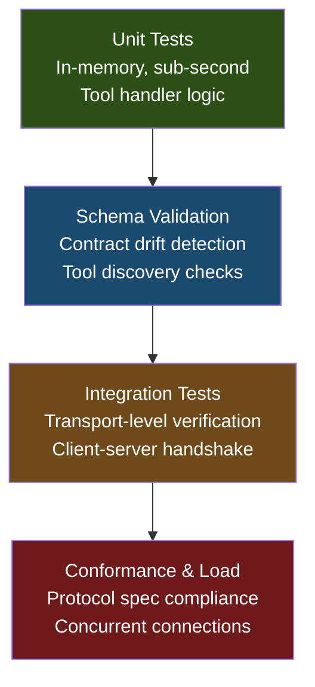

# MCP Server Testing Frameworks: Unit Testing, Integration Testing, and Conformance Validation


---

Most MCP server failures in production are boundary failures, not model failures [^1]. A tool handler that works perfectly in manual testing will silently break when schema descriptions drift, parameter types shift, or transport negotiation fails under load. Yet the majority of MCP servers shipping today have zero automated tests.

This article covers the testing pyramid for MCP servers — from sub-second in-memory unit tests through protocol conformance validation to CI-integrated regression suites — with concrete patterns for both Python and TypeScript implementations.

## The MCP Testing Pyramid

MCP servers demand a layered testing strategy that mirrors the protocol's own layered architecture. The testing pyramid progresses through four gates before code reaches production:



## Unit Testing with In-Memory Transports

The foundational layer skips transport entirely and calls handler functions directly through an in-memory client-server binding. This eliminates subprocess management, network overhead, and the race conditions that plague test suites spawning real server processes [^2].

### Python: FastMCP In-Memory Pattern

FastMCP 2.x provides direct in-memory connections where the test client communicates with the server in the same process [^3]:

```python
import pytest
from fastmcp import FastMCP, Client

server = FastMCP("weather")

@server.tool()
async def get_forecast(city: str, days: int = 7) -> dict:
    """Return weather forecast for a city."""
    if not 1 <= days <= 14:
        raise ValueError(f"Days must be 1-14, got {days}")
    # Production logic here
    return {"city": city, "days": days, "forecasts": [...]}

@pytest.fixture
async def client():
    async with Client(server) as c:
        yield c

@pytest.mark.asyncio
async def test_forecast_returns_correct_city(client):
    result = await client.call_tool("get_forecast", {"city": "London", "days": 3})
    assert result.data["city"] == "London"

@pytest.mark.asyncio
async def test_forecast_rejects_invalid_days(client):
    with pytest.raises(Exception):
        await client.call_tool("get_forecast", {"city": "London", "days": 0})
```

A critical caveat from the FastMCP documentation: never open a `Client` inside a pytest fixture directly — wrap it with `async with` to avoid event loop issues [^3].

### TypeScript: SDK InMemoryTransport Pattern

The official `@modelcontextprotocol/sdk` provides `InMemoryTransport` for the same purpose [^4]:

```typescript
import { describe, it, expect, beforeEach } from 'vitest';
import { Client } from '@modelcontextprotocol/sdk/client/index.js';
import { InMemoryTransport } from '@modelcontextprotocol/sdk/inMemory.js';
import { createServer } from '../src/server.js';

describe('weather server', () => {
  let client: Client;

  beforeEach(async () => {
    const server = createServer();
    const [clientTransport, serverTransport] = InMemoryTransport.createLinkedPair();
    await server.connect(serverTransport);
    client = new Client({ name: 'test', version: '1.0.0' });
    await client.connect(clientTransport);
  });

  it('lists the forecast tool', async () => {
    const { tools } = await client.listTools();
    const names = tools.map(t => t.name);
    expect(names).toContain('get_forecast');
  });

  it('returns forecast data', async () => {
    const result = await client.callTool({
      name: 'get_forecast',
      arguments: { city: 'London', days: 3 }
    });
    expect(result.content[0].text).toContain('London');
  });
});
```

Vitest is recommended over Jest for TypeScript MCP projects due to native ESM support and tighter TypeScript integration [^5].

### Mocking External Dependencies

MCP tool handlers frequently call databases, APIs, or file systems. Standard mocking applies — the server is a regular Python or TypeScript object [^2]:

```python
from unittest.mock import AsyncMock

@pytest.mark.asyncio
async def test_forecast_with_mocked_api():
    mock_weather_api = AsyncMock()
    mock_weather_api.fetch.return_value = {"temp": 18, "condition": "cloudy"}

    server.dependencies["weather_api"] = mock_weather_api

    async with Client(server) as client:
        result = await client.call_tool("get_forecast", {"city": "London"})
        assert result.data["forecasts"][0]["temp"] == 18
        mock_weather_api.fetch.assert_called_once_with("London")
```

## Schema Validation Tests

Schema drift is the silent killer of MCP integrations. LLMs select tools based on descriptions and parameter schemas — a missing description or renamed parameter means the model stops routing to your tool entirely [^6].

Schema validation tests belong in CI and run on every commit:

```python
@pytest.mark.asyncio
async def test_all_tools_have_descriptions(client):
    tools = await client.list_tools()
    for tool in tools:
        assert tool.description, f"Tool '{tool.name}' missing description"
        assert len(tool.description) >= 20, (
            f"Tool '{tool.name}' description too short for reliable LLM routing"
        )

@pytest.mark.asyncio
async def test_tool_parameter_schema_stability(client):
    tools = await client.list_tools()
    tool_map = {t.name: t for t in tools}

    forecast = tool_map["get_forecast"]
    params = forecast.inputSchema["properties"]
    assert "city" in params, "Required parameter 'city' missing"
    assert params["city"]["type"] == "string"
    assert "days" in params, "Required parameter 'days' missing"
```

For complex schemas, the `inline-snapshot` library auto-generates and maintains expected output structures — run `pytest --inline-snapshot=create` on first pass, then `pytest --inline-snapshot=fix` after intentional changes [^3].

## Integration Testing with MCP Inspector

The official MCP Inspector, maintained by the MCP team, connects to your server as a real client and exposes the JSON-RPC message flow [^7]. It serves dual purposes: interactive debugging during development and automated conformance checks in CI.

### Interactive Mode

```bash
npx @modelcontextprotocol/inspector uv --directory ./my-server run my-server
```

This launches a web UI for browsing tool schemas, invoking tools with form-based parameters, inspecting resources, and viewing protocol-level messages [^7].

### CLI Mode for CI Integration

The Inspector's CLI mode enables automated validation in pipelines [^8]:

```bash
# Validate tool inventory
npx @modelcontextprotocol/inspector --method tools/list

# Test a specific tool invocation
npx @modelcontextprotocol/inspector \
  --tool-name get_forecast \
  --tool-arg city=London \
  --tool-arg days=3
```

Exit codes signal pass or fail states that CI runners can interpret directly [^8].

### Codex CLI Integration Testing

When testing MCP servers intended for Codex CLI consumption, the `codex mcp add` command registers the server, but Codex currently lacks a built-in `codex mcp validate` command [^9]. A feature request (issue #20195) proposes `codex mcp validate <name>` to perform initialise/list calls and report failures [^9]. Until then, the workaround is to use the MCP Inspector against your server's stdio transport:

```bash
npx @modelcontextprotocol/inspector node ./dist/server.js
```

## Conformance Testing Against the MCP Specification

The MCP specification (currently 2025-11-25, with the 2026-07-28 release candidate now available for validation) [^10] defines protocol-level requirements that go beyond functional correctness. Conformance testing verifies your server handles capability negotiation, JSON-RPC framing, and error responses according to spec.

### The Five Gates Framework

A structured approach to production readiness progresses through five gates [^1]:


### Automated Conformance with pmcp

The `pmcp` tool provides automated conformance validation [^1]:

```bash
# Smoke test — verify server reachability
cargo pmcp test check http://localhost:3000

# Strict conformance against the MCP spec
cargo pmcp test conformance http://localhost:3000 --strict

# Auto-generate scenario tests from discovered tools
cargo pmcp test generate http://localhost:3000

# Load testing with breaking-point detection
cargo pmcp loadtest init http://localhost:3000

# Security probing
cargo pmcp pentest http://localhost:3000 --profile deep
```

### MCPJam for CI/CD Pipelines

MCPJam provides a testing and evaluation platform that wires into GitHub Actions, GitLab CI, or equivalent systems to run conformance checks, end-to-end tests, and LLM-based evaluations on every pull request [^11].

## Parameterised Edge Case Testing

Boundary conditions account for a disproportionate share of MCP server failures. Parameterised tests cover these systematically [^6]:

```python
@pytest.mark.parametrize("days,should_pass", [
    (1, True),    # Lower bound
    (14, True),   # Upper bound
    (7, True),    # Default value
    (0, False),   # Below range
    (-1, False),  # Negative
    (15, False),  # Above range
    (100, False), # Far above range
])
@pytest.mark.asyncio
async def test_forecast_day_boundaries(client, days, should_pass):
    if should_pass:
        result = await client.call_tool("get_forecast", {"city": "London", "days": days})
        assert result.data["days"] == days
    else:
        with pytest.raises(Exception):
            await client.call_tool("get_forecast", {"city": "London", "days": days})
```

## Security Considerations

A 2026 Equixly security assessment found 43 per cent of tested MCP implementations had command injection vulnerabilities [^12]. The MCP specification (2025-11-25) recommends tool sandboxing and runtime instrumentation for external function calls [^12]. Your test suite should include:

- **Input sanitisation checks** — verify that shell metacharacters, path traversal attempts, and SQL injection payloads are rejected or escaped
- **Permission boundary tests** — confirm tools cannot access resources outside their declared scope
- **Transport security validation** — ensure TLS is enforced for non-stdio transports

⚠️ The specific percentage (43%) comes from a single vendor assessment and may not be representative of the broader MCP ecosystem.

## CI Pipeline Configuration

A complete GitHub Actions workflow combining all layers:

```yaml
name: MCP Server Tests
on: [push, pull_request]

jobs:
  test:
    runs-on: ubuntu-latest
    steps:
      - uses: actions/checkout@v4
      - uses: actions/setup-python@v5
        with:
          python-version: '3.12'

      - name: Install dependencies
        run: uv sync --dev

      - name: Unit tests (in-memory)
        run: uv run pytest -m "not integration" --cov=src -q

      - name: Schema validation
        run: uv run pytest tests/test_schema.py -v

      - name: Integration tests
        run: uv run pytest -m integration -v

      - name: Conformance check
        run: |
          npx @modelcontextprotocol/inspector \
            --method tools/list \
            uv run python -m my_server
```

## Conclusion

Testing MCP servers is not optional infrastructure — it is the mechanism that prevents boundary failures from reaching production. Start with in-memory unit tests using FastMCP's `Client` or the TypeScript SDK's `InMemoryTransport` for sub-second feedback during development. Layer schema validation tests in CI to catch contract drift before it breaks LLM tool routing. Use MCP Inspector in both interactive and CLI modes for protocol-level integration testing. Graduate to conformance suites and load testing as your server approaches production traffic.

The MCP specification's 2026-07-28 release candidate introduces additional protocol requirements [^10]. If your server lacks tests today, the in-memory unit test pattern is the highest-leverage starting point — it requires no infrastructure changes and catches the majority of regressions before they escape to integration.

## Citations

[^1]: "Testing MCP Servers: The Five Gates Between Demo and Production", DEV Community, 2026. [https://dev.to/aws-heroes/testing-mcp-servers-the-five-gates-between-demo-and-production-2inf](https://dev.to/aws-heroes/testing-mcp-servers-the-five-gates-between-demo-and-production-2inf)

[^2]: "Unit Testing MCP Servers - Complete Testing Guide", MCPcat, 2026. [https://mcpcat.io/guides/writing-unit-tests-mcp-servers/](https://mcpcat.io/guides/writing-unit-tests-mcp-servers/)

[^3]: "Tests - FastMCP Development Documentation", FastMCP, 2026. [https://gofastmcp.com/development/tests](https://gofastmcp.com/development/tests)

[^4]: "TypeScript SDK for Model Context Protocol", GitHub, 2026. [https://github.com/modelcontextprotocol/typescript-sdk](https://github.com/modelcontextprotocol/typescript-sdk)

[^5]: "MCP Server: Node.js, TypeScript, Vitest & K6", Medium, 2026. [https://medium.com/@rajasekaran.parthiban7/%EF%B8%8F-mcp-server-node-js-typescript-vitest-k6-f056dad97288](https://medium.com/@rajasekaran.parthiban7/%EF%B8%8F-mcp-server-node-js-typescript-vitest-k6-f056dad97288)

[^6]: "Your MCP Server Has No Tests. Here Are 4 Patterns to Fix That.", DEV Community, 2026. [https://dev.to/klement_gunndu/your-mcp-server-has-no-tests-here-are-4-patterns-to-fix-that-2k59](https://dev.to/klement_gunndu/your-mcp-server-has-no-tests-here-are-4-patterns-to-fix-that-2k59)

[^7]: "MCP Inspector - Model Context Protocol Documentation", Anthropic, 2026. [https://modelcontextprotocol.io/docs/tools/inspector](https://modelcontextprotocol.io/docs/tools/inspector)

[^8]: "MCP Inspector: Debug and Test Your MCP Servers (2026 Guide)", Apigene, 2026. [https://apigene.ai/blog/mcp-inspector](https://apigene.ai/blog/mcp-inspector)

[^9]: "MCP CLI should expose validation, tool listing, and enable/disable management", GitHub Issue #20195, 2026. [https://github.com/openai/codex/issues/20195](https://github.com/openai/codex/issues/20195)

[^10]: "The 2026-07-28 MCP Specification Release Candidate", Model Context Protocol Blog, 2026. [https://blog.modelcontextprotocol.io/posts/2026-07-28-release-candidate/](https://blog.modelcontextprotocol.io/posts/2026-07-28-release-candidate/)

[^11]: "MCPJam Inspector - Testing and evaluation platform for MCP servers", GitHub, 2026. [https://github.com/MCPJam/inspector](https://github.com/MCPJam/inspector)

[^12]: "MCP Security: The Complete Guide to Securing Model Context Protocol in 2026", Practical DevSecOps, 2026. [https://www.practical-devsecops.com/mcp-security-guide/](https://www.practical-devsecops.com/mcp-security-guide/)
