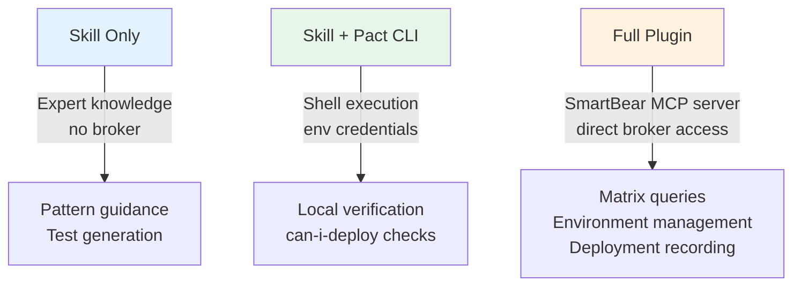
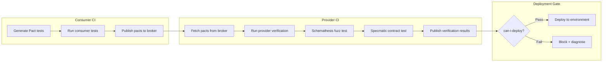

# Codex CLI for API Contract Testing: PactFlow, OpenAPI Validation, and Consumer-Driven Workflows


---

Contract testing sits at the intersection of two hard problems: keeping distributed services in sync, and doing so without a full integration environment. The traditional answer — heavyweight end-to-end suites that break for reasons unrelated to your change — has never satisfied anyone. Consumer-driven contracts solved the theory; tooling friction kept adoption patchy. With PactFlow's MCP server, Specmatic's contract validation tools, and Codex CLI's exec pipeline, that friction has largely evaporated.

This article walks through the current contract testing toolchain available to Codex CLI users, covering consumer-driven contracts with Pact, schema-first validation with OpenAPI, and the MCP integrations that tie them together.

## Why Contract Testing Matters for Agent-Assisted Development

When Codex CLI generates or modifies API endpoints, it works from whatever context you provide — AGENTS.md, OpenAPI specs, existing test suites. Without a contract test verifying that the consumer's expectations still hold, a perfectly reasonable refactor can silently break a downstream service. Contract tests catch this class of failure before deployment, and they run in milliseconds rather than the minutes an integration suite demands [^1].

The shift towards agentic development makes this more urgent, not less. An agent modifying a provider's response shape has no innate awareness of consumers unless you encode that relationship in a verifiable artefact [^2].

## The PactFlow Agent Skills and MCP Server

PactFlow — the commercial platform built atop the open-source Pact framework — ships a comprehensive agent integration package comprising three skills and an MCP server [^3].

### Installation

```bash
# Via the Skills CLI
npx skills add pactflow/pactflow-agent-skills

# Or via GitHub CLI extension
gh skill install pactflow/pactflow-agent-skills
```

Both commands auto-detect installed agentic tools (Codex CLI, Claude Code, Cursor, Copilot, and others) and place skill files in the appropriate locations [^3].

### Three Capability Tiers

The PactFlow integration operates at three levels, depending on how much infrastructure you wire up:



At the full plugin tier, the SmartBear MCP server exposes structured tools for querying the contract matrix, recording deployments, managing environments, and diagnosing `can-i-deploy` failures — all without leaving the terminal [^4].

### Autonomous Subagents

The package includes five specialised subagents [^3]:

| Subagent | Role |
|---|---|
| `pact-generator` | Creates consumer tests from API descriptions, client code, or OpenAPI specs |
| `pact-reviewer` | Audits existing tests against best-practice patterns |
| `pact-implementor` | Scaffolds new library integration |
| `pact-maintainer` | Monitors workspace health and flags stale contracts |
| `bdct-tester` | Runs end-to-end bi-directional contract testing flows |

PactFlow reports up to 60% faster test creation and maintenance when using these agent skills compared to manual authoring [^4].

## Consumer-Driven Contract Workflow with Codex CLI

The canonical workflow for consumer-driven contracts follows a generate-publish-verify cycle. Here is how it maps to Codex CLI:

### Step 1: Generate Consumer Tests

Point Codex at your API client code and let the `pact-generator` subagent create the consumer contract:

```bash
codex exec -p "Generate Pact v4 consumer tests for the OrderService client \
  in src/clients/order-client.ts. Use @pact-foundation/pact v16.5.0. \
  Cover all endpoints: GET /orders, GET /orders/:id, POST /orders, \
  and DELETE /orders/:id. Apply type matchers for response bodies \
  and exact matchers for status codes." \
  --sandbox workspace-write
```

Pact-js v16.5.0 [^5] and pact-python v3.4.0 [^6] both default to the Pact v4 specification, which supports GraphQL contracts and mixed synchronous/asynchronous messaging in a single interaction file.

### Step 2: Verify with the Provider

On the provider side, Codex generates the verification configuration:

```bash
codex exec -p "Add Pact provider verification to the OrderService provider \
  test suite. Fetch pacts from our PactFlow broker at \
  https://ourorg.pactflow.io. Configure consumer version selectors \
  for mainBranch and deployedOrReleased. Set up provider states \
  using our existing test fixtures." \
  --sandbox workspace-write
```

### Step 3: Gate Deployment

```bash
# In CI — check whether this version can be deployed
pact-broker can-i-deploy \
  --pacticipant OrderService \
  --version $(git rev-parse --short HEAD) \
  --to-environment production
```

If you have the full PactFlow MCP plugin configured, Codex can run this check and diagnose failures inline:

```bash
codex exec -p "Query the PactFlow contract matrix for OrderService \
  at the current git SHA. If can-i-deploy fails, diagnose the root \
  cause — check for missing verification results, unpublished pacts, \
  or misconfigured consumer version selectors."
```

## Schema-First Validation with OpenAPI MCP Servers

Not every team uses consumer-driven contracts. For teams following a schema-first approach — where the OpenAPI specification is the single source of truth — several MCP servers provide direct schema validation.

### mcp-openapi-schema

Hannes Janetzek's `mcp-openapi-schema` [^7] exposes OpenAPI schemas as MCP resources, enabling Codex to validate generated code against the specification:

```toml
# ~/.codex/config.toml
[mcp.openapi-schema]
transport = "stdio"
command = ["npx", "-y", "mcp-openapi-schema", "--spec", "./openapi.yaml"]
```

### ReAPI mcp-openapi

The ReAPI server [^8] loads multiple OpenAPI specifications from a directory and exposes search, discovery, mock data generation, and code generation tools via MCP. This is particularly useful for polyglot microservice architectures where each service maintains its own spec.

```toml
[mcp.reapi-openapi]
transport = "stdio"
command = ["npx", "-y", "@reapi/mcp-openapi", "--dir", "./specs"]
```

### Specmatic MCP Server

Specmatic's MCP server [^9] takes the most opinionated approach, exposing four dedicated contract testing tools:

| Tool | Purpose |
|---|---|
| `run_contract_test` | Validates API implementations against OpenAPI specifications |
| `run_resiliency_test` | Sends boundary-condition and invalid requests to test robustness |
| `manage_mock_server` | Start, stop, and list mock servers from OpenAPI specs |
| `backward_compatibility_check` | Detects breaking changes between spec versions |

This enables a particularly tight feedback loop during development:

```bash
codex exec -p "Start a Specmatic mock server from our openapi.yaml, \
  then run contract tests against the running OrderService on port 8080. \
  Report any schema violations or missing endpoints."
```

## Property-Based API Testing with Schemathesis

Schemathesis v4.19.0 [^10] complements contract testing with property-based fuzzing. Rather than testing specific scenarios, it generates diverse inputs from your OpenAPI schema and verifies that every response conforms to the specification.

```bash
# Run directly in CI
schemathesis run http://localhost:8080/openapi.json \
  --checks all \
  --report junit \
  --output results/api-fuzz.xml
```

Schemathesis detects five categories of failure: server crashes on edge-case inputs, schema violations in response structures, validation bypasses where invalid data is accepted, integration failures where responses do not match client expectations, and stateful bugs where operations fail only in sequence [^10].

Integrating this into a Codex CLI pipeline:

```bash
codex exec -p "Our Schemathesis run found 3 schema violations in the \
  OrderService. The JUnit report is at results/api-fuzz.xml. Fix the \
  response serialisation for the failing endpoints and ensure all \
  responses conform to openapi.yaml." \
  --sandbox workspace-write
```

## Composing the Full Pipeline

The real power emerges when you compose these tools into a single CI stage. The following Mermaid diagram illustrates a complete contract verification pipeline:



A GitHub Actions implementation using `codex exec`:


```yaml
# .github/workflows/contract-verify.yml
name: Contract Verification
on: [push]

jobs:
  verify-contracts:
    runs-on: ubuntu-latest
    steps:
      - uses: actions/checkout@v4
      - uses: openai/codex-action@v1
        with:
          codex-api-key: ${{ secrets.OPENAI_API_KEY }}
          permissions: workspace-write
          prompt: |
            Run the full contract verification suite:
            1. Execute Pact provider verification against the broker
            2. Run Schemathesis against the local server
            3. Check can-i-deploy for the current SHA
            Report results as structured JSON.
```


## AGENTS.md Configuration for Contract-Aware Development

To make Codex CLI contract-aware by default, add contract testing context to your AGENTS.md:

```markdown
## Contract Testing

This repository uses consumer-driven contracts via Pact (v4 spec).

### Rules
- Every new API endpoint MUST have corresponding Pact consumer tests
- Use type matchers for response bodies, exact matchers for status codes
- Provider states must use existing test fixtures in `test/fixtures/`
- Run `pact-broker can-i-deploy` before merging to main

### Commands
- Consumer tests: `npm run test:pact:consumer`
- Provider verification: `npm run test:pact:provider`
- Schema validation: `npx schemathesis run http://localhost:8080/openapi.json`

### OpenAPI Specification
- Source of truth: `docs/openapi.yaml`
- All response types must match the spec exactly
- Breaking changes require a version bump and consumer notification
```

## Current Limitations and Caveats

**PactFlow MCP server authentication:** The SmartBear MCP server requires a PactFlow API token. For open-source Pact Broker users without PactFlow, the skill-only tier still provides expert contract testing guidance, but you lose the direct broker integration [^3].

**Schemathesis and GraphQL:** While Schemathesis supports GraphQL schemas, its property-based approach works best with REST APIs where the input space is more naturally enumerable [^10].

**Specmatic JRE dependency:** The Specmatic MCP server requires a Java Runtime Environment, which adds weight to containerised CI environments. The npm package handles this automatically but the Docker deployment is simpler for teams already running JVM services [^9].

**Model reasoning for contract semantics:** Contract testing involves nuanced decisions about matcher granularity — over-specifying with exact matchers creates brittle contracts, while under-specifying with loose matchers misses real breaking changes. Setting reasoning effort to `high` or `xhigh` is advisable for contract generation tasks [^11].

## Conclusion

Contract testing has moved from an aspirational practice to a first-class citizen of the Codex CLI workflow. The PactFlow agent skills eliminate the boilerplate of writing consumer tests. The OpenAPI MCP servers ensure schema compliance at development time rather than at deployment time. And `codex exec` pipelines make the entire verification cycle scriptable and CI-ready.

The gap between "we should do contract testing" and "we do contract testing" has never been narrower.

## Citations

[^1]: [Introduction to Pact — Consumer-Driven Contract Testing](https://docs.pact.io/) — Pact Foundation documentation, accessed May 2026
[^2]: [API-First Development and Contract Testing: Modern Practices and Tools](https://dasroot.net/posts/2026/02/api-first-development-contract-testing/) — dasroot.net, February 2026
[^3]: [PactFlow Agent Skills — Installation Guide](https://docs.pact.io/ai_tools/installation) — Pact Foundation documentation, accessed May 2026
[^4]: [Introducing the PactFlow MCP Server: AI-Powered Contract Testing](https://pactflow.io/blog/pactflow-mcp-server/) — PactFlow blog, October 2025
[^5]: [@pact-foundation/pact v16.5.0](https://www.npmjs.com/package/@pact-foundation/pact) — npm registry, May 2026
[^6]: [pact-python v3.4.0](https://pypi.org/project/pact-python/) — PyPI, May 2026
[^7]: [mcp-openapi-schema — OpenAPI Schema MCP Server](https://github.com/hannesj/mcp-openapi-schema) — Hannes Janetzek, GitHub
[^8]: [ReAPI mcp-openapi — OpenAPI Specification MCP Server](https://github.com/ReAPI-com/mcp-openapi) — ReAPI, GitHub
[^9]: [Specmatic MCP Server — Contract Testing for AI Coding Agents](https://github.com/specmatic/specmatic-mcp-server) — Specmatic, GitHub
[^10]: [Schemathesis v4.19.0 — Property-Based API Testing](https://schemathesis.io/) — Schemathesis, accessed May 2026
[^11]: [Best Practices — Codex CLI](https://developers.openai.com/codex/learn/best-practices) — OpenAI Developers documentation, accessed May 2026
