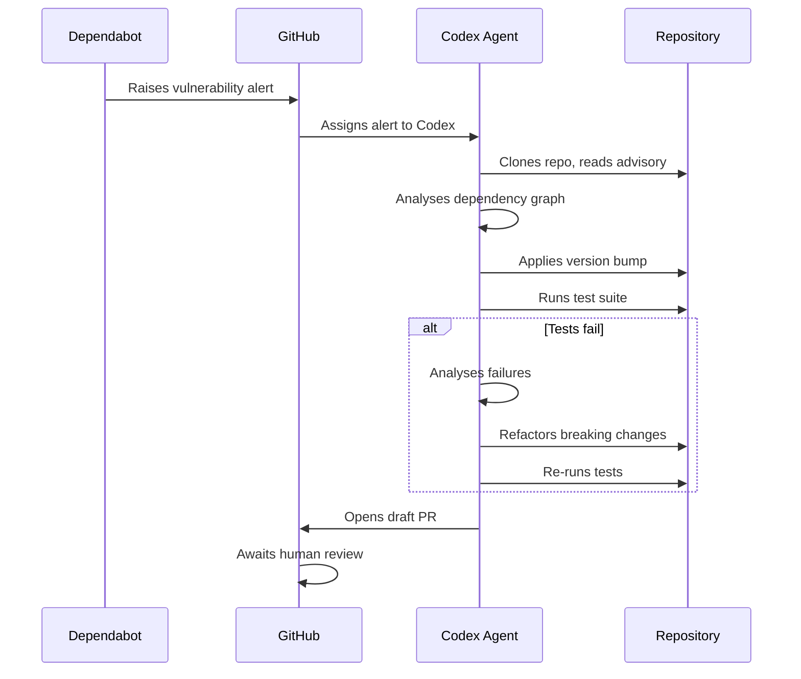
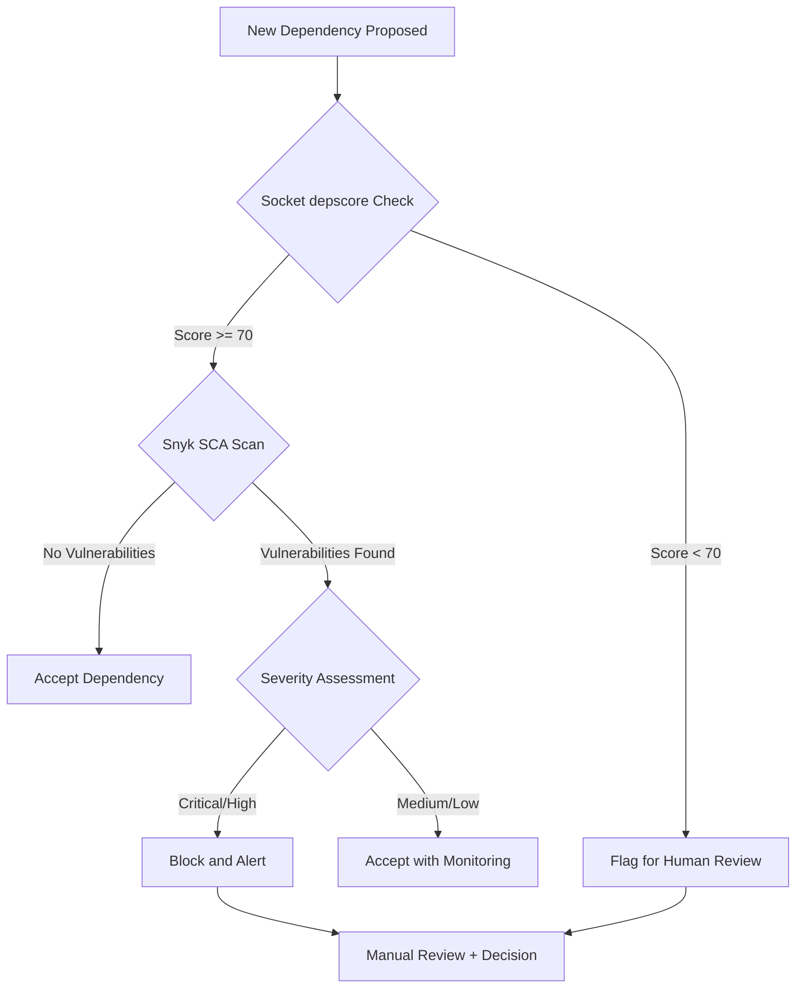

# Codex CLI for Automated Dependency Management: Dependabot Agent Assignment, Supply Chain Security, and Remediation Workflows


---

Dependency management has always been unglamorous plumbing — version bumps, CVE patches, transitive resolution conflicts — yet it remains one of the highest-leverage security activities a team can invest in. Since April 2026, GitHub has allowed Dependabot alerts to be assigned directly to AI coding agents including Codex [^1]. Combined with purpose-built MCP servers from Socket and Snyk, Codex CLI now sits at the centre of an end-to-end dependency remediation pipeline that stretches from vulnerability detection through to a tested, reviewable pull request.

This article walks through the architecture, the tooling, and the practical workflows for making dependency management an agent-assisted discipline.

## The Dependabot Agent Assignment Model

On 7 April 2026, GitHub shipped the ability to assign Dependabot alerts to AI coding agents [^1]. The workflow is straightforward:

1. Navigate to a Dependabot alert detail page on GitHub.
2. Select **Assign to Agent** and choose Codex (or Copilot, or Claude).
3. The agent analyses the advisory, inspects the repository's dependency graph, and opens a **draft pull request** with a proposed fix.
4. If the update introduces test failures, the agent attempts to resolve them before marking the PR as ready for review.

You can assign multiple agents to the same alert simultaneously — each works independently and opens its own draft PR, letting you compare approaches [^1]. This is particularly useful for major version upgrades where breaking API changes require code modifications across the project.



### Requirements

Dependabot agent assignment requires GitHub Code Security and a plan that includes coding agent access [^1]. The feature works with public and private repositories, though private repositories naturally require authenticated agent access.

## Supply Chain Scoring with Socket MCP

Before accepting any dependency — new or updated — the prudent question is whether the package is trustworthy. Socket's MCP server exposes the `depscore` tool, which returns supply chain risk, code quality, maintenance status, vulnerability indicators, and licence compliance scores for any package across npm, PyPI, and Cargo ecosystems [^2].

### Configuration

Socket MCP ships as both a hosted public server and a self-hostable npm package [^2]. The hosted endpoint requires no authentication:

```toml
# .codex/config.toml
[mcp_servers.socket]
type = "url"
url = "https://mcp.socket.dev/"
```

For the self-hosted variant using stdio transport:

```toml
[mcp_servers.socket]
type = "stdio"
command = "npx"
args = ["-y", "@anthropic-ai/socket-mcp"]
```

### Querying Package Scores

Once configured, Codex can invoke the `depscore` tool during any conversation or automation:

```json
{
  "packages": [
    { "ecosystem": "npm", "depname": "express", "version": "5.1.0" },
    { "ecosystem": "npm", "depname": "lodash", "version": "4.17.21" }
  ]
}
```

The response includes granular scores that an agent can use to make informed decisions — flagging packages with low supply chain scores or known maintenance issues before they enter the dependency tree.

### AGENTS.md Integration

Add a directive to your repository's `AGENTS.md` so that Codex automatically checks scores before adding dependencies:

```markdown
## Dependency Policy

Always check dependency scores with the Socket MCP `depscore` tool
when adding a new dependency. If the overall score is below 70 or the
supply chain score is below 60, flag the dependency for human review
and suggest an alternative or a hand-written implementation.
```

This turns what was previously a manual review step into an automated guardrail [^2].

## Vulnerability Scanning with Snyk MCP

Where Socket focuses on supply chain reputation, Snyk's MCP server provides deep vulnerability scanning. The server is built into the Snyk CLI (v1.1298.0+) and exposes two primary tools [^3]:

- **`snyk_sca_scan`** — detects vulnerabilities in open-source dependencies by analysing the project's dependency tree.
- **`snyk_code_scan`** — assesses proprietary code for security flaws, including patterns that commonly arise in AI-generated code.

### Setup

```toml
# .codex/config.toml
[mcp_servers.snyk]
type = "stdio"
command = "snyk"
args = ["mcp"]
```

Snyk has also published a dedicated Codex CLI integration guide that covers tagging specific files for scanning and using the agent to remediate findings in context [^4]. An experimental breakability evaluation tool, shipping with Snyk's June 2026 release, will assess whether a dependency update is likely to introduce breaking changes before the update is applied [^3].

## Building a Remediation Pipeline with `codex exec`

The real power emerges when these tools are composed into non-interactive pipelines. The following workflow runs entirely from CI or a scheduled automation:

```bash
#!/usr/bin/env bash
set -euo pipefail

# Step 1: Identify vulnerable dependencies
ALERTS=$(gh api repos/{owner}/{repo}/dependabot/alerts \
  --jq '[.[] | select(.state == "open")] | length')

if [ "$ALERTS" -eq 0 ]; then
  echo "No open Dependabot alerts. Exiting."
  exit 0
fi

# Step 2: Run Codex in exec mode to remediate
codex exec \
  --model o3 \
  --approval-mode full-auto \
  --output-schema remediation-schema.json \
  -o results.json \
  "Review all open Dependabot alerts for this repository. \
   For each alert: \
   1. Check the replacement package score using Socket MCP. \
   2. Apply the version bump. \
   3. Run the full test suite. \
   4. If tests fail, analyse and fix breaking changes. \
   5. Commit each fix on a separate branch."
```

The `--output-schema` flag ensures the output conforms to a predictable JSON structure, making downstream processing reliable [^5]:

```json
{
  "type": "object",
  "properties": {
    "alerts_processed": { "type": "integer" },
    "fixes_applied": { "type": "integer" },
    "fixes_failed": { "type": "integer" },
    "details": {
      "type": "array",
      "items": {
        "type": "object",
        "properties": {
          "package": { "type": "string" },
          "from_version": { "type": "string" },
          "to_version": { "type": "string" },
          "status": { "type": "string" },
          "branch": { "type": "string" }
        },
        "required": ["package", "status"],
        "additionalProperties": false
      }
    }
  },
  "required": ["alerts_processed", "fixes_applied"],
  "additionalProperties": false
}
```

## Renovate Integration Patterns

For teams using Renovate rather than Dependabot, the integration pattern differs. Renovate supports 90+ package managers across GitHub, GitLab, Bitbucket, Azure DevOps, and Gitea [^6], giving it broader reach than Dependabot's GitHub-only, 30+ manager scope.

Renovate does not yet support native agent assignment in the way Dependabot does. However, you can wire Codex into the Renovate workflow through hooks:

```toml
# .codex/config.toml

[hooks.on_agent_turn_start]
command = "bash"
args = ["-c", "gh pr list --label 'renovate' --json number,title --jq '.[0]' > /tmp/renovate-context.json"]
```

When a Renovate PR fails CI, a scheduled Codex automation can pick it up:

```bash
codex exec \
  --model o3 \
  "There is a failing Renovate PR. Check out the branch, \
   run the test suite, identify why the dependency update \
   broke tests, fix the breaking changes, and push the fix."
```

This transforms Renovate from a version-bump tool into an intelligent remediation system, with Codex handling the code modifications that Renovate's rule-based engine cannot.

## Supply Chain Attack Prevention

The 2026 threat landscape makes automated supply chain scanning essential. Recent attacks have included npm worms that steal tokens, environment variables, and API keys, and even inject malicious MCP servers into developer tools to maintain persistence [^7]. A defence-in-depth approach combines multiple layers:



### AGENTS.md Security Policy

```markdown
## Supply Chain Security

When adding or updating dependencies:
1. Run Socket `depscore` — reject packages scoring below 70 overall.
2. Run `snyk_sca_scan` — block any dependency with critical or high
   severity vulnerabilities that lack a patched version.
3. For npm packages, verify the package has not been flagged for
   typosquatting, install scripts, or obfuscated code.
4. Never add a dependency without checking its score first.
5. Prefer well-maintained packages with multiple maintainers.
```

## Scheduling Dependency Audits

For ongoing maintenance, configure a Codex automation to run weekly dependency audits:

```bash
# Weekly dependency health check
codex exec \
  --model o4-mini \
  --output-schema audit-schema.json \
  -o weekly-audit.json \
  "Audit all project dependencies: \
   1. Check Socket scores for all direct dependencies. \
   2. Run Snyk SCA scan for the full dependency tree. \
   3. Identify packages with outdated versions (>6 months behind latest). \
   4. Flag any packages with declining maintenance scores. \
   5. Produce a prioritised remediation report."
```

Using `o4-mini` for routine audits keeps costs manageable whilst still providing sufficient reasoning capability for dependency analysis [^8]. Reserve `o3` for the actual remediation work where complex code changes may be required.

## Practical Considerations

**AI-generated fixes are not always correct.** GitHub's own documentation emphasises that coding agents can produce incomplete patches, miss edge cases, or introduce new issues [^1]. The draft PR model exists precisely so that human reviewers remain in the loop. Treat agent-generated dependency fixes the same way you would treat any pull request: review the diff, verify tests pass, and confirm the fix is appropriate before merging.

**Transitive dependencies are harder.** Direct dependency bumps are relatively straightforward, but transitive dependency conflicts — where updating package A requires a version of package B that conflicts with package C — often require human judgement. ⚠️ The current generation of agents handles simple transitives well but may struggle with deeply nested resolution conflicts.

**Lock file consistency matters.** Ensure your `AGENTS.md` includes instructions about lock file management. An agent that updates `package.json` but fails to regenerate `package-lock.json` will create inconsistencies that only surface in CI.

## Citations

[^1]: [Dependabot alerts are now assignable to AI agents for remediation](https://github.blog/changelog/2026-04-07-dependabot-alerts-are-now-assignable-to-ai-agents-for-remediation/) — GitHub Changelog, 7 April 2026
[^2]: [Guide to Socket MCP](https://docs.socket.dev/docs/guide-to-socket-mcp) — Socket.dev Documentation, 2026
[^3]: [AI Security Guardrails with Snyk CLI MCP Server](https://snyk.io/articles/ai-security-guardrails-with-snyk-cli-mcp-server/) — Snyk, 2026
[^4]: [Codex CLI guide](https://docs.snyk.io/integrations/snyk-studio-agentic-integrations/quickstart-guides-for-snyk-studio/codex-cli-guide) — Snyk Documentation, 2026
[^5]: [Non-interactive mode – Codex](https://developers.openai.com/codex/noninteractive) — OpenAI Developers Documentation, 2026
[^6]: [Renovate – Cross-platform Dependency Automation](https://github.com/renovatebot/renovate) — Mend.io, 2026
[^7]: [The npm Threat Landscape: Attack Surface and Mitigations](https://unit42.paloaltonetworks.com/monitoring-npm-supply-chain-attacks/) — Palo Alto Networks Unit 42, May 2026
[^8]: [Command line options – Codex CLI](https://developers.openai.com/codex/cli/reference) — OpenAI Developers Documentation, 2026
