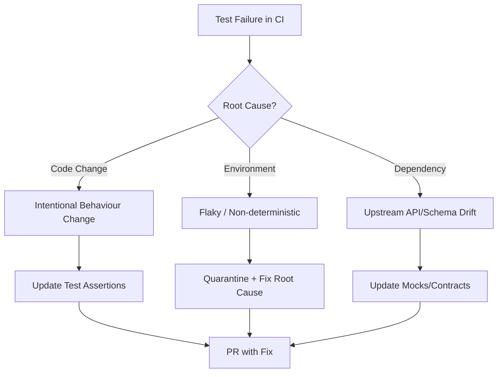
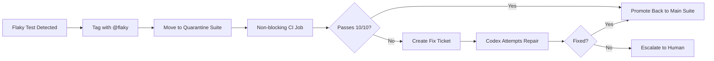

# Codex CLI for Automated Test Maintenance: Fixing Broken Tests, Updating Snapshots, and Eliminating Flaky Tests


Test suites decay. A team that starts with 200 tests and 10 per cent maintenance overhead reaches 1,000 tests and 50 per cent maintenance overhead, a ceiling where keeping tests green costs more than the safety they provide[^1]. QA engineers report spending 20 to 30 per cent of their working week triaging failures that have nothing to do with production bugs[^2]. Flaky tests drive a disproportionate share of that waste[^3], and at scale a team deploying eight times per month with twelve tests breaking per deploy burns roughly \$67,200 annually on maintenance alone[^2].

Codex CLI turns test maintenance from a manual grind into an agent-driven workflow. This article covers three patterns: automated test repair in CI, intelligent snapshot management, and flaky test detection with quarantine, all using Codex CLI's current tooling.

## The test maintenance problem

Test maintenance is not test writing. Writing new tests is creative work. Maintenance is reactive drudgery: a renamed API field breaks 40 assertions; a CSS refactor invalidates 15 snapshots; a timing-dependent test passes locally but fails in CI. The fix is usually trivial, but finding it requires context-switching from feature work.



Codex CLI handles all three branches. The key insight: AGENTS.md constraints ensure the agent fixes the *test*, not the *implementation*, unless you explicitly instruct otherwise.

## Pattern 1: automated test repair in CI

The OpenAI Cookbook documents a GitHub Actions workflow that triggers Codex when CI fails, generates a minimal fix, and opens a pull request[^4]. Here is a production-hardened version:


```yaml
name: Codex Test Autofix
on:
  workflow_run:
    workflows: ["CI"]
    types: [completed]

jobs:
  autofix:
    if: ${{ github.event.workflow_run.conclusion == 'failure' }}
    runs-on: ubuntu-latest
    permissions:
      contents: write
      pull-requests: write
    steps:
      - uses: actions/checkout@v4
        with:
          ref: ${{ github.event.workflow_run.head_branch }}

      - uses: actions/setup-node@v4
        with:
          node-version: 20

      - run: npm ci

      - uses: openai/codex-action@main
        with:
          codex_args: '["--config","sandbox_mode=\"workspace-write\""]'
        env:
          OPENAI_API_KEY: ${{ secrets.OPENAI_API_KEY }}
          CODEX_INSTRUCTION: |
            Run the test suite. Identify failing tests. For each failure:
            1. Determine whether the test expectation is outdated or the implementation is wrong.
            2. If the test expectation is outdated, update the test.
            3. If the implementation is wrong, stop and report — do not fix production code.
            4. Never delete tests. Never weaken assertions.
            Implement only the minimal change needed. Stop after all tests pass.

      - uses: peter-evans/create-pull-request@v6
        with:
          commit-message: "fix(tests): auto-repair failing tests via Codex"
          branch: codex/autofix-${{ github.event.workflow_run.head_branch }}
          title: "fix(tests): automated test repair"
          body: |
            Codex CLI identified and repaired failing tests.
            **Review carefully** — agent did not modify production code.
```


The critical constraint is the instruction: *never fix production code*. Without this, agents will happily 'fix' a failing test by changing the function under test[^5].

### AGENTS.md for test repair

Encode test maintenance boundaries permanently in your repository:

```markdown
<!-- tests/AGENTS.md -->
# Test Maintenance Rules

## Boundaries
- NEVER modify files outside `tests/` or `__tests__/` directories
- NEVER weaken assertions (e.g. replacing `.toBe(42)` with `.toBeTruthy()`)
- NEVER delete test cases — quarantine them with `.skip` if genuinely obsolete
- If a test failure indicates a production bug, STOP and report the finding

## Test Commands
- Unit tests: `npm test` (Jest) or `npx vitest run`
- E2E tests: `npx playwright test`
- Type checks: `npx tsc --noEmit`

## Conventions
- Snapshot updates require running with `--update-snapshot` flag
- Flaky tests must be tagged with `// @flaky` comment before quarantining
- All test fixes must preserve the original test's intent
```

AGENTS.md guidance alone achieves roughly 25 to 40 per cent compliance from agents; the same rules enforced as runtime hooks hit closer to 95 per cent[^6].

## Pattern 2: intelligent snapshot management

Snapshot tests are the highest-maintenance category. A single component refactor can invalidate dozens of `.snap` files. The naive approach, running `jest --updateSnapshot`, accepts *all* changes blindly. Codex CLI enables a selective approach:

```bash
codex exec "Run 'npx vitest run' and identify snapshot failures. \
For each failing snapshot: \
1. Read the component source that generates the snapshot. \
2. Determine if the new output is correct given the source. \
3. If correct, update that specific snapshot. \
4. If incorrect, report the discrepancy without updating. \
Output a summary of updated vs flagged snapshots." \
  --output-schema ./schemas/snapshot-report.json
```

The `--output-schema` flag produces machine-readable JSON for downstream tooling[^7]:

```json
{
  "type": "object",
  "properties": {
    "updated": {
      "type": "array",
      "items": { "type": "string" }
    },
    "flagged": {
      "type": "array",
      "items": {
        "type": "object",
        "properties": {
          "file": { "type": "string" },
          "reason": { "type": "string" }
        }
      }
    },
    "total_failures": { "type": "integer" }
  }
}
```

### PostToolUse hook for snapshot validation

You can prevent blind snapshot acceptance with a hook that surfaces each update:

```toml
# config.toml
[[hooks]]
event = "PostToolUse"
tool_name = "shell_command"
command = """
if echo "$TOOL_INPUT" | grep -q "updateSnapshot\\|--update"; then
  echo "⚠️ Snapshot update detected — verifying diff is intentional" >&2
  git diff --stat "**/*.snap" >&2
fi
"""
```

This surfaces snapshot changes during the agent's execution, making unintended updates visible in the session log.

## Pattern 3: flaky test detection and quarantine

Flaky tests, those that pass or fail non-deterministically, are the most insidious maintenance burden. The 2026 consensus is clear: quarantine, do not retry[^8]. Retries discard signal; quarantine preserves it.

### Detection with codex exec

Run a flakiness scan as a scheduled automation:

```bash
codex exec "Analyse the test suite for flakiness indicators: \
1. Find tests using setTimeout, Date.now(), Math.random(), or network calls without mocks. \
2. Find tests that reference shared mutable state across test cases. \
3. Find tests with race conditions (async operations without proper awaits). \
4. Check git history for tests that have been retried or skipped in the last 30 days. \
Report each finding with file, line, and recommended fix." \
  --model gpt-5.6-luna \
  -o /tmp/flaky-report.json \
  --output-schema ./schemas/flaky-report.json
```

Using `gpt-5.6-luna` keeps costs low for this analytical task, where no code generation is required[^9].

### Quarantine workflow

Once detected, quarantine flaky tests without losing visibility:



For Playwright, the quarantine pattern uses tag-based filtering[^8]:

```typescript
// playwright.config.ts
export default defineConfig({
  projects: [
    {
      name: 'stable',
      grep: /^(?!.*@flaky)/,  // exclude @flaky tagged tests
    },
    {
      name: 'quarantine',
      grep: /@flaky/,
      retries: 3,  // only retry quarantined tests
    },
  ],
});
```

### PreToolUse hook to block retry masking

Block agents from retrying flaky tests instead of fixing them:

```toml
[[hooks]]
event = "PreToolUse"
tool_name = "shell_command"
command = """
if echo "$TOOL_INPUT" | grep -qE "retryTimes|--retries.*[3-9]"; then
  echo "BLOCKED: Do not add retries to mask flakiness. Fix the root cause or quarantine the test." >&2
  exit 2
fi
"""
```

Exit code 2 blocks the tool call and feeds the reason back to the model[^10].

## Complementary tooling: self-healing tests with Shiplight

The patterns above fix tests *after* they break. Shiplight[^13] takes a different approach: preventing breakage in the first place through self-healing test automation.

Shiplight is an agent-native testing platform that integrates with Codex CLI through MCP. Its intent-cache-heal pattern stores the semantic purpose of each test step as natural language intent rather than a brittle CSS selector. When a UI refactor breaks a locator, the AI re-resolves the correct element from the live DOM using that intent, updates the locator cache, and the test continues without human intervention.

The integration works through a standard MCP server configuration:

```toml
[mcp_servers.shiplight]
command = "npx"
args = ["-y", "@shiplight/mcp@latest"]
```

Once connected, Codex can generate intent-based YAML tests that live in your repository and run in CI through Playwright. When the agent makes a code change, it opens a real browser, walks the flow it changed, and the successful verification is written as a YAML test file. If the UI later changes, the self-healing layer resolves the new element without failing the test.

This complements the reactive patterns in this article. Codex CLI's test repair and quarantine workflows handle failures after they occur. Shiplight reduces the volume of failures that reach the repair stage by eliminating the most common cause: locator brittleness after UI changes[^14].

## Combining patterns: the test health automation

Wire all three patterns into a weekly scheduled automation:

```bash
#!/bin/bash
# scripts/test-health.sh — run via cron or GitHub Actions schedule

set -euo pipefail

# 1. Run full suite, capture failures
npx vitest run --reporter=json > /tmp/test-results.json 2>&1 || true

# 2. Let Codex analyse and fix
codex exec "Read /tmp/test-results.json. \
Categorise each failure as: intentional-change, flaky, or upstream-drift. \
For intentional-change: update the test assertion. \
For flaky: add a @flaky tag and move to quarantine config. \
For upstream-drift: update mocks to match current API contracts. \
Never modify production source files. \
Commit each category as a separate commit with conventional commit messages." \
  --sandbox workspace-write

# 3. Push results
git push origin HEAD
```

## Cost considerations

Test maintenance tasks are typically low-reasoning-effort work, pattern matching against error messages and updating string literals. Route these to `gpt-5.6-luna` with `model_reasoning_effort = "low"` to minimise spend[^9]. Reserve `gpt-5.6-terra` or `gpt-5.6-sol` for complex flakiness root-cause analysis where the agent must reason about concurrency or timing.

A typical maintenance run fixing five to ten broken assertions consumes 8,000 to 15,000 tokens, including test file context, costing approximately \$0.02 to \$0.05 at current rates[^11].

## Limitations and safety

- **False confidence**: an agent updating a test assertion may mask a genuine regression. Always review auto-generated PRs before merging.
- **Context ceiling**: large test files exceeding 500 lines approach compaction territory. Split monolithic test files for better agent performance.
- **Snapshot semantics**: Codex cannot evaluate visual correctness of rendered component snapshots. It reasons about structure, not pixels. Use visual regression tools such as Percy, Chromatic, or Shiplight for visual assertions[^12].
- **Shared state**: agents struggle with test isolation bugs caused by global singletons or database state leakage between tests.

## Citations

[^1]: Ali El-Shayeb, 'The hidden test automation maintenance cost consuming 50 per cent of QA time,' *QA meets AI (Medium)*, May 2026. https://medium.com/qa-flow/the-hidden-test-automation-maintenance-cost-consuming-50-of-qa-time-a8a462cd9084

[^2]: Diffie, 'The True Cost of Test Maintenance (And How to Cut It),' 2026. https://diffie.ai/blog/true-cost-of-test-maintenance

[^3]: ACCELQ, 'Flaky Tests in 2026: How to Identify, Fix, and Prevent Them,' 2026. https://www.accelq.com/blog/flaky-tests/

[^4]: OpenAI, 'Use Codex CLI to automatically fix CI failures,' *OpenAI Cookbook*, 2026. https://developers.openai.com/cookbook/examples/codex/autofix-github-actions

[^5]: Claude Skills Hub, 'Auto Fix Tests Skill,' 2026. https://claudeskills.info/skill/fix-tests/

[^6]: OpenAI, 'Custom instructions with AGENTS.md,' *Codex Developers*, 2026. https://learn.chatgpt.com/docs/agents-md

[^7]: OpenAI, 'Non-interactive mode,' *Codex Developers*, 2026. https://learn.chatgpt.com/docs/noninteractive

[^8]: Trunk.io, 'How to avoid and detect flaky tests in Vitest,' 2026. https://trunk.io/blog/how-to-avoid-and-detect-flaky-tests-in-vitest

[^9]: OpenAI, 'Models,' *Codex Developers*, 2026. https://learn.chatgpt.com/docs/models

[^10]: OpenAI, 'Hooks,' *Codex Developers*, 2026. https://learn.chatgpt.com/docs/hooks

[^11]: OpenAI, 'Pricing,' *Codex Developers*, 2026. https://learn.chatgpt.com/docs/pricing

[^12]: BrowserStack, 'How to Detect and Avoid Playwright Flaky Tests in 2026,' 2026. https://www.browserstack.com/guide/playwright-flaky-tests

[^13]: Shiplight, 'Self-Healing and Auto-Healing Test Automation Explained,' 2026. https://www.shiplight.ai/blog/what-is-self-healing-test-automation

[^14]: Shiplight, 'Add Automated Testing to Cursor, Copilot and Codex,' 2026. https://www.shiplight.ai/blog/add-testing-to-ai-coding-tools-cursor-copilot-codex
