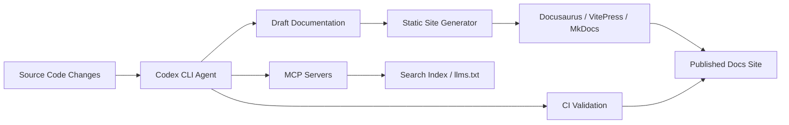
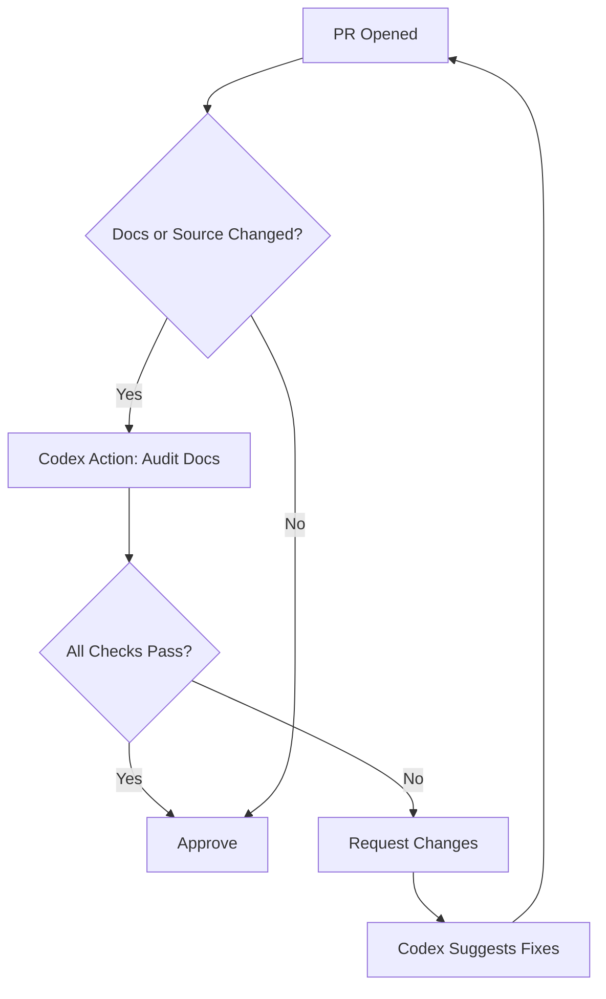

# Codex CLI for Docs-as-Code: Docusaurus, VitePress, MkDocs, and Agent-Driven Documentation Pipelines


---

Documentation rots faster than code. APIs change, features ship, and the docs lag behind — sometimes by weeks, sometimes permanently. The docs-as-code movement treats documentation with the same rigour as production code: version-controlled, CI-gated, and reviewed in pull requests. Codex CLI turns that philosophy into an automated pipeline, using agent-driven workflows to draft, validate, cross-reference, and publish documentation alongside the code it describes.

This article covers three leading static site generators — Docusaurus, VitePress, and MkDocs Material — and shows how Codex CLI integrates with each through MCP servers, AGENTS.md conventions, hooks, and `codex exec` pipelines to keep documentation current without burning developer time.

## The Documentation Landscape in 2026

Three frameworks dominate developer documentation:

- **Docusaurus 3.9.x** (Meta) — React-based, ~3M weekly npm downloads, used by React, Jest, and Prettier [^1]
- **VitePress 2.x** (Vue team) — Vite-powered, ~2M weekly downloads, used by Vue 3, Vite, and Vitest [^2]
- **MkDocs Material 9.7.x** (squidfunk) — Python-based, now in maintenance mode with all Insiders features folded into the open-source edition [^3]

All three share a core assumption: documentation lives in Markdown files alongside source code. That assumption makes them ideal targets for agent-assisted workflows — Codex CLI already speaks Markdown fluently.



## MCP Servers for Documentation Frameworks

### Docusaurus MCP Server Plugin

The `docusaurus-plugin-mcp-server` by Steve Calvert exposes documentation as an MCP endpoint that Codex CLI can query at runtime [^4]. During build, the plugin extracts rendered HTML, converts it to Markdown, and builds a search index. At runtime, a serverless function handles MCP JSON-RPC requests, providing two tools:

- **search** — returns matching documents with URLs, snippets, and relevance scores
- **get_page** — retrieves full page content as Markdown

Configuration is straightforward:

```javascript
// docusaurus.config.js
module.exports = {
  plugins: [
    [
      'docusaurus-plugin-mcp-server',
      {
        server: {
          name: 'my-docs',
          version: '1.0.0',
        },
      },
    ],
  ],
};
```

The plugin ships adapters for Vercel, Netlify, and Cloudflare, and includes a `McpInstallButton` React component that generates copy-to-clipboard MCP client configurations [^4].

### VitePress MCP Plugin

The `vite-plugin-vitepress-mcp` package adds MCP server capabilities to VitePress sites [^5]. Configuration slots into the Vite config:

```typescript
// .vitepress/config.ts
import { defineConfig } from 'vitepress';
import { mcpPlugin } from 'vite-plugin-vitepress-mcp';

export default defineConfig({
  vite: {
    plugins: [mcpPlugin()],
  },
});
```

### GitMCP: Framework-Agnostic Documentation Access

For projects that do not ship their own MCP server, [GitMCP](https://gitmcp.io) transforms any GitHub repository into an MCP-accessible documentation source [^6]. Point Codex CLI at the GitMCP URL for any repo:

```toml
# .codex/config.toml
[mcp]
  [mcp.servers.project-docs]
    transport = "http"
    url = "https://gitmcp.io/your-org/your-repo"
```

This works regardless of whether the project uses Docusaurus, VitePress, MkDocs, or plain Markdown.

## AGENTS.md for Documentation Projects

Documentation repositories benefit from specific AGENTS.md instructions that prevent common agent mistakes — hallucinated API endpoints, incorrect code examples, and broken cross-references:

```markdown
# AGENTS.md

## Documentation Standards
- Every code example MUST be tested. Run the example before including it.
- Cross-reference related pages using relative Markdown links, never absolute URLs.
- Use British English spelling throughout.
- Every API method documented must include: signature, parameters table, return type, and at least one example.
- Do NOT invent API methods or parameters. Check the source code first.

## Framework-Specific Rules
- Docusaurus: Use MDX for interactive components. Admonitions use :::note syntax.
- VitePress: Use Vue components in Markdown. Custom containers use ::: syntax.
- MkDocs: Use admonition syntax (!!! note). Never use HTML directly.

## Validation
- Run `npm run build` (Docusaurus/VitePress) or `mkdocs build --strict` before committing.
- Broken links cause build failures. Fix them, do not suppress warnings.
```

## Agent-Driven Documentation Workflows

### Workflow 1: Docs-from-Diff

The most valuable pattern: when code changes, Codex CLI drafts the corresponding documentation update. Wire this into a PostToolUse hook:

```toml
# .codex/config.toml
[[hooks]]
event = "PostToolUse"
matcher = "shell"
command = """
if echo "$CODEX_TOOL_OUTPUT" | grep -q 'src/'; then
  echo '{"systemMessage": "Source code was modified. Check whether docs/ needs a corresponding update. If so, draft the changes."}'
else
  echo '{}'
fi
"""
```

For CI pipelines, use `codex exec` to audit documentation freshness:

```bash
codex exec "Review the git diff against main. \
  Identify any public API changes that lack corresponding \
  documentation updates in docs/. \
  List each undocumented change with file and line number."
```

### Workflow 2: Bulk Documentation Generation

Generate initial documentation for an undocumented codebase using subagents:

```bash
codex exec "For each exported function in src/api/ that lacks \
  a corresponding page in docs/api/, generate a documentation \
  page following the template in docs/_template.md. \
  Include the function signature, parameter descriptions \
  extracted from TypeScript types, and a usage example."
```

### Workflow 3: Cross-Reference Validation

Documentation sites suffer from stale cross-references. Codex CLI can audit them:

```bash
codex exec "Scan all Markdown files in docs/. \
  Find every internal link. Verify each target exists. \
  Report broken links with source file, line number, and target path."
```

## llms.txt: Making Your Docs AI-Readable

The llms.txt specification (v1.7.0, stable as of May 2026) defines a Markdown file at your domain root that indexes your most important documentation for LLM consumption [^7]. Codex CLI can generate and maintain this file:

```bash
codex exec "Generate an llms.txt file for this documentation site. \
  Read the sidebar configuration to determine page hierarchy. \
  For each page, write a one-line description. \
  Follow the llms.txt v1.7.0 specification format."
```

The output follows the specification's structure:

```markdown
# Project Name

> Brief project description

## Docs

- [Getting Started](https://docs.example.com/getting-started): Installation and first steps
- [API Reference](https://docs.example.com/api): Complete API documentation
- [Configuration](https://docs.example.com/config): Configuration options and defaults
```

Adoption of llms.txt expanded significantly through 2026 Q1, moving beyond early adopters into mainstream SaaS and developer tooling [^7].

## CI Pipeline Integration

Gate documentation quality in your CI pipeline using `codex exec` and the Codex GitHub Action:


```yaml
# .github/workflows/docs-quality.yml
name: Documentation Quality Gate
on:
  pull_request:
    paths: ['docs/**', 'src/**']

jobs:
  docs-audit:
    runs-on: ubuntu-latest
    steps:
      - uses: actions/checkout@v4
      - uses: openai/codex-action@v1
        with:
          prompt: |
            Review the PR diff. Check:
            1. Every public API change in src/ has a docs/ update
            2. All code examples in changed docs compile
            3. No broken cross-references
            4. British English spelling
            Output a JSON report with pass/fail and findings.
          model: gpt-5.4
          sandbox: read-only
        env:
          OPENAI_API_KEY: ${{ secrets.OPENAI_API_KEY }}
```




## Framework-Specific Tips

### Docusaurus

Docusaurus 3.9.x ships with Algolia DocSearch v4 for AI-driven search and supports MDX 3 for interactive documentation [^1]. When using Codex CLI with Docusaurus projects:

- Configure the sandbox to allow `node_modules/.cache` writes — Docusaurus builds cache aggressively
- Use `--add-dir` to include the `static/` directory if assets need updating
- The `sidebars.js` file is the source of truth for navigation; instruct the agent to update it when adding pages

```toml
# .codex/config.toml
[sandbox]
allow_write = ["docs/", "sidebars.js", "static/"]
```

### VitePress

VitePress 2.x alpha builds on Vite 7 with improved HMR and theme capabilities [^2]. Key considerations:

- VitePress uses file-system routing — no sidebar configuration file to update separately
- Vue components embedded in Markdown need the `<script setup>` syntax
- The `.vitepress/config.ts` file controls navigation; add it to writable paths

### MkDocs Material

MkDocs Material 9.7.x folded all previously paid Insiders features into the open-source edition in November 2025, including instant previews, navigation paths, and footnote tooltips [^3]. Note that the project is now in maintenance mode, with new feature work moving to the successor project Zensical [^3]:

- Use `mkdocs build --strict` in hooks to catch warnings as errors
- The `mkdocs.yml` nav section is the authoritative page tree
- Python-based plugins (e.g., `mkdocs-awesome-pages`) may need sandbox exceptions for pip

```bash
# Validate MkDocs build in a PostToolUse hook
mkdocs build --strict 2>&1 | head -20
```

## Model Selection for Documentation Tasks

Documentation work is primarily language generation with moderate reasoning requirements. The recommended approach:

| Task | Model | Reasoning |
|------|-------|-----------|
| Drafting new pages | GPT-5.5 | Needs nuanced technical writing |
| Cross-reference auditing | o4-mini | Pattern matching, low creativity |
| Code example validation | GPT-5.4 | Needs code comprehension |
| llms.txt generation | o4-mini | Structured extraction |
| Bulk API doc generation | GPT-5.4 | Balance of speed and accuracy |

## Limitations and Caveats

- **Build validation requires network access**: Docusaurus and VitePress npm builds pull dependencies. Configure the sandbox to allow network during `npm install` or pre-install in a setup script
- **MkDocs Material maintenance mode**: New feature work has moved to Zensical; plan migration if you need cutting-edge features beyond November 2026 [^3]
- **MCP server maturity**: The Docusaurus MCP plugin is functional but was last updated March 2026; VitePress MCP support remains community-maintained [^4] [^5]
- **Agent hallucination risk**: Documentation agents can invent plausible but incorrect API methods. Always validate generated docs against source code — the AGENTS.md instructions above mitigate but do not eliminate this risk
- **llms.txt is not yet an IETF RFC**: The specification is stable and widely adopted but lacks formal standardisation [^7]

## Citations

[^1]: [Docusaurus Official Documentation and Changelog](https://docusaurus.io/changelog) — Meta, 2026
[^2]: [VitePress Official Site and Releases](https://vitepress.dev/) — Vue.js Team, 2026
[^3]: [Material for MkDocs — Maintenance Mode Announcement and 9.7.0 Release](https://squidfunk.github.io/mkdocs-material/blog/archive/2026/) — squidfunk, 2025-2026
[^4]: [docusaurus-plugin-mcp-server — GitHub Repository](https://github.com/scalvert/docusaurus-plugin-mcp-server) — Steve Calvert, 2026
[^5]: [vite-plugin-vitepress-mcp — npm Package](https://socket.dev/npm/package/vite-plugin-vitepress-mcp) — Community, 2026
[^6]: [GitMCP — Turn Any GitHub Repo into an MCP Documentation Source](https://gitmcp.io) — GitMCP, 2026
[^7]: [llms.txt Specification v1.7.0 and State of llms.txt 2026](https://www.ai-visibility.org.uk/specifications/llms-txt/) — AI Visibility, 2026
