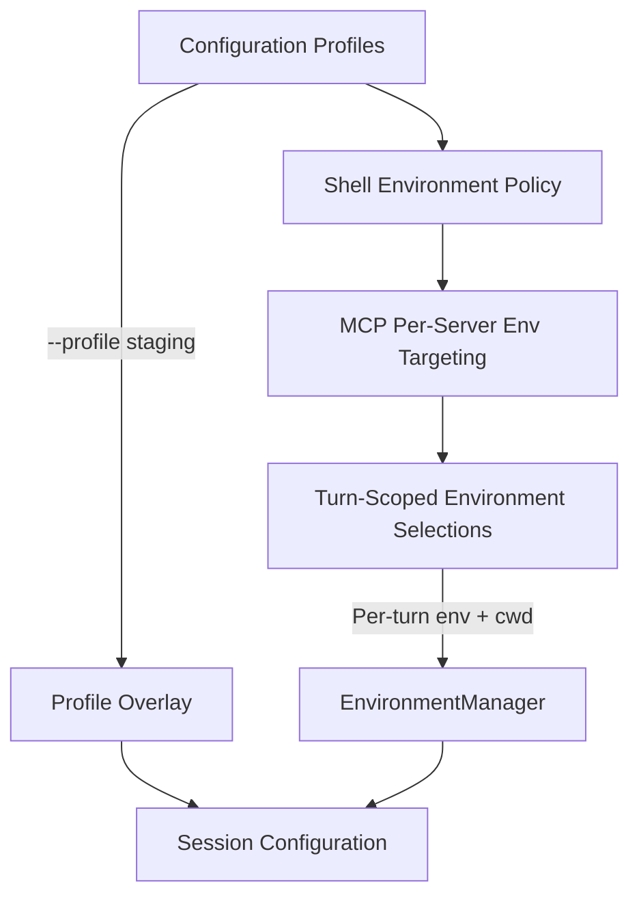
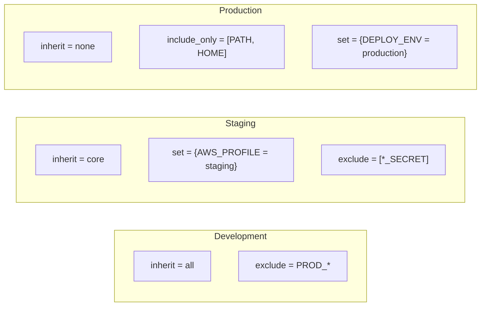
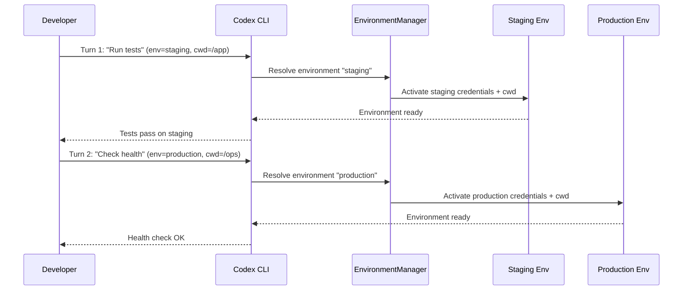

# Codex CLI Environment Management: Turn-Scoped Selections, Profiles, Shell Policies, and Multi-Environment Workflows


---

Professional software teams do not write code in a vacuum. Every meaningful project involves at least three environments — development, staging, and production — each with its own credentials, endpoints, feature flags, and infrastructure topology. Codex CLI has steadily accumulated the primitives needed to navigate this reality without leaking secrets or deploying to the wrong target. This article consolidates the environment management surface area as of v0.135.0, covering configuration profiles, shell environment policies, MCP per-server environment targeting, and the recently landed turn-scoped environment selections.

## The Problem: Environment Sprawl Meets Agent Autonomy

When a human developer switches from staging to production, the cognitive overhead is low: change a `.env` symlink, swap a kubeconfig context, or toggle a shell alias. But an autonomous agent operating in full-auto mode has no such intuition. Without explicit guardrails, Codex will happily run `terraform apply` against whichever AWS account happens to be configured in the ambient shell. The consequences range from embarrassing (staging data in production logs) to catastrophic (production database migrations triggered by a test prompt).

Codex CLI addresses this with four layered mechanisms:



## Configuration Profiles

Profiles are named configuration layers stored as separate TOML files that overlay the base user configuration [^1]. When you pass `--profile <name>`, Codex loads `~/.codex/config.toml` first, then merges `~/.codex/<name>.config.toml` on top. Profile files only need to contain values that differ from the base.

### Creating Environment-Specific Profiles

A typical setup for a team working across three environments:

```toml
# ~/.codex/staging.config.toml
model = "gpt-5.4-mini"
approval_policy = "on-request"
model_reasoning_effort = "medium"

[model_providers.staging-provider]
name = "Azure OpenAI Staging"
base_url = "https://staging.openai.azure.com/v1"
env_key = "AZURE_STAGING_API_KEY"

[shell_environment_policy]
inherit = "core"
set = { DEPLOY_ENV = "staging", AWS_PROFILE = "staging" }
exclude = ["PROD_*"]
```

```toml
# ~/.codex/production.config.toml
model = "gpt-5.5"
approval_policy = "untrusted"
model_reasoning_effort = "high"
sandbox_mode = "read-only"

[model_providers.prod-provider]
name = "Azure OpenAI Production"
base_url = "https://production.openai.azure.com/v1"
env_key = "AZURE_PROD_API_KEY"

[shell_environment_policy]
inherit = "none"
set = { DEPLOY_ENV = "production", AWS_PROFILE = "production" }
include_only = ["PATH", "HOME", "USER", "DEPLOY_ENV", "AWS_PROFILE"]
```

Switching between environments becomes a single flag:

```bash
codex --profile staging "Run the integration test suite against the staging API"
codex --profile production "Check the health endpoint and report status"
```

### Configuration Precedence

Profiles sit in the middle of Codex's configuration hierarchy [^1] [^2]:

1. **Requirements** (organisation-enforced, highest priority)
2. **Managed defaults**
3. **CLI flags and `-c` overrides**
4. **Project config** (`.codex/config.toml`, trusted projects only)
5. **Profile files**
6. **User config** (`~/.codex/config.toml`)
7. **System config** (`/etc/codex/config.toml`)
8. **Built-in defaults**

This means a project-level config can override a profile, and CLI flags trump everything below requirements. The layering is intentional: it lets organisations enforce safety rails (via requirements) whilst giving individual developers flexibility through profiles [^2].

## Shell Environment Policy

The `shell_environment_policy` table controls which environment variables Codex forwards to any subprocess it spawns — every `npm test`, every `terraform plan`, every shell command the model proposes [^3]. This is the primary defence against secret leakage.

### Policy Options

```toml
[shell_environment_policy]
# Baseline: "all" | "core" | "none"
inherit = "core"

# Explicit overrides injected into every subprocess
set = { NODE_ENV = "test", CI = "true" }

# Glob patterns for variables to exclude
exclude = ["*_SECRET", "*_TOKEN", "*_API_KEY", "AWS_SESSION_*"]

# Whitelist — when set, only matching variables survive
include_only = ["PATH", "HOME", "USER", "SHELL", "NODE_ENV", "CI"]

# Keep default KEY/SECRET/TOKEN filtering active
ignore_default_excludes = false

# Load user shell profile (.bashrc/.zshrc)
experimental_use_profile = true
```

Patterns use case-insensitive glob syntax (`*`, `?`, `[A-Z]`) [^3]. The `inherit = "core"` baseline passes only `PATH`, `HOME`, `USER`, `SHELL`, and similar essentials — a sensible default that avoids the `inherit = "all"` footgun where every ambient credential flows through.

### Environment-Specific Shell Policies

By combining profiles with shell policies, each environment gets its own variable boundary:



In development, you want maximal convenience — inherit everything, exclude only production credentials. In staging, inherit the core set and explicitly inject staging-specific variables. In production, start from nothing and whitelist only what the agent strictly needs.

## MCP Per-Server Environment Targeting

Codex CLI v0.134.0 introduced per-server environment targeting for MCP servers [^4]. Prior to this release, all MCP servers in a session shared the same ambient environment. Now, each server can receive its own set of environment variables, with explicit control over whether variables are sourced locally or from a remote executor.

### Configuration

```toml
[mcp_servers.staging-db]
command = "npx"
args = ["-y", "@supabase/mcp-server"]
env_vars = [
    "SUPABASE_URL",
    { name = "SUPABASE_KEY", source = "local" },
    { name = "DATABASE_URL", source = "remote" }
]

[mcp_servers.staging-db.env]
SUPABASE_URL = "https://staging.supabase.co"
```

The `env_vars` array supports two forms [^5]:

- **Plain strings** (e.g. `"SUPABASE_URL"`) — read from Codex's local environment, equivalent to `source = "local"`
- **Objects with `source`** — `source = "local"` reads from the local shell; `source = "remote"` reads from the remote executor environment (requires remote MCP stdio)

For HTTP-based MCP servers (Streamable HTTP), authentication uses bearer tokens or environment-backed headers:

```toml
[mcp_servers.figma]
url = "https://mcp.figma.com/mcp"
bearer_token_env_var = "FIGMA_OAUTH_TOKEN"

[mcp_servers.internal-api]
url = "https://internal.example.com/mcp"
env_http_headers = { "X-Internal-Auth" = "INTERNAL_AUTH_TOKEN" }
```

OAuth-enabled servers can authenticate via `codex mcp login <server-name>`, with configurable callback ports and URLs [^5]:

```toml
mcp_oauth_callback_port = 5555
mcp_oauth_callback_url = "https://devbox.example.internal/callback"
```

### Multi-Environment MCP Topology

A realistic configuration might wire different MCP servers to different environments:

```toml
# Development database — local credentials
[mcp_servers.dev-postgres]
command = "npx"
args = ["-y", "@modelcontextprotocol/server-postgres"]
env_vars = ["DEV_DATABASE_URL"]

# Staging monitoring — remote credentials
[mcp_servers.staging-datadog]
command = "npx"
args = ["-y", "@datadog/mcp-server"]
env_vars = [
    { name = "DD_API_KEY", source = "remote" },
    { name = "DD_SITE", source = "local" }
]

# Production — read-only, no write tools
[mcp_servers.prod-postgres]
command = "npx"
args = ["-y", "@modelcontextprotocol/server-postgres"]
env_vars = [{ name = "PROD_DATABASE_URL", source = "remote" }]
enabled = false  # Disabled by default; enable via profile overlay
```

## Turn-Scoped Environment Selections

The newest addition to the environment management story is turn-scoped environment selections, landed via PR #18416 [^6]. This feature adds experimental `turn/start.environments` parameters that allow specifying a per-turn environment ID and working directory, resolved by an `EnvironmentManager` before turn processing begins.

### What This Enables

Before turn-scoped selections, switching environments mid-session required restarting Codex with a different `--profile` flag or manually changing environment variables. Now, app-server sessions can manage multiple environments simultaneously and target a specific environment and working directory on each turn [^6].



This is particularly valuable for:

- **Multi-workspace sessions** — working across a frontend and backend repository in a single conversation, each with its own environment context
- **Cross-environment validation** — running a migration on staging, then immediately verifying the equivalent schema in production, without session restarts
- **Remote setups** — targeting different remote executors per turn, each with their own credential scopes

### Current Status

Turn-scoped selections are experimental as of v0.135.0. The feature passes through the core protocol operations and is primarily consumed by app-server integrations and the SDK's thread/turn APIs [^6]. CLI users benefit indirectly when the app-server manages their session, but the interactive TUI does not yet expose an environment picker. Expect this to stabilise over the next few releases.

## Putting It All Together: A Multi-Environment Workflow

Here is a practical workflow combining all four mechanisms for a team managing a microservices platform:

### 1. Base Configuration

```toml
# ~/.codex/config.toml
model = "gpt-5.5"
approval_policy = "on-request"

[shell_environment_policy]
inherit = "core"
ignore_default_excludes = false

[mcp_servers.context7]
command = "npx"
args = ["-y", "@upstash/context7-mcp"]
```

### 2. Profile Overlays

```toml
# ~/.codex/dev.config.toml
model = "gpt-5.4-mini"
approval_policy = "auto-edit"

[shell_environment_policy]
inherit = "all"
exclude = ["PROD_*", "*PRODUCTION*"]
set = { DEPLOY_ENV = "development" }
```

```toml
# ~/.codex/staging.config.toml
approval_policy = "on-request"

[shell_environment_policy]
inherit = "core"
set = { DEPLOY_ENV = "staging", AWS_PROFILE = "staging" }
exclude = ["PROD_*"]

[mcp_servers.staging-sentry]
command = "npx"
args = ["-y", "@sentry/mcp-server"]
env_vars = ["SENTRY_STAGING_DSN"]
```

### 3. Project-Level Overrides

```toml
# .codex/config.toml (in repo root, trusted project)
[mcp_servers.project-db]
command = "npx"
args = ["-y", "@modelcontextprotocol/server-postgres"]
env_vars = ["DATABASE_URL"]
```

### 4. Session Usage

```bash
# Morning development work — relaxed approvals, all env vars
codex --profile dev "Implement the new user registration endpoint"

# Pre-deploy validation — tighter controls
codex --profile staging "Run the full integration suite and report failures"

# Production incident — maximum safety
codex --profile production "Investigate the 500 errors in /api/orders, read-only"
```

### 5. SDK Turn-Scoped Targeting

For automated pipelines using the Python SDK, turn-scoped selections let a single script validate across environments without restarting the client:

```python
from openai_codex import Codex

with Codex() as codex:
    thread = codex.thread_start(
        base_instructions="You are a deployment validator"
    )

    # Turn 1: validate staging
    staging_result = thread.run(
        input_text="Run smoke tests against the staging API"
        # environment="staging" — experimental parameter
    )

    # Turn 2: validate production (same thread, different env)
    prod_result = thread.run(
        input_text="Check production health endpoints"
        # environment="production" — experimental parameter
    )
```

## Security Considerations

Environment management is fundamentally a security concern. A few hard-won guidelines:

1. **Never set `inherit = "all"` in production profiles.** Start from `"none"` and whitelist explicitly. The convenience of `"all"` is not worth the risk of leaking `AWS_SECRET_ACCESS_KEY` into a model-proposed shell command.

2. **Use `exclude` patterns defensively.** The defaults filter variables containing `KEY`, `SECRET`, and `TOKEN`, but only when `ignore_default_excludes = false` [^3]. Do not disable this unless you have a specific reason.

3. **Prefer `source = "remote"` for production credentials.** When MCP servers need production access, sourcing credentials from the remote executor keeps them off the developer's local machine entirely [^5].

4. **Use organisation requirements to enforce baselines.** The `requirements.toml` mechanism sits at the top of the configuration precedence hierarchy and cannot be overridden by profiles, CLI flags, or project config [^2]. Use it to mandate `sandbox_mode = "read-only"` for production profiles.

5. **Scope MCP servers to profiles.** Rather than enabling a production database MCP server globally, define it in the production profile and keep it `enabled = false` in the base config. This prevents accidental production queries during development sessions.

## Citations

[^1]: OpenAI, "Config basics – Codex", [https://developers.openai.com/codex/config-basic](https://developers.openai.com/codex/config-basic)

[^2]: OpenAI, "Advanced Configuration – Codex", [https://developers.openai.com/codex/config-advanced](https://developers.openai.com/codex/config-advanced)

[^3]: OpenAI, "Configuration Reference – Codex", [https://developers.openai.com/codex/config-reference](https://developers.openai.com/codex/config-reference)

[^4]: OpenAI, "Codex CLI v0.134.0 Release Notes", [https://github.com/openai/codex/releases/tag/rust-v0.134.0](https://github.com/openai/codex/releases/tag/rust-v0.134.0)

[^5]: OpenAI, "Model Context Protocol – Codex", [https://developers.openai.com/codex/mcp](https://developers.openai.com/codex/mcp)

[^6]: starr-openai, "Add turn-scoped environment selections", Pull Request #18416, [https://github.com/openai/codex/pull/18416](https://github.com/openai/codex/pull/18416)
