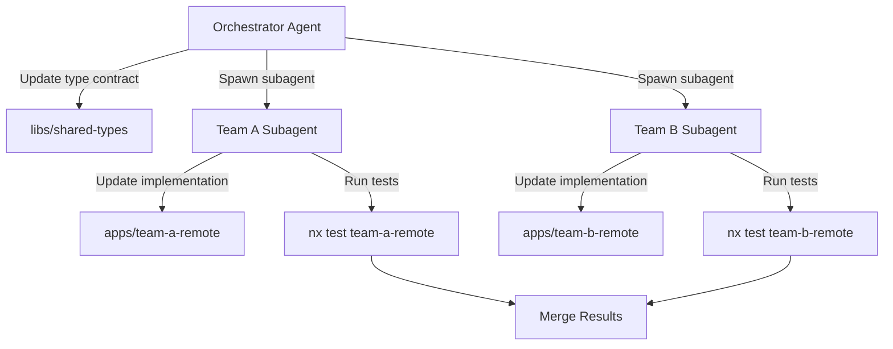
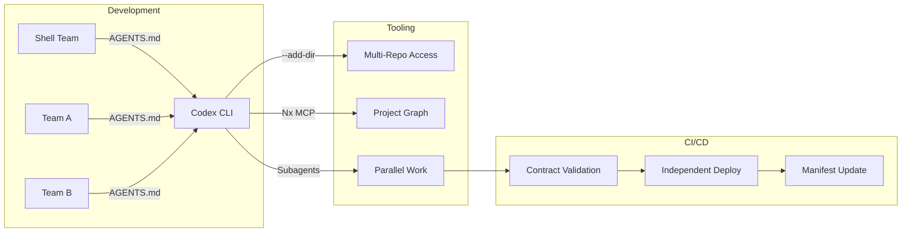

# Codex CLI for Micro-Frontend Development: Module Federation 2.0, Nx Integration, and Independent Team Deployments


Micro-frontend architectures let independent teams own, develop, and deploy slices of a web application without cross-team coordination bottlenecks. Module Federation 2.0 — which reached stable release in April 2026 with support across Webpack, Rspack, Vite, Rollup, and Metro [^1] — makes the runtime wiring practical. Codex CLI, with its multi-directory support, subagent parallelism, and Nx MCP server integration, is a natural fit for the workflow patterns micro-frontends demand.

This article covers configuring Codex CLI for micro-frontend projects, using Module Federation 2.0 with agent assistance, and orchestrating independent team deployments through subagent workflows.

## Why Micro-Frontends Need Agent Tooling

A mature micro-frontend architecture involves several moving parts: a shell (host) application that orchestrates routing and layout, multiple remote applications exposing federated modules, shared libraries with versioned contracts, and independent CI/CD pipelines per team. The coordination surface is large — exactly the kind of multi-file, cross-boundary work where coding agents excel.

The key challenges agents can address:

- **Contract enforcement** — ensuring remote modules expose the types and interfaces the host expects
- **Cross-application refactoring** — renaming a shared component that surfaces in three remotes and the shell
- **Configuration drift** — keeping federation configs consistent across independently maintained repos
- **Build pipeline validation** — verifying that module boundaries remain clean after changes

## Module Federation 2.0: What Matters for Agent Workflows

Module Federation 2.0 decouples the runtime from the bundler, standardising module loading across platforms [^1]. The features most relevant to agent-assisted development are:

### TypeScript Type Sharing

MF2 generates and hot-reloads TypeScript types across remote boundaries via `@module-federation/enhanced` [^2]. This gives Codex CLI concrete type information when working across application boundaries — the agent can verify that a remote's exported interface matches the host's import expectations without running the full build.

### Manifest-Based Discovery

The `mf-manifest.json` protocol lets deployment platforms dynamically discover and route to federated modules [^1]. Agents can read and validate these manifests as structured data, catching misconfigured `remoteEntry` URLs or version mismatches before deployment.

### Unified Runtime Across Bundlers

With support spanning Webpack, Rspack, Rollup, Rolldown, Rsbuild, Vite, and Metro [^1], teams within the same micro-frontend architecture can use different bundlers. Codex CLI does not care which bundler a project uses — it reads the configuration files and operates on the source code.

## Project Structure and AGENTS.md Configuration

A typical micro-frontend monorepo (or polyrepo) follows this layout:

```
apps/
  shell/           # Host application
  team-a-remote/   # Team A's micro-frontend
  team-b-remote/   # Team B's micro-frontend
libs/
  shared-ui/       # Shared component library
  shared-types/    # Contract types
```

### AGENTS.md for the Shell

Place an `AGENTS.md` in `apps/shell/` that encodes federation-specific constraints:

```markdown
# Shell Application — AGENTS.md

## Architecture
This is the Module Federation 2.0 host application. It consumes
remotes defined in `module-federation.config.ts`.

## Rules
- Never modify remote entry URLs directly; they are managed
  by the deployment manifest in `mf-manifest.json`.
- When adding a new remote, update both the federation config
  and the routing table in `src/routes.tsx`.
- Shared dependencies in `shared` config must pin exact versions
  to prevent singleton violations.

## Testing
Run `npx nx test shell` before committing. Integration tests
covering remote loading are in `e2e/federation.spec.ts`.
```

### AGENTS.md for Remotes

Each remote team maintains its own `AGENTS.md` encoding its exposed API contract:

```markdown
# Team A Remote — AGENTS.md

## Exposed Modules
This remote exposes `./Widget` and `./WidgetConfig` via Module
Federation. The type contract is defined in `libs/shared-types`.

## Rules
- Changing the public API of exposed modules requires updating
  the type contract in `libs/shared-types` first.
- Do not add host-specific dependencies; this remote must
  remain independently deployable.
- Run `npx nx build team-a-remote` to verify federation
  output before committing.
```

## Multi-Directory Workflows with `--add-dir`

For polyrepo setups where each micro-frontend lives in its own repository, Codex CLI's `--add-dir` flag grants write access to additional directories [^3]:

```bash
codex --cd ~/repos/shell \
  --add-dir ~/repos/team-a-remote \
  --add-dir ~/repos/team-b-remote \
  --add-dir ~/repos/shared-types
```

This gives Codex CLI visibility and write access across all four repositories in a single session — essential for cross-application refactoring where a type change in `shared-types` must propagate to consumers.

For monorepo setups managed by Nx or Turborepo, `--add-dir` is unnecessary; the workspace root provides sufficient scope.

## Nx MCP Server Integration

Nx ships a purpose-built MCP server (available from Nx 21.4) that provides Codex CLI with structural awareness of the workspace graph [^4]. Configuration is straightforward:

```json
{
  "servers": {
    "nx-mcp": {
      "type": "stdio",
      "command": "npx",
      "args": ["nx", "mcp"]
    }
  }
}
```

The Nx MCP server exposes several tools relevant to micro-frontend workflows [^4]:

- **`nx_docs`** — provides Nx configuration guidance, including Module Federation generator options
- **`ci_information`** — retrieves pipeline execution data and self-healing suggestions for failed federation builds
- **`nx_visualize_graph`** — opens the interactive project graph, revealing dependency relationships between shell and remotes
- **`nx_current_running_tasks_details`** — monitors active build or serve processes across the micro-frontend suite

Combined with Nx agent skills for workspace exploration [^5], Codex CLI gains the ability to reason about project boundaries, affected targets, and build ordering — all critical for micro-frontend dependency chains.

## Subagent Patterns for Independent Teams

Micro-frontends are inherently parallel: each team's remote can be developed, tested, and deployed independently. Codex CLI's subagent architecture maps directly to this model [^6].

### Per-Remote Subagents

Define custom agent roles in `config.toml` for each team's domain:

```toml
[agents.team-a]
model = "gpt-5.5"
instructions = """
You are responsible for the Team A remote micro-frontend
in apps/team-a-remote/. Follow the AGENTS.md in that directory.
Only modify files within apps/team-a-remote/ and libs/shared-types/.
Run 'npx nx test team-a-remote' to validate changes.
"""
sandbox = "workspace-write"

[agents.team-b]
model = "gpt-5.5"
instructions = """
You are responsible for the Team B remote micro-frontend
in apps/team-b-remote/. Follow the AGENTS.md in that directory.
Only modify files within apps/team-b-remote/ and libs/shared-types/.
Run 'npx nx test team-b-remote' to validate changes.
"""
sandbox = "workspace-write"
```

### Orchestrated Cross-Remote Changes

When a shared type contract changes, spawn subagents to update each remote in parallel:

```bash
codex exec "The Widget interface in libs/shared-types/src/widget.ts
needs a new 'priority' field of type number. Update the type
definition, then spawn subagents to update each remote's
implementation: team-a-remote and team-b-remote. Each subagent
should update the component usage and add tests for the new field.
Run nx affected:test to verify."
```

Because subagents operate on isolated worktrees [^6], they can work concurrently on the same repository without merge conflicts — precisely the model micro-frontend teams use in practice.



## Module Federation Configuration with Agent Assistance

A typical MF2 configuration file benefits from agent-assisted authoring because the options interact in subtle ways. Here is a Rspack-based configuration for a host application:

```typescript
// apps/shell/module-federation.config.ts
import { ModuleFederationPlugin } from '@module-federation/enhanced/rspack';

export default {
  name: 'shell',
  remotes: {
    teamA: 'teamA@http://localhost:3001/mf-manifest.json',
    teamB: 'teamB@http://localhost:3002/mf-manifest.json',
  },
  shared: {
    react: { singleton: true, requiredVersion: '^19.1.0' },
    'react-dom': { singleton: true, requiredVersion: '^19.1.0' },
    'react-router': { singleton: true, requiredVersion: '^7.6.0' },
  },
};
```

And the corresponding remote configuration:

```typescript
// apps/team-a-remote/module-federation.config.ts
import { ModuleFederationPlugin } from '@module-federation/enhanced/rspack';

export default {
  name: 'teamA',
  filename: 'remoteEntry.js',
  exposes: {
    './Widget': './src/components/Widget.tsx',
    './WidgetConfig': './src/components/WidgetConfig.tsx',
  },
  shared: {
    react: { singleton: true, requiredVersion: '^19.1.0' },
    'react-dom': { singleton: true, requiredVersion: '^19.1.0' },
  },
};
```

Ask Codex CLI to validate consistency across these configurations:

```bash
codex "Review all module-federation.config.ts files in this
workspace. Check that shared dependency versions match across
host and remotes, singleton flags are consistent, and exposed
module paths resolve to existing files."
```

## CI Integration with `codex exec`

Independent deployment pipelines are a defining characteristic of micro-frontends. Each remote ships separately, and the shell updates its manifest to point to new remote versions. Codex CLI's non-interactive mode integrates into this workflow [^7]:


```yaml
# .github/workflows/federation-validate.yml
name: Federation Contract Validation
on:
  pull_request:
    paths:
      - 'libs/shared-types/**'

jobs:
  validate-contracts:
    runs-on: ubuntu-latest
    steps:
      - uses: actions/checkout@v4
      - uses: openai/codex-action@v1
        with:
          codex-args: >-
            --approval-mode full-auto
            --sandbox workspace-write
          prompt: |
            The shared type contracts in libs/shared-types/ have
            changed. Verify that all remotes (apps/team-a-remote,
            apps/team-b-remote) and the shell (apps/shell) still
            compile correctly against the updated types. Run
            'npx nx affected:build' and report any type errors.
        env:
          OPENAI_API_KEY: ${{ secrets.OPENAI_API_KEY }}
```


This pipeline triggers whenever the shared type contract changes, using Codex to verify that all consumers remain compatible — a federation-specific contract validation gate.

## Shared Library Versioning Strategy

Singleton violations are the most common runtime failure in federated architectures. When two remotes bundle different versions of a shared library (typically React), the host ends up with two instances and hooks break.

Codex CLI can enforce version discipline through a PostToolUse hook:

```toml
# config.toml
[[hooks]]
event = "PostToolUse"
tool = "shell"
command = """
if echo "$TOOL_INPUT" | grep -q 'npm install\|yarn add\|pnpm add'; then
  echo "REVIEW: Verify shared dependency versions match federation config"
fi
"""
```

For comprehensive validation, ask Codex to audit the entire dependency surface:

```bash
codex "Scan all package.json files across apps/ and libs/.
For every dependency listed in any module-federation.config.ts
shared section, verify that the installed versions are compatible.
Flag any potential singleton violations where version ranges
do not overlap."
```

## Performance Considerations

Module Federation introduces runtime overhead through remote module loading. Codex CLI can help optimise this:

- **Preloading configuration** — MF2 supports `preloadRemote` for critical-path remotes. Ask Codex to analyse route usage patterns and configure preloading for above-the-fold content.
- **Bundle analysis** — use `codex exec` to run Rspack's `--analyze` flag and have the agent interpret the bundle composition, identifying oversized shared chunks.
- **Tree-shaking validation** — federated modules can inadvertently re-export entire libraries. Codex can trace import chains and flag barrel exports that defeat tree-shaking.

## Practical Workflow Summary



The combination of `--add-dir` for polyrepo access, Nx MCP for structural awareness, per-team `AGENTS.md` for domain constraints, and subagent parallelism for cross-remote changes gives Codex CLI a natural mapping to micro-frontend development patterns. Module Federation 2.0's TypeScript type sharing and manifest protocol provide the structured contracts that agents need to reason about cross-application boundaries without hallucinating integration points.

## Citations

[^1]: "Module Federation 2.0 Reaches Stable Release with Wider Support outside of Webpack", InfoQ, April 2026. [https://www.infoq.com/news/2026/04/module-federation-2-stable/](https://www.infoq.com/news/2026/04/module-federation-2-stable/)

[^2]: "Module Federation 2.0: webpack vs Rspack vs Vite 2026", PkgPulse Guides, 2026. [https://www.pkgpulse.com/guides/module-federation-2-webpack-rspack-vite-micro-frontends-2026](https://www.pkgpulse.com/guides/module-federation-2-webpack-rspack-vite-micro-frontends-2026)

[^3]: "Features — Codex CLI", OpenAI Developers. [https://developers.openai.com/codex/cli/features](https://developers.openai.com/codex/cli/features)

[^4]: "Nx MCP Server Reference", Nx Documentation. [https://nx.dev/docs/reference/nx-mcp](https://nx.dev/docs/reference/nx-mcp)

[^5]: "Codex CLI and Nx: Agent Skills, Project Graph Awareness, and Self-Healing CI for Monorepos", Codex Knowledge Base, April 2026. [https://codex.danielvaughan.com/2026/04/12/codex-cli-nx-monorepo-agent-skills/](https://codex.danielvaughan.com/2026/04/12/codex-cli-nx-monorepo-agent-skills/)

[^6]: "Subagents — Codex", OpenAI Developers. [https://developers.openai.com/codex/subagents](https://developers.openai.com/codex/subagents)

[^7]: "GitHub Action — Codex", OpenAI Developers. [https://developers.openai.com/codex/github-action](https://developers.openai.com/codex/github-action)
