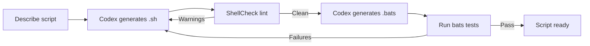

# Codex CLI for Shell Scripting: Agent-Assisted Bash Generation, Testing, and Maintenance


---

Shell scripts are the connective tissue of every engineering organisation. They glue CI pipelines together, orchestrate container builds, manage secrets rotation, and handle the thousand small tasks nobody wants to write a proper service for. They are also, notoriously, where bugs go to hide. Quoting mistakes, unhandled exit codes, platform-specific behaviour, and silent failures make shell scripts a perfect target for agent-assisted development — the kind of structured, convention-heavy work where Codex CLI excels[^1].

This article covers how to use Codex CLI v0.135 to generate, lint, test, and maintain shell scripts. It is aimed at senior developers who already know Bash but want to accelerate the tedious parts — argument parsing, error handling, portability — without sacrificing quality.

## Why Shell Scripts Suit Agent-Assisted Workflows

Shell scripts share characteristics that make them well-suited to Codex CLI:

1. **Bounded scope** — most scripts are under 500 lines with a single responsibility[^2].
2. **Rich conventions** — ShellCheck defines over 400 rules that an agent can enforce during generation[^3].
3. **Immediate verification** — scripts can be executed in the sandbox to confirm correctness.
4. **Low blast radius** — when sandboxed, a failing script cannot damage anything outside the working directory.

Codex CLI's sandbox (Seatbelt on macOS, Bubblewrap on Linux) restricts the commands the agent runs to the workspace by default[^4], making it safe to let the agent iterate on scripts that touch the filesystem.

## Setting Up AGENTS.md for Shell Projects

Before generating scripts, encode your team's conventions in `AGENTS.md`. A minimal shell-focused configuration:

```markdown
# Shell Scripting Standards

- Target Bash 5.2+ unless POSIX portability is explicitly required
- Use `set -euo pipefail` at the top of every script
- Use `shellcheck` directives only to suppress documented false positives
- Format with `shfmt -i 2 -ci -bn` (2-space indent, case indent, binary ops on next line)
- Log to stderr; reserve stdout for data output
- Use `readonly` for constants and `local` for function variables
- Prefer `[[ ]]` over `[ ]` for conditionals in Bash scripts
- Include a usage function and parse `--help` as the first argument
- Every script must have a corresponding `.bats` test file
```

This gives Codex CLI enough context to generate scripts that conform to your standards from the first attempt[^5].

## Generating Scripts with Codex CLI

### Interactive Generation

For a new script, describe the requirement in natural language:

```bash
codex "Write a bash script called backup-db.sh that:
1. Takes --host, --port, --database, and --output-dir arguments
2. Runs pg_dump with custom format
3. Compresses the output with zstd
4. Rotates backups older than 30 days in the output directory
5. Exits non-zero if any step fails
6. Logs timestamped messages to stderr"
```

Codex CLI reads the `AGENTS.md` conventions, generates the script with proper argument parsing (typically using `getopts` or a `while/case` loop), adds error handling, and writes the file. Because the agent can execute commands in the sandbox, it will typically run `shellcheck` against its own output before presenting the result[^1].

### Non-Interactive Generation with `codex exec`

For CI pipelines or batch script generation, use `codex exec`:

```bash
codex exec "Generate a POSIX-compatible script that checks if all
required environment variables listed in .env.example are set,
printing missing ones to stderr and exiting 1 if any are absent" \
  > check-env.sh
chmod +x check-env.sh
```

The `codex exec` mode streams progress to stderr and writes the final output to stdout[^6], making it composable with standard Unix pipelines.

### Using `--image` for Script-from-Diagram Workflows

When you have a workflow diagram or a terminal screenshot showing the expected behaviour:

```bash
codex -i workflow-diagram.png "Write a deployment script
that implements this workflow. Use bash with set -euo pipefail."
```

The multimodal input lets Codex CLI interpret visual context — flowcharts, terminal output, or architecture diagrams — and translate them directly into executable scripts[^7].

## Linting and Quality Enforcement

### ShellCheck Integration

ShellCheck v0.10.0 is the standard static analysis tool for shell scripts, covering Bash, sh, dash, and ksh dialects[^3]. When ShellCheck is installed in your environment, Codex CLI can run it as part of its verification loop:

```bash
codex "Run shellcheck on all .sh files in scripts/ and fix any
issues found. Do not suppress warnings — fix the underlying code."
```

The agent iterates: run ShellCheck, read the diagnostics, apply fixes, run again until clean. This closed-loop pattern is where agent assistance pays off most — the tedious fix-check-fix cycle happens without human intervention.

### Formatting with shfmt

For consistent formatting, include `shfmt` in your workflow:

```bash
codex "Format all shell scripts in this repository using shfmt
with 2-space indentation, case statement indentation, and
binary operators on the next line. Show me the diff before applying."
```

The `shfmt` tool (v3.10.0 as of May 2026) supports Bash, POSIX shell, and mksh, and can be configured via an `.editorconfig` file[^8].

## Testing Shell Scripts with Bats

Bats (Bash Automated Testing System) v1.11.1 is the de facto testing framework for shell scripts[^9]. Codex CLI can both generate scripts and their corresponding test files:

```bash
codex "Write bats tests for scripts/backup-db.sh that cover:
1. Missing required arguments exit with code 1
2. --help prints usage to stdout
3. Invalid --port value is rejected
4. Output directory is created if it doesn't exist
Use bats-assert and bats-support helpers."
```

A typical generated test file:

```bash
#!/usr/bin/env bats

load 'test_helper/bats-support/load'
load 'test_helper/bats-assert/load'

setup() {
  export TEST_DIR="$(mktemp -d)"
}

teardown() {
  rm -rf "$TEST_DIR"
}

@test "exits 1 when --database is missing" {
  run ./scripts/backup-db.sh --host localhost --port 5432 \
    --output-dir "$TEST_DIR"
  assert_failure
  assert_output --partial "required"
}

@test "--help prints usage to stdout" {
  run ./scripts/backup-db.sh --help
  assert_success
  assert_output --partial "Usage:"
}

@test "creates output directory if absent" {
  local out_dir="$TEST_DIR/new-dir"
  run ./scripts/backup-db.sh --host localhost --port 5432 \
    --database testdb --output-dir "$out_dir" 2>/dev/null || true
  [ -d "$out_dir" ]
}
```

After generating the tests, Codex CLI can execute them:

```bash
codex "Run the bats tests for backup-db.sh and fix any failures"
```



## Shell Environment Policy Configuration

When Codex CLI executes shell commands during script development, the `shell_environment_policy` controls which environment variables reach the subprocess[^10]. This is critical for scripts that depend on specific environment variables:

```toml
[shell_environment_policy]
inherit = "core"
exclude = ["AWS_SECRET_*", "GITHUB_TOKEN", "NPM_TOKEN"]

[shell_environment_policy.set]
LANG = "en_GB.UTF-8"
SHELL = "/bin/bash"
```

The `inherit = "core"` setting provides `PATH`, `HOME`, `USER`, and other essential variables while filtering out secrets. The `exclude` patterns prevent accidental exposure of credentials during agent-driven script execution[^10].

For scripts that need network access (e.g., scripts that call APIs), configure the sandbox:

```toml
[sandbox_workspace_write]
network_access = true
```

## Practical Workflow: Modernising Legacy Scripts

One of the highest-value applications is modernising legacy shell scripts. Consider a repository with dozens of scripts written over years by different developers:

```bash
codex "Audit all .sh files in this repository. For each script:
1. Add 'set -euo pipefail' if missing
2. Replace backtick command substitution with \$()
3. Quote all variable expansions
4. Replace 'which' with 'command -v'
5. Add shellcheck disable comments only where truly necessary
6. Preserve the script's existing behaviour
Show me a summary of changes per file."
```

Codex CLI processes each file, applying the transformations while respecting the existing logic. The agent's ability to run `shellcheck` after each modification ensures that fixes do not introduce new issues.

### POSIX Portability Conversion

For scripts that need to run on minimal environments (Alpine containers, embedded systems, CI runners without Bash):

```bash
codex "Convert scripts/deploy.sh from Bash to POSIX sh.
Replace bashisms: [[ ]] with [ ], arrays with positional
parameters, process substitution with temp files,
here-strings with printf pipes. Run shellcheck --shell=sh
to verify POSIX compliance."
```

## Integrating with CI/CD Pipelines

Use `codex exec` in GitHub Actions to enforce shell script quality:

```yaml
name: Shell Script Quality
on: [pull_request]
jobs:
  lint:
    runs-on: ubuntu-latest
    steps:
      - uses: actions/checkout@v4
      - uses: openai/codex-action@v1
        with:
          prompt: |
            Run shellcheck on all changed .sh files.
            Run shfmt --diff on all changed .sh files.
            If any issues are found, post a summary as a
            PR comment with the exact fixes needed.
          approval_mode: read-only
```

The Codex GitHub Action runs the agent in a sandboxed environment with read-only permissions, ensuring it can analyse and report but not modify the repository directly[^11].

## Common AGENTS.md Patterns for Shell Projects

### DevOps Infrastructure Scripts

```markdown
# Infrastructure Shell Standards
- All scripts must be idempotent
- Use trap for cleanup on EXIT, INT, TERM
- Validate external tool availability with command -v before use
- Prefer curl over wget for HTTP requests
- Use mktemp for temporary files, never hardcoded /tmp paths
- Include --dry-run support for destructive operations
```

### Container Build Scripts

```markdown
# Container Build Standards
- Target /bin/sh for Dockerfile ENTRYPOINT scripts (Alpine compatibility)
- Use exec to replace the shell process with the main application
- Handle SIGTERM gracefully for container orchestrator stop signals
- Never store secrets in script files — read from environment only
```

## Limitations and Caveats

Shell scripting with Codex CLI has specific constraints worth noting:

- **Interactive scripts** — scripts that use `read`, `select`, or `dialog` are difficult to test in the sandbox. The agent cannot provide interactive input to subprocesses. Structure scripts to accept all input via arguments or environment variables.
- **Platform-specific commands** — Codex CLI runs on your local machine, so macOS-generated scripts may use BSD `sed` syntax that fails on GNU `sed`. Always specify the target platform in your prompt.
- **Privileged operations** — the sandbox prevents `sudo`, `mount`, and other privileged operations. Scripts that require root access need manual testing outside the sandbox.
- **Long-running daemons** — the sandbox has a command timeout. Scripts designed as persistent services should be tested separately.

## Summary

Shell scripts are an ideal target for agent-assisted development: they are structured, convention-heavy, and immediately testable. Codex CLI v0.135 provides the sandbox safety, multimodal input, and iterative execution loop needed to generate, lint, test, and modernise scripts efficiently. The combination of `AGENTS.md` conventions, ShellCheck linting, Bats testing, and `codex exec` automation creates a workflow where the agent handles the boilerplate and the developer focuses on the logic.

The practical stack: describe the script in natural language, let Codex generate it with proper error handling, run ShellCheck and Bats in the agent loop, and enforce quality via CI. Shell scripts are too important to be the part of the codebase that nobody reviews — and with agent assistance, they no longer need to be.

## Citations

[^1]: [Codex CLI Features — OpenAI Developers](https://developers.openai.com/codex/cli/features) — Official feature documentation for Codex CLI, including sandbox execution and multimodal input.
[^2]: [Best practices — Codex | OpenAI Developers](https://developers.openai.com/codex/learn/best-practices) — OpenAI's recommendations for effective Codex usage, including task decomposition and bounded scope.
[^3]: [ShellCheck — GitHub](https://github.com/koalaman/shellcheck) — Static analysis tool for shell scripts, v0.10.0, supporting 400+ lint rules across Bash, sh, dash, and ksh.
[^4]: [Sandbox and Approval Policies — Codex DeepWiki](https://deepwiki.com/openai/codex/2.4-sandbox-and-approval-policies) — Documentation of Codex CLI's OS-native sandboxing with Seatbelt (macOS) and Bubblewrap (Linux).
[^5]: [Custom instructions with AGENTS.md — Codex | OpenAI Developers](https://developers.openai.com/codex/guides/agents-md) — Official guide to configuring agent behaviour via AGENTS.md instruction files.
[^6]: [Non-interactive mode — Codex | OpenAI Developers](https://developers.openai.com/codex/noninteractive) — Documentation for `codex exec`, the non-interactive execution mode for CI/CD and scripting.
[^7]: [Codex CLI Image Workflows — Codex Knowledge Base](https://codex.danielvaughan.com/2026/03/28/codex-cli-image-workflows/) — Guide to multimodal image input in Codex CLI sessions.
[^8]: [shfmt — GitHub](https://github.com/mvdan/sh) — Shell formatter supporting Bash, POSIX, and mksh, v3.10.0.
[^9]: [Bats-core — GitHub](https://github.com/bats-core/bats-core) — Bash Automated Testing System v1.11.1, the standard testing framework for shell scripts.
[^10]: [Advanced Configuration — Codex | OpenAI Developers](https://developers.openai.com/codex/config-advanced) — Documentation for `shell_environment_policy` and sandbox configuration keys.
[^11]: [GitHub Action — Codex | OpenAI Developers](https://developers.openai.com/codex/github-action) — Official Codex GitHub Action for CI/CD integration.
