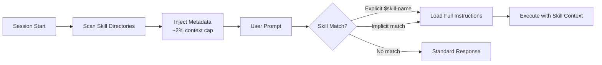
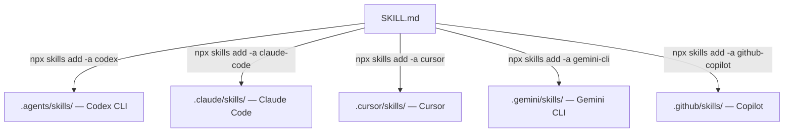

# The Vercel Skills CLI and the Open Agent Skills Ecosystem: Installing, Managing, and Publishing Skills for Codex CLI


---

Every coding agent ships with a finite instruction set. Skills — modular, reusable instruction bundles packaged as `SKILL.md` files — extend that set without bloating context windows. Vercel's open-source **skills CLI** (`npx skills`) has become the de facto package manager for this ecosystem, accumulating over 20,000 GitHub stars and supporting 27+ agents including Codex CLI, Claude Code, Gemini CLI, GitHub Copilot, and Cursor [^1][^2]. This article covers how the skills system works inside Codex CLI, how to install and manage skills with the Vercel CLI, and how to publish your own.

## Why Skills Matter

Codex CLI uses a **progressive disclosure** model for skills. At session start, it injects only lightweight metadata — name, description, and file path — into the model's context, capped at roughly two per cent of the context window or 8,000 characters [^3]. The full skill instructions load only when a skill is explicitly or implicitly invoked. This design means you can install dozens of skills without incurring a token tax on every turn.

Skills replaced the older **custom prompts** mechanism, which is now deprecated [^4]. Where custom prompts were monolithic blocks bolted onto the system prompt, skills are composable units that the agent discovers, evaluates for relevance, and activates on demand.



## The SKILL.md Format

A skill is a directory containing a required `SKILL.md` file with YAML frontmatter:

```markdown
---
name: my-lint-fixer
description: >
  Trigger when the user asks to fix lint errors or when ESLint reports failures.
  Do NOT trigger for general code review or formatting.
---

## Instructions

1. Run `npx eslint . --format json` to collect all violations.
2. Group violations by rule.
3. Apply auto-fixes where available (`--fix`).
4. For remaining violations, propose minimal manual patches.
```

The `name` and `description` fields are mandatory [^3]. The description doubles as a trigger specification — it tells Codex **when** to activate the skill and, critically, when **not** to. Optional directories alongside `SKILL.md` include:

| Directory | Purpose |
|-----------|---------|
| `scripts/` | Executable code the skill can invoke |
| `references/` | Documentation and context files |
| `assets/` | Templates, schemas, or static resources |
| `agents/openai.yaml` | UI metadata, invocation policy, MCP dependencies |

The `agents/openai.yaml` file controls advanced behaviour such as disabling implicit invocation (`allow_implicit_invocation: false`) and declaring tool dependencies [^3].

## Skill Discovery in Codex CLI

Codex scans a hierarchy of directories at startup, resolving skills by scope:

| Scope | Path | Use Case |
|-------|------|----------|
| Working directory | `$CWD/.agents/skills/` | Task-specific skills |
| Repository root | `$REPO_ROOT/.agents/skills/` | Organisation-wide standards |
| User home | `$HOME/.agents/skills/` | Personal toolkit |
| System | `/etc/codex/skills/` | Admin-managed defaults |
| Bundled | Internal | OpenAI-shipped skills |

This hierarchy means a repository can ship skills that every team member inherits, whilst individual developers layer their own on top [^3].

## Installing Skills with the Vercel Skills CLI

The skills CLI, released by Vercel on 20 January 2026 and now at v1.1.1, is the standard way to install, update, and remove skills across agents [^1][^5].

### Basic Installation

```bash
# Install all skills from a repository
npx skills add vercel-labs/agent-skills

# Install a specific skill from a multi-skill package
npx skills add vercel-labs/agent-skills --skill frontend-design

# Target a specific agent
npx skills add vercel-labs/agent-skills -a codex

# Install from a full URL
npx skills add https://github.com/vercel-labs/agent-skills
```

The CLI resolves the source, downloads the `SKILL.md` files, and symlinks them into the appropriate agent directory — `.agents/skills/` for Codex CLI [^2][^6].

### Discovery and Search

```bash
# Interactive fuzzy search across skills.sh directory
npx skills find

# Keyword search
npx skills find "react testing"

# List installed skills
npx skills list

# Preview available skills before installing
npx skills add vercel-labs/agent-skills --list
```

The `find` command, introduced in v1.1.1, provides interactive type-ahead search against the skills.sh directory [^5].

### Lifecycle Management

```bash
# Update all installed skills to latest versions
npx skills update

# Update a specific skill
npx skills update frontend-design

# Remove a skill
npx skills remove web-design-guidelines

# Remove from all agents
npx skills remove my-skill --agent '*'
```

### CI/CD Integration

The `--yes` flag and `--json` output mode enable non-interactive workflows:

```bash
# Install without prompts (for CI pipelines)
npx skills add vercel-labs/agent-skills --yes

# Machine-readable output
npx skills list --json
```

## The skills.sh Directory

The [skills.sh](https://skills.sh) platform serves as both a public directory and a leaderboard for skill packages [^1]. As of May 2026, the top skills by installation count include:

| Skill | Publisher | Installs |
|-------|-----------|----------|
| `find-skills` | vercel-labs | 1.8M |
| `frontend-design` | anthropics | 483.8K |
| `vercel-react-best-practices` | vercel | 440.6K |
| `microsoft-foundry` | azure | 357.5K |
| `web-design-guidelines` | — | 356.2K |

Skills on the directory can be browsed by trending, official status, topic, or security audit status [^1].

## Configuring Skills in Codex CLI

Once installed, skills appear automatically in Codex CLI sessions. Configuration lives in `~/.codex/config.toml`:

```toml
# Disable a skill without deleting it
[[skills.config]]
path = "/home/dev/.agents/skills/frontend-design/SKILL.md"
enabled = false
```

You can also invoke skills explicitly within a session using the `$` prefix or the `/skills` slash command:

```
# Explicit invocation
$my-lint-fixer fix all ESLint errors in src/

# List available skills
/skills
```

Codex restarts skill discovery on session start, so newly installed skills require a fresh session [^3].

## Writing and Publishing Your Own Skills

### Scaffolding

The skills CLI includes a generator:

```bash
npx skills init my-database-migrator
```

This creates a directory with a template `SKILL.md` ready for editing [^2].

Alternatively, use Codex CLI's built-in skill creator:

```
$skill-creator
```

This launches a guided flow that produces a well-structured `SKILL.md` with appropriate trigger conditions [^3].

### Publishing to skills.sh

Publishing follows the GitHub-native model. Host your skill in a public GitHub repository with the standard directory structure:

```
my-skills/
├── skills/
│   ├── database-migrator/
│   │   └── SKILL.md
│   └── api-scaffolder/
│       ├── SKILL.md
│       ├── scripts/
│       │   └── scaffold.sh
│       └── references/
│           └── openapi-patterns.md
```

Once public, anyone can install your skill with `npx skills add your-username/my-skills`. Skills that gain traction appear on the skills.sh leaderboard automatically [^1].

### Best Practices for Skill Authorship

1. **Precise trigger descriptions** — the `description` field should specify both positive and negative triggers to avoid false activations
2. **Minimal context footprint** — keep `SKILL.md` concise; offload large reference material to the `references/` directory
3. **Idempotent scripts** — any executable in `scripts/` should be safe to run multiple times
4. **Cross-agent compatibility** — test with at least two agents (Codex CLI and one other) to verify the skill works beyond a single runtime
5. **Version your skills** — use Git tags so consumers can pin to specific versions

## Cross-Agent Portability

The open agent skills standard means a single `SKILL.md` works across Codex CLI, Claude Code, Gemini CLI, Cursor, GitHub Copilot, and dozens more [^2]. The skills CLI handles agent-specific directory placement automatically. This portability matters for teams running mixed toolchains — a skill authored for one agent travels with the repository and works for every team member regardless of their preferred agent.



## Practical Example: A Test Coverage Enforcer

Here is a complete skill that enforces test coverage thresholds:

```markdown
---
name: coverage-enforcer
description: >
  Trigger when the user asks to check, enforce, or improve test coverage.
  Also trigger after test generation tasks to verify coverage meets thresholds.
  Do NOT trigger for general test execution or debugging.
---

## Instructions

1. Run the project's test suite with coverage enabled:
   - Node.js: `npx vitest run --coverage`
   - Python: `pytest --cov=src --cov-report=json`
   - Go: `go test -coverprofile=coverage.out ./...`

2. Parse coverage output and identify:
   - Overall line coverage percentage
   - Files below 80% coverage
   - Uncovered branches in critical paths

3. For files below threshold:
   - Generate targeted test cases covering the gaps
   - Prefer integration tests over unit tests for API endpoints
   - Avoid testing implementation details

4. Re-run coverage to verify improvement.

5. Report final coverage delta as a summary table.
```

Install it locally:

```bash
npx skills init coverage-enforcer
# Edit SKILL.md with the content above
npx skills add ./coverage-enforcer -a codex
```

## Conclusion

The Vercel skills CLI transforms skill management from manual file copying into a proper package management workflow. For Codex CLI users, the combination of progressive disclosure, hierarchical discovery, and a standardised `SKILL.md` format means you can build a rich, modular instruction set without sacrificing context window budget. With 27+ supported agents and 1.8 million installs on the top skill alone, the open agent skills ecosystem is the closest thing the AI coding agent space has to npm — and it is worth investing in.

---

## Citations

[^1]: [skills.sh — The Open Agent Skills Ecosystem](https://skills.sh), Vercel, accessed 31 May 2026.
[^2]: [vercel-labs/skills — GitHub Repository](https://github.com/vercel-labs/skills), Vercel Labs, accessed 31 May 2026.
[^3]: [Agent Skills — Codex CLI Developer Documentation](https://developers.openai.com/codex/skills), OpenAI, accessed 31 May 2026.
[^4]: [Custom Prompts — Codex Developer Documentation](https://developers.openai.com/codex/custom-prompts), OpenAI, accessed 31 May 2026.
[^5]: [Skills v1.1.1: Interactive Discovery, Open Source Release, and Agent Support](https://vercel.com/changelog/skills-v1-1-1-interactive-discovery-open-source-release-and-agent-support), Vercel Changelog, 2026.
[^6]: [Agent Skills — Vercel Documentation](https://vercel.com/docs/agent-resources/skills), Vercel, accessed 31 May 2026.
